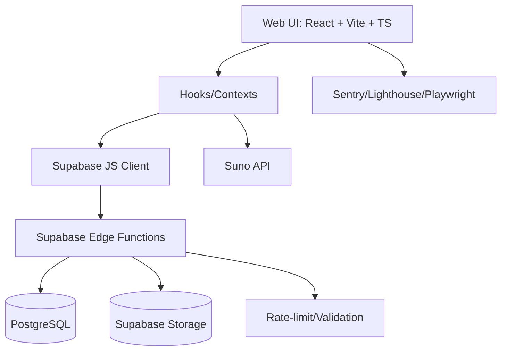
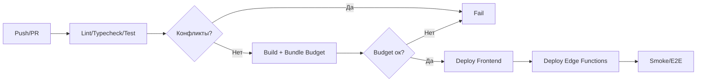

# План Комплексного Аудита и Исследования

## Обзор и Цели

* Цель: провести полный аудит по UI/UX, интеграциям, версионированию, сборке, хукам и качеству, с отчётами в формате Markdown с таблицами/графиками.

* Охват: Web (React/Vite/TypeScript), мобильные браузеры (Android/iOS), Supabase (Auth/DB/Storage/Edge Functions), Suno API интеграции.

* Итог: набор отчётов, чек-листов и измерений с практическими рекомендациями и оценками трудозатрат (±10%) за 14 рабочих дней.

## Диаграмма Системного Контекста

## 1. Анализ Интерфейса (UI/UX + Accessibility)

* Методология:

  * Heuristic Evaluation (Нильсен), Cognitive Walkthrough, User Flow Review.

  * Mobile First: проверка 5+ брейкпоинтов (320×568, 360×640, 390×844, 768×1024, 1440×900).

  * Доступность: WCAG 2.1 AA — контраст, фокус, клавиатурная навигация, ARIA-атрибуты, альтернативные тексты, подписи форм.

  * Соответствие гайдлайнам App Store (Apple HIG) и Google Play (Material Guidelines).

* Инструменты и проверки:

  * Lighthouse Mobile ≥90; метрики LCP ≤2.5s, TTI ≤3.5s.

  * Axe DevTools/Playwright Axe для автоматизации а11y; ручные сценарии-
    репродукции (steps-to-reproduce) для каждого обнаруженного дефекта.

  * Воспроизведение сценариев: добавление треков, генерация, загрузка обложек, навигация в Workspace.

* Отчёты:

  * UI/UX Audit Report: таблицы проблем (Интуитивность/Эффективность/Удовлетворённость), скриншоты, шаги воспроизведения, приоритеты.

  * Accessibility Report: карта нарушений WCAG по критериям A/AA, рекомендации исправлений.

  * Mobile Compliance: соответствие HIG/Material, матрица брейкпоинтов.

## 2. Интеграции (API/Нагрузочные/Безопасность/Надёжность)

* Инвентаризация интеграций:

  * Supabase (Auth, Storage, Edge Functions); Suno API (генерация музыки/лирки/обложек/видео, конверсия WAV, разделение вокала).

* Нагрузочное тестирование (целевое 1000+ RPS):

  * JMeter сценарии: прогрев, ступенчатый рост (ramp-up), плато, деградирующие сценарии.

  * Метрики: p50/p95/p99 latency, error rate, throughput, saturation.

* Безопасность:

  * OWASP Top 10: XSS, CSRF, инъекции, безопасность хранения.

  * SSL/TLS: корректность сертификатов, принудительный HTTPS, HSTS, безопасные заголовки (CSP/XFO/XCTO/XSSP/Referrer-Policy/Permissions-Policy) — проверим серверные заголовки, соответствие `vite.config.ts`.

  * Suno API Callback Security (по документам): IP whitelist, HTTPS-only, валидация JSON-структуры, таймауты/ретраи.

* Надёжность (Resilience):

  * Retry/Backoff: экспоненциальный, с jitter; проверим имеющиеся утилиты.

  * Circuit Breaker: проектные места для внедрения (критичные вызовы Suno/Supabase).

* Отчёты:

  * API Integration Audit: диаграммы взаимодействий, SLA/SLO, результаты JMeter, рекомендации по масштабированию.

  * Security Audit: находки OWASP, таблицы рисков, план ремедиации, настройки заголовков/SSL.

  * Reliability Audit: политика ретраев, backoff, circuit breaker, очереди/таймауты.

## 3. Система Версионирования

* SemVer 2.0.0: аудит `package.json`, релизного процесса и тегов.

* Changelog: соответствие Conventional Commits, релизные заметки, выпускные ветки.

* Обновления: механизмы force/optional update (UI сигнализация, совместимость типов/форматов).

* Backward Compatibility: тест-кейсы на совместимость API/данных/хранилища.

* Отчёты:

  * Versioning & Releases: матрица изменений, совместимость, стратегия миграций.

## 4. Система Генерации/Сборки (Vite/Rollup)

* Конфиг-аудит: `vite.config.ts` (manualChunks, dedupe, CSP, env-мердж, tsconfig-paths, Sentry, visualizer).

* Tree-shaking/Code-splitting: точки разделения, динамические импорты, vendor чанки.

* Кэширование: HTTP cache-control, preloading/prefetching, hashing.

* Замеры сборки: cold/warm build time; размеры чанков; sourcemaps, минификация.

* Отчёты:

  * Build Performance Report: таблицы времени, графики размера чанков, рекомендации (бюджеты, lazy-loading, split points).

## 5. Хуки и CI/CD

* Pre-commit/Pre-push: Husky/линт/типизация/тесты.

* CI (GitHub Actions): матрица job-ов (typecheck, lint, unit/integration/e2e, bundle-budget, конфликт-маркеры).

* Security hooks: secret scanning, dependency checks (Dependabot, npm audit), SAST (опционально).

* Конфликты хуков: проверка совместимости задач, время выполнения.

* Отчёты:

  * CI/CD Audit: диаграмма пайплайна, время, стабильность, предложения оптимизации.

## Производительность и Стабильность на Мобиле

* Lighthouse Mobile ≥90, LCP ≤2.5s, TTI ≤3.5s.

* Слабые устройства (Android 8+, 2GB RAM):

  * Память: профилирование, уменьшение количества ререндеров, виртуализация списков.

  * Сетевые оптимизации: кеширование, сжатие, минимизация загрузок.

* Отчёты:

  * Mobile Performance Report: результаты Lighthouse/Profiler, рекомендации.

## Диаграмма CI/CD

## Документация и Формат Отчётов

* Формат: Markdown (таблицы, графики, скриншоты, steps-to-reproduce, приоритеты/оценки трудозатрат).

* Разделы: UI/UX, Accessibility, Integrations (API), Security, Load, Versioning, Build, CI/CD, Mobile Performance.

* Стандартизация «SUNOAPI-ORG»: подтянуть лучшие практики из документации Suno API (callbacks, concurrency, security, polling, developer notes) для оценки интеграций и описания интерфейсов.

* Шаблоны: единый шаблон отчёта с полями «Описание проблемы → Шаги воспроизведения → Влияние → Рекомендация → Оценка трудозатрат».

## Метрики и Качество

* Полнота покрытия: 100% функционала по сценариям.

* Детализация: у каждого дефекта – шаги воспроизведения, ожидаемое/фактическое.

* Практичность: рекомендации реализуемы, с оценкой человеко-часов (±10%).

* Точность: все измерения повторяемы, с артефактами (скрипты/настройки).

## План-график (14 рабочих дней)

1. День 1–3: Discovery, инвентаризация, настройка инструментов, базовые замеры.
2. День 4–6: UI/UX + Accessibility аудит (брейкпоинты, мобильные сценарии).
3. День 7–9: Интеграции + нагрузка (JMeter 1000+ RPS), Security (OWASP, TLS).
4. День 10–11: Build/Bundle анализ, оптимизации, повторные замеры.
5. День 12: Хуки/CI/CD аудит, рекомендации по пайплайну.
6. День 13: Компиляция отчётов, оценка трудозатрат, приоритезация.
7. День 14: Итоговая презентация, список P0/P1/P2 улучшений.

## Риски и Допущения

* Доступ к окружениям/секретам для нагрузочных/безопасностных тестов.

* Нагрузка 1000+ RPS выполняется на staging или специально подготовленном окружении.

* iOS/Android проверяются в мобильных браузерах/эмуляторах (нативные гайдлайны – комплаенс по UX-паттернам).

## Критерии Приёмки

* Отчёты готовы по всем разделам в срок 14 дней.

* Lighthouse Mobile ≥90; LCP ≤2.5s; TTI ≤3.5s (на контрольном наборе страниц).

* Реестр дефектов с шагами воспроизведения и оценками (±10%).

* План ремедиации с приоритетами и ожидаемым эффектом.

## Следующие шаги

* После подтверждения плана запускаем аудит по графику, предоставляя промежуточные

