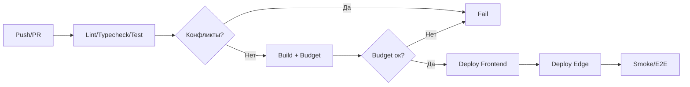

# План Комплексного Аудита и Оптимизации

## Цели и Результаты
- Провести архитектурный анализ, стресс‑тестирование, выстроить систему задач, формализовать требования к коду и запустить план оптимизации.
- Доставить отчёты, чек‑листы, стандарты и Roadmap с метриками и контрольными точками.

## Контекст Системы
```mermaid
graph TD
  UI[React + Vite + TS] --> Hooks[Hooks/Contexts]
  Hooks --> Query[TanStack React Query]
  Hooks --> Supa[@supabase/supabase-js]
  Supa --> Edge[Supabase Edge Functions]
  Edge --> DB[(PostgreSQL)]
  Edge --> Storage[(Supabase Storage)]
  UI --> Sentry[Sentry/Monitoring]
```

## 1. Архитектурный Анализ
- Оценка соответствия стандартам:
  - Слоистая архитектура (UI → Hooks/Contexts → Services/Edge → DB/Storage).
  - Чистые границы, адаптеры, отсутствие god‑объектов, минимизация `any`, единообразие импорта (ESM).
- Выявление антипаттернов:
  - Смешение ESM/CJS, дублирующие системы уведомлений, несогласованные бакеты Storage, избыточные `any`, плотные компоненты.
- План миграции (минимальный простой):
  - Уведомления: единый адаптер (`sonner`), поэтапная миграция.
  - Типизация: общие доменные типы, отказ от `any`, унификация структур Track.
  - Storage: стандарт «tracks‑audio/covers/videos» и «projects‑covers»; единый конфиг.
  - Сервисы: разнести по доменам, добавить интерфейсы и адаптеры; убрать прямые вызовы из UI.
  - Внедрение через фичефлаги/градацию PR (dark launch), обратная совместимость.

## 2. Тестирование Устойчивости
- Стресс‑тесты (1000+ RPS):
  - JMeter сценарии: прогрев, ramp‑up, плато, деградация.
  - Метрики: p50/p95/p99 латентность, throughput, error rate.
- Границы и ошибки:
  - Ошибки сети/таймауты, пустые/битые данные, отмены, повторные клики.
  - Инъекции и некорректные запросы (валидация на Edge, zod).
- Непрерывность:
  - Лайтхаус (мобайл), профилирование рендеров, эмулирование слабых устройств.
  - Регрессия: Playwright e2e на ключевые флоу.

## 3. Система Управления Задачами
- Приоритизация: MoSCoW + WSJF для крупных инициатив.
- Отслеживание: GitHub Projects, метки (type/priority/scope), доски и статусы.
- Шаблоны задач:
  - Feature/Bug/TechDebt/Chore/Spike — стандартизированные Issue templates.
- Workflow статусов:
  - Backlog → Ready → In Progress → In Review → QA → Done (Blocked побочно).

## 4. Требования к Коду
- Конвенции именования:
  - camelCase для переменных/функций; PascalCase для компонентов/типов; UPPER_CASE для констант.
- Оформление и структура:
  - Отступ 2 пробела; индексные файлы на barrel‑экспорты; фичевая структура `src/features/<domain>/*`.
- Спецкомментарии:
  - TODO (конкретный владелец + срок); FIXME (известная ошибка + ссылка); HACK (временный workaround + план замены).
- Документация:
  - JSDoc для публичных API/хуков; архитектурные схемы (Mermaid); README для фич.

## 5. План Оптимизации (Roadmap)
- Фаза 1 (Архитектура): уведомления, Storage, ESM, типы — 1–2 недели.
- Фаза 2 (Производительность): разбиение чанков, виртуализация, дебаунсы — 1 неделя.
- Фаза 3 (Надёжность): ретраи/backoff/circuit breaker, валидация, логирование — 1 неделя.
- Фаза 4 (Качество): тесты unit/integration/e2e, покрытие, код‑ревью — 1 неделя.
- Контрольные точки: конец каждой фазы — отчёт, метрики, демо.

## Метрики
- UI: Lighthouse Mobile ≥90; LCP ≤2.5s; TTI ≤3.5s; размер бандла.
- API/Edge: p95 латентность; error rate <1%; SLA доступности.
- Качество: покрытие тестами ≥75% (цель 80%+), 0 конфликтов, линт/typecheck зелёные.

## 6. Контроль Качества
- Автоматизация:
  - CI: typecheck, eslint, unit/integration/e2e, bundle budget, поиск конфликт‑маркеров.
- Чек‑листы Code Review:
  - Архитектура/границы, типы, обработка ошибок, логирование, безопасность (OWASP), производительность.
- Стандарты покрытия:
  - Порог по пакетам; отчёты coverage; блокирование PR ниже порога.

## Диаграмма CI/CD


## Документирование Изменений
- Для каждого изменения:
  - Обоснование, ожидаемый эффект, критерии успеха, риски и способы минимизации.
- Фиксация:
  - CHANGELOG (дата/тип/автор/ссылки), отчёты в `docs/audit/SUNOAPI-ORG/*`.

## Поставляемые Артефакты
- Архитектурный отчёт: антипаттерны, план миграции, схемы.
- Стресс‑тест отчёт: JMeter сценарии, графики, рекомендации.
- Система задач: шаблоны, метки, workflow, приоритизация.
- Стандарты кода: конвенции, линтеры, форматтеры, комментарии, документация.
- Roadmap: фазы, задачи, контрольные точки, метрики.
- QA: CI пайплайн, чек‑листы, покрытие.

## План‑график (4–6 недель)
1. Неделя 1: Архитектура и типизация (ESM, уведомления, Storage).  
2. Неделя 2: Производительность (чанки/виртуализация/дебаунсы).  
3. Неделя 3: Надёжность (ретраи/валидация/логирование).  
4. Неделя 4: Качество (тесты/CI/CR чек‑листы).  
5–6. Буфер: корректировки и закрепление.

## Риски и Митигации
- Срыв сроков на стресс‑тестах → заранее подготовить staging, фиктивные данные.
- Регрессии в UI → e2e сценарии на ключевые флоу до релиза.
- Несогласованность типов → единый источник доменных типов, линт‑правила.

## Следующие Шаги
- Подтвердить план.  
- Запустить фазу 1: аудит слоёв, унификация уведомлений/Storage, исправление ESM/CJS, типизация.  
- Параллельно подготовить CI шаги и шаблоны задач.
