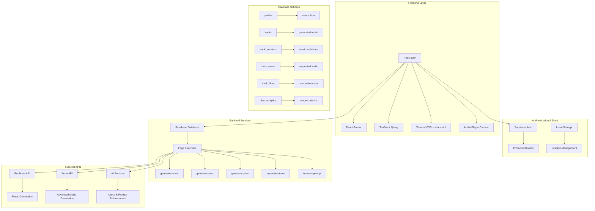
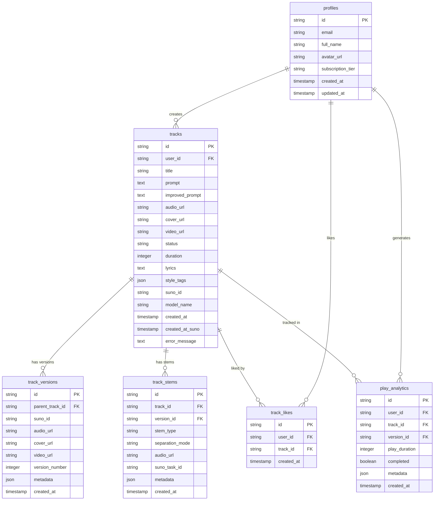
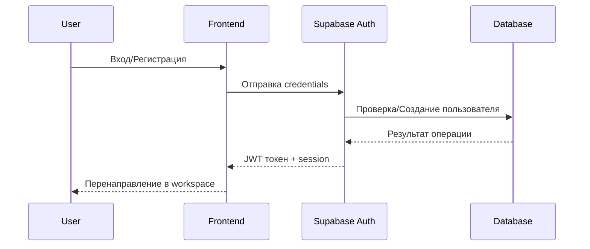
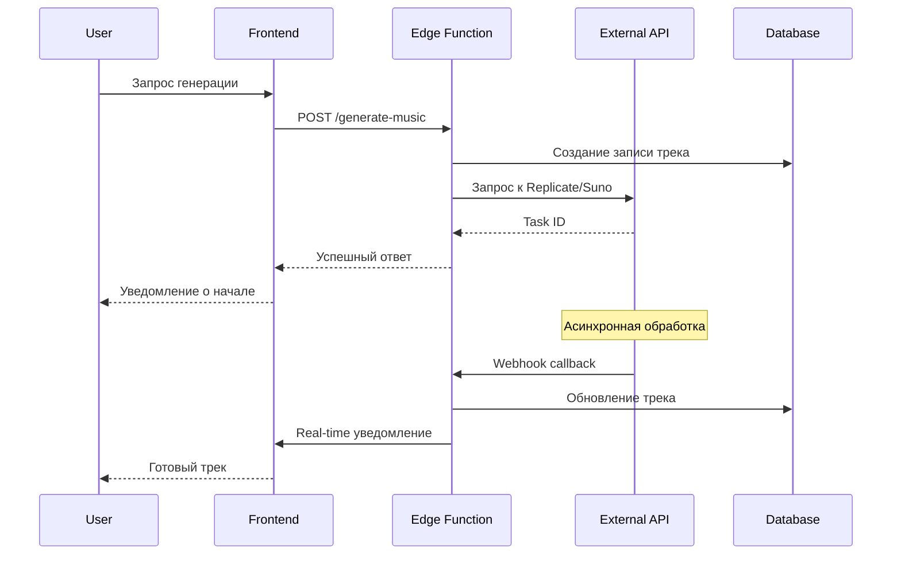
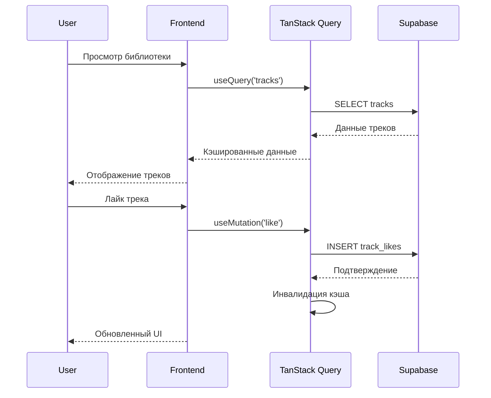
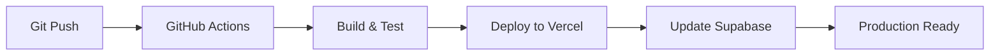

# 🏗️ Архитектура системы Albert3 Muse Synth Studio

## 📋 Обзор архитектуры

Albert3 Muse Synth Studio - это современное веб-приложение для генерации музыки с использованием ИИ, построенное на основе микросервисной архитектуры с использованием React, Supabase и внешних API для генерации музыки.

## 🎯 Основные компоненты системы



## 🔧 Технологический стек

### Frontend
- **React 18** - Основной UI фреймворк
- **TypeScript** - Типизация и безопасность кода
- **Vite** - Сборщик и dev-сервер
- **React Router** - Маршрутизация
- **TanStack Query** - Управление состоянием сервера
- **Tailwind CSS** - Стилизация
- **shadcn/ui** - Компонентная библиотека
- **Radix UI** - Примитивы UI компонентов

### Backend & Database
- **Supabase** - Backend-as-a-Service
- **PostgreSQL** - Основная база данных
- **Supabase Edge Functions** - Serverless функции
- **Deno** - Runtime для Edge Functions

### External Services
- **Replicate API** - Генерация музыки через ИИ модели
- **Suno API** - Продвинутая генерация музыки
- **AI Services** - Улучшение промптов и генерация текстов

## 📊 Схема базы данных



## 🔄 Поток данных и взаимодействие компонентов

### 1. Аутентификация пользователя


### 2. Генерация музыки


### 3. Управление треками


## 🏛️ Архитектурные паттерны

### 1. **Компонентная архитектура**
- **Атомарные компоненты** - Базовые UI элементы (Button, Input)
- **Молекулы** - Составные компоненты (TrackCard, AuthForm)
- **Организмы** - Сложные блоки (TracksList, MusicGenerator)
- **Страницы** - Полные экраны приложения

### 2. **Слоистая архитектура**
```
┌─────────────────────────────────────┐
│           Presentation Layer        │ ← React Components, Pages
├─────────────────────────────────────┤
│           Business Logic Layer      │ ← Hooks, Services, Utils
├─────────────────────────────────────┤
│           Data Access Layer         │ ← API Services, Supabase Client
├─────────────────────────────────────┤
│           Infrastructure Layer      │ ← Supabase, External APIs
└─────────────────────────────────────┘
```

### 3. **Микросервисная архитектура**
- **Edge Functions** как независимые микросервисы
- **Разделение ответственности** по функциональным доменам
- **Асинхронная обработка** через webhooks и callbacks

## 🔐 Безопасность архитектуры

### Аутентификация и авторизация
- **JWT токены** для аутентификации
- **Row Level Security (RLS)** в Supabase
- **Защищенные маршруты** на фронтенде
- **Валидация токенов** в Edge Functions

### Защита данных
- **HTTPS** для всех соединений
- **Environment variables** для секретов
- **Валидация входных данных** с помощью Zod
- **CORS политики** для API

## 📈 Масштабируемость

### Горизонтальное масштабирование
- **Serverless функции** автоматически масштабируются
- **CDN** для статических ресурсов
- **Database connection pooling** в Supabase

### Вертикальное масштабирование
- **Оптимизация запросов** к базе данных
- **Кэширование** с TanStack Query
- **Lazy loading** компонентов и ресурсов

## 🔄 CI/CD и развертывание

### Процесс развертывания


### Среды разработки
- **Development** - Локальная разработка с Vite
- **Staging** - Тестовая среда на Vercel
- **Production** - Продакшн среда с полным мониторингом

## 📊 Мониторинг и аналитика

### Встроенная аналитика
- **Play Analytics** - Отслеживание воспроизведения треков
- **User Behavior** - Анализ пользовательского поведения
- **Performance Metrics** - Метрики производительности

### Внешний мониторинг
- **Supabase Dashboard** - Мониторинг базы данных
- **Vercel Analytics** - Производительность фронтенда
- **Error Tracking** - Отслеживание ошибок

## 🚀 Будущие улучшения архитектуры

### Краткосрочные цели
- **Real-time уведомления** через Supabase Realtime
- **Оптимизация производительности** фронтенда
- **Расширенная аналитика** пользователей

### Долгосрочные цели
- **Микрофронтенды** для больших команд
- **GraphQL API** для более эффективных запросов
- **Machine Learning Pipeline** для персонализации
- **Multi-tenant архитектура** для корпоративных клиентов

---

*Документ обновлен: Январь 2025*
*Версия архитектуры: 1.0*