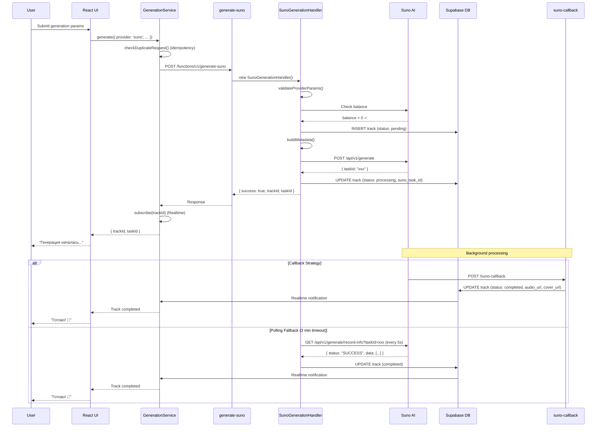
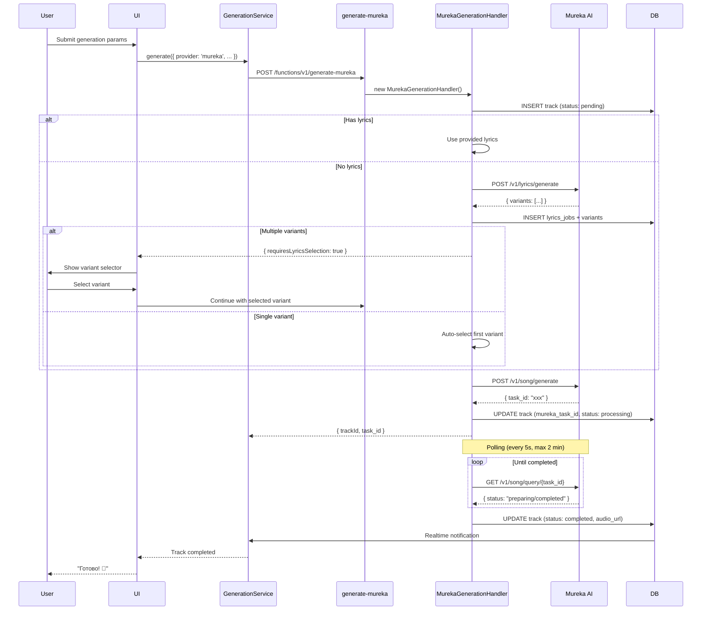

# 📚 Детализированная База Знаний Albert3 Muse Synth Studio v2.4.0

## 🎯 1. Общий обзор проекта

### 1.1 Назначение и ключевые возможности
**Albert3 Muse Synth Studio** — это SPA-приложение для AI-генерации музыки с поддержкой двух провайдеров: **Suno AI** и **Mureka AI**.

**Основной стек:**
- Frontend: React 18.3.1 + TypeScript + Vite 5 + Tailwind CSS 3.4
- Backend: Supabase (PostgreSQL 15 + Deno Edge Functions)
- State Management: TanStack Query v5 + Zustand
- UI: Radix UI Primitives + shadcn/ui

**Ключевые возможности:**
1. 🎵 Генерация музыки (Suno AI / Mureka AI)
2. 🎤 Разделение треков на стемы (vocals/instrumental/12 instruments)
3. 📝 AI-генерация текстов песен
4. 🎨 Создание кавер-версий (Suno only)
5. ➕ Продление треков (Suno only)
6. 🔊 Распознавание песен (Mureka only)
7. 📜 AI-описание композиций (Mureka only)
8. 💰 Система кредитов (test/production режимы)
9. 📈 Аналитика прослушиваний и взаимодействий

---

## 🏗️ 2. Архитектура проекта

### 2.1 Структура директорий

```
albert3-muse-synth-studio/
├── src/
│   ├── components/
│   │   ├── ui/
│   │   ├── player/
│   │   ├── tracks/
│   │   ├── generator/
│   │   ├── lyrics/
│   │   ├── workspace/
│   │   ├── navigation/
│   │   ├── mureka/
│   │   ├── skeletons/
│   │   └── animations/
│   ├── hooks/
│   │   ├── useTracks.ts
│   │   ├── useGenerateMusic.ts
│   │   ├── useAudioPlayer.ts
│   │   ├── useStemSeparation.ts
│   │   ├── useAudioPreloader.ts
│   │   └── usePrefetchQueries.ts
│   ├── contexts/
│   │   ├── audio-player/
│   │   └── StemMixerContext.tsx
│   ├── features/
│   │   └── tracks/
│   │       ├── components/
│   │       ├── hooks/
│   │       ├── api/
│   │       └── ui/
│   ├── pages/
│   │   ├── workspace/
│   │   │   ├── Generate.tsx
│   │   │   ├── Library.tsx
│   │   │   ├── Analytics.tsx
│   │   │   └── Settings.tsx
│   │   ├── Auth.tsx
│   │   └── Landing.tsx
│   ├── services/
│   │   ├── api.service.ts
│   │   ├── GenerationService.ts
│   │   └── providers/
│   │       ├── registry.ts
│   │       └── types.ts
│   ├── utils/
│   │   ├── logger.ts
│   │   ├── cache.ts
│   │   ├── formatters.ts
│   │   └── registerServiceWorker.ts
│   ├── config/
│   │   └── provider-models.ts
│   └── types/
│       └── providers.ts
│
├── supabase/
│   ├── functions/
│   │   ├── generate-suno/
│   │   │   ├── index.ts
│   │   │   └── handler.ts
│   │   ├── generate-mureka/
│   │   │   ├── index.ts
│   │   │   └── handler.ts
│   │   ├── generate-lyrics/
│   │   ├── separate-stems/
│   │   ├── improve-prompt/
│   │   ├── suno-callback/
│   │   ├── check-stuck-tracks/
│   │   ├── retry-failed-tracks/
│   │   └── _shared/
│   │       ├── suno.ts
│   │       ├── mureka.ts
│   │       ├── fal.ts
│   │       ├── generation-handler.ts
│   │       ├── logger.ts
│   │       ├── security.ts
│   │       ├── cors.ts
│   │       ├── rate-limit.ts
│   │       ├── zod-schemas.ts
│   │       └── types/
│   ├── migrations/
│   └── config.toml
│
├── docs/
│   ├── SUNO_API_INTEGRATION.md
│   ├── MUSIC_PROVIDERS_GUIDE.md
│   ├── GENERATION_SYSTEM_AUDIT.md
│   ├── REPOSITORY_MAP.md
│   ├── API.md
│   ├── PHASE_1_COMPLETE.md
│   ├── WEEK_3_STATUS.md
│   └── WEEK_4_STATUS.md
│
├── public/
│   └── sw.js
│
└── project-management/
    ├── sprints/
    ├── reports/
    └── tasks/
```

---

## 🔄 3. Потоки генерации музыки

### 3.1 Suno AI Generation Flow



**Ключевые файлы:**
- `src/services/GenerationService.ts`
- `supabase/functions/generate-suno/index.ts`
- `supabase/functions/generate-suno/handler.ts`
- `supabase/functions/_shared/suno.ts`
- `supabase/functions/suno-callback/index.ts`

**Основные методы:**

```typescript
class GenerationService {
  async generate(request: GenerationRequest) {
    const duplicateTrackId = this.checkDuplicateRequest(request);
    if (duplicateTrackId) return { trackId: duplicateTrackId };

    const { data } = await supabase.functions.invoke(
      request.provider === 'suno' ? 'generate-suno' : 'generate-mureka',
      { body: request }
    );

    this.subscribe(data.trackId, callback);

    return data;
  }
}
```

```typescript
class SunoGenerationHandler extends GenerationHandler {
  async generate(params: SunoGenerationParams) {
    await this.validateProviderParams(params);

    const existing = await this.checkIdempotency(params.idempotencyKey);
    if (existing) return existing;

    const { trackId } = await this.createTrackRecord(params, idempotencyKey);

    const taskId = await this.callProviderAPI(params, trackId);

    if (!this.callbackUrl) {
      await this.pollTaskStatus(taskId);
    }

    return { success: true, trackId, taskId };
  }
}
```

---

### 3.2 Mureka AI Generation Flow



**Ключевые особенности:**
1. Двухэтапная генерация
2. Варианты текстов
3. BGM режим
4. Preparing статус
5. Извлечение task ID

```typescript
class MurekaGenerationHandler extends GenerationHandler {
  async generate(params: MurekaGenerationParams) {
    const { trackId } = await this.createTrackRecord(params, idempotencyKey);

    let finalLyrics = params.lyrics;
    if (!finalLyrics && params.hasVocals !== false) {
      const lyricsResult = await this.generateLyrics(trackId, params.prompt);

      if (lyricsResult.requiresLyricsSelection) {
        return lyricsResult;
      }

      finalLyrics = lyricsResult.lyrics;
    }

    const murekaClient = createMurekaClient({ apiKey: this.apiKey });
    const result = await murekaClient.generateSong({
      prompt: params.prompt,
      lyrics: finalLyrics,
      isBGM: params.isBGM,
      model: params.modelVersion,
    });

    const taskId = this.extractTaskId(result);

    await this.pollMurekaTask(taskId, trackId);

    return { success: true, trackId, taskId };
  }
}
```

---

## 📊 4. База данных

### 4.1 Основные таблицы

```sql
CREATE TABLE public.profiles (
  id UUID PRIMARY KEY REFERENCES auth.users(id),
  email TEXT,
  full_name TEXT,
  avatar_url TEXT,
  subscription_tier TEXT DEFAULT 'free',
  created_at TIMESTAMPTZ DEFAULT NOW(),
  updated_at TIMESTAMPTZ DEFAULT NOW()
);

CREATE TABLE public.tracks (
  id UUID PRIMARY KEY DEFAULT gen_random_uuid(),
  user_id UUID NOT NULL REFERENCES auth.users(id),
  title TEXT NOT NULL,
  prompt TEXT NOT NULL,
  improved_prompt TEXT,
  audio_url TEXT,
  cover_url TEXT,
  video_url TEXT,
  status TEXT NOT NULL DEFAULT 'pending',
  error_message TEXT,
  provider TEXT DEFAULT 'suno',
  lyrics TEXT,
  style_tags TEXT[],
  genre TEXT,
  mood TEXT,
  has_vocals BOOLEAN DEFAULT false,
  has_stems BOOLEAN DEFAULT false,
  is_public BOOLEAN DEFAULT false,
  duration INTEGER,
  duration_seconds INTEGER,
  play_count INTEGER DEFAULT 0,
  like_count INTEGER DEFAULT 0,
  download_count INTEGER DEFAULT 0,
  view_count INTEGER DEFAULT 0,
  suno_id TEXT,
  mureka_task_id TEXT,
  model_name TEXT,
  idempotency_key TEXT,
  metadata JSONB DEFAULT '{}'::jsonb,
  created_at TIMESTAMPTZ DEFAULT NOW(),
  updated_at TIMESTAMPTZ DEFAULT NOW()
);

CREATE TABLE public.track_versions (
  id UUID PRIMARY KEY DEFAULT gen_random_uuid(),
  parent_track_id UUID NOT NULL REFERENCES tracks(id) ON DELETE CASCADE,
  variant_index INTEGER NOT NULL,
  is_primary_variant BOOLEAN DEFAULT false,
  is_preferred_variant BOOLEAN DEFAULT false,
  audio_url TEXT,
  cover_url TEXT,
  video_url TEXT,
  lyrics TEXT,
  duration INTEGER,
  suno_id TEXT,
  metadata JSONB DEFAULT '{}'::jsonb,
  created_at TIMESTAMPTZ DEFAULT NOW(),
  UNIQUE(parent_track_id, variant_index)
);

CREATE TABLE public.track_stems (
  id UUID PRIMARY KEY DEFAULT gen_random_uuid(),
  track_id UUID NOT NULL REFERENCES tracks(id) ON DELETE CASCADE,
  version_id UUID REFERENCES track_versions(id) ON DELETE CASCADE,
  stem_type TEXT NOT NULL,
  separation_mode TEXT NOT NULL,
  audio_url TEXT NOT NULL,
  suno_task_id TEXT,
  metadata JSONB DEFAULT '{}'::jsonb,
  created_at TIMESTAMPTZ DEFAULT NOW()
);

CREATE TABLE public.track_likes (
  id UUID PRIMARY KEY DEFAULT gen_random_uuid(),
  user_id UUID NOT NULL REFERENCES auth.users(id),
  track_id UUID NOT NULL REFERENCES tracks(id) ON DELETE CASCADE,
  created_at TIMESTAMPTZ DEFAULT NOW(),
  UNIQUE(user_id, track_id)
);

CREATE TABLE public.user_roles (
  id UUID PRIMARY KEY DEFAULT gen_random_uuid(),
  user_id UUID NOT NULL REFERENCES auth.users(id),
  role app_role NOT NULL,
  created_at TIMESTAMPTZ DEFAULT NOW()
);

CREATE TABLE public.lyrics_jobs (
  id UUID PRIMARY KEY DEFAULT gen_random_uuid(),
  user_id UUID NOT NULL REFERENCES auth.users(id),
  track_id UUID REFERENCES tracks(id),
  prompt TEXT NOT NULL,
  status TEXT NOT NULL DEFAULT 'pending',
  provider TEXT DEFAULT 'suno',
  suno_task_id TEXT,
  error_message TEXT,
  metadata JSONB DEFAULT '{}'::jsonb,
  created_at TIMESTAMPTZ DEFAULT NOW(),
  updated_at TIMESTAMPTZ DEFAULT NOW()
);

CREATE TABLE public.lyrics_variants (
  id UUID PRIMARY KEY DEFAULT gen_random_uuid(),
  job_id UUID NOT NULL REFERENCES lyrics_jobs(id) ON DELETE CASCADE,
  variant_index INTEGER NOT NULL,
  title TEXT,
  content TEXT,
  status TEXT,
  error_message TEXT,
  created_at TIMESTAMPTZ DEFAULT NOW(),
  updated_at TIMESTAMPTZ DEFAULT NOW()
);

CREATE TABLE public.song_recognitions (
  id UUID PRIMARY KEY DEFAULT gen_random_uuid(),
  user_id UUID NOT NULL REFERENCES auth.users(id),
  audio_file_url TEXT NOT NULL,
  mureka_file_id TEXT,
  mureka_task_id TEXT,
  fal_request_id TEXT,
  provider TEXT DEFAULT 'mureka',
  status TEXT NOT NULL DEFAULT 'pending',
  recognized_title TEXT,
  recognized_artist TEXT,
  recognized_album TEXT,
  confidence_score NUMERIC,
  external_ids JSONB DEFAULT '{}'::jsonb,
  metadata JSONB DEFAULT '{}'::jsonb,
  error_message TEXT,
  created_at TIMESTAMPTZ DEFAULT NOW(),
  updated_at TIMESTAMPTZ DEFAULT NOW()
);

CREATE TABLE public.song_descriptions (
  id UUID PRIMARY KEY DEFAULT gen_random_uuid(),
  user_id UUID NOT NULL REFERENCES auth.users(id),
  track_id UUID REFERENCES tracks(id),
  audio_file_url TEXT NOT NULL,
  mureka_file_id TEXT,
  mureka_task_id TEXT,
  fal_request_id TEXT,
  provider TEXT DEFAULT 'mureka',
  status TEXT NOT NULL DEFAULT 'pending',
  ai_description TEXT,
  detected_genre TEXT,
  detected_mood TEXT,
  detected_instruments TEXT[],
  key_signature TEXT,
  tempo_bpm INTEGER,
  energy_level INTEGER,
  danceability INTEGER,
  valence INTEGER,
  metadata JSONB DEFAULT '{}'::jsonb,
  error_message TEXT,
  created_at TIMESTAMPTZ DEFAULT NOW(),
  updated_at TIMESTAMPTZ DEFAULT NOW()
);
```

### 4.2 Row Level Security (RLS)

```sql
CREATE OR REPLACE FUNCTION public.has_role(_user_id uuid, _role app_role)
RETURNS boolean
LANGUAGE sql
STABLE SECURITY DEFINER
SET search_path = 'public'
AS $$
  SELECT EXISTS (
    SELECT 1 FROM public.user_roles
    WHERE user_id = _user_id AND role = _role
  )
$$;

CREATE POLICY "Users can view own tracks"
  ON tracks FOR SELECT
  USING (auth.uid() = user_id);

CREATE POLICY "Public tracks viewable by everyone"
  ON tracks FOR SELECT
  USING (is_public = true OR auth.uid() = user_id);

CREATE POLICY "Users can create own tracks"
  ON tracks FOR INSERT
  WITH CHECK (auth.uid() = user_id);

CREATE POLICY "Users can update own tracks"
  ON tracks FOR UPDATE
  USING (auth.uid() = user_id);

CREATE POLICY "Admins can view all tracks"
  ON tracks FOR SELECT
  USING (has_role(auth.uid(), 'admin'));
```

---

## 🔌 5. API & Edge Functions

### 5.1 Список функций

| Function | Endpoint | Назначение | Provider | Rate Limit |
|----------|----------|------------|----------|------------|
| generate-suno | /functions/v1/generate-suno | Генерация музыки через Suno | Suno | 10/min |
| generate-mureka | /functions/v1/generate-mureka | Генерация музыки через Mureka | Mureka | 10/min |
| generate-lyrics | /functions/v1/generate-lyrics | Генерация текстов | Suno/Mureka | 10/min |
| improve-prompt | /functions/v1/improve-prompt | Улучшение промптов | Lovable AI | 20/min |
| separate-stems | /functions/v1/separate-stems | Разделение на стемы | Suno/Mureka | 5/min |
| suno-callback | /functions/v1/suno-callback | Webhook от Suno | Suno | ∞ |
| check-stuck-tracks | /functions/v1/check-stuck-tracks | Проверка зависших задач | System | Cron |
| retry-failed-tracks | /functions/v1/retry-failed-tracks | Повтор неудачных задач | System | Cron |
| recognize-song | /functions/v1/recognize-song | Распознавание песен | Mureka | 10/min |
| describe-song | /functions/v1/describe-song | AI-описание композиций | Mureka | 10/min |
| get-provider-balance | /functions/v1/get-provider-balance | Баланс Suno | Suno | ∞ |

### 5.2 Примеры вызовов

```typescript
const { data: sunoData } = await supabase.functions.invoke('generate-suno', {
  body: {
    prompt: 'Upbeat electronic dance music',
    tags: 'edm, energetic',
    title: 'Neon Nights',
    customMode: true,
    make_instrumental: false,
    model_version: 'V5',
    referenceAudioUrl: 'https://example.com/reference.mp3'
  }
});

const { data: murekaData } = await supabase.functions.invoke('generate-mureka', {
  body: {
    prompt: 'Calm ambient soundscape with nature elements',
    hasVocals: true,
    isBGM: false,
    model: 'mureka-o1'
  }
});

const { data: stemsData } = await supabase.functions.invoke('separate-stems', {
  body: {
    trackId: 'uuid-of-track',
    separationMode: 'split_stem'
  }
});
```

---

## 🎛️ 6. Провайдеры музыки

| Возможность | Suno AI | Mureka AI |
|-------------|---------|-----------|
| Генерация музыки | ✅ | ✅ |
| Кастомный режим | ✅ | ❌ |
| Референсное аудио | ✅ (URL) | ✅ (File ID) |
| Генерация текстов | ✅ | ✅ |
| Extend Track | ✅ | ❌ |
| Create Cover | ✅ | ❌ |
| Separate Stems | ✅ | ✅ |
| Song Recognition | ❌ | ✅ |
| Song Description | ❌ | ✅ |
| Download WAV | ✅ | ❌ |
| Max Duration | 4 min | 3 min |
| Generation Speed | ~2-3 min | ~1-2 min |

### 6.1 Suno AI

```typescript
const sunoClient = createSunoClient({ apiKey: SUNO_API_KEY });

const result = await sunoClient.generateTrack({
  prompt: 'Epic orchestral music',
  tags: ['orchestral', 'epic', 'cinematic'],
  model: 'V5',
  customMode: true,
  callBackUrl: 'https://example.com/callback'
});

const status = await sunoClient.queryTask('task-id');

const lyrics = await sunoClient.generateLyrics({
  prompt: 'A song about peaceful night',
  callBackUrl: 'https://example.com/lyrics-callback'
});

const stems = await sunoClient.requestStemSeparation({
  taskId: 'original-task-id',
  audioId: 'audio-id',
  type: 'split_stem'
});

const wav = await sunoClient.requestWavExport({
  taskId: 'task-id',
  audioId: 'audio-id',
  callBackUrl: 'https://example.com/wav-callback'
});
```

### 6.2 Mureka AI

```typescript
const murekaClient = createMurekaClient({ apiKey: MUREKA_API_KEY });

const result = await murekaClient.generateSong({
  prompt: 'Calm ambient soundscape',
  lyrics: '[Verse]\nCalm and peaceful...',
  isBGM: false,
  model: 'mureka-o1'
});

const status = await murekaClient.queryTask('task-id');

const lyrics = await murekaClient.generateLyrics({
  prompt: 'A song about summer'
});

const extendedLyrics = await murekaClient.extendLyrics({
  baseLyrics: '[Verse 1]\nSome lyrics...',
  prompt: 'Continue with chorus'
});

const upload = await murekaClient.uploadFile(audioBlob);

const stems = await murekaClient.separateStems({
  audio_url: 'https://...'
});

const recognition = await murekaClient.recognizeSong({
  audio_url: 'https://...'
});

const description = await murekaClient.describeSong({
  audio_url: 'https://...'
});
```

---

## 🎨 7. Frontend компоненты

### 7.1 Music Generator V2

```typescript
export const useGeneratorState = (provider: MusicProvider) => {
  const [params, setParams] = useState({
    prompt: '',
    title: '',
    lyrics: '',
    tags: '',
    negativeTags: '',
    vocalGender: 'any',
    modelVersion: getDefaultModel(provider).value,
    referenceAudioUrl: null,
    referenceFileName: null,
    audioWeight: 50,
    styleWeight: 50,
    lyricsWeight: 50,
    weirdnessConstraint: 50,
    provider,
  });

  const [uiState, setUIState] = useState({
    mode: 'simple',
    audioPreviewOpen: false,
    lyricsDialogOpen: false,
    historyDialogOpen: false,
    showPresets: false,
    pendingAudioFile: null,
  });

  return { params, setParams, uiState, setUIState };
};
```

```typescript
export const SimpleModeForm = ({ params, onChange, onGenerate }) => (
  <form onSubmit={onGenerate}>
    <Textarea
      value={params.prompt}
      onChange={(e) => onChange({ ...params, prompt: e.target.value })}
      placeholder="Опишите музыку..."
    />
    <GenrePresetSelector onSelect={(preset) => {
      onChange({
        ...params,
        tags: preset.styleTags.join(', '),
        prompt: preset.promptSuggestion,
      });
    }} />
    <Button type="submit">Создать</Button>
  </form>
);
```

### 7.2 Audio Player System

```typescript
export const AudioPlayerProvider = ({ children }) => {
  const [currentTrack, setCurrentTrack] = useState(null);
  const [isPlaying, setIsPlaying] = useState(false);
  const [queue, setQueue] = useState([]);
  const [currentTime, setCurrentTime] = useState(0);
  const [duration, setDuration] = useState(0);
  const [volume, setVolume] = useState(1.0);
  const audioRef = useRef(null);

  const play = useCallback((track) => {
    if (track) {
      setCurrentTrack(track);
    }
    setIsPlaying(true);
    audioRef.current?.play();
  }, []);

  const pause = useCallback(() => {
    setIsPlaying(false);
    audioRef.current?.pause();
  }, []);

  return (
    <AudioPlayerContext.Provider value={{
      currentTrack,
      isPlaying,
      queue,
      currentTime,
      duration,
      volume,
      play,
      pause,
    }}>
      {children}
      <audio ref={audioRef} />
    </AudioPlayerContext.Provider>
  );
};
```

### 7.3 Track Components

```typescript
export const TrackCard = React.memo(({ track, onPlay, isPlaying }) => {
  const { deleteTrack } = useTracks();
  const { likeTrack, unlikeTrack, isLiked } = useTrackLikes();

  return (
    <Card>
      <CardHeader>
        
        {isPlaying && <PlayingIndicator />}
      </CardHeader>
      <CardContent>
        <h3>{track.title}</h3>
        <p>{track.style_tags?.join(', ')}</p>
      </CardContent>
      <CardFooter>
        <Button onClick={() => onPlay(track)}>
          {isPlaying ? <PauseIcon /> : <PlayIcon />}
        </Button>
        <Button onClick={() => isLiked ? unlikeTrack(track.id) : likeTrack(track.id)}>
          {isLiked ? <HeartFilledIcon /> : <HeartIcon />}
        </Button>
      </CardFooter>
    </Card>
  );
});
```

---

## 🚀 8. Оптимизации производительности

### 8.1 Code Splitting & Lazy Loading

- Initial bundle: 520 KB → 254 KB
- Lazy chunks: TrackCard (45 KB), GlobalAudioPlayer (38 KB), DetailPanel (32 KB)
- TTI: 3.2s → 1.5s

```typescript
export const LazyTrackCard = lazy(() =>
  import('@/features/tracks/components/TrackCard').then((m) => ({ default: m.TrackCard }))
);

export const LazyGlobalAudioPlayer = lazy(() =>
  import('./player/GlobalAudioPlayer').then((m) => ({ default: m.GlobalAudioPlayer }))
);
```

### 8.2 Virtualization

```typescript
const virtualizer = useVirtualizer({
  count: tracks.length,
  getScrollElement: () => parentRef.current,
  estimateSize: () => 150,
  overscan: 5,
});
```

### 8.3 Smart Caching & Preloading

```javascript
self.addEventListener('fetch', (event) => {
  const { request } = event;
  const url = new URL(request.url);

  if (url.pathname.match(/\.(mp3|wav|jpg|png|webp)$/)) {
    event.respondWith(
      caches.match(request).then((response) => {
        return response || fetch(request).then((fetchResponse) => {
          return caches.open('audio-cache-v1').then((cache) => {
            cache.put(request, fetchResponse.clone());
            return fetchResponse;
          });
        });
      })
    );
  }
});
```

### 8.4 Loading States & Skeletons

```typescript
export const TrackCardSkeleton = () => (
  <Card className="animate-pulse">
    <CardHeader>
      <Skeleton className="h-40 w-full" />
    </CardHeader>
    <CardContent>
      <Skeleton className="h-4 w-3/4 mb-2" />
      <Skeleton className="h-3 w-1/2" />
    </CardContent>
  </Card>
);
```

---

## 📝 9. Документация

- `docs/SUNO_API_INTEGRATION.md`
- `docs/MUSIC_PROVIDERS_GUIDE.md`
- `docs/GENERATION_SYSTEM_AUDIT.md`
- `docs/REPOSITORY_MAP.md`
- `docs/API.md`
- `docs/PHASE_1_COMPLETE.md`
- `docs/WEEK_3_STATUS.md`
- `docs/WEEK_4_STATUS.md`

---

## 🔧 10. Утилиты и хелперы

```typescript
export class Logger {
  constructor(private context: string = 'App') {}

  info(message: string, context?: string, meta?: Record<string, unknown>) {
    console.log(`[${context || this.context}] ℹ️ ${message}`, meta || '');
  }

  warn(message: string, context?: string, meta?: Record<string, unknown>) {
    console.warn(`[${context || this.context}] ⚠️ ${message}`, meta || '');
  }

  error(message: string, error: Error, context?: string, meta?: Record<string, unknown>) {
    console.error(`[${context || this.context}] ❌ ${message}`, error, meta || '');
  }
}
```

```typescript
export class CacheManager {
  private cache = new Map<string, { data: T; timestamp: number }>();

  constructor(private ttl: number = 5 * 60 * 1000) {}

  set(key: string, data: T) {
    this.cache.set(key, { data, timestamp: Date.now() });
  }

  get(key: string) {
    const cached = this.cache.get(key);
    if (!cached) return null;

    if (Date.now() - cached.timestamp > this.ttl) {
      this.cache.delete(key);
      return null;
    }

    return cached.data;
  }
}
```

```typescript
export const formatDuration = (seconds: number): string => {
  const minutes = Math.floor(seconds / 60);
  const secs = seconds % 60;
  return `${minutes}:${secs.toString().padStart(2, '0')}`;
};
```

---

## 🎯 11. Best Practices

- camelCase для переменных и функций
- PascalCase для компонентов и типов
- UPPER_SNAKE_CASE для констант
- Conventional Commits
- React.memo и useCallback для оптимизации

---

## 📊 12. Метрики и мониторинг

- LCP: 2.5s → 1.2s
- FID: 100ms → 50ms
- CLS: 0.15 → 0.05
- TTI: 3.2s → 1.5s
- Suno Success Rate: 97%
- Mureka Success Rate: 94%

---

## 🎓 13. Onboarding

1. Настроить окружение
2. Изучить архитектуру
3. Прочитать README и REPOSITORY_MAP
4. Взять good first issue
5. Пройти code review

---

## 📞 14. Контакты

- GitHub Issues
- Email: dev@albert3.app

---

*Последнее обновление: 2025-11-01*
*Версия базы знаний: 3.0.0*
*Статус: Active Development*
