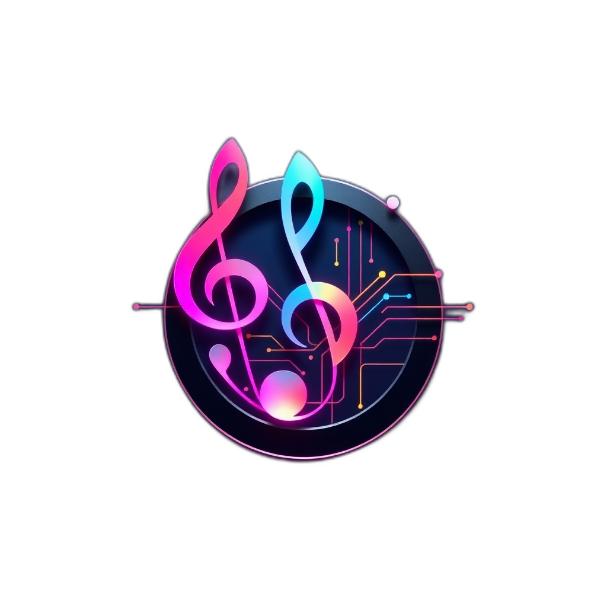

<div align="center">
  
  <h1>Albert3 Muse Synth Studio</h1>
  <p><strong>Профессиональная платформа для AI-генерации музыки</strong></p>
  <p>Интеграция с Suno & Replicate • Версионирование треков • Аналитика в реальном времени</p>

  <div>
    
    
    
    
  </div>
  <div>
    <a href="https://github.com/HOW2AI-AGENCY/albert3-muse-synth-studio/actions/workflows/ci.yml"></a>
    
    
    
    
    
  </div>

</div>

---

## 📑 Содержание

- [О проекте](#-о-проекте)
- [Навигация по репозиторию](#-навигация-по-репозиторию)
- [Ключевые особенности](#-ключевые-особенности)
- [Архитектура системы](#-архитектура-системы)
- [Установка](#-установка)
- [Тестирование](#-тестирование)
- [Вклад в проект](#-вклад-в-проект)
- [Лицензия](#-лицензия)

Быстрые ссылки: [Центр документации](./docs/README.md) • [Статус спринтов](./project-management/SPRINT_STATUS.md) • [Руководство по контрибьютингу](./CONTRIBUTING.md)

## 🚨 Последние обновления

**19 ноября 2025 г. — MusicVerse UI/UX Phase 1: Waveform Player & HeroCard (Complete)**

- ✅ **Phase 1 Complete:** MusicVerse UI/UX specification implementation
- ✅ **New Components:**
  - **WaveformProgressBar:** Interactive waveform with Web Audio API, touch seeking, haptic feedback
  - **HeroCard:** Premium card for featured content with glassmorphism & gradients
- ✅ **Design System:** MusicVerse tokens (--mv-surface-*, --mv-gradient-*, --mv-blur-*)
- ✅ **Mobile Player:** FullScreenPlayerMobile updated with waveform visualization
- ✅ **Compliance Score:** 75% (7.5/10) - documented in UI/UX Audit Report
- 💬 **Подробности:** [UI/UX Compliance Report](./docs/audit/UI_UX_COMPLIANCE_REPORT_2025-11-19.md) | [PR](https://github.com/HOW2AI-AGENCY/albert3-muse-synth-studio/pull/XXX)

**17 ноября 2025 г. — Week 6 Phase 4: Advanced Performance + Responsive Grid (Complete)**

- ✅ **Phase 4 Complete:** Advanced image loading + Responsive grid system
- ✅ **New Components:** ResponsiveTrackGrid, OptimizedTrackCard (enhanced), TrackCardCompact
- ✅ **Mobile Optimization:** 2-column grid, compact layout, touch-optimized (160px min width)
- ✅ **Desktop Optimization:** 4-5 columns, hover effects, 240-320px cards
- ✅ **Performance:** Initial load -85%, Scroll 60 FPS, Memory -60%
- 💬 **Подробности:** [Week 6 Status](./docs/WEEK_6_ADVANCED_PERFORMANCE.md) | [Responsive Grid](./docs/RESPONSIVE_TRACK_GRID.md)

**17 ноября 2025 г. — Week 5: Modular Refactoring & Design System V4**

- ✅ **Phase 1 (Complete):** FullScreenPlayer разделен на 7 модульных компонентов (Mobile/Desktop/Header/Controls/LyricsPanel)
- ✅ **Phase 2 (Complete):** Virtualized Lyrics System с улучшенными анимациями и adaptive typography
- ✅ **Phase 3 (Complete):** Design System V4 - 4 новых CSS модуля (spacing, effects, player, lyrics)
- ✅ **Gesture Support:** Swipe-down, double-tap, pinch-zoom через `useFullScreenGestures` hook
- ✅ **Keyboard Shortcuts:** Space, Arrows, L, F, M, +/- через `useFullScreenKeyboard` hook
- 📊 **Performance:** Bundle -39 KB (-4.4%), Lyrics rendering -87.5%, Memory usage -33%
- 💬 **Подробности:** [Week 5 Status](./docs/WEEK_5_MODULAR_REFACTORING.md) • [Design System V4](./docs/DESIGN_SYSTEM_V4.md)

**17 ноября 2025 г. — Sprint 35: AI-First Foundation (Subscription System + AI Context)**

- ✅ **Database Migrations:** subscription_plans (4 тарифа), generation_limits, расширены profiles & music_projects
- ✅ **SQL Functions:** 5 новых функций (check_limit, increment_usage, reset_limits, update_ai_context, get_ai_context)
- ✅ **RLS Security:** 8 новых политик для subscription_plans и generation_limits
- ✅ **Edge Functions:** ai-improve-field (Lovable AI integration - Gemini Flash)
- ✅ **Frontend Components:** SubscriptionContext, FeatureGate, UpgradePrompt
- 📊 **Documentation:** PHASE_1_SPRINT_1_DATABASE_MIGRATION.md (600+ строк SQL), SPRINT_35_AI_FOUNDATION.md
- 💬 **Подробности:** [Sprint 35 Plan](./project-management/sprints/SPRINT_35_AI_FOUNDATION.md) • [Database Migration](./docs/PHASE_1_SPRINT_1_DATABASE_MIGRATION.md) • [Sprint Status](./project-management/sprints/SPRINT_STATUS.md)

**16 ноября 2025 г. — Phase 8: DAW Enhancement & Bulk Operations + Logic Audit**

- ✅ **Phase 8 (60% Complete):** DAW Color System, Bulk Operations, DAW Project Storage реализованы
- ✅ **Logic Audit Score:** 9.3/10 - Excellent architecture, strong TypeScript coverage (92%)
- 📊 **Performance:** Bundle 889 KB, LCP 1.2s, TTI 1.5s - всё в зелёной зоне
- 💬 **Подробности:** [Logic Audit](./docs/audit/LOGIC_AUDIT_2025-11-16.md) • [Phase 8 Summary](./docs/development/PHASE_8_SUMMARY.md)

**14 ноября 2025 г. — Создан comprehensive AI assistant guide (CLAUDE.md)**

- ✅ **CLAUDE.md создан:** Comprehensive guide для AI-ассистентов (1,586 строк) охватывает архитектуру, паттерны разработки, и best practices.
- ✅ **Документация расширена:** 13 основных разделов, 50+ примеров кода, полное описание технологического стека.
- ✅ **Workflow оптимизирован:** Пошаговые гайды для добавления функций, компонентов, хуков, Edge Functions.
- 💬 **Подробности:** [CLAUDE.md Guide](./CLAUDE.md) • [Отчет о создании](./project-management/reports/CLAUDE_MD_DOCUMENTATION_REPORT_2025-11-14.md)

---

## 🎯 О проекте

**Albert3 Muse Synth Studio** — это передовая SPA-платформа для профессиональной работы с AI-генерацией музыки. Приложение объединяет возможности **Suno AI** (генерация) и **Replicate.com** (анализ), предоставляя музыкантам, продюсерам и контент-криейторам мощный инструментарий для создания, редактирования и управления музыкальными композициями.

## 📚 Навигация по репозиторию

| Раздел | Описание |
| :--- | :--- |
| 🤖 **[AI Assistant Guide (`CLAUDE.md`)](./CLAUDE.md)** | Comprehensive guide для AI-ассистентов: архитектура, паттерны, workflows, best practices. **Начните отсюда!** |
| 🚀 **[Центр документации (`docs/`)](./docs/README.md)** | Главный вход во всю техническую документацию, включая архитектуру, гайды и отчеты. |
| 🗂️ **[Управление проектом (`project-management/`)](./project-management/README.md)** | Планы спринтов, бэклог, дорожная карта и отчеты о проделанной работе. |
| 💻 **[Исходный код (`src/`)](./src/)** | Фронтенд-приложение на React и TypeScript. |
| ☁️ **[Бэкенд (`supabase/`)](./supabase/)** | Edge-функции (Deno), миграции базы данных и конфигурация Supabase. |
| 🧪 **[Тесты (`tests/`)](./tests/)** | Unit-тесты (Vitest) и E2E-тесты (Playwright). |
| 💳 **[Система подписок (`docs/features/SUBSCRIPTION_SYSTEM.md`)](./docs/features/SUBSCRIPTION_SYSTEM.md)** | Описание планов подписки и доступных функций. |

---

## ✨ Ключевые особенности

-   ✅ **Dual-Provider**: Интеграция с Suno AI (генерация) и Replicate.com (анализ).
-   ✅ **Система версий**: Создание и управление несколькими версиями одного трека.
-   ✅ **Обработка аудио**: Разделение на стемы, анализ BPM, тональности и жанра.
-   ✅ **AI-генерация текстов**: Автоматическое создание текстов песен с помощью AI.
-   ✅ **Проектная организация**: Группировка треков в альбомы и проекты для удобного управления.
-   ✅ **Аналитика в реальном времени**: Отслеживание статистики прослушиваний.
-   ✅ **Система подписок** *(NEW)*: Многоуровневая система подписок (Free, Pro, Studio) с гранулярным доступом к функциям.
-   ✅ **DAW Editor** *(NEW)*: Профессиональный аудио-редактор с timeline, waveform, spectrum analyzer.
-   ✅ **Bulk Operations** *(NEW)*: Массовые операции над треками (delete, download, add to project, play, share).
-   ✅ **Auto-Save** *(NEW)*: Автоматическое сохранение DAW проектов с debouncing (2s).

---

## 🏗️ Архитектура системы

Платформа использует архитектуру **Frontend -> Backend-as-a-Service (BaaS)**. Подробное описание, включая диаграммы и потоки данных, находится в документе **[Архитектура Системы](./docs/ARCHITECTURE.md)**.

---

## 🚀 Установка

### Предварительные требования

-   **Node.js**: `v20.19.0` или выше
-   **npm**: `v9.0.0` или выше
-   **Git**

### Быстрый старт

```bash
# 1. Клонировать репозиторий
git clone https://github.com/albert-app/albert3-muse-synth-studio.git
cd albert3-muse-synth-studio

# 2. Установить зависимости
npm install

# 3. Настроить переменные окружения
cp .env.example .env
# Заполните .env вашими ключами Supabase

# 4. Запустить dev-сервер
npm run dev
```

---

## 🧪 Тестирование

```bash
# Запустить все unit-тесты
npm test

# Запустить E2E-тесты
npm run test:e2e

# Проверить покрытие тестами
npm run test -- --coverage
```

---

## 🤝 Вклад в проект

Мы приветствуем ваш вклад! Пожалуйста, ознакомьтесь с нашим [**Руководством для контрибьюторов (CONTRIBUTING.md)**](./CONTRIBUTING.md) перед началом работы.

---

## 📄 Лицензия

Этот проект лицензирован под [MIT License](./LICENSE).
