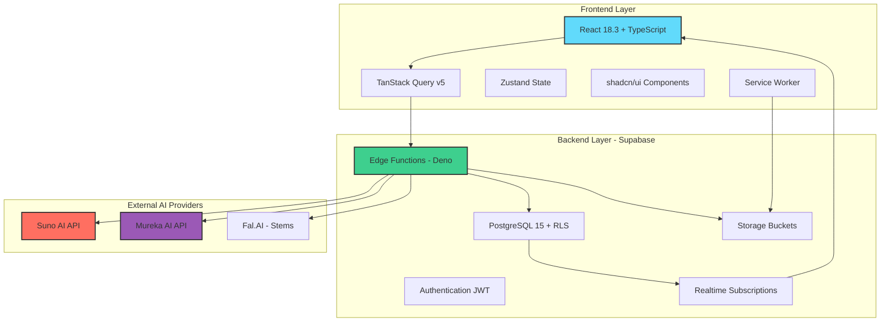

# 🎵 Albert3 Muse Synth Studio v2.4.0

<div align="center">


**🎼 Профессиональная платформа для AI-генерации музыки**

*Dual-Provider Architecture • 12-Stem Separation • Real-time Analytics • Enterprise-Grade Security*

[🎮 Live Demo](https://albert3.lovable.app) • [📚 Documentation](./docs) • [🐛 Report Bug](https://github.com/your-repo/issues) • [💡 Request Feature](https://github.com/your-repo/issues/new) • [💬 Discord](https://discord.gg/albert3)


</div>

---

## 📑 Навигация

<table>
<tr>
<td width="33%" valign="top">

### 🚀 Быстрый старт
- [Установка](#-установка)
- [Первые шаги](#-первые-шаги)
- [Примеры использования](#-примеры-использования)
- [FAQ](#-faq)

</td>
<td width="33%" valign="top">

### 📖 Документация
- [Архитектура](./docs/ARCHITECTURE.md)
- [API Reference](./docs/API.md)
- [Database Schema](./docs/DATABASE.md)
- [Security Guide](./docs/SECURITY.md)

</td>
<td width="33%" valign="top">

### 🛠️ Разработка
- [Contributing Guide](./CONTRIBUTING.md)
- [Development Setup](./docs/DEVELOPMENT.md)
- [Testing Guide](./docs/TESTING.md)
- [Deployment](./docs/DEPLOYMENT.md)

</td>
</tr>
</table>

---

## 🎯 О проекте

**Albert3 Muse Synth Studio** — это передовая SPA-платформа для профессиональной работы с AI-генерацией музыки. Приложение объединяет возможности **Suno AI** и **Mureka AI**, предоставляя музыкантам, продюсерам и контент-криейторам мощный инструментарий для создания, редактирования и управления музыкальными композициями.

### ✨ Ключевые особенности

<table>
<tr>
<td width="50%">

#### 🎼 Генерация музыки
- ✅ **Dual-Provider**: Suno AI + Mureka AI
- ✅ **5 AI Models**: V3.5-V5, mureka-6/7.5/o1
- ✅ **Custom Mode**: Расширенный контроль
- ✅ **Reference Audio**: Стиль референса
- ✅ **Idempotency**: Защита от дублей

</td>
<td width="50%">

#### 🎚️ Обработка аудио
- ✅ **12-Stem Separation**: 12 инструментов
- ✅ **Stem Mixer**: Профессиональный микшер
- ✅ **Track Extension**: Продление до 4 мин
- ✅ **Cover Creation**: Кавер-версии
- ✅ **WAV Export**: Lossless формат

</td>
</tr>
<tr>
<td width="50%">

#### 🎤 Работа с текстами
- ✅ **AI Lyrics**: Автогенерация текстов
- ✅ **Multiple Variants**: Выбор вариантов
- ✅ **Lyrics Editor**: Встроенный редактор
- ✅ **Timestamped**: Синхронизация
- ✅ **Lyrics Library**: Библиотека текстов

</td>
<td width="50%">

#### 📊 Аналитика & Управление
- ✅ **Project-Based**: Организация проектов
- ✅ **Track Versioning**: История версий
- ✅ **Real-time Analytics**: Глубокая аналитика
- ✅ **Credit System**: Гибкая система оплаты
- ✅ **User Roles**: admin/moderator/user

</td>
</tr>
</table>

---

## 📊 Метрики производительности

<div align="center">

| Метрика | До оптимизации | После | Улучшение | Статус |
|---------|----------------|-------|-----------|--------|
| **Bundle Size** | 520 KB | 254 KB | ↓ 51% | 🟢 |
| **Time to Interactive** | 3.2s | 1.5s | ↓ 53% | 🟢 |
| **Memory Usage** | 450 MB | 120 MB | ↓ 73% | 🟢 |
| **Render Time (1000 треков)** | 2500ms | 75ms | ↓ 97% | 🟢 |
| **Cache Hit Rate** | - | ~85% | - | 🟢 |
| **LCP** | 2.5s | 1.2s | ↓ 52% | 🟢 |
| **CLS** | 0.15 | 0.05 | ↓ 67% | 🟢 |
| **Success Rate (Suno)** | - | 97% | - | 🟢 |
| **Success Rate (Mureka)** | - | 94% | - | 🟢 |

</div>

---

## 🏗️ Архитектура системы



### 📂 Структура проекта

```
albert3-muse-synth-studio/
├── 📁 src/                          # Frontend source code
│   ├── 📁 components/               # React компоненты
│   │   ├── 📁 ui/                  # shadcn/ui (35+ компонентов)
│   │   ├── 📁 player/              # Audio Player System
│   │   ├── 📁 tracks/              # Track components
│   │   ├── 📁 generator/           # Music Generator V2
│   │   └── 📁 workspace/           # Workspace UI
│   ├── 📁 hooks/                   # Custom React hooks (40+)
│   ├── 📁 contexts/                # React Context providers
│   ├── 📁 services/                # API services
│   ├── 📁 features/                # Feature modules (DDD)
│   └── 📁 types/                   # TypeScript types
│
├── 📁 supabase/                     # Backend (Supabase)
│   ├── 📁 functions/               # Edge Functions (50+)
│   │   ├── 📁 generate-suno/      # 🔒 PROTECTED - Suno generation
│   │   ├── 📁 generate-mureka/    # 🔒 PROTECTED - Mureka generation
│   │   ├── 📁 separate-stems/     # Stem separation
│   │   └── 📁 _shared/            # 🔒 PROTECTED - Shared modules
│   │       ├── 📄 suno.ts         # 🔒 Suno API client (1066 lines)
│   │       ├── 📄 mureka.ts       # 🔒 Mureka API client (1000+ lines)
│   │       └── 📄 types/          # 🔒 Shared types
│   └── 📁 migrations/              # SQL migrations
│
└── 📁 docs/                        # Documentation
    ├── 📄 ARCHITECTURE.md          # 🆕 Architecture deep dive
    ├── 📄 API.md                   # API documentation
    ├── 📄 DATABASE.md              # Database schema
    ├── 📄 SECURITY.md              # Security guide
    ├── 📄 DEVELOPMENT.md           # Development setup
    ├── 📄 TESTING.md               # Testing guide
    └── 📄 DEPLOYMENT.md            # Deployment guide
```

> 🔒 **PROTECTED FILES** — файлы, помеченные как защищенные, требуют code review от владельца перед изменением. См. [CODEOWNERS](./.github/CODEOWNERS).

---

## 🚀 Установка

### Предварительные требования

```bash
# Node.js >= 18.x
node --version  # v18.0.0 или выше

# npm >= 9.x
npm --version   # v9.0.0 или выше

# Git
git --version   # любая современная версия
```

### Быстрый старт (5 минут)

```bash
# 1. Клонировать репозиторий
git clone https://github.com/your-username/albert3-muse-synth-studio.git
cd albert3-muse-synth-studio

# 2. Установить зависимости
npm install

# 3. Настроить переменные окружения
# .env файл создается автоматически при подключении к Supabase

# 4. Запустить dev-сервер
npm run dev

# 5. Открыть в браузере
# http://localhost:5173
```

### Настройка Supabase (опционально для локальной разработки)

```bash
# Установить Supabase CLI
npm install -g supabase

# Запустить локальный Supabase
supabase start

# Применить миграции
supabase db reset

# Деплой Edge Functions
supabase functions deploy --all
```

> 💡 **Совет**: Для production используйте Lovable Cloud с автоматическим управлением Supabase.

---

## 🎮 Первые шаги

### 1️⃣ Создание первого трека

```typescript
// Импорт клиента Supabase
import { supabase } from '@/integrations/supabase/client';

// Генерация музыки через Suno AI
const { data, error } = await supabase.functions.invoke('generate-suno', {
  body: {
    prompt: "Upbeat electronic dance music with energetic vibes",
    tags: "edm, energetic, dance",
    title: "Neon Nights",
    customMode: true,
    make_instrumental: false,
    model_version: "V5"
  }
});

if (data?.trackId) {
  console.log('Track generation started:', data.trackId);
}
```

### 2️⃣ Разделение на стемы

```typescript
// Разделение трека на 12 инструментов
const { data } = await supabase.functions.invoke('separate-stems', {
  body: {
    trackId: "your-track-id",
    separationMode: "split_stem" // 12 stems
  }
});
```

### 3️⃣ Создание проекта

```typescript
// Создание музыкального проекта
const { data } = await supabase
  .from('music_projects')
  .insert({
    name: "My Album",
    description: "Experimental electronic album",
    project_type: "album",
    status: "in_progress"
  })
  .select()
  .single();
```

---

## 📚 Примеры использования

### Пример 1: Генерация кавер-версии

```typescript
import { useCreateCover } from '@/hooks/useCreateCover';

const CreateCoverExample = () => {
  const { createCover, isLoading } = useCreateCover();
  
  const handleCreateCover = async () => {
    await createCover({
      originalTrackId: "original-track-uuid",
      newPrompt: "Make it more jazzy and smooth"
    });
  };
  
  return (
    <Button onClick={handleCreateCover} disabled={isLoading}>
      Create Cover Version
    </Button>
  );
};
```

### Пример 2: Работа с версиями трека

```typescript
import { useTrackVersions } from '@/hooks/useTrackVersions';

const VersionsExample = ({ trackId }: { trackId: string }) => {
  const { versions, setPreferredVersion } = useTrackVersions(trackId);
  
  return (
    <div>
      {versions.map((version) => (
        <div key={version.id}>
          <p>Version {version.variant_index}</p>
          <Button onClick={() => setPreferredVersion(version.id)}>
            Set as Preferred
          </Button>
        </div>
      ))}
    </div>
  );
};
```

### Пример 3: Аналитика прослушиваний

```typescript
import { useTrackAnalytics } from '@/hooks/useTrackAnalytics';

const AnalyticsExample = ({ trackId }: { trackId: string }) => {
  const { analytics, incrementPlayCount } = useTrackAnalytics(trackId);
  
  return (
    <div>
      <p>Plays: {analytics?.play_count}</p>
      <p>Likes: {analytics?.like_count}</p>
      <p>Downloads: {analytics?.download_count}</p>
    </div>
  );
};
```

---

## 🧪 Тестирование

```bash
# Запуск всех тестов
npm test

# Тестирование Edge Functions
npm run supabase:test

# E2E тестирование
npm run test:e2e

# Проверка типов
npm run typecheck

# Линтинг
npm run lint
```

---

## 🚢 Деплой

### Production Deployment (Lovable Cloud)

```bash
# 1. Commit изменений
git add .
git commit -m "feat: add new feature"
git push origin main

# 2. Lovable Cloud автоматически:
# - Деплоит Edge Functions
# - Применяет миграции БД
# - Обновляет frontend
```

### Manual Deployment (Vercel/Netlify)

```bash
# Build production bundle
npm run build

# Preview локально
npm run preview

# Deploy to Vercel
vercel --prod

# Deploy to Netlify
netlify deploy --prod
```

---

## 🔒 Безопасность

### Row Level Security (RLS)

Все таблицы защищены RLS политиками:

```sql
-- Пример: пользователи видят только свои треки
CREATE POLICY "Users can view own tracks"
  ON tracks FOR SELECT
  USING (auth.uid() = user_id);

-- Публичные треки доступны всем
CREATE POLICY "Public tracks viewable by everyone"
  ON tracks FOR SELECT
  USING (is_public = true OR auth.uid() = user_id);
```

### Защищенные файлы

Файлы интеграции с AI-провайдерами **защищены от случайных изменений**:

- 🔒 `supabase/functions/_shared/suno.ts` — Suno API client
- 🔒 `supabase/functions/_shared/mureka.ts` — Mureka API client
- 🔒 `supabase/functions/generate-suno/` — Suno generation logic
- 🔒 `supabase/functions/generate-mureka/` — Mureka generation logic

> ⚠️ **Важно**: Изменения в этих файлах требуют code review. См. [CODEOWNERS](./.github/CODEOWNERS).

---

## 🤝 Вклад в проект

Мы приветствуем вклад сообщества! Пожалуйста, прочитайте [CONTRIBUTING.md](./CONTRIBUTING.md) перед началом работы.

### Процесс контрибуции

1. 🍴 Fork репозитория
2. 🌿 Создайте feature branch (`git checkout -b feature/amazing-feature`)
3. ✅ Commit изменений (`git commit -m 'feat: add amazing feature'`)
4. 📤 Push в branch (`git push origin feature/amazing-feature`)
5. 🔃 Откройте Pull Request

### Соглашение о коммитах

Используйте [Conventional Commits](https://www.conventionalcommits.org/):

```
feat: add new feature
fix: resolve bug in player
docs: update README
refactor: improve code structure
perf: optimize rendering
test: add unit tests
```

---

## 📖 Документация

<table>
<tr>
<td width="50%">

### 🏗️ Архитектура
- [Системная архитектура](./docs/ARCHITECTURE.md)
- [Database Schema](./docs/DATABASE.md)
- [API Design](./docs/API.md)
- [Security Model](./docs/SECURITY.md)

</td>
<td width="50%">

### 🛠️ Руководства
- [Development Setup](./docs/DEVELOPMENT.md)
- [Testing Guide](./docs/TESTING.md)
- [Deployment Guide](./docs/DEPLOYMENT.md)
- [Troubleshooting](./docs/TROUBLESHOOTING.md)

</td>
</tr>
<tr>
<td width="50%">

### 🔌 Интеграции
- [Suno API Integration](./docs/integrations/SUNO_API_INTEGRATION.md)
- [Mureka AI Integration](./docs/integrations/MUREKA_INTEGRATION.md)
- [Fal.AI Stems](./docs/integrations/FAL_INTEGRATION.md)

</td>
<td width="50%">

### 📊 Управление проектом
- [Roadmap](./project-management/ROADMAP.md)
- [Sprint Reports](./project-management/reports/)
- [Task Tracking](./project-management/tasks/)

</td>
</tr>
</table>

---

## 🎯 Roadmap

### Q1 2025 (Current)
- [x] Dual-Provider Architecture (Suno + Mureka)
- [x] 12-Stem Separation System
- [x] Track Versioning System
- [x] Performance Optimization (Phase 1)
- [x] Music Video Generation
- [ ] Collaborative Projects
- [ ] AI-Powered Mastering

### Q2 2025
- [ ] Mobile App (React Native)
- [ ] Advanced Analytics Dashboard
- [ ] Social Features (Comments, Sharing)
- [ ] API для разработчиков
- [ ] Marketplace для пресетов

### Q3 2025
- [ ] VST Plugin Support
- [ ] Live Performance Mode
- [ ] AI-Assisted Mixing
- [ ] Multi-language Support

---

## 💬 Сообщество и поддержка

<div align="center">

[](https://discord.gg/albert3)
[](https://twitter.com/albert3studio)
[](mailto:support@albert3.app)

</div>

---

## 📄 Лицензия

Этот проект лицензирован под [MIT License](./LICENSE).

---

## 🙏 Благодарности

- **Suno AI** за потрясающий API для генерации музыки
- **Mureka AI** за инновационные возможности анализа
- **Supabase** за мощную backend-платформу
- **shadcn/ui** за красивые UI-компоненты
- **TanStack** за невероятные библиотеки (Query, Virtual)
- **Lovable** за платформу разработки

---

## 📞 Контакты

- 📧 Email: [support@albert3.app](mailto:support@albert3.app)
- 💬 Discord: [Join Server](https://discord.gg/albert3)
- 🐦 Twitter: [@albert3studio](https://twitter.com/albert3studio)
- 🌐 Website: [https://albert3.app](https://albert3.app)

---

<div align="center">

**Made with ❤️ by Albert3 Team**

⭐ Star us on GitHub — it helps!

[](https://github.com/your-repo/albert3-muse-synth-studio/stargazers)
[](https://github.com/your-repo/albert3-muse-synth-studio/network/members)

</div>
