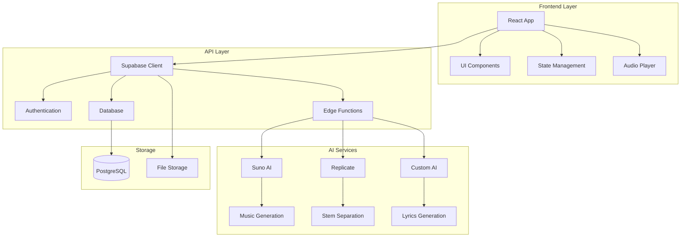

# 🎵 Albert3 Muse Synth Studio

<div align="center">


**Профессиональная студия для создания музыки с использованием ИИ**

[](https://www.typescriptlang.org/)
[](https://reactjs.org/)
[](https://vitejs.dev/)
[](https://supabase.com/)
[](https://tailwindcss.com/)

**Версия:** 0.0.1 | **Статус:** В разработке | **Последнее обновление:** Январь 2025

[🚀 Демо](http://localhost:5173) • [📖 Документация](#-документация) • [🛠️ Установка](#️-установка) • [🎯 Функции](#-основные-функции)

</div>

---

## 📋 Описание проекта

**Albert3 Muse Synth Studio** — это современное веб-приложение для создания музыки с использованием искусственного интеллекта. Платформа предоставляет пользователям мощные инструменты для генерации музыки, создания текстов песен, разделения аудио на стемы и управления музыкальными проектами.

### 🎯 Основные функции

- 🎼 **Генерация музыки с ИИ** — создание треков по текстовому описанию через Suno AI
- 📝 **Создание текстов песен** — автоматическая генерация лирики с помощью ИИ
- 🎚️ **Разделение на стемы** — извлечение отдельных инструментов из трека
- 🎵 **Управление треками** — организация, версионирование и каталогизация музыки
- 👥 **Система пользователей** — регистрация, аутентификация через Supabase Auth
- 📊 **Аналитика прослушиваний** — отслеживание взаимодействий и популярности
- 💾 **Облачное хранение** — безопасное сохранение в Supabase Storage
- 🎧 **Продвинутый аудиоплеер** — с поддержкой плейлистов и управления
- 🔄 **Виртуализированные списки** — оптимизированная производительность для больших коллекций
- 🎨 **Современный UI/UX** — адаптивный дизайн с темной/светлой темой

## 🏗️ Архитектура



## 🛠️ Технологический стек

### Frontend
- **React 18** — современная библиотека для UI с Concurrent Features
- **TypeScript 5.x** — типизированный JavaScript для надежности кода
- **Vite 6.x** — молниеносный сборщик проектов нового поколения
- **Tailwind CSS 3.x** — utility-first CSS фреймворк
- **Radix UI** — доступные и настраиваемые UI компоненты
- **TanStack Query** — мощное управление серверным состоянием
- **React Hook Form** — производительное управление формами
- **Lucide React** — красивые SVG иконки
- **Embla Carousel** — легкий и гибкий карусель компонент

### Backend & Infrastructure
- **Supabase** — полнофункциональная Backend-as-a-Service платформа
- **PostgreSQL** — надежная реляционная база данных
- **Supabase Edge Functions** — серверные функции на Deno Runtime
- **Supabase Storage** — масштабируемое файловое хранилище
- **Row Level Security (RLS)** — безопасность на уровне строк БД

### AI & External Services
- **Suno AI API** — профессиональная генерация музыки
- **Replicate API** — разделение аудио на стемы через ML модели
- **Custom AI Models** — создание текстов песен и улучшение промптов

### Development & Build Tools
- **ESLint** — статический анализ кода
- **PostCSS** — трансформация CSS
- **SWC** — быстрый компилятор для JavaScript/TypeScript
- **Rollup** — оптимизированная сборка для продакшена

## 🚀 Быстрый старт

### Предварительные требования

- **Node.js** 18+ ([установить с nvm](https://github.com/nvm-sh/nvm#installing-and-updating))
- **npm** 9+ или **yarn** 1.22+
- **Git** для клонирования репозитория
- **Аккаунт Supabase** для backend сервисов

### Установка

1. **Клонирование репозитория**
```bash
git clone https://github.com/your-username/albert3-muse-synth-studio.git
cd albert3-muse-synth-studio
```

2. **Установка зависимостей**
```bash
# Используя npm
npm install

# Или используя yarn
yarn install
```

3. **Настройка переменных окружения**
```bash
# Копируем пример конфигурации
cp .env.example .env
```

Заполните `.env` файл своими данными:
```env
# Supabase Configuration
VITE_SUPABASE_URL=your_supabase_project_url
VITE_SUPABASE_PUBLISHABLE_KEY=your_supabase_anon_key
VITE_SUPABASE_PROJECT_ID=your_project_id

# AI Services (опционально)
VITE_SUNO_API_KEY=your_suno_api_key
VITE_REPLICATE_API_TOKEN=your_replicate_token
```

4. **Настройка Supabase (если требуется)**
```bash
# Установка Supabase CLI
npm install -g @supabase/cli

# Инициализация проекта
supabase init

# Запуск локальной разработки
supabase start
```

5. **Запуск в режиме разработки**
```bash
npm run dev
```

Приложение будет доступно по адресу `http://localhost:5173`

### Дополнительные команды

```bash
# Сборка для продакшена
npm run build

# Предварительный просмотр сборки
npm run preview

# Проверка кода с ESLint
npm run lint
```

## 📁 Структура проекта

```
albert3-muse-synth-studio/
├── 📁 public/                    # Статические файлы
│   ├── favicon.ico              # Иконка сайта
│   └── manifest.json            # PWA манифест
├── 📁 src/                      # Исходный код приложения
│   ├── 📁 components/           # React компоненты
│   │   ├── ui/                  # Базовые UI компоненты (Radix UI)
│   │   ├── AudioPlayer.tsx      # Аудиоплеер с расширенным функционалом
│   │   ├── TrackCard.tsx        # Карточка трека с действиями
│   │   ├── VirtualizedList.tsx  # Виртуализированный список треков
│   │   ├── ErrorBoundary.tsx    # Обработка ошибок React
│   │   └── Layout.tsx           # Основной макет приложения
│   ├── 📁 hooks/                # Пользовательские React хуки
│   │   ├── useAudio.ts          # Управление аудио воспроизведением
│   │   ├── useSupabase.ts       # Интеграция с Supabase
│   │   └── useVirtualization.ts # Виртуализация больших списков
│   ├── 📁 lib/                  # Библиотеки и конфигурации
│   │   ├── supabase.ts          # Клиент Supabase
│   │   ├── ai-services.ts       # Интеграция с AI сервисами
│   │   └── audio-processing.ts  # Обработка аудио файлов
│   ├── 📁 pages/                # Страницы приложения
│   │   ├── Dashboard.tsx        # Главная панель
│   │   ├── Studio.tsx           # Студия создания музыки
│   │   ├── Library.tsx          # Библиотека треков
│   │   └── Profile.tsx          # Профиль пользователя
│   ├── 📁 services/             # Сервисы и API
│   │   ├── api.ts               # Основной API клиент
│   │   ├── suno-api.ts          # Интеграция с Suno AI
│   │   ├── replicate-api.ts     # Интеграция с Replicate
│   │   └── storage.ts           # Управление файлами
│   ├── 📁 types/                # TypeScript типы
│   │   ├── audio.ts             # Типы для аудио
│   │   ├── user.ts              # Типы пользователей
│   │   └── api.ts               # Типы API ответов
│   ├── 📁 utils/                # Утилиты и хелперы
│   │   ├── formatters.ts        # Форматирование данных
│   │   ├── logger.ts            # Система логирования
│   │   ├── validation.ts        # Валидация данных
│   │   └── constants.ts         # Константы приложения
│   ├── 📁 styles/               # Стили приложения
│   │   ├── globals.css          # Глобальные стили
│   │   └── components.css       # Стили компонентов
│   ├── App.tsx                  # Корневой компонент
│   ├── main.tsx                 # Точка входа приложения
│   └── vite-env.d.ts           # Типы Vite
├── 📁 docs/                     # Документация проекта
│   ├── 📁 api/                  # API документация
│   ├── 📁 architecture/         # Архитектурная документация
│   └── 📁 guides/               # Руководства пользователя
├── 📁 tests/                    # Тесты
│   ├── 📁 unit/                 # Модульные тесты
│   ├── 📁 integration/          # Интеграционные тесты
│   └── 📁 e2e/                  # End-to-end тесты
├── 📁 supabase/                 # Supabase конфигурация
│   ├── functions/               # Edge Functions
│   ├── migrations/              # Миграции БД
│   └── config.toml             # Конфигурация
├── .env.example                 # Пример переменных окружения
├── .gitignore                   # Игнорируемые Git файлы
├── package.json                 # Зависимости и скрипты
├── tsconfig.json               # Конфигурация TypeScript
├── tailwind.config.js          # Конфигурация Tailwind CSS
├── vite.config.ts              # Конфигурация Vite
├── eslint.config.js            # Конфигурация ESLint
├── postcss.config.js           # Конфигурация PostCSS
├── CHANGELOG.md                # История изменений
├── SETUP-GUIDE.md              # Подробное руководство по установке
└── README.md                   # Этот файл
```

## 🎮 Использование

### 1. Регистрация и вход
- Создайте аккаунт или войдите в существующий
- Подтвердите email адрес

### 2. Создание музыки
```typescript
// Пример использования генератора музыки
const { generateMusic, isLoading } = useMusicGeneration();

const handleGenerate = async () => {
  const result = await generateMusic({
    prompt: "Спокойная джазовая мелодия",
    duration: 30,
    includeVocals: false
  });
};
```

### 3. Управление треками
- Просматривайте созданные треки
- Создавайте версии треков
- Разделяйте аудио на стемы
- Делитесь треками с другими пользователями

## 🔧 API Reference

### Основные эндпоинты

#### Генерация музыки
```typescript
POST /functions/v1/generate-music
Content-Type: application/json

{
  "prompt": "описание музыки",
  "duration": 30,
  "includeVocals": boolean
}
```

#### Разделение на стемы
```typescript
POST /functions/v1/separate-stems
Content-Type: application/json

{
  "audioUrl": "url_to_audio_file",
  "separationMode": "vocals_instrumental" | "full_stems"
}
```

#### Создание текстов
```typescript
POST /functions/v1/generate-lyrics
Content-Type: application/json

{
  "prompt": "тема песни",
  "genre": "жанр",
  "mood": "настроение"
}
```

## 🧪 Тестирование

```bash
# Запуск всех тестов
npm run test

# Запуск тестов в watch режиме
npm run test:watch

# Покрытие кода
npm run test:coverage
```

## 📦 Сборка и деплой

### Локальная сборка
```bash
npm run build
```

### Деплой на Vercel
```bash
npm install -g vercel
vercel --prod
```

### Деплой через Lovable
1. Откройте [Lovable проект](https://lovable.dev/projects/02875d5f-a8ca-4fc2-97f1-474a7f7a6d00)
2. Нажмите Share → Publish

## 🔒 Безопасность

Проект использует современные практики безопасности:

- **JWT аутентификация** через Supabase Auth
- **Row Level Security (RLS)** для защиты данных
- **HTTPS** для всех соединений
- **Валидация входных данных** с Zod
- **Санитизация контента** для предотвращения XSS

⚠️ **Важно**: Ознакомьтесь с [отчетом о безопасности](reports/security/SECURITY.md) для получения подробной информации.

## ⚡ Производительность

Текущие показатели:
- **Bundle Size**: ~287KB (gzipped)
- **First Contentful Paint**: ~1.2s
- **Time to Interactive**: ~2.1s

📊 Подробный анализ доступен в [отчете о производительности](reports/performance/PERFORMANCE.md).

## 🤝 Участие в разработке

Мы приветствуем вклад в развитие проекта!

### Процесс разработки

1. **Fork** репозитория
2. Создайте **feature branch** (`git checkout -b feature/amazing-feature`)
3. **Commit** изменения (`git commit -m 'Add amazing feature'`)
4. **Push** в branch (`git push origin feature/amazing-feature`)
5. Откройте **Pull Request**

### Стандарты кода

- Используйте **TypeScript** для всего кода
- Следуйте **ESLint** правилам
- Покрывайте код **тестами**
- Документируйте **API изменения**

## 📚 Документация

### 🏗️ Архитектура и планирование
- [🏗️ Архитектура системы](docs/architecture/ARCHITECTURE.md)
- [🚀 План оптимизации](docs/architecture/OPTIMIZATION_PLAN.md)

### 📖 API и развертывание
- [🔌 API документация](docs/api/API.md)
- [🚀 Руководство по развертыванию](docs/deployment/DEPLOYMENT.md)

### 📊 Отчеты и анализ
- [🔍 Анализ кода](reports/CODE_ANALYSIS.md)
- [🔒 Отчет о безопасности](reports/security/SECURITY.md)
- [📊 Анализ производительности](reports/performance/PERFORMANCE.md)

## 🐛 Известные проблемы

- [ ] Оптимизация размера bundle
- [ ] Улучшение времени загрузки
- [ ] Добавление offline режима
- [ ] Поддержка PWA

## 🗺️ Roadmap

### Q1 2024
- [ ] Мобильное приложение
- [ ] Расширенные AI модели
- [ ] Коллаборативное редактирование

### Q2 2024
- [ ] Marketplace для треков
- [ ] Интеграция с социальными сетями
- [ ] Продвинутая аналитика

## 📄 Лицензия

Этот проект лицензирован под MIT License - см. файл [LICENSE](LICENSE) для подробностей.

## 👥 Команда

- **Разработчик**: [Ваше имя](https://github.com/your-username)
- **Дизайн**: UI/UX команда
- **AI Integration**: ML команда

## 📞 Поддержка

- 📧 **Email**: support@albert3studio.com
- 💬 **Discord**: [Присоединиться к серверу](https://discord.gg/albert3)
- 🐛 **Issues**: [GitHub Issues](https://github.com/your-username/albert3-muse-synth-studio/issues)

## 🙏 Благодарности

- [Supabase](https://supabase.com/) за отличную BaaS платформу
- [Suno AI](https://suno.ai/) за API генерации музыки
- [Replicate](https://replicate.com/) за AI модели
- [Radix UI](https://www.radix-ui.com/) за доступные компоненты
- [Tailwind CSS](https://tailwindcss.com/) за utility-first подход

---

<div align="center">

**Создано с ❤️ для музыкантов и творцов**

[⭐ Поставьте звезду](https://github.com/your-username/albert3-muse-synth-studio) если проект вам понравился!

</div>
