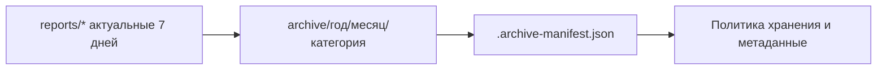
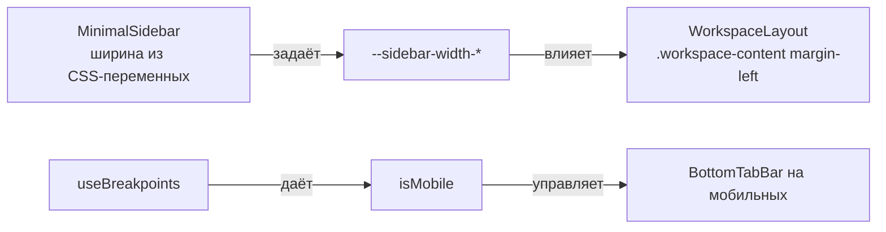

<div align="center">
  
  <h1>Albert3 Muse Synth Studio</h1>
  <p><strong>Профессиональная платформа для AI-генерации музыки</strong></p>
  <p>Интеграция с Suno & Replicate • Версионирование треков • Аналитика в реальном времени</p>

  <div>
    
    
    
    
  </div>
  <div>
    
    
    
  </div>

</div>

---

## 🚨 Последние обновления безопасности

**04 ноября 2025** - Выполнены критичные улучшения безопасности (P1):
- ✅ **Логирование в Sentry:** Заменено 25 использований `console.*` на `logger` → Все ошибки теперь отслеживаются
- ✅ **Обновлены зависимости:** vite 7.1.12, supabase 2.54.11, typescript 5.8.3 → устранены найденные уязвимости
- ✅ **CORS ограничен:** Изменен с `*` на localhost whitelist → Защита от CSRF атак
- ✅ **CSP headers:** Добавлена Content Security Policy → Защита от XSS атак

**Оценка безопасности:** 8.0/10 → **9.0/10** ⭐

📊 [Полный отчёт аудита](./docs/audit/) • [Статус выполнения](./docs/audit/2025-11-04_Implementation_Status.md) • [План дальнейших работ](./docs/audit/2025-11-04_Next_Steps.md)

---

## 🎯 О проекте

**Albert3 Muse Synth Studio** — это передовая SPA-платформа для профессиональной работы с AI-генерацией музыки. Приложение объединяет возможности **Suno AI** (генерация) и **Replicate.com** (анализ), предоставляя музыкантам, продюсерам и контент-криейторам мощный инструментарий для создания, редактирования и управления музыкальными композициями.

## 📚 Навигация по репозиторию

| Раздел | Описание | Быстрые ссылки |
| :--- | :--- | :--- |
| 🚀 **Быстрый старт** | Все, что нужно для запуска проекта за 5 минут. | [Установка](#-установка) • [Запуск](#-быстрый-старт) |
| 🏗️ **Архитектура** | Глубокое погружение в архитектуру системы. | [Описание](./docs/ARCHITECTURE.md) • [Схема](#-архитектура-системы) |
| 🔬 **Аудит** | Результаты последнего технического аудита. | [Отчёты](./docs/audit/) • [План работ](./docs/audit/05_Refactor_Plan.md) |
| 🎛️ **Компоненты** | Обзор UI-кита и ключевых компонентов. | `src/components/ui` |
| ☁️ **Backend** | Обзор Edge-функций Supabase. | `supabase/functions` |
| 🤝 **Контрибьютинг**| Как помочь проекту. | [Гайд](./CONTRIBUTING.md) • [Задачи](./project-management) |
| 🗄️ **Архив отчётов** | Политика хранения и структура архива. | [Политика](./docs/ARCHIVE_POLICY.md) • [Манифест](./archive/.archive-manifest.json) |

---

## ✨ Ключевые особенности

-   ✅ **Dual-Provider**: Интеграция с Suno AI (генерация) и Replicate.com (анализ).
-   ✅ **Система версий**: Создание и управление несколькими версиями одного трека.
-   ✅ **Обработка аудио**: Разделение на стемы, анализ BPM, тональности и жанра.
-   ✅ **AI-генерация текстов**: Автоматическое создание текстов песен с помощью AI.
-   ✅ **Проектная организация**: Группировка треков в альбомы и проекты для удобного управления.
-   ✅ **Аналитика в реальном времени**: Отслеживание статистики прослушиваний.

---

## 🏗️ Архитектура системы

Платформа использует архитектуру **Frontend -> Backend-as-a-Service (BaaS)**, где фронтенд-приложение на React взаимодействует с Supabase, который предоставляет базу данных, аутентификацию, хранилище и бессерверные Edge-функции.

<details>
<summary>Диаграмма архитектуры (нажмите для просмотра)</summary>

```mermaid
graph TB
    subgraph "Frontend Layer (React + Vite)"
        A[UI Components (shadcn/ui)]
        B[State Management (React Query + Zustand)]
        C[Routing (React Router)]
    end

    subgraph "Backend Layer (Supabase)"
        F[Edge Functions (Deno)]
        G[Database (PostgreSQL + RLS)]
        H[Authentication (JWT)]
        I[Storage]
    end

    subgraph "External AI Providers"
        K[Suno AI API]
        L[Replicate.com API]
    end

    A & C --> B; B --> F;
    F --> K; F --> L; F --> G; F --> I;
    G --> H;

    style A fill:#61DAFB,stroke:#333,stroke-width:2px
    style F fill:#3ECF8E,stroke:#333,stroke-width:2px
    style K fill:#FF6F61,stroke:#333,stroke-width:2px
    style L fill:#9B59B6,stroke:#333,stroke-width:2px
```

</details>

---

## 🚀 Установка

### Предварительные требования

-   **Node.js**: `v18.0.0` или выше
-   **npm**: `v9.0.0` или выше
-   **Git**

### Быстрый старт

```bash
# 1. Клонировать репозиторий
git clone https://github.com/albert-app/albert3-muse-synth-studio.git
cd albert3-muse-synth-studio

# 2. Установить зависимости
npm install

# 3. Настроить переменные окружения
# Для работы с Supabase создайте файл .env и добавьте ключи проекта
# VITE_SUPABASE_URL=...
# VITE_SUPABASE_ANON_KEY=...
# REPLICATE_API_KEY=... (для бэкенда)

# 4. Запустить dev-сервер
npm run dev

# 5. Открыть в браузере: http://localhost:5173
```

---

## 🎮 Примеры использования

<details>
<summary>Пример: Генерация трека (нажмите для просмотра)</summary>

```typescript
import { supabase } from '@/integrations/supabase/client';

const generateTrack = async () => {
  const { data, error } = await supabase.functions.invoke('generate-suno', {
    body: {
      prompt: "Upbeat electronic dance music with energetic vibes",
      tags: "edm, energetic, dance",
    }
  });

  if (error) console.error('Ошибка генерации:', error);
  else console.log('Генерация запущена, ID задачи:', data.taskId);
};
```

</details>

<details>
<summary>Пример: Получение версий трека (нажмите для просмотра)</summary>

```typescript
import { useTrackVersions } from '@/hooks';

const TrackVersionsComponent = ({ trackId }: { trackId: string }) => {
  const { allVersions: versions, isLoading } = useTrackVersions(trackId);

  if (isLoading) return <p>Загрузка версий...</p>;

  return (
    <ul>
      {versions?.map((version) => (
        <li key={version.id}>
          Версия {version.variant_index ?? version.version_number}
          <audio controls src={version.audio_url} />
        </li>
      ))}
    </ul>
  );
};
```
</details>

---

## 🧪 Тестирование

```bash
# Запустить все unit-тесты
npm test

# Запустить E2E-тесты
npm run test:e2e

# Проверить покрытие тестами (в Vitest покрытие включено в npm test)
# Альтернативно: можно запустить с ключом --coverage
npm test
# или
npm run test -- --coverage
```

---

## 🤝 Вклад в проект

Мы приветствуем ваш вклад! Пожалуйста, ознакомьтесь с нашим [**Руководством для контрибьюторов (CONTRIBUTING.md)**](./CONTRIBUTING.md) перед началом работы.

---

## 📄 Лицензия

Этот проект лицензирован под [MIT License](./LICENSE).

---

## 🗄️ Архив отчётов и политика хранения

Для поддержания порядка и производительности действует политика хранения отчётов:

- Срок актуальности оперативных отчётов — `7 дней`. По истечении срока они переносятся в архив.
- Полные, но неактуальные отчёты — архивируются с категоризацией по годам/месяцам/типам.
- Нерелевантные черновики и дублеты — удаляются.

Структура архива и критерии описаны в `docs/ARCHIVE_POLICY.md`. Текущее состояние архива отражено в `archive/.archive-manifest.json`.


## Обновления фронтенда Workspace (2025-11-04)

- Привязан отступ основного контента к реальной ширине сайдбара через CSS‑переменные (`--sidebar-width-collapsed`/`--sidebar-width-expanded`). Это устраняет рассинхрон на десктопе при сворачивании/разворачивании.
- Унифицирован детект мобильного устройства: теперь используется `useBreakpoints().isMobile` как единый источник правды. Устаревший `hooks/use-mobile.tsx` реэкспортирует новое значение для совместимости.
- Улучшена нижняя мобильная панель навигации (`BottomTabBar`): равномерное распределение элементов (`justify-between`) и ограничение ширины меток (`max-w-[80px]`) для предотвращения переполнения.



### Тестирование

- Проверьте на брейкпоинтах `lg`/`xl`: сворачивание сайдбара должно плавно менять отступ контента.
- На мобильных метки во вкладках не должны обрезаться за пределы контейнера.
- Быстрые проверки доступности: клавиатурная навигация по нижней панели сохраняется, `aria-current` корректно отражает активную страницу.

> Примечание: локальный предпросмотр может требовать корректной установки бинарных модулей Rollup под Windows. Если dev‑сервер не стартует из‑за `@rollup/rollup-win32-x64-msvc`, используйте переменную окружения `ROLLUP_SKIP_NATIVE=true` или обновите окружение (`npm ci`, Node ≥ 20).
