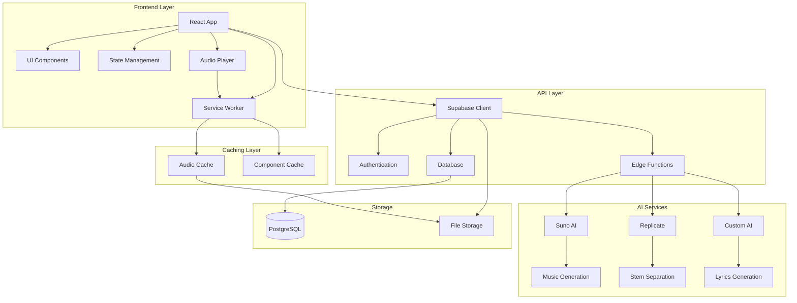
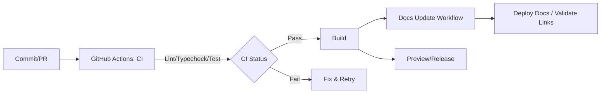
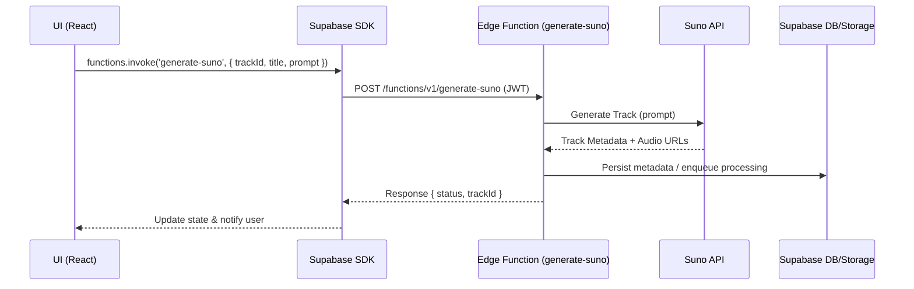

# 🎵 Albert3 Muse Synth Studio

<div align="center">


**Профессиональная студия для создания музыки с использованием ИИ**

[](https://www.typescriptlang.org/)
[](https://reactjs.org/)
[](https://vitejs.dev/)
[](https://supabase.com/)
[](https://tailwindcss.com/)
[](https://github.com/HOW2AI-AGENCY/albert3-muse-synth-studio/actions/workflows/ci.yml)
[](https://github.com/HOW2AI-AGENCY/albert3-muse-synth-studio/actions/workflows/docs-update.yml)
[](LICENSE)

[](https://github.com/HOW2AI-AGENCY/albert3-muse-synth-studio/stargazers)
[](https://github.com/HOW2AI-AGENCY/albert3-muse-synth-studio/issues)
[](https://github.com/HOW2AI-AGENCY/albert3-muse-synth-studio/pulls)
[](https://github.com/HOW2AI-AGENCY/albert3-muse-synth-studio/commits)
[](https://github.com/HOW2AI-AGENCY/albert3-muse-synth-studio/graphs/contributors)
[](https://github.com/HOW2AI-AGENCY/albert3-muse-synth-studio)
[](https://github.com/HOW2AI-AGENCY/albert3-muse-synth-studio)
[](https://github.com/HOW2AI-AGENCY/albert3-muse-synth-studio)

**Версия кодовой базы:** 2.6.3 | **Документация обновлена:** 11 октября 2025 | **Статус:** Стабильная поддержка (завершён Sprint 25)

[🚀 Демо](http://localhost:5173) • [📖 Документация](#-документация) • [🛠️ Установка](#️-установка) • [🎯 Функции](#-основные-функции) • [🔗 Репозиторий](https://github.com/HOW2AI-AGENCY/albert3-muse-synth-studio)

</div>

---

## 📑 Содержание

- [🧭 Навигация по репозиторию](#-навигация-по-репозиторию)
- [📋 Описание проекта](#-описание-проекта)
- [🎯 Основные функции](#-основные-функции)
- [📊 Состояние проекта](#-состояние-проекта-аудит-16-октября-2025)
- [🔎 Важные технические примечания](#-важные-технические-примечания-16-октября-2025)
- [🏗️ Архитектура](#️-архитектура)
- [🛠️ Технологический стек](#️-технологический-стек)
- [🚀 Быстрый старт](#-быстрый-старт)
  - [🛠️ Установка](#установка)
  - [📦 Дополнительные команды](#дополнительные-команды)
  - [⚙️ Использование](#️-использование)
  - [🧪 Примеры](#-примеры)
- [📁 Структура проекта](#-структура-проекта)
- [📊 Текущий статус проекта](#-текущий-статус-проекта)
- [🤝 Вклад в проект](#-вклад-в-проект)
- [📄 Лицензия](#-лицензия)
- [👥 Команда](#-команда)
- [📞 Поддержка](#-поддержка)
- [🔎 SEO](#-seo)

## 🧭 Навигация по репозиторию

<table>
<tr>
<td width="50%">

### 📚 **Документация**
- [📚 Индекс документации](docs/INDEX.md)
- [🧭 Developer Control Center](docs/DEVELOPER_DASHBOARD.md)
- [🏗️ Архитектурный обзор](docs/architecture-overview.md)
- [🔌 API и интеграции](docs/api/API.md)
- [🧩 Реестр UI компонентов](docs/interface/COMPONENT_SYSTEM.md)
- [🎧 Руководство пользователя](docs/USER_GUIDE.md)

</td>
<td width="50%">

### 📋 **Управление проектом**
- [📊 Доска статусов](project-management/tasks/STATUS_DASHBOARD.md)
- [✅ Итоги Sprint 24](project-management/tasks/current-sprint.md)
- [📋 Бэклог задач](project-management/tasks/backlog.md)
- [🔧 Реестр техдолга](project-management/TECHNICAL_DEBT_PLAN.md)
- [🧭 Навигация по проекту](project-management/NAVIGATION_INDEX.md)

</td>
</tr>
<tr>
<td width="50%">

### 🛠️ **Для разработчиков**
- [⚙️ Руководство по установке](SETUP-GUIDE.md)
- [🤝 Руководство по участию](project-management/CONTRIBUTING.md)
- [📋 Быстрый справочник](project-management/QUICK-REFERENCE.md)
- [🧪 План аудита и QA](project-management/tasks/audit-remediation-plan.md)
- [🔄 Рабочие процессы](project-management/workflows/development.md)

</td>
<td width="50%">

### 📊 **Отчеты**
- [🗂️ Индекс отчетов](project-management/reports/README.md)
- [🆕 Репо-аудит 16.10.2025](project-management/reports/2025-10-16-repo-audit.md)
- [📁 Репо-аудит 15.10.2025](project-management/reports/2025-10-15-repo-audit.md)
- [📊 Sprint 23 Report](project-management/reports/sprint-23-report.md)
- [🔒 Безопасность](reports/security/SECURITY.md)
- [⚡ Производительность](reports/performance/PERFORMANCE.md)
- [🗂️ Архив](archive/README.md)

</td>
</tr>
</table>

---

## 📋 Описание проекта

**Albert3 Muse Synth Studio** — это современное веб-приложение для создания музыки с использованием искусственного интеллекта. Платформа предоставляет пользователям мощные инструменты для генерации музыки, создания текстов песен, разделения аудио на стемы и управления музыкальными проектами.

### 🎯 Основные функции

Albert3 Muse Synth Studio предлагает следующие возможности:

- 🎼 **Генерация музыки с ИИ** — создание треков по текстовому описанию через Suno AI
- 📝 **Создание текстов песен** — автоматическая генерация лирики с помощью ИИ
- 🎚️ **Разделение на стемы** — извлечение отдельных инструментов из трека
- 🎵 **Управление треками** — организация, версионирование и каталогизация музыки
- 👥 **Система пользователей** — регистрация, аутентификация через Supabase Auth
- 📊 **Аналитика прослушиваний** — отслеживание взаимодействий и популярности
- 💾 **Облачное хранение** — безопасное сохранение в Supabase Storage
- 🎧 **Продвинутый аудиоплеер** — с поддержкой плейлистов и управления
- 🔄 **Автоматическое восстановление** — застрявшие треки автоматически переотправляются
- 🎨 **Современный UI/UX** — адаптивный дизайн с темной/светлой темой
- 📱 **Полностью адаптивный дизайн** — оптимизированный интерфейс для мобильных, планшетов и десктопов

### 📊 Состояние проекта (аудит 16 октября 2025)

- 🛠️ **Кодовая база**: централизованный сервис `src/services/api.service.ts` и Supabase Edge Functions задокументированы в [Developer Control Center](docs/DEVELOPER_DASHBOARD.md); команды `npm run lint`, `npm run typecheck` и `npm run docs:validate` зафиксированы как обязательные перед коммитом.
- 🧪 **Тестирование**: Vitest и Playwright входят в стандартный пайплайн, smoke-наборы плеера и библиотеки отмечены как критические в статус-борде тестов (`docs/DEVELOPER_DASHBOARD.md#%F0%9F%94%A5-ci--qa`).
- 👁️ **Наблюдаемость**: `src/utils/logger.ts` агрегирует структурированные логи, Sentry подключён через `@sentry/react`/`@sentry/tracing`, ключевые метрики Suno сведены в [отчёт 16.10.2025](project-management/reports/2025-10-16-repo-audit.md#observability).
- 🗃️ **Данные**: миграции Supabase разделены на автоматические и ручные (`supabase/migrations/manual`), регламенты описаны в `docs/DEVELOPER_DASHBOARD.md#%F0%9F%93%84-data-ops`.
- 📚 **Документация**: навигация обновлена, добавлены контрольный центр разработчика и доска статусов задач, интеграционные материалы агрегированы в [Third-Party Integrations](docs/integrations/THIRD_PARTY_OVERVIEW.md).

### ✨ Последние обновления (11 октября 2025)

- 🐛 **Критические исправления** — устранен infinite loop в `useTrackSync`, исправлен `get-balance` Edge Function fallback
- 🔒 **Безопасность БД** — добавлен `SET search_path = 'public'` для всех SECURITY DEFINER functions
- 🗂️ **Реорганизация репозитория** — архивированы октябрьские отчеты, удален устаревший код
- ✅ **Улучшения UI** — реализован `onOpenPlayer` в DetailPanel, удален TODO
- 📋 **Обновленная документация** — актуализированы README, TROUBLESHOOTING, добавлен архивный манифест

### 🔍 Итоги анализа репозитория (16 октября 2025)

- **UI-платформа** продолжает использовать более 45 компонентов shadcn + кастомные обёртки (`ResponsiveLayout`, `BottomTabBar`, `WorkspaceHeader`); актуальный каталог доступен в `docs/interface/COMPONENT_SYSTEM.md`.
- **Сервисный слой** консолидирован вокруг `src/services/api.service.ts` и Supabase Edge Functions; диаграммы потоков данных приведены в `project-management/reports/2025-10-16-repo-audit.md#architecture-overview`.
- **Observability** описана как многоуровневая: структурированные логи (`src/utils/logger.ts`), Sentry и расширенные метаданные Suno в БД; проверки и алерты сведены в разделе Observability нового аудита.
- **Навигация** покрывает Developer Control Center, обновлённые индексы и тематические отчёты; валидация документации (`npm run docs:validate`) включена в чек-лист перед PR.
- **Процессы** и контрольные списки вынесены в `project-management/tasks/STATUS_DASHBOARD.md` и `docs/DEVELOPER_DASHBOARD.md`, закрывая требования по мониторингу и онбордингу.

### 🔎 Важные технические примечания (16 октября 2025)

- 🛡️ **Service Worker (public/sw.js)** — обновлён обработчик `fetch`, чтобы исключить сетевые ошибки и конфликт кэширования:
  - запросы к Supabase (API/DB/Edge Functions) больше не перехватываются и не кэшируются;
  - кэшируются только реальные аудиофайлы по расширениям (например, `.mp3`, `.wav`), JSON/HTML не попадают в аудио-кэш;
  - подробности и патч: см. `public/sw.js`.
- 🗄️ **Supabase интеграция** — сервис-воркер не вмешивается в сетевые запросы Supabase. Используйте клиентские SDK как обычно. Конфигурация в `.env` (подробнее — `docs/integrations/THIRD_PARTY_OVERVIEW.md`):
  - `VITE_SUPABASE_URL`, `VITE_SUPABASE_PUBLISHABLE_KEY`, `VITE_SUPABASE_PROJECT_ID` — обязательны для запуска.
- 🎛️ **Audio Caching Policy** — политика кэширования аудио стала строже: кэшируются только файлы с аудио-расширениями; любые запросы к `*.supabase.co` не классифицируются как аудио и обходятся стороной.
- 📜 **Logger (src/utils/logger.ts)** — централизованный логгер с уровнями `debug`, `info`, `warn`, `error`. Для диагностики проблем:
  - включите детальные логи на этапе разработки;
  - проверяйте Console в DevTools и сетевые события;
  - при необходимости приложите выдержки логов к Issue/PR.
- 🧑‍💻 **Dev Server** — запуск: `npm run dev` (по умолчанию `http://localhost:5173`). При обновлении Service Worker выполните «Hard Reload» или перезапустите dev-сервер, чтобы очистить устаревший кэш.

## 🏗️ Архитектура



## 📈 Диаграммы

### CI/CD Pipeline



### Edge Functions Flow (Suno)



## 🛠️ Технологический стек

### Frontend
- **React 18** — современная библиотека для UI с Concurrent Features
- **TypeScript 5.x** — типизированный JavaScript для надежности кода
- **Vite 6.x** — молниеносный сборщик проектов нового поколения
- **Tailwind CSS 3.x** — utility-first CSS фреймворк
- **Radix UI** — доступные и настраиваемые UI компоненты
- **TanStack Query** — мощное управление серверным состоянием

### Backend & Infrastructure
- **Supabase** — полнофункциональная Backend-as-a-Service платформа
- **PostgreSQL** — надежная реляционная база данных
- **Supabase Edge Functions** — серверные функции на Deno Runtime
- **Supabase Storage** — масштабируемое файловое хранилище
- **Row Level Security (RLS)** — безопасность на уровне строк БД

### AI & External Services
- **Suno AI API** — профессиональная генерация музыки
- **Replicate API** — разделение аудио на стемы через ML модели
- **Custom AI Models** — создание текстов песен и улучшение промптов

## 🚀 Быстрый старт

### Предварительные требования

- **Node.js** 18+ ([установить с nvm](https://github.com/nvm-sh/nvm#installing-and-updating))
- **npm** 9+ или **yarn** 1.22+
- **Git** для клонирования репозитория
- **Аккаунт Supabase** для backend сервисов

### Установка

1. **Клонирование репозитория**
```bash
git clone https://github.com/your-username/albert3-muse-synth-studio.git
cd albert3-muse-synth-studio
```

2. **Установка зависимостей**
```bash
npm install
```

3. **Настройка переменных окружения**
```bash
cp .env.example .env
```

Заполните `.env` файл своими данными:
```env
# Supabase Configuration
VITE_SUPABASE_URL=your_supabase_project_url
VITE_SUPABASE_PUBLISHABLE_KEY=your_supabase_anon_key
VITE_SUPABASE_PROJECT_ID=your_project_id
```

4. **Запуск в режиме разработки**
```bash
npm run dev
```

Приложение будет доступно по адресу `http://localhost:5173`

Если вы только что обновили Service Worker, выполните «Hard Reload» в браузере (или перезапустите dev-сервер), чтобы избежать использования устаревшего кэша аудио.

### Дополнительные команды

```bash
# Сборка для продакшена
npm run build

# Предварительный просмотр сборки
npm run preview

# Проверка кода с ESLint
npm run lint

# Тесты
npm run test

# Наблюдение за тестами
npm run test:watch

# Отчёт о покрытии
npm run coverage

# Проверка типов TypeScript
npm run typecheck
```

## ⚙️ Использование

- Запуск dev-сервера: `npm run dev` и переход на `http://localhost:5173`.
- Проверка баланса провайдера (Suno/Replicate) через Edge Function `get-balance`.
- Генерация музыки через Edge Function `generate-suno`.

См. подробности: `docs/api/API.md` и `docs/integrations/SUNO_API_AUDIT.md`.

## 🧪 Примеры

### Проверка баланса Suno (client-side, TypeScript)

```ts
import { createClient } from '@supabase/supabase-js';

const supabase = createClient(
  import.meta.env.VITE_SUPABASE_URL!,
  import.meta.env.VITE_SUPABASE_PUBLISHABLE_KEY!
);

export async function getSunoBalance() {
  const { data, error } = await supabase.functions.invoke('get-balance', {
    body: { provider: 'suno' },
  });
  if (error) throw error;
  return data;
}
```

### Генерация музыки через Suno (client-side, TypeScript)

```ts
import { createClient } from '@supabase/supabase-js';

const supabase = createClient(
  import.meta.env.VITE_SUPABASE_URL!,
  import.meta.env.VITE_SUPABASE_PUBLISHABLE_KEY!
);

export async function generateSunoTrack({ trackId, title, prompt }: { trackId: string; title: string; prompt: string; }) {
  const { data, error } = await supabase.functions.invoke('generate-suno', {
    body: { trackId, title, prompt },
  });
  if (error) throw error;
  return data;
}
```

### cURL: проверить баланс

```bash
curl -X POST "https://your-project.supabase.co/functions/v1/get-balance" \
  -H "Authorization: Bearer YOUR_SUPABASE_JWT" \
  -H "Content-Type: application/json" \
  -d '{"provider":"suno"}'
```

Больше примеров: см. `docs/api/API.md`.

## 📁 Структура проекта

```
albert3-muse-synth-studio/
├── 📁 src/                      # Исходный код
│   ├── components/              # React компоненты
│   │   ├── ui/                  # UI компоненты (shadcn)
│   │   ├── player/              # Аудиоплеер
│   │   ├── tracks/              # Управление треками
│   │   └── workspace/           # Workspace компоненты
│   ├── hooks/                   # Кастомные хуки
│   │   ├── useTrackRecovery.ts  # Автовосстановление треков
│   │   ├── useTracks.ts         # Управление треками
│   │   └── useMusicGeneration.ts # Генерация музыки
│   ├── contexts/                # React Context
│   │   └── AudioPlayerContext.tsx # Контекст плеера
│   ├── services/                # API сервисы
│   │   ├── api.service.ts       # Основной API
│   │   ├── analytics.service.ts # Аналитика
│   │   └── likes.service.ts     # Лайки
│   ├── pages/                   # Страницы приложения
│   │   └── workspace/           # Workspace страницы
│   └── utils/                   # Утилиты
│
├── 📁 docs/                     # Документация
│   ├── TROUBLESHOOTING_TRACKS.md # Диагностика треков
│   ├── architecture/            # Архитектурные документы
│   └── api/                     # API документация
│
├── 📁 project-management/       # Управление проектом
│   ├── tasks/                   # Задачи и спринты
│   │   ├── current-sprint.md    # Текущий спринт
│   │   └── backlog.md           # Бэклог
│   ├── TECHNICAL_DEBT_PLAN.md   # План по техдолгу
│   └── reports/                 # Отчеты
│
├── 📁 supabase/                 # Supabase конфигурация
│   ├── functions/               # Edge Functions
│   ├── migrations/              # Миграции БД
│   └── config.toml             # Конфигурация
│
└── 📁 archive/                  # Архивные файлы
    ├── 2024/                    # Архив 2024
    └── 2025/                    # Архив 2025
```

## 📊 Текущий статус проекта

### Завершенные спринты

**Sprint 22 (ЗАВЕРШЁН)**: Generation Reliability & Desktop UX
- ✅ GEN-001: Generation Stability (4h)
- ✅ UI-001: Desktop Generator Refactoring (4h)
- ✅ TRACK-001: Track Versions Fallback (3h)
- ✅ INTEG-001: Edge Functions Unification (3h)
- ✅ BALANCE-001: Provider Balance Fix (2h)
- **Completion**: 100% (5/5 задач)
- **Total hours**: 16 hours
- **Version**: 2.6.0

**Sprint 21 (ЗАВЕРШЁН)**: Performance Optimization & Credit System
- ✅ PERF-001: Route-based Code Splitting (8h)
- ✅ PERF-002: Component Lazy Loading (6h)
- ✅ PERF-003: React Query Optimization (4h)
- ✅ DEBT-001: Code Deduplication (4h)
- ✅ DEBT-002: Type Safety Enhancement (4h)
- ✅ DEBT-003: Legacy Code Removal (2h)
- ✅ DOC-001: Knowledge Base Creation (6h)
- ✅ UI/UX-001: Desktop Player Improvements (4h)
- **Completion**: 100% (8/8 задач)
- **Total hours**: 46 hours
- **Version**: 2.5.0

**Sprint 20 (ЗАВЕРШЁН)**: System Reliability & Advanced Features
- ✅ GEN-001: Production-Ready Generation (8h)
- ✅ GEN-002: Track Versions System (10h)
- ✅ STOR-001: Storage System (8h)
- ✅ BUGFIX-001, BUGFIX-002, BUGFIX-003 (10h total)
- **Completion**: 100% (6/6 задач)
- **Total hours**: 38.5 hours
- **Version**: 2.3.3

**Метрики производительности**:
- Bundle size: 380KB → 120KB ✅ (-68%)
- FCP: 1.5s → 0.9s ✅ (-40%)
- LCP: 2.8s → 1.8s ✅ (-36%)
- TTI: 2.2s → 1.4s ✅ (-36%)
- Lighthouse: 75 → 82 ✅ (+9%)

## 🤝 Вклад в проект

Мы приветствуем вклад сообщества! См. [руководство по участию](project-management/CONTRIBUTING.md) для деталей.

### Как внести вклад

1. Fork репозитория
2. Создайте feature branch (`git checkout -b feature/amazing-feature`)
3. Commit изменения (`git commit -m 'Add amazing feature'`)
4. Push в branch (`git push origin feature/amazing-feature`)
5. Откройте Pull Request

## 📄 Лицензия

Этот проект лицензирован под MIT License - см. файл LICENSE для деталей.

## 👥 Команда

- **Product Owner**: AI Assistant
- **Lead Developer**: AI Assistant
- **Architecture**: AI Assistant

## 📞 Поддержка

- **Issues**: [GitHub Issues](https://github.com/your-username/albert3-muse-synth-studio/issues)
- **Documentation**: [docs/](docs/)
- **Troubleshooting**: [TROUBLESHOOTING_TRACKS.md](docs/TROUBLESHOOTING_TRACKS.md)

---

<div align="center">

**Создано с ❤️ используя React, TypeScript, Supabase и ИИ**

[⬆ Вернуться к началу](#-albert3-muse-synth-studio)

</div>

## 🔎 SEO

- Ключевые слова: `Suno AI`, `Генерация музыки`, `Supabase Edge Functions`, `React`, `TypeScript`, `Audio Player`, `AI Music`, `Music Generator`, `Stem Separation`, `Lyrics Generation`.
- Быстрые ссылки: `docs/INDEX.md`, `docs/api/API.md`, `docs/integrations/SUNO_API_AUDIT.md`, `project-management/NAVIGATION_INDEX.md`, `project-management/tasks/STATUS_DASHBOARD.md`.
- Навигация: используйте оглавление в начале и блок «Навигация по репозиторию».
