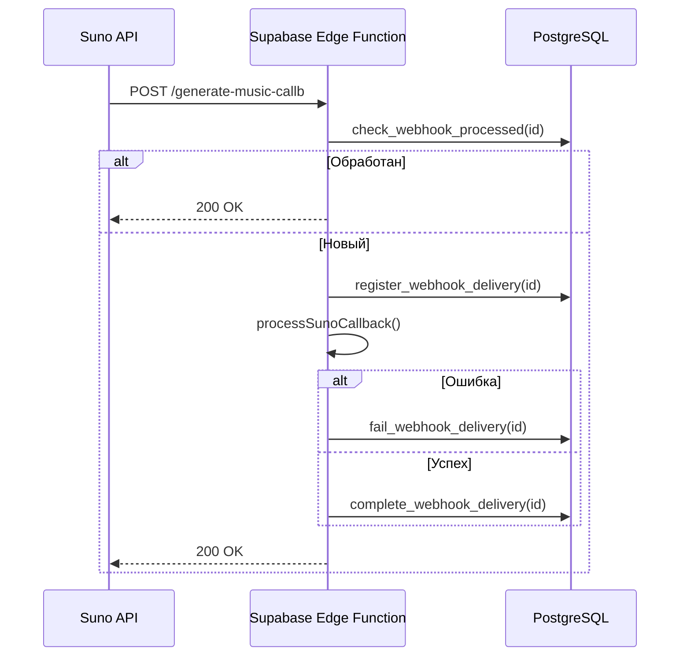
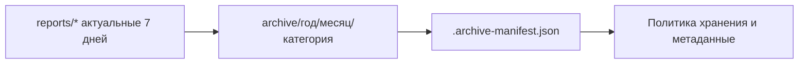
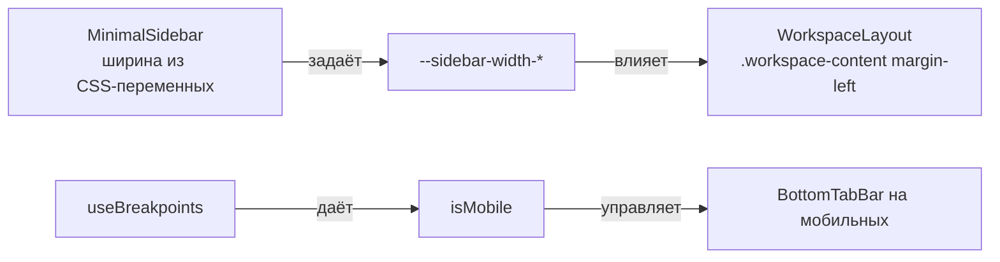

<div align="center">
  
  <h1>Albert3 Muse Synth Studio</h1>
  <p><strong>Профессиональная платформа для AI-генерации музыки</strong></p>
  <p>Интеграция с Suno & Replicate • Версионирование треков • Аналитика в реальном времени</p>

  <div>
    
    
    
    
  </div>
  <div>
    <a href="https://github.com/HOW2AI-AGENCY/albert3-muse-synth-studio/actions/workflows/ci.yml"></a>
    
    
    
    
    
  </div>

</div>

---

## 📑 Содержание

- [О проекте](#-о-проекте)
- [Навигация по репозиторию](#-навигация-по-репозиторию)
- [Ключевые особенности](#-ключевые-особенности)
- [Архитектура системы](#-архитектура-системы)
- [Установка](#-установка)
- [Примеры использования](#-примеры-использования)
- [Тестирование](#-тестирование)
- [Вебхуки Suno](#-вебхуки-suno-идемпотентность-и-обработка)
- [Визуальные элементы](#-визуальные-элементы)
- [Вклад в проект](#-вклад-в-проект)
- [Лицензия](#-лицензия)
- [Архив отчётов](#-архив-отчётов-и-политика-хранения)

Быстрые ссылки: [Документация](./docs/README.md) • [Индекс документов](./docs/INDEX.md) • [Контрибьютинг](./CONTRIBUTING.md) • [Changelog](./CHANGELOG.md)

## 🚨 Последние обновления

**12 ноября 2025** - Закрытие технического долга по результатам аудита:

- ✅ **Исправлена критическая ошибка (P0):** Восстановлено отображение синхронизированных текстов песен на всех устройствах.
- ✅ **Устранены проблемы производительности (P1):** Ускорено обновление статусов генерации треков и исправлена логика присвоения названий.
- ✅ **Оптимизирована работа с версиями (P2):** Убрана избыточная загрузка данных о версиях треков, что значительно ускорило отклик интерфейса.
- ✅ **Восстановлена интеграция с Replicate (P2):** Реанимирована функция анализа музыки через Replicate API с использованием актуальной модели.

**07 ноября 2025** - Завершен комплексный технический аудит проекта:

### Общая Оценка: **8.3/10** ⭐⭐⭐⭐

| Компонент | Оценка | Статус |
|-----------|--------|--------|
| Аудио Плеер | 8.5/10 | ✅ Отлично |
| Система Генерации | 8.0/10 | ✅ Хорошо |
| Кросс-Платформенность | 8.3/10 | ✅ Хорошо |
| Архитектура | 7.5/10 | ⚠️ Требует улучшений |
| Интеграции | 8.5/10 | ✅ Отлично |
| Бизнес-Логика | 7.5/10 | ⚠️ Требует улучшений |

### Критические Проблемы (P0):
- 🔴 Кнопка генерации скрыта на мобильных (z-index конфликт)
- 🔴 Rate limiting только на клиенте (уязвимость безопасности)
- 🔴 Webhook Mureka без аутентификации (уязвимость безопасности)
- 🔴 Circuit breaker не интегрирован в API вызовы
- 🔴 Отсутствует retry logic для временных сбоев API

### План Действий:
- **Неделя 1-2:** Исправление критических проблем (5 задач P0)
- **Неделя 3-4:** Архитектура и производительность (5 задач P1)
- **Неделя 5-6:** Организация кода и тестирование (4 задачи P2)
- **Неделя 7-8+:** Улучшения и новые функции (5 задач P2-P3)

📊 **Отчеты:**
- [Комплексный Аудит](./docs/audit/2025-11-07_COMPREHENSIVE_PROJECT_AUDIT.md)
- [Статус Спринтов](./project-management/SPRINT_STATUS.md)
- [Архив Аудитов](./docs/audit/)

**04 ноября 2025** - Выполнены критичные улучшения безопасности (P1):
- ✅ Логирование в Sentry: заменено 25 `console.*` на `logger`
- ✅ Обновлены зависимости: vite 7.1.12, supabase 2.54.11, typescript 5.8.3
- ✅ CORS ограничен: изменен с `*` на localhost whitelist
- ✅ CSP headers: добавлена Content Security Policy
- ✅ Оценка безопасности: 8.0/10 → 9.0/10

---

## 🎯 О проекте

**Albert3 Muse Synth Studio** — это передовая SPA-платформа для профессиональной работы с AI-генерацией музыки. Приложение объединяет возможности **Suno AI** (генерация) и **Replicate.com** (анализ), предоставляя музыкантам, продюсерам и контент-криейторам мощный инструментарий для создания, редактирования и управления музыкальными композициями.

## 📚 Навигация по репозиторию

| Раздел | Описание | Быстрые ссылки |
| :--- | :--- | :--- |
| 🚀 **Быстрый старт** | Все, что нужно для запуска проекта за 5 минут. | [Установка](#-установка) • [Запуск](#-быстрый-старт) |
| 🏗️ **Архитектура** | Глубокое погружение в архитектуру системы. | [Описание](./docs/ARCHITECTURE.md) • [Схема](#-архитектура-системы) |
| 🔬 **Аудит** | Результаты последнего технического аудита. | [Отчёты](./docs/audit/) • [План работ](./docs/audit/05_Refactor_Plan.md) |
| 🎛️ **Компоненты** | Обзор UI-кита и ключевых компонентов. | `src/components/ui` |
| ☁️ **Backend** | Обзор Edge-функций Supabase. | `supabase/functions` |
| 🤝 **Контрибьютинг**| Как помочь проекту. | [Гайд](./CONTRIBUTING.md) • [Задачи](./project-management) |
| 🗄️ **Архив отчётов** | Политика хранения и структура архива. | [Политика](./docs/ARCHIVE_POLICY.md) • [Манифест](./archive/.archive-manifest.json) |

---

## ✨ Ключевые особенности

-   ✅ **Dual-Provider**: Интеграция с Suno AI (генерация) и Replicate.com (анализ).
-   ✅ **Система версий**: Создание и управление несколькими версиями одного трека.
-   ✅ **Обработка аудио**: Разделение на стемы, анализ BPM, тональности и жанра.
-   ✅ **AI-генерация текстов**: Автоматическое создание текстов песен с помощью AI.
-   ✅ **Проектная организация**: Группировка треков в альбомы и проекты для удобного управления.
-   ✅ **Аналитика в реальном времени**: Отслеживание статистики прослушиваний.

---

## 🏗️ Архитектура системы

Платформа использует архитектуру **Frontend -> Backend-as-a-Service (BaaS)**, где фронтенд-приложение на React взаимодействует с Supabase, который предоставляет базу данных, аутентификацию, хранилище и бессерверные Edge-функции.

<details>
<summary>Диаграмма архитектуры (нажмите для просмотра)</summary>

```mermaid
graph TB
    subgraph "Frontend Layer (React + Vite)"
        A[UI Components (shadcn/ui)]
        B[State Management (React Query + Zustand)]
        C[Routing (React Router)]
    end

    subgraph "Backend Layer (Supabase)"
        F[Edge Functions (Deno)]
        G[Database (PostgreSQL + RLS)]
        H[Authentication (JWT)]
        I[Storage]
    end

    subgraph "External AI Providers"
        K[Suno AI API]
        L[Replicate.com API]
    end

    A & C --> B; B --> F;
    F --> K; F --> L; F --> G; F --> I;
    G --> H;

    style A fill:#61DAFB,stroke:#333,stroke-width:2px
    style F fill:#3ECF8E,stroke:#333,stroke-width:2px
    style K fill:#FF6F61,stroke:#333,stroke-width:2px
    style L fill:#9B59B6,stroke:#333,stroke-width:2px
```

</details>

---

## 🚀 Установка

### Предварительные требования

-   **Node.js**: `v18.0.0` или выше
-   **npm**: `v9.0.0` или выше
-   **Git**

### Быстрый старт

```bash
# 1. Клонировать репозиторий
git clone https://github.com/albert-app/albert3-muse-synth-studio.git
cd albert3-muse-synth-studio

# 2. Установить зависимости
npm install

# 3. Настроить переменные окружения
# Для работы с Supabase создайте файл .env и добавьте ключи проекта
# VITE_SUPABASE_URL=...
# VITE_SUPABASE_ANON_KEY=...
# REPLICATE_API_KEY=... (для бэкенда)

# 4. Запустить dev-сервер
npm run dev

# 5. Открыть в браузере: http://localhost:5173
```

---

## 🎮 Примеры использования

<details>
<summary>Пример: Генерация трека (нажмите для просмотра)</summary>

```typescript
import { supabase } from '@/integrations/supabase/client';

const generateTrack = async () => {
  const { data, error } = await supabase.functions.invoke('generate-suno', {
    body: {
      prompt: "Upbeat electronic dance music with energetic vibes",
      tags: "edm, energetic, dance",
    }
  });

  if (error) console.error('Ошибка генерации:', error);
  else console.log('Генерация запущена, ID задачи:', data.taskId);
};
```

</details>

<details>
<summary>Пример: Получение версий трека (нажмите для просмотра)</summary>

```typescript
import { useTrackVersions } from '@/hooks';

const TrackVersionsComponent = ({ trackId }: { trackId: string }) => {
  const { allVersions: versions, isLoading } = useTrackVersions(trackId);

  if (isLoading) return <p>Загрузка версий...</p>;

  return (
    <ul>
      {versions?.map((version) => (
        <li key={version.id}>
          Версия {version.variant_index ?? version.version_number}
          <audio controls src={version.audio_url} />
        </li>
      ))}
    </ul>
  );
};
```
</details>

<details>
<summary>Пример: Вызов Edge-функции из Node.js-скрипта (нажмите для просмотра)</summary>

```ts
// scripts/examples/call-edge.ts
import 'cross-fetch/polyfill';

const SUPABASE_FUNCTIONS_URL = process.env.SUPABASE_FUNCTIONS_URL!; // например: https://<project-id>.functions.supabase.co
const SUNO_PROMPT = 'Ambient chillout with soft pads and slow beat';

async function main() {
  const resp = await fetch(`${SUPABASE_FUNCTIONS_URL}/generate-suno`, {
    method: 'POST',
    headers: { 'Content-Type': 'application/json' },
    body: JSON.stringify({ prompt: SUNO_PROMPT, tags: 'ambient,chill' })
  });
  if (!resp.ok) throw new Error(`HTTP ${resp.status}`);
  const data = await resp.json();
  console.log('Задача поставлена:', data);
}

main().catch((e) => {
  console.error('Ошибка:', e);
  process.exit(1);
});
```

Запуск (Windows PowerShell):

```powershell
$env:SUPABASE_FUNCTIONS_URL="https://<project-id>.functions.supabase.co"
node .\scripts\examples\call-edge.ts
```

</details>

---

## 🎛 Управление версиями треков

Система версионирования позволяет создавать, просматривать и назначать «мастер‑версию» трека. UI и логику синхронизации реализуют компоненты и хуки из `src/features/tracks`.

- Компоненты: `TrackVariantSelector`, `TrackCardCover`, `TrackCardInfo`, `TrackCardActions`.
- Хуки: `useTrackVersions` (загрузка, кеш, `setMasterVersion`), `useTrackRollback` (откат/назначение мастер‑версии через единый поток инвалидации).
- API: `setMasterVersionApi` вызывает назначение мастер‑версии на сервере.
- Кеш: `invalidateTrackVersionsCache` и последующий `fetchTrackVersions`/`loadVersions({ force: true })` гарантируют обновление UI.

```mermaid
graph TD
  UI[TrackVariantSelector] --> HV[useTrackVersions.setMasterVersion]
  UI --> HR[useTrackRollback.rollbackToVersion]
  HV --> API[setMasterVersionApi]
  HR --> API
  API --> Cache[invalidateTrackVersionsCache]
  Cache --> Fetch[fetchTrackVersions / loadVersions(force)]
  Fetch --> C[TrackCardCover & TrackCardInfo]
  C --> User[Пользователь видит обновлённую обложку и метаданные]
```

Мини‑чек‑лист для проверки:

- [x] Клик по «Сделать мастер» в `TrackVariantSelector` обновляет карточку трека.
- [x] Обложка (`TrackCardCover`) и метаданные (`TrackCardInfo`) переключаются на выбранную версию.
- [x] Меню действий (`TrackCardActions`) отражает текущую мастер‑версию.

Подсказки по отладке:

- Если видите ошибку `Maximum update depth exceeded`, проверьте циклические обновления состояния: обработчики `onVersionChange`, эффекты и `useTrackCardState` не должны вызывать друг друга рекурсивно.
- Убедитесь, что `useEffect`‑анимации (например, добавление класса `animate-fade-in`) не триггерят повторные перевычисления без нужды.

## 🧪 Тестирование

```bash
# Запустить все unit-тесты
npm test

# Запустить E2E-тесты
npm run test:e2e

# Проверить покрытие тестами (в Vitest покрытие включено в npm test)
# Альтернативно: можно запустить с ключом --coverage
npm test
# или
npm run test -- --coverage
```

---

## 🔔 Вебхуки Suno: идемпотентность и обработка

В проекте реализована надёжная идемпотентная обработка вебхуков Suno:

- Проверка повторной доставки через таблицу `webhook_delivery_log` и RPC `check_webhook_processed`.
- Регистрация начала обработки `register_webhook_delivery`, фиксация результата `complete_webhook_delivery` или ошибки `fail_webhook_delivery`.
- Генерация `webhookId` из заголовков (`x-delivery-id`, `x-webhook-id`) либо детерминированно из `taskId`/`stage`.
- Ошибочные колбэки (`code >= 400`, `callbackType === 'error'`) помечают трек как `failed`.

Подробнее: `docs/architecture/webhooks.md`.



---

## 🖼️ Визуальные элементы

Для быстрого представления интерфейса используйте скриншоты и gif-анимации. Ниже — пример-placeholder (обновите при необходимости реальными скриншотами):

<div align="center">
  
</div>

Рекомендации:
- Храните изображения в `public/images`.
- Используйте форматы PNG/SVG/WebP; для gif-анимаций — оптимизированные WebP.
- Добавляйте подписи и ссылки на соответствующие разделы документации (например, [Компоненты UI](./src/components/ui)).

---

## 🧹 Очистка Supabase Storage

Для предотвращения переполнения хранилища и снижения затрат:

- В `supabase/functions/cleanup-storage-objects/index.ts` добавлена пагинация `list()` для больших бакетов.
- Убрано обращение к несуществующему полю `deleted_at` в таблице `tracks`.
- Очистка учитывает статус трека (`failed`), возраст файла и наличие трека в БД.

Запуск локально:

```bash
deno task test   # включает тесты Edge-функций
```

---

## 🤝 Вклад в проект

Мы приветствуем ваш вклад! Пожалуйста, ознакомьтесь с нашим [**Руководством для контрибьюторов (CONTRIBUTING.md)**](./CONTRIBUTING.md) перед началом работы.

Кратко о процессе ревью:
- Коммиты — по Conventional Commits (feat/fix/docs/chore и т.д.).
- Перед PR: `npm run verify:workspace` (линт, типы, тесты, сборка).
- PR должен проходить обязательные проверки в CI: TypeScript, ESLint, Unit/E2E, Edge Functions.
- Обновляйте документацию и Changelog при изменениях логики или API.

---

## 📄 Лицензия

Этот проект лицензирован под [MIT License](./LICENSE).

Условия использования:
- Свободно используйте и модифицируйте код при сохранении уведомления об авторских правах и лицензии.
- ПО предоставляется «как есть», без гарантий. См. текст лицензии для подробностей.

---

## 🗄️ Архив отчётов и политика хранения

Для поддержания порядка и производительности действует политика хранения отчётов:

- Срок актуальности оперативных отчётов — `7 дней`. По истечении срока они переносятся в архив.
- Полные, но неактуальные отчёты — архивируются с категоризацией по годам/месяцам/типам.
- Нерелевантные черновики и дублеты — удаляются.

Структура архива и критерии описаны в `docs/ARCHIVE_POLICY.md`. Текущее состояние архива отражено в `archive/.archive-manifest.json`.


## Обновления фронтенда Workspace (2025-11-04)

- Привязан отступ основного контента к реальной ширине сайдбара через CSS‑переменные (`--sidebar-width-collapsed`/`--sidebar-width-expanded`). Это устраняет рассинхрон на десктопе при сворачивании/разворачивании.
- Унифицирован детект мобильного устройства: теперь используется `useBreakpoints().isMobile` как единый источник правды. Устаревший `hooks/use-mobile.tsx` реэкспортирует новое значение для совместимости.
- Улучшена нижняя мобильная панель навигации (`BottomTabBar`): равномерное распределение элементов (`justify-between`) и ограничение ширины меток (`max-w-[80px]`) для предотвращения переполнения.



### Тестирование

- Проверьте на брейкпоинтах `lg`/`xl`: сворачивание сайдбара должно плавно менять отступ контента.
- На мобильных метки во вкладках не должны обрезаться за пределы контейнера.
- Быстрые проверки доступности: клавиатурная навигация по нижней панели сохраняется, `aria-current` корректно отражает активную страницу.

> Примечание: локальный предпросмотр может требовать корректной установки бинарных модулей Rollup под Windows. Если dev‑сервер не стартует из‑за `@rollup/rollup-win32-x64-msvc`, используйте переменную окружения `ROLLUP_SKIP_NATIVE=true` или обновите окружение (`npm ci`, Node ≥ 20).
