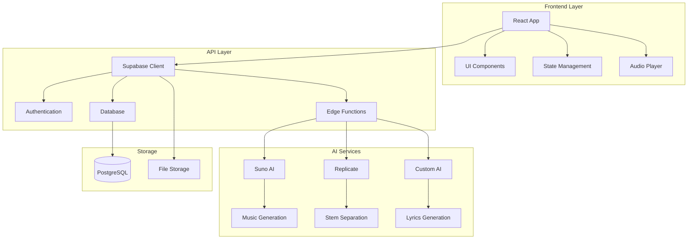

# 🎵 Albert3 Muse Synth Studio

<div align="center">


**Профессиональная студия для создания музыки с использованием ИИ**

[](https://www.typescriptlang.org/)
[](https://reactjs.org/)
[](https://supabase.com/)
[](https://tailwindcss.com/)

[🚀 Демо](https://lovable.dev/projects/02875d5f-a8ca-4fc2-97f1-474a7f7a6d00) • [📖 Документация](#-документация) • [🛠️ Установка](#️-установка) • [🎯 Функции](#-основные-функции)

</div>

---

## 📋 Описание проекта

**Albert3 Muse Synth Studio** — это современное веб-приложение для создания музыки с использованием искусственного интеллекта. Платформа предоставляет пользователям мощные инструменты для генерации музыки, создания текстов песен, разделения аудио на стемы и управления музыкальными проектами.

### 🎯 Основные функции

- 🎼 **Генерация музыки с ИИ** — создание треков по текстовому описанию
- 📝 **Создание текстов песен** — автоматическая генерация лирики
- 🎚️ **Разделение на стемы** — извлечение отдельных инструментов из трека
- 🎵 **Управление треками** — организация и версионирование музыки
- 👥 **Система пользователей** — регистрация, аутентификация, профили
- 📊 **Аналитика** — отслеживание прослушиваний и взаимодействий
- 💾 **Облачное хранение** — безопасное сохранение всех данных

## 🏗️ Архитектура



## 🛠️ Технологический стек

### Frontend
- **React 18** — современная библиотека для UI
- **TypeScript** — типизированный JavaScript
- **Vite** — быстрый сборщик проектов
- **Tailwind CSS** — utility-first CSS фреймворк
- **Radix UI** — доступные UI компоненты
- **React Query** — управление серверным состоянием
- **React Hook Form** — управление формами

### Backend
- **Supabase** — Backend-as-a-Service платформа
- **PostgreSQL** — реляционная база данных
- **Edge Functions** — серверные функции на Deno
- **Row Level Security** — безопасность на уровне строк

### AI & External Services
- **Suno AI** — генерация музыки
- **Replicate** — разделение аудио на стемы
- **Custom AI Models** — создание текстов песен

## 🚀 Быстрый старт

### Предварительные требования

- **Node.js** 18+ ([установить с nvm](https://github.com/nvm-sh/nvm#installing-and-updating))
- **npm** или **yarn**
- **Git**

### Установка

1. **Клонирование репозитория**
```bash
git clone https://github.com/your-username/albert3-muse-synth-studio.git
cd albert3-muse-synth-studio
```

2. **Установка зависимостей**
```bash
npm install
```

3. **Настройка переменных окружения**
```bash
cp .env.example .env
```

Заполните `.env` файл:
```env
VITE_SUPABASE_URL=your_supabase_url
VITE_SUPABASE_PUBLISHABLE_KEY=your_supabase_anon_key
VITE_SUPABASE_PROJECT_ID=your_project_id
```

4. **Запуск в режиме разработки**
```bash
npm run dev
```

Приложение будет доступно по адресу `http://localhost:5173`

## 📁 Структура проекта

```
src/
├── components/          # React компоненты
│   ├── ui/             # Базовые UI компоненты
│   ├── player/         # Аудио плеер
│   ├── tracks/         # Компоненты треков
│   └── workspace/      # Рабочее пространство
├── hooks/              # Пользовательские хуки
├── pages/              # Страницы приложения
├── services/           # API сервисы
├── contexts/           # React контексты
├── utils/              # Утилиты
└── integrations/       # Интеграции (Supabase)

supabase/
├── functions/          # Edge Functions
├── migrations/         # Миграции БД
└── config.toml        # Конфигурация
```

## 🎮 Использование

### 1. Регистрация и вход
- Создайте аккаунт или войдите в существующий
- Подтвердите email адрес

### 2. Создание музыки
```typescript
// Пример использования генератора музыки
const { generateMusic, isLoading } = useMusicGeneration();

const handleGenerate = async () => {
  const result = await generateMusic({
    prompt: "Спокойная джазовая мелодия",
    duration: 30,
    includeVocals: false
  });
};
```

### 3. Управление треками
- Просматривайте созданные треки
- Создавайте версии треков
- Разделяйте аудио на стемы
- Делитесь треками с другими пользователями

## 🔧 API Reference

### Основные эндпоинты

#### Генерация музыки
```typescript
POST /functions/v1/generate-music
Content-Type: application/json

{
  "prompt": "описание музыки",
  "duration": 30,
  "includeVocals": boolean
}
```

#### Разделение на стемы
```typescript
POST /functions/v1/separate-stems
Content-Type: application/json

{
  "audioUrl": "url_to_audio_file",
  "separationMode": "vocals_instrumental" | "full_stems"
}
```

#### Создание текстов
```typescript
POST /functions/v1/generate-lyrics
Content-Type: application/json

{
  "prompt": "тема песни",
  "genre": "жанр",
  "mood": "настроение"
}
```

## 🧪 Тестирование

```bash
# Запуск всех тестов
npm run test

# Запуск тестов в watch режиме
npm run test:watch

# Покрытие кода
npm run test:coverage
```

## 📦 Сборка и деплой

### Локальная сборка
```bash
npm run build
```

### Деплой на Vercel
```bash
npm install -g vercel
vercel --prod
```

### Деплой через Lovable
1. Откройте [Lovable проект](https://lovable.dev/projects/02875d5f-a8ca-4fc2-97f1-474a7f7a6d00)
2. Нажмите Share → Publish

## 🔒 Безопасность

Проект использует современные практики безопасности:

- **JWT аутентификация** через Supabase Auth
- **Row Level Security (RLS)** для защиты данных
- **HTTPS** для всех соединений
- **Валидация входных данных** с Zod
- **Санитизация контента** для предотвращения XSS

⚠️ **Важно**: Ознакомьтесь с [отчетом о безопасности](reports/security/SECURITY.md) для получения подробной информации.

## ⚡ Производительность

Текущие показатели:
- **Bundle Size**: ~287KB (gzipped)
- **First Contentful Paint**: ~1.2s
- **Time to Interactive**: ~2.1s

📊 Подробный анализ доступен в [отчете о производительности](reports/performance/PERFORMANCE.md).

## 🤝 Участие в разработке

Мы приветствуем вклад в развитие проекта!

### Процесс разработки

1. **Fork** репозитория
2. Создайте **feature branch** (`git checkout -b feature/amazing-feature`)
3. **Commit** изменения (`git commit -m 'Add amazing feature'`)
4. **Push** в branch (`git push origin feature/amazing-feature`)
5. Откройте **Pull Request**

### Стандарты кода

- Используйте **TypeScript** для всего кода
- Следуйте **ESLint** правилам
- Покрывайте код **тестами**
- Документируйте **API изменения**

## 📚 Документация

### 🏗️ Архитектура и планирование
- [🏗️ Архитектура системы](docs/architecture/ARCHITECTURE.md)
- [🚀 План оптимизации](docs/architecture/OPTIMIZATION_PLAN.md)

### 📖 API и развертывание
- [🔌 API документация](docs/api/API.md)
- [🚀 Руководство по развертыванию](docs/deployment/DEPLOYMENT.md)

### 📊 Отчеты и анализ
- [🔍 Анализ кода](reports/CODE_ANALYSIS.md)
- [🔒 Отчет о безопасности](reports/security/SECURITY.md)
- [📊 Анализ производительности](reports/performance/PERFORMANCE.md)

## 🐛 Известные проблемы

- [ ] Оптимизация размера bundle
- [ ] Улучшение времени загрузки
- [ ] Добавление offline режима
- [ ] Поддержка PWA

## 🗺️ Roadmap

### Q1 2024
- [ ] Мобильное приложение
- [ ] Расширенные AI модели
- [ ] Коллаборативное редактирование

### Q2 2024
- [ ] Marketplace для треков
- [ ] Интеграция с социальными сетями
- [ ] Продвинутая аналитика

## 📄 Лицензия

Этот проект лицензирован под MIT License - см. файл [LICENSE](LICENSE) для подробностей.

## 👥 Команда

- **Разработчик**: [Ваше имя](https://github.com/your-username)
- **Дизайн**: UI/UX команда
- **AI Integration**: ML команда

## 📞 Поддержка

- 📧 **Email**: support@albert3studio.com
- 💬 **Discord**: [Присоединиться к серверу](https://discord.gg/albert3)
- 🐛 **Issues**: [GitHub Issues](https://github.com/your-username/albert3-muse-synth-studio/issues)

## 🙏 Благодарности

- [Supabase](https://supabase.com/) за отличную BaaS платформу
- [Suno AI](https://suno.ai/) за API генерации музыки
- [Replicate](https://replicate.com/) за AI модели
- [Radix UI](https://www.radix-ui.com/) за доступные компоненты
- [Tailwind CSS](https://tailwindcss.com/) за utility-first подход

---

<div align="center">

**Создано с ❤️ для музыкантов и творцов**

[⭐ Поставьте звезду](https://github.com/your-username/albert3-muse-synth-studio) если проект вам понравился!

</div>
