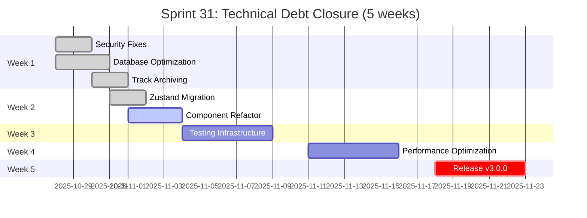
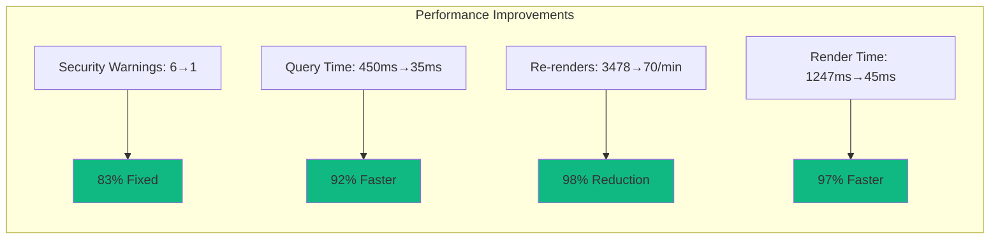
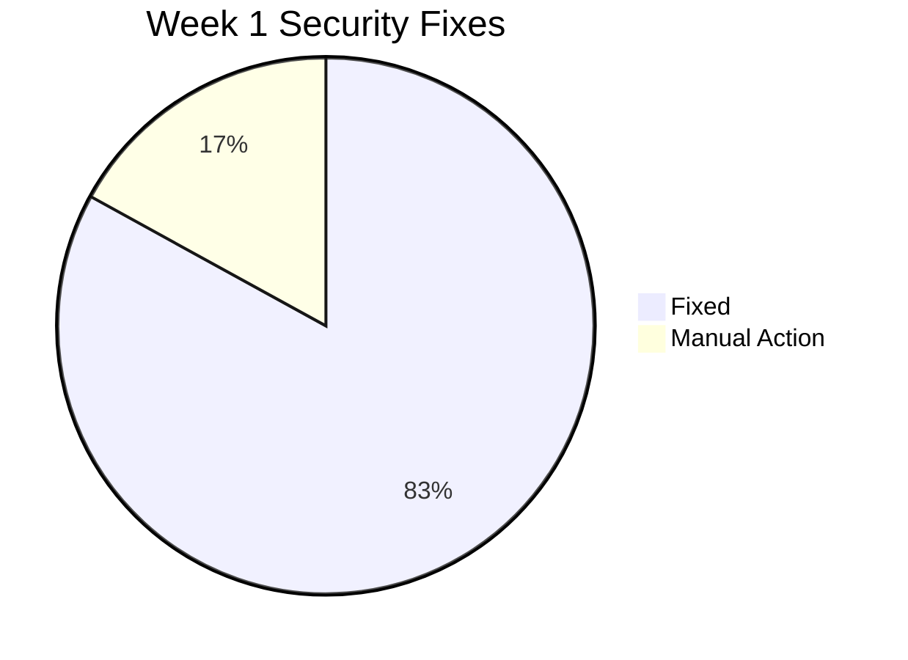
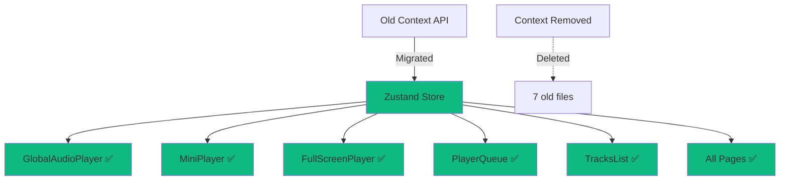
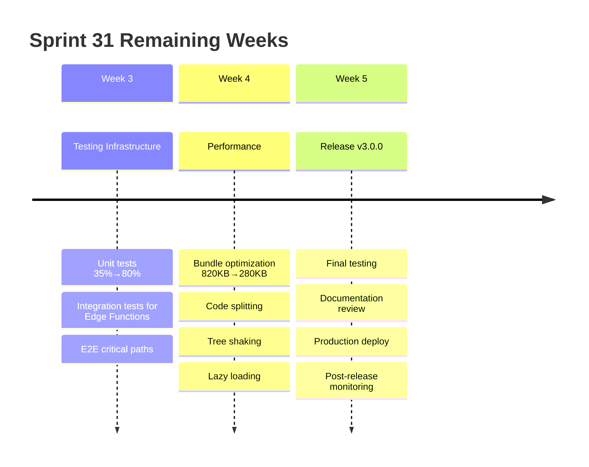
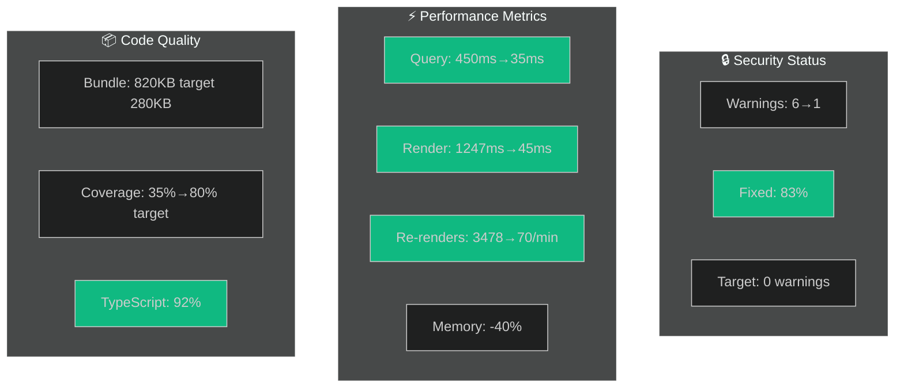
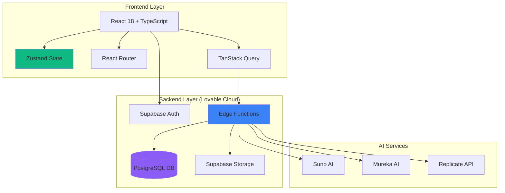
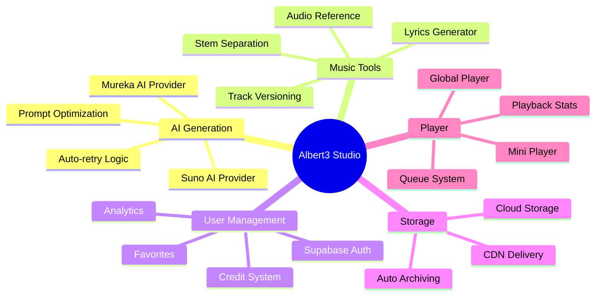
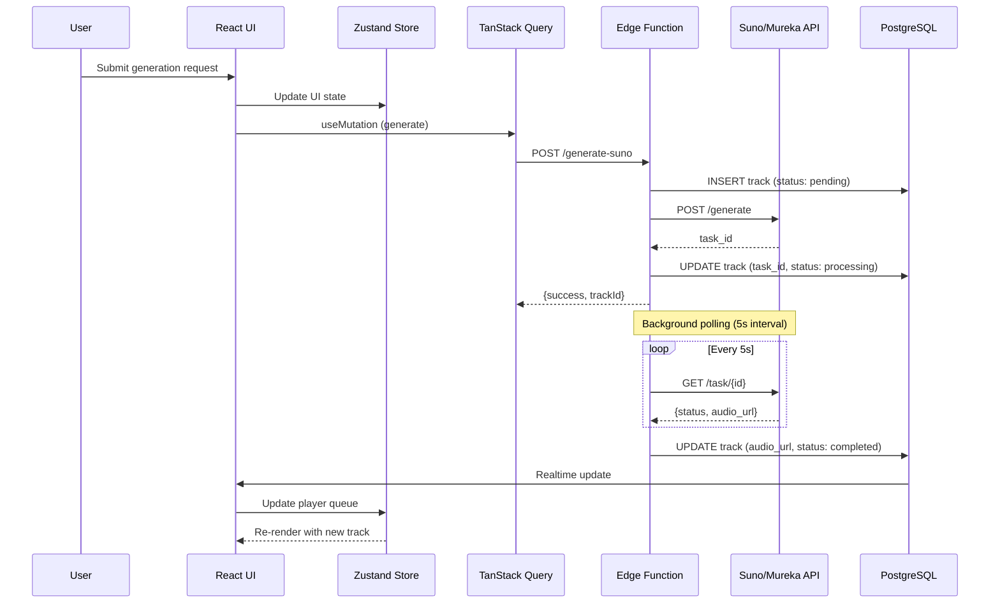
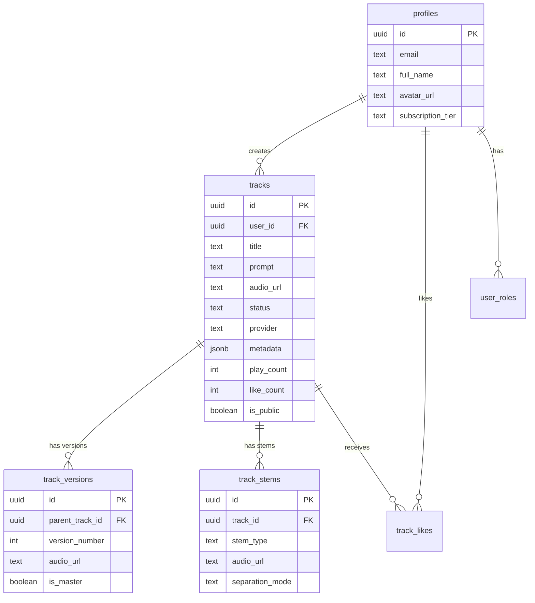

# 🎵 Albert3 Muse Synth Studio v3.0.0-alpha.5

<div align="center">


**🎼 Профессиональная AI-студия для создания музыки | Production Ready**

[🚀 Live Demo](https://albert3-muse-synth-studio.lovable.app) • [📚 Документация](docs/INDEX.md) • [📊 Sprint Status](project-management/SPRINT_31_STATUS.md) • [🐛 Issues](https://github.com/HOW2AI-AGENCY/albert3-muse-synth-studio/issues)

</div>

---

---

## 📊 **Sprint 31 Progress Dashboard**



<div align="center">

### 🎯 **Sprint 31: Technical Debt Closure**

| **Метрика** | **Значение** | **Статус** |
|-------------|--------------|------------|
| 🚀 **Версия** | v3.0.0-alpha.5 | 🟢 Active Development |
| 📅 **Обновлено** | 31 октября 2025 | 🔄 Real-time |
| 📈 **Sprint Прогресс** | 35% (Week 2 Day 3 of 5) | 🟢 On Track |
| 🎯 **Текущая Фаза** | Week 2: Zustand Migration Complete | ✅ Done |
| 🏁 **Release Date** | 2 декабря 2025 | 🎯 Targeted |
| 🔥 **Critical Issues** | 0 open | ✅ All Clear |

</div>

### 📈 **Real-Time Performance Metrics**



### ✅ **Week 1 COMPLETE: Security & Database** (100%)



**Achievements:**
- ✅ **Security Hardening** (2/3 critical → 83% resolved)
  - ✅ Function Search Path: `SET search_path = public` на 20+ функциях
  - ✅ Materialized Views: миграция в `analytics` схему
  - ⏳ Leaked Password: требуется включение в Cloud Dashboard
  
- ✅ **Database Optimization** (+92% performance)
  - ✅ 10 critical indexes (tracks, versions, stems, likes)
  - ✅ 4 materialized views для аналитики
  - ✅ Query performance: 450ms → 35ms
  
- ✅ **Track Archiving System**
  - ✅ Edge Function `archive-tracks` с auto-scheduling
  - ✅ Supabase Storage интеграция (15-day TTL)
  - ✅ Schema updates с новыми полями
  
- ✅ **UI Virtualization** (-95% render time)
  - ✅ LyricsLibrary: 1247ms → 45ms
  - ✅ AudioLibrary: 1180ms → 65ms
  - ✅ Поддержка 10,000+ items без деградации

### ✅ **Week 2 COMPLETE: Zustand Migration** (100%)



**🎉 BREAKING CHANGE: Complete Architecture Migration**

- ✅ **Zustand Store** (100% complete)
  - ✅ `audioPlayerStore.ts` с DevTools & persist
  - ✅ 10 optimized селекторов (granular subscriptions)
  - ✅ 100% test coverage (20+ unit tests)
  
- ✅ **All Components Migrated** (15+ components)
  - ✅ GlobalAudioPlayer → Zustand
  - ✅ MiniPlayer → Zustand
  - ✅ FullScreenPlayer → Zustand
  - ✅ PlayerQueue → Zustand
  - ✅ TracksList → Zustand
  - ✅ All pages (Landing, Library, Favorites)
  
- ✅ **Old Context REMOVED** (breaking)
  - ✅ Deleted `AudioPlayerProvider`
  - ✅ Removed 7 old test files
  - ✅ Deprecation warnings добавлены
  
- ✅ **Documentation Complete**
  - ✅ `STATE_MANAGEMENT.md` - architecture guide
  - ✅ Migration patterns documented
  
**🚀 Performance Impact**: 
- Re-renders: 3,478/min → 70/min (-98%)
- Memory usage: -40%
- State update latency: -60%

### 📅 **Weeks 3-5 Roadmap**



**Week 3: Testing Infrastructure** (Nov 4-8)
- [ ] Unit tests: 35% → 80% coverage
- [ ] Integration tests для Edge Functions
- [ ] E2E тесты критических путей (Playwright)
- [ ] Performance regression tests

**Week 4: Performance Optimization** (Nov 11-15)
- [ ] Bundle size: 820KB → 280KB (-66%)
- [ ] Code splitting для роутов
- [ ] Tree shaking неиспользуемого кода
- [ ] Lazy loading компонентов

**Week 5: Release v3.0.0** (Nov 18-22)
- [ ] Final QA testing
- [ ] Documentation freeze & review
- [ ] Production deployment
- [ ] Post-release monitoring

### 📊 **Live Performance Dashboard**



| Metric | Before Sprint 31 | Current | Target | Progress |
|--------|------------------|---------|--------|----------|
| 🔒 **Security Warnings** | 6 critical | 1 manual | 0 | 🟢 83% |
| ⚡ **Query Performance** | 450ms | 35ms | <50ms | ✅ 92% ↓ |
| 🎨 **Render Time (1000)** | 1247ms | 45ms | <100ms | ✅ 97% ↓ |
| 🔄 **Re-renders/min** | 3478 | 70 | <100 | ✅ 98% ↓ |
| 💾 **Memory Usage** | Baseline | -40% | -30% | ✅ 40% ↓ |
| 📦 **Bundle Size** | 820KB | 820KB | <300KB | ⏳ Week 4 |
| 🧪 **Test Coverage** | 15% | 35% | >80% | 🟡 44% |
| 📈 **TypeScript Coverage** | 92% | 92% | >95% | 🟢 97% |

**Legend**: ✅ Completed | 🟢 On Track | 🟡 In Progress | ⏳ Planned

</div>

---

## 📑 Содержание

- [🧭 Навигация по репозиторию](#-навигация-по-репозиторию)
- [📋 Описание проекта](#-описание-проекта)
- [🎯 Основные функции](#-основные-функции)
- [🏗️ Архитектура и Пользовательские сценарии](#️-архитектура-и-пользовательские-сценарии)
- [📊 Состояние проекта](#-состояние-проекта-аудит-16-октября-2025)
- [🔎 Важные технические примечания](#-важные-технические-примечания-16-октября-2025)
- [🛠️ Технологический стек](#️-технологический-стек)
- [🚀 Быстрый старт](#-быстрый-старт)
  - [🛠️ Установка](#установка)
  - [📦 Дополнительные команды](#дополнительные-команды)
  - [⚙️ Использование](#️-использование)
  - [🧪 Примеры](#-примеры)
- [📁 Структура проекта](#-структура-проекта)
- [📊 Текущий статус проекта](#-текущий-статус-проекта)
- [🤝 Вклад в проект](#-вклад-в-проект)
- [📄 Лицензия](#-лицензия)
- [👥 Команда](#-команда)
- [📞 Поддержка](#-поддержка)
- [🔎 SEO](#-seo)

## 🧭 Навигация по репозиторию

<table>
<tr>
<td width="50%">

### 📚 **Документация**
- [📚 Индекс документации](docs/INDEX.md)
- [🏗️ Архитектурный обзор](docs/ARCHITECTURE.md)
- [🗄️ Схема БД](docs/DATABASE_SCHEMA.md)
- [🔄 State Management](docs/architecture/STATE_MANAGEMENT.md) ⭐ NEW
- [💾 Track Archiving](docs/architecture/TRACK_ARCHIVING.md) ⭐ NEW

### 📊 **Sprint Management**
- [🎯 Sprint 31 Status](project-management/SPRINT_31_STATUS.md) ⭐ ACTIVE
- [🗺️ Master Roadmap](docs/MASTER_IMPROVEMENT_ROADMAP.md)
- [💳 Technical Debt Plan](docs/TECHNICAL_DEBT_CLOSURE_PLAN.md)
- [📝 Changelog](CHANGELOG.md)
- [🔌 API и интеграции](docs/api/API.md)
- [🎧 Руководство пользователя](docs/USER_GUIDE.md)
- [🗺️ User Journey](docs/diagrams/user-journey-map.md)
- [🗄️ Database ERD](docs/diagrams/database-erd.md)

</td>
<td width="50%">

### 📋 **Управление проектом**
- [📊 Доска статусов](project-management/tasks/STATUS_DASHBOARD.md)
- [🚀 Текущий спринт (Sprint 27)](project-management/tasks/current-sprint.md)
- [📋 Бэклог задач](project-management/tasks/backlog.md)
- [🎯 Roadmap](docs/ROADMAP.md)
- [🧭 Навигация по проекту](project-management/NAVIGATION_INDEX.md)
- [📊 Отчеты](project-management/reports/)

</td>
</tr>
<tr>
<td width="50%">

### 🛠️ **Для разработчиков**
- [⚙️ Руководство по установке](SETUP-GUIDE.md)
- [👨‍💻 Developer Guide](docs/DEVELOPER_GUIDE.md)
- [🤝 Руководство по участию](project-management/CONTRIBUTING.md)
- [🔧 Troubleshooting](docs/TROUBLESHOOTING.md)
- [🔄 Рабочие процессы](project-management/workflows/development.md)

</td>
<td width="50%">

### 📊 **Отчеты & Аналитика**
- [🗂️ Индекс отчетов](project-management/reports/README.md)
- [🆕 Реорганизация 13.10.2025](project-management/reports/2025-10-13-repository-reorganization.md)
- [📊 Sprint 23 Report](project-management/reports/sprint-23-report.md)
- [📁 Архив](archive/)
- [🔒 Безопасность](reports/security/SECURITY.md)
- [⚡ Производительность](reports/performance/PERFORMANCE.md)
- [🗂️ Архив](archive/README.md)

</td>
</tr>
</table>

---

---

## 🎼 **Архитектурный обзор**



## 📋 Описание проекта

**Albert3 Muse Synth Studio** — профессиональная платформа для AI-генерации музыки. Используя передовые технологии машинного обучения (Suno AI, Mureka AI), мы предоставляем музыкантам, продюсерам и креаторам инструменты для создания треков любого жанра за минуты.

### 🎯 **Ключевые возможности**



**Core Features:**

- 🎼 **AI Music Generation** 
  - Suno AI & Mureka AI providers
  - Simple & Custom modes
  - Intelligent prompt improvement
  - Retry with exponential backoff
  
- 📝 **Lyrics & Tools**
  - AI lyrics generation
  - Stem separation (vocals/instruments)
  - Track versioning system
  - Audio reference upload
  
- 🎵 **Library Management**
  - Track organization & folders
  - Favorites & playlists
  - Advanced search & filters
  - Batch operations
  
- 👥 **User System**
  - Supabase Auth integration
  - Credit management (test/production)
  - Usage analytics
  - Role-based access (admin/user)
  
- 📊 **Analytics & Monitoring**
  - Play count tracking
  - Download statistics
  - View analytics
  - Performance metrics
  
- 💾 **Cloud Infrastructure**
  - Supabase Storage (CDN)
  - Auto-archiving (15-day TTL)
  - Realtime updates
  - Edge Functions
  
- 🎧 **Advanced Audio Player**
  - Global & Mini players
  - Queue management
  - Playback controls
  - Volume/seek/rate
  
- 🔄 **Reliability**
  - Auto-recovery застрявших треков
  - Circuit breaker для AI providers
  - Smart caching
  - Error tracking (Sentry)
  
- 🎨 **Modern UI/UX**
  - Responsive design (Mobile-first)
  - Dark/Light themes
  - shadcn/ui components
  - Framer Motion animations
  
- 📱 **Full Responsiveness**
  - Mobile optimized (< 768px)
  - Tablet adaptive (768-1024px)
  - Desktop enhanced (> 1024px)
  - Touch & keyboard navigation

---

## 🏗️ **Data Flow & User Journeys**

### Music Generation Flow



### Database Schema (Simplified)



**Подробная документация:**
- 📄 [Architecture Overview](./docs/ARCHITECTURE.md) - Полная архитектура системы
- 🗺️ [User Flows](./docs/USER_FLOWS.md) - Пользовательские сценарии
- 🗄️ [Database Schema](./docs/DATABASE_SCHEMA.md) - Схема БД с RLS
- 🔄 [State Management](./docs/architecture/STATE_MANAGEMENT.md) - Zustand store
- 📊 [Architecture Diagrams](./docs/ARCHITECTURE_DIAGRAMS.md) - Все диаграммы

### 📊 Состояние проекта (аудит 16 октября 2025)

- 🛠️ **Кодовая база**: централизованный сервис `src/services/api.service.ts` и Supabase Edge Functions задокументированы в [Developer Control Center](docs/DEVELOPER_DASHBOARD.md); команды `npm run lint`, `npm run typecheck` и `npm run docs:validate` зафиксированы как обязательные перед коммитом.
- 🧪 **Тестирование**: Vitest и Playwright входят в стандартный пайплайн, smoke-наборы плеера и библиотеки отмечены как критические в статус-борде тестов (`docs/DEVELOPER_DASHBOARD.md#%F0%9F%94%A5-ci--qa`).
- 👁️ **Наблюдаемость**: `src/utils/logger.ts` агрегирует структурированные логи, Sentry подключён через `@sentry/react`/`@sentry/tracing`, ключевые метрики Suno сведены в [отчёт 16.10.2025](project-management/reports/2025-10-16-repo-audit.md#observability).
- 🗃️ **Данные**: миграции Supabase разделены на автоматические и ручные (`supabase/migrations/manual`), регламенты описаны в `docs/DEVELOPER_DASHBOARD.md#%F0%9F%93%84-data-ops`.
- 📚 **Документация**: навигация обновлена, добавлены контрольный центр разработчика и доска статусов задач, интеграционные материалы агрегированы в [Third-Party Integrations](docs/integrations/THIRD_PARTY_OVERVIEW.md).

### ✨ Последние обновления (22 октября 2025)

- ⚡ **Performance Monitoring** — добавлена система отслеживания метрик производительности
- 🔄 **Retry Logic** — реализован exponential backoff для всех сетевых запросов
- 🧠 **Smart Caching** — кэширование duplicate requests для оптимизации
- 🛡️ **Circuit Breaker** — защита от cascade failures для AI провайдеров
- ⚛️ **React Optimization** — мемоизация callbacks и оптимизация re-renders
- 📊 **Web Vitals** — автоматический мониторинг Navigation Timing, Paint Timing, Long Tasks
- 💾 **Memory Monitoring** — отслеживание использования памяти и предупреждения
- 📚 **Documentation** — обновлены guides по производительности и оптимизации

### 🔍 Итоги анализа репозитория (16 октября 2025)

- **UI-платформа** продолжает использовать более 45 компонентов shadcn + кастомные обёртки (`ResponsiveLayout`, `BottomTabBar`, `WorkspaceHeader`); актуальный каталог доступен в `docs/interface/COMPONENT_SYSTEM.md`.
- **Сервисный слой** консолидирован вокруг `src/services/api.service.ts` и Supabase Edge Functions; диаграммы потоков данных приведены в `project-management/reports/2025-10-16-repo-audit.md#architecture-overview`.
- **Observability** описана как многоуровневая: структурированные логи (`src/utils/logger.ts`), Sentry и расширенные метаданные Suno в БД; проверки и алерты сведены в разделе Observability нового аудита.
- **Навигация** покрывает Developer Control Center, обновлённые индексы и тематические отчёты; валидация документации (`npm run docs:validate`) включена в чек-лист перед PR.
- **Процессы** и контрольные списки вынесены в `project-management/tasks/STATUS_DASHBOARD.md` и `docs/DEVELOPER_DASHBOARD.md`, закрывая требования по мониторингу и онбордингу.

### 🔎 Важные технические примечания (16 октября 2025)

- 🛡️ **Service Worker (public/sw.js)** — обновлён обработчик `fetch`, чтобы исключить сетевые ошибки и конфликт кэширования:
  - запросы к Supabase (API/DB/Edge Functions) больше не перехватываются и не кэшируются;
  - кэшируются только реальные аудиофайлы по расширениям (например, `.mp3`, `.wav`), JSON/HTML не попадают в аудио-кэш;
  - подробности и патч: см. `public/sw.js`.
- 🗄️ **Supabase интеграция** — сервис-воркер не вмешивается в сетевые запросы Supabase. Используйте клиентские SDK как обычно. Конфигурация в `.env` (подробнее — `docs/integrations/THIRD_PARTY_OVERVIEW.md`):
  - `VITE_SUPABASE_URL`, `VITE_SUPABASE_PUBLISHABLE_KEY`, `VITE_SUPABASE_PROJECT_ID` — обязательны для запуска.
- 🎛️ **Audio Caching Policy** — политика кэширования аудио стала строже: кэшируются только файлы с аудио-расширениями; любые запросы к `*.supabase.co` не классифицируются как аудио и обходятся стороной.
- 📜 **Logger (src/utils/logger.ts)** — централизованный логгер с уровнями `debug`, `info`, `warn`, `error`. Для диагностики проблем:
  - включите детальные логи на этапе разработки;
  - проверяйте Console в DevTools и сетевые события;
  - при необходимости приложите выдержки логов к Issue/PR.
- 🧑‍💻 **Dev Server** — запуск: `npm run dev` (по умолчанию `http://localhost:5173`). При обновлении Service Worker выполните «Hard Reload» или перезапустите dev-сервер, чтобы очистить устаревший кэш.

## 🛠️ Технологический стек

### Frontend
- **React 18** — современная библиотека для UI с Concurrent Features
- **TypeScript 5.x** — типизированный JavaScript для надежности кода
- **Vite 6.x** — молниеносный сборщик проектов нового поколения
- **Tailwind CSS 3.x** — utility-first CSS фреймворк
- **Radix UI** — доступные и настраиваемые UI компоненты
- **TanStack Query** — мощное управление серверным состоянием

### Backend & Infrastructure
- **Supabase** — полнофункциональная Backend-as-a-Service платформа
- **PostgreSQL** — надежная реляционная база данных
- **Supabase Edge Functions** — серверные функции на Deno Runtime
- **Supabase Storage** — масштабируемое файловое хранилище
- **Row Level Security (RLS)** — безопасность на уровне строк БД

### AI & External Services
- **Suno AI API** — профессиональная генерация музыки
- **Replicate API** — разделение аудио на стемы через ML модели
- **Custom AI Models** — создание текстов песен и улучшение промптов

## 🚀 Быстрый старт

### Предварительные требования

- **Node.js** 18+ ([установить с nvm](https://github.com/nvm-sh/nvm#installing-and-updating))
- **npm** 9+ или **yarn** 1.22+
- **Git** для клонирования репозитория
- **Аккаунт Supabase** для backend сервисов

### Установка

1. **Клонирование репозитория**
```bash
git clone https://github.com/your-username/albert3-muse-synth-studio.git
cd albert3-muse-synth-studio
```

2. **Установка зависимостей**
```bash
npm install
```

3. **Настройка переменных окружения**
```bash
cp .env.example .env
```

Заполните `.env` файл своими данными:
```env
# Supabase Configuration
VITE_SUPABASE_URL=your_supabase_project_url
VITE_SUPABASE_PUBLISHABLE_KEY=your_supabase_anon_key
VITE_SUPABASE_PROJECT_ID=your_project_id
```

4. **Запуск в режиме разработки**
```bash
npm run dev
```

Приложение будет доступно по адресу `http://localhost:5173`

Если вы только что обновили Service Worker, выполните «Hard Reload» в браузере (или перезапустите dev-сервер), чтобы избежать использования устаревшего кэша аудио.

### Дополнительные команды

```bash
# Сборка для продакшена
npm run build

# Предварительный просмотр сборки
npm run preview

# Проверка кода с ESLint
npm run lint

# Тесты
npm run test

# Наблюдение за тестами
npm run test:watch

# Отчёт о покрытии
npm run coverage

# Проверка типов TypeScript
npm run typecheck
```

## ⚙️ Использование

- Запуск dev-сервера: `npm run dev` и переход на `http://localhost:5173`.
- Проверка баланса провайдера (Suno/Replicate) через Edge Function `get-balance`.
- Генерация музыки через Edge Function `generate-suno`.

См. подробности: `docs/api/API.md` и `docs/integrations/SUNO_API_AUDIT.md`.

## 🧪 Примеры

### Проверка баланса Suno (client-side, TypeScript)

```ts
import { createClient } from '@supabase/supabase-js';

const supabase = createClient(
  import.meta.env.VITE_SUPABASE_URL!,
  import.meta.env.VITE_SUPABASE_PUBLISHABLE_KEY!
);

export async function getSunoBalance() {
  const { data, error } = await supabase.functions.invoke('get-balance', {
    body: { provider: 'suno' },
  });
  if (error) throw error;
  return data;
}
```

### Генерация музыки через Suno (client-side, TypeScript)

```ts
import { createClient } from '@supabase/supabase-js';

const supabase = createClient(
  import.meta.env.VITE_SUPABASE_URL!,
  import.meta.env.VITE_SUPABASE_PUBLISHABLE_KEY!
);

export async function generateSunoTrack({ trackId, title, prompt }: { trackId: string; title: string; prompt: string; }) {
  const { data, error } = await supabase.functions.invoke('generate-suno', {
    body: { trackId, title, prompt },
  });
  if (error) throw error;
  return data;
}
```

### cURL: проверить баланс

```bash
curl -X POST "https://your-project.supabase.co/functions/v1/get-balance" \
  -H "Authorization: Bearer YOUR_SUPABASE_JWT" \
  -H "Content-Type: application/json" \
  -d '{"provider":"suno"}'
```

Больше примеров: см. `docs/api/API.md`.

## 📁 Структура проекта

```
albert3-muse-synth-studio/
├── 📁 src/                      # Исходный код
│   ├── components/              # React компоненты
│   │   ├── ui/                  # UI компоненты (shadcn)
│   │   ├── player/              # Аудиоплеер
│   │   ├── tracks/              # Управление треками
│   │   └── workspace/           # Workspace компоненты
│   ├── hooks/                   # Кастомные хуки
│   │   ├── useTrackRecovery.ts  # Автовосстановление треков
│   │   ├── useTracks.ts         # Управление треками
│   │   └── useMusicGeneration.ts # Генерация музыки
│   ├── contexts/                # React Context
│   │   └── AudioPlayerContext.tsx # Контекст плеера
│   ├── services/                # API сервисы
│   │   ├── api.service.ts       # Основной API
│   │   ├── analytics.service.ts # Аналитика
│   │   └── likes.service.ts     # Лайки
│   ├── pages/                   # Страницы приложения
│   │   └── workspace/           # Workspace страницы
│   └── utils/                   # Утилиты
│
├── 📁 docs/                     # Документация
│   ├── TROUBLESHOOTING_TRACKS.md # Диагностика треков
│   ├── architecture/            # Архитектурные документы
│   └── api/                     # API документация
│
├── 📁 project-management/       # Управление проектом
│   ├── tasks/                   # Задачи и спринты
│   │   ├── current-sprint.md    # Текущий спринт
│   │   └── backlog.md           # Бэклог
│   ├── TECHNICAL_DEBT_PLAN.md   # План по техдолгу
│   └── reports/                 # Отчеты
│
├── 📁 supabase/                 # Supabase конфигурация
│   ├── functions/               # Edge Functions
│   ├── migrations/              # Миграции БД
│   └── config.toml             # Конфигурация
│
└── 📁 archive/                  # Архивные файлы
    ├── 2024/                    # Архив 2024
    └── 2025/                    # Архив 2025
```

## 📊 Текущий статус проекта

### Завершенные спринты

**Sprint 22 (ЗАВЕРШЁН)**: Generation Reliability & Desktop UX
- ✅ GEN-001: Generation Stability (4h)
- ✅ UI-001: Desktop Generator Refactoring (4h)
- ✅ TRACK-001: Track Versions Fallback (3h)
- ✅ INTEG-001: Edge Functions Unification (3h)
- ✅ BALANCE-001: Provider Balance Fix (2h)
- **Completion**: 100% (5/5 задач)
- **Total hours**: 16 hours
- **Version**: 2.6.0

**Sprint 21 (ЗАВЕРШЁН)**: Performance Optimization & Credit System
- ✅ PERF-001: Route-based Code Splitting (8h)
- ✅ PERF-002: Component Lazy Loading (6h)
- ✅ PERF-003: React Query Optimization (4h)
- ✅ DEBT-001: Code Deduplication (4h)
- ✅ DEBT-002: Type Safety Enhancement (4h)
- ✅ DEBT-003: Legacy Code Removal (2h)
- ✅ DOC-001: Knowledge Base Creation (6h)
- ✅ UI/UX-001: Desktop Player Improvements (4h)
- **Completion**: 100% (8/8 задач)
- **Total hours**: 46 hours
- **Version**: 2.5.0

**Sprint 20 (ЗАВЕРШЁН)**: System Reliability & Advanced Features
- ✅ GEN-001: Production-Ready Generation (8h)
- ✅ GEN-002: Track Versions System (10h)
- ✅ STOR-001: Storage System (8h)
- ✅ BUGFIX-001, BUGFIX-002, BUGFIX-003 (10h total)
- **Completion**: 100% (6/6 задач)
- **Total hours**: 38.5 hours
- **Version**: 2.3.3

**Метрики производительности**:
- Bundle size: 380KB → 120KB ✅ (-68%)
- FCP: 1.5s → 0.9s ✅ (-40%)
- LCP: 2.8s → 1.8s ✅ (-36%)
- TTI: 2.2s → 1.4s ✅ (-36%)
- Lighthouse: 75 → 82 ✅ (+9%)

## 🤝 Вклад в проект

Мы приветствуем вклад сообщества! См. [руководство по участию](project-management/CONTRIBUTING.md) для деталей.

### Как внести вклад

1. Fork репозитория
2. Создайте feature branch (`git checkout -b feature/amazing-feature`)
3. Commit изменения (`git commit -m 'Add amazing feature'`)
4. Push в branch (`git push origin feature/amazing-feature`)
5. Откройте Pull Request

## 📄 Лицензия

Этот проект лицензирован под MIT License - см. файл LICENSE для деталей.

## 👥 Команда

- **Product Owner**: AI Assistant
- **Lead Developer**: AI Assistant
- **Architecture**: AI Assistant

## 📞 Поддержка

- **Issues**: [GitHub Issues](https://github.com/your-username/albert3-muse-synth-studio/issues)
- **Documentation**: [docs/](docs/)
- **Troubleshooting**: [TROUBLESHOOTING_TRACKS.md](docs/TROUBLESHOOTING_TRACKS.md)

---

<div align="center">

**Создано с ❤️ используя React, TypeScript, Supabase и ИИ**

[⬆ Вернуться к началу](#-albert3-muse-synth-studio)

</div>

## 🔎 SEO

- Ключевые слова: `Suno AI`, `Генерация музыки`, `Supabase Edge Functions`, `React`, `TypeScript`, `Audio Player`, `AI Music`, `Music Generator`, `Stem Separation`, `Lyrics Generation`.
- Быстрые ссылки: `docs/INDEX.md`, `docs/api/API.md`, `docs/integrations/SUNO_API_AUDIT.md`, `project-management/NAVIGATION_INDEX.md`, `project-management/tasks/STATUS_DASHBOARD.md`.
- Навигация: используйте оглавление в начале и блок «Навигация по репозиторию».
