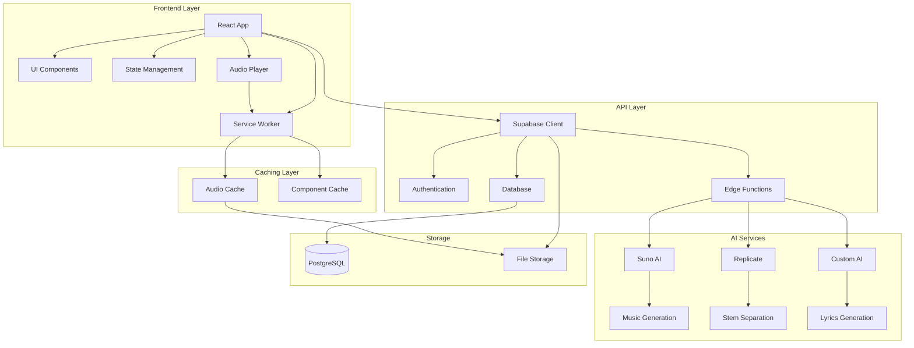

# 🎵 Albert3 Muse Synth Studio

<div align="center">


**Профессиональная студия для создания музыки с использованием ИИ**

[](https://www.typescriptlang.org/)
[](https://reactjs.org/)
[](https://vitejs.dev/)
[](https://supabase.com/)
[](https://tailwindcss.com/)

**Версия:** 2.5.2 | **Статус:** Активная разработка | **Sprint:** 22 (ЗАВЕРШЁН) - Generation Reliability & Desktop UX

[🚀 Демо](http://localhost:5173) • [📖 Документация](#-документация) • [🛠️ Установка](#️-установка) • [🎯 Функции](#-основные-функции)

</div>

---

## 🧭 Навигация по репозиторию

<table>
<tr>
<td width="50%">

### 📚 **Документация**
- [📖 Основная документация](docs/README.md)
- [🏗️ Архитектура системы](docs/architecture/ARCHITECTURE.md)
- [🔌 API документация](docs/api/API.md)
- [⚡ Оптимизация производительности](docs/PERFORMANCE_OPTIMIZATIONS.md)
- [🔧 Troubleshooting треков](docs/TROUBLESHOOTING_TRACKS.md)
- [📱 Мобильная оптимизация](docs/MOBILE_OPTIMIZATION.md)

</td>
<td width="50%">

### 📋 **Управление проектом**
- [📝 Текущий спринт](project-management/tasks/current-sprint.md)
- [📋 Бэклог задач](project-management/tasks/backlog.md)
- [🔧 Технический долг](project-management/TECHNICAL_DEBT_PLAN.md)
- [📝 История изменений](CHANGELOG.md)
- [🚀 План развития](project-management/DEVELOPMENT_ROADMAP.md)

</td>
</tr>
<tr>
<td width="50%">

### 🛠️ **Для разработчиков**
- [⚙️ Руководство по установке](SETUP-GUIDE.md)
- [🤝 Руководство по участию](project-management/CONTRIBUTING.md)
- [📋 Быстрый справочник](project-management/QUICK-REFERENCE.md)
- [🔄 Рабочие процессы](project-management/workflows/development.md)

</td>
<td width="50%">

### 📊 **Отчеты**
- [📈 Аналитика проекта](project-management/reports/README.md)
- [🔒 Безопасность](reports/security/SECURITY.md)
- [⚡ Производительность](reports/performance/PERFORMANCE.md)
- [🗂️ Архив](archive/README.md)

</td>
</tr>
</table>

---

## 📋 Описание проекта

**Albert3 Muse Synth Studio** — это современное веб-приложение для создания музыки с использованием искусственного интеллекта. Платформа предоставляет пользователям мощные инструменты для генерации музыки, создания текстов песен, разделения аудио на стемы и управления музыкальными проектами.

### 🎯 Основные функции

Albert3 Muse Synth Studio предлагает следующие возможности:

- 🎼 **Генерация музыки с ИИ** — создание треков по текстовому описанию через Suno AI
- 📝 **Создание текстов песен** — автоматическая генерация лирики с помощью ИИ
- 🎚️ **Разделение на стемы** — извлечение отдельных инструментов из трека
- 🎵 **Управление треками** — организация, версионирование и каталогизация музыки
- 👥 **Система пользователей** — регистрация, аутентификация через Supabase Auth
- 📊 **Аналитика прослушиваний** — отслеживание взаимодействий и популярности
- 💾 **Облачное хранение** — безопасное сохранение в Supabase Storage
- 🎧 **Продвинутый аудиоплеер** — с поддержкой плейлистов и управления
- 🔄 **Автоматическое восстановление** — застрявшие треки автоматически переотправляются
- 🎨 **Современный UI/UX** — адаптивный дизайн с темной/светлой темой
- 📱 **Полностью адаптивный дизайн** — оптимизированный интерфейс для мобильных, планшетов и десктопов

### ✨ Последние обновления (v2.5.2)

- ✅ **Стабилизация генерации** - унификация Edge Functions, улучшенное логирование
- ✅ **Desktop UI улучшения** - исправлена разметка плеера, нет overlapping элементов
- ✅ **Track Versions Fallback** - автоматическое создание виртуальных версий из metadata
- ✅ **Edge Functions унификация** - @supabase/supabase-js@2.39.3 во всех функциях
- ✅ **Provider Balance Monitoring** - real-time отображение баланса Suno API
- ✅ **Система управления кредитами** - отображение баланса провайдера (v2.4.0)
- ✅ **Админская панель** - управление режимами работы (v2.4.0)
- ✅ **Performance Optimization** - bundle size: 380KB → 120KB (v2.5.0)
- ✅ **Code Quality** - Code Duplication: 15% → 5% (v2.5.0)

## 🏗️ Архитектура



## 🛠️ Технологический стек

### Frontend
- **React 18** — современная библиотека для UI с Concurrent Features
- **TypeScript 5.x** — типизированный JavaScript для надежности кода
- **Vite 6.x** — молниеносный сборщик проектов нового поколения
- **Tailwind CSS 3.x** — utility-first CSS фреймворк
- **Radix UI** — доступные и настраиваемые UI компоненты
- **TanStack Query** — мощное управление серверным состоянием

### Backend & Infrastructure
- **Supabase** — полнофункциональная Backend-as-a-Service платформа
- **PostgreSQL** — надежная реляционная база данных
- **Supabase Edge Functions** — серверные функции на Deno Runtime
- **Supabase Storage** — масштабируемое файловое хранилище
- **Row Level Security (RLS)** — безопасность на уровне строк БД

### AI & External Services
- **Suno AI API** — профессиональная генерация музыки
- **Replicate API** — разделение аудио на стемы через ML модели
- **Custom AI Models** — создание текстов песен и улучшение промптов

## 🚀 Быстрый старт

### Предварительные требования

- **Node.js** 18+ ([установить с nvm](https://github.com/nvm-sh/nvm#installing-and-updating))
- **npm** 9+ или **yarn** 1.22+
- **Git** для клонирования репозитория
- **Аккаунт Supabase** для backend сервисов

### Установка

1. **Клонирование репозитория**
```bash
git clone https://github.com/your-username/albert3-muse-synth-studio.git
cd albert3-muse-synth-studio
```

2. **Установка зависимостей**
```bash
npm install
```

3. **Настройка переменных окружения**
```bash
cp .env.example .env
```

Заполните `.env` файл своими данными:
```env
# Supabase Configuration
VITE_SUPABASE_URL=your_supabase_project_url
VITE_SUPABASE_PUBLISHABLE_KEY=your_supabase_anon_key
VITE_SUPABASE_PROJECT_ID=your_project_id
```

4. **Запуск в режиме разработки**
```bash
npm run dev
```

Приложение будет доступно по адресу `http://localhost:5173`

### Дополнительные команды

```bash
# Сборка для продакшена
npm run build

# Предварительный просмотр сборки
npm run preview

# Проверка кода с ESLint
npm run lint

# Тесты
npm run test
```

## 📁 Структура проекта

```
albert3-muse-synth-studio/
├── 📁 src/                      # Исходный код
│   ├── components/              # React компоненты
│   │   ├── ui/                  # UI компоненты (shadcn)
│   │   ├── player/              # Аудиоплеер
│   │   ├── tracks/              # Управление треками
│   │   └── workspace/           # Workspace компоненты
│   ├── hooks/                   # Кастомные хуки
│   │   ├── useTrackRecovery.ts  # Автовосстановление треков
│   │   ├── useTracks.ts         # Управление треками
│   │   └── useMusicGeneration.ts # Генерация музыки
│   ├── contexts/                # React Context
│   │   └── AudioPlayerContext.tsx # Контекст плеера
│   ├── services/                # API сервисы
│   │   ├── api.service.ts       # Основной API
│   │   ├── analytics.service.ts # Аналитика
│   │   └── likes.service.ts     # Лайки
│   ├── pages/                   # Страницы приложения
│   │   └── workspace/           # Workspace страницы
│   └── utils/                   # Утилиты
│
├── 📁 docs/                     # Документация
│   ├── TROUBLESHOOTING_TRACKS.md # Диагностика треков
│   ├── architecture/            # Архитектурные документы
│   └── api/                     # API документация
│
├── 📁 project-management/       # Управление проектом
│   ├── tasks/                   # Задачи и спринты
│   │   ├── current-sprint.md    # Текущий спринт
│   │   └── backlog.md           # Бэклог
│   ├── TECHNICAL_DEBT_PLAN.md   # План по техдолгу
│   └── reports/                 # Отчеты
│
├── 📁 supabase/                 # Supabase конфигурация
│   ├── functions/               # Edge Functions
│   ├── migrations/              # Миграции БД
│   └── config.toml             # Конфигурация
│
└── 📁 archive/                  # Архивные файлы
    ├── 2024/                    # Архив 2024
    └── 2025/                    # Архив 2025
```

## 📊 Текущий статус проекта

### Завершенные спринты

**Sprint 22 (ЗАВЕРШЁН)**: Generation Reliability & Desktop UX
- ✅ GEN-001: Generation Stability (4h)
- ✅ UI-001: Desktop Generator Refactoring (4h)
- ✅ TRACK-001: Track Versions Fallback (3h)
- ✅ INTEG-001: Edge Functions Unification (3h)
- ✅ BALANCE-001: Provider Balance Fix (2h)
- **Completion**: 100% (5/5 задач)
- **Total hours**: 16 hours
- **Version**: 2.5.2

**Sprint 21 (ЗАВЕРШЁН)**: Performance Optimization & Credit System
- ✅ PERF-001: Route-based Code Splitting (8h)
- ✅ PERF-002: Component Lazy Loading (6h)
- ✅ PERF-003: React Query Optimization (4h)
- ✅ DEBT-001: Code Deduplication (4h)
- ✅ DEBT-002: Type Safety Enhancement (4h)
- ✅ DEBT-003: Legacy Code Removal (2h)
- ✅ DOC-001: Knowledge Base Creation (6h)
- ✅ UI/UX-001: Desktop Player Improvements (4h)
- **Completion**: 100% (8/8 задач)
- **Total hours**: 46 hours
- **Version**: 2.5.0

**Sprint 20 (ЗАВЕРШЁН)**: System Reliability & Advanced Features
- ✅ GEN-001: Production-Ready Generation (8h)
- ✅ GEN-002: Track Versions System (10h)
- ✅ STOR-001: Storage System (8h)
- ✅ BUGFIX-001, BUGFIX-002, BUGFIX-003 (10h total)
- **Completion**: 100% (6/6 задач)
- **Total hours**: 38.5 hours
- **Version**: 2.3.3

**Метрики производительности**:
- Bundle size: 380KB → 120KB ✅ (-68%)
- FCP: 1.5s → 0.9s ✅ (-40%)
- LCP: 2.8s → 1.8s ✅ (-36%)
- TTI: 2.2s → 1.4s ✅ (-36%)
- Lighthouse: 75 → 82 ✅ (+9%)

## 🤝 Вклад в проект

Мы приветствуем вклад сообщества! См. [руководство по участию](project-management/CONTRIBUTING.md) для деталей.

### Как внести вклад

1. Fork репозитория
2. Создайте feature branch (`git checkout -b feature/amazing-feature`)
3. Commit изменения (`git commit -m 'Add amazing feature'`)
4. Push в branch (`git push origin feature/amazing-feature`)
5. Откройте Pull Request

## 📄 Лицензия

Этот проект лицензирован под MIT License - см. файл LICENSE для деталей.

## 👥 Команда

- **Product Owner**: AI Assistant
- **Lead Developer**: AI Assistant
- **Architecture**: AI Assistant

## 📞 Поддержка

- **Issues**: [GitHub Issues](https://github.com/your-username/albert3-muse-synth-studio/issues)
- **Documentation**: [docs/](docs/)
- **Troubleshooting**: [TROUBLESHOOTING_TRACKS.md](docs/TROUBLESHOOTING_TRACKS.md)

---

<div align="center">

**Создано с ❤️ используя React, TypeScript, Supabase и ИИ**

[⬆ Вернуться к началу](#-albert3-muse-synth-studio)

</div>
