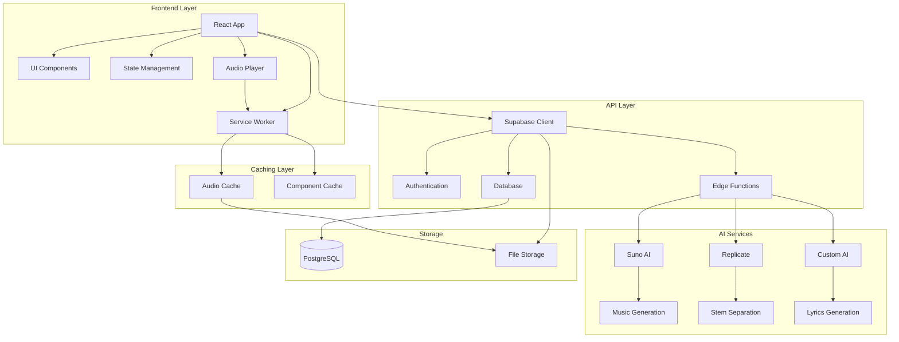

# 🎵 Albert3 Muse Synth Studio

<div align="center">


**Профессиональная студия для создания музыки с использованием ИИ**

[](https://www.typescriptlang.org/)
[](https://reactjs.org/)
[](https://vitejs.dev/)
[](https://supabase.com/)
[](https://tailwindcss.com/)

**Версия:** 1.5.0 | **Статус:** Активно | **Последнее обновление:** Январь 2025

[🚀 Демо](http://localhost:5173) • [📖 Документация](#-документация) • [🛠️ Установка](#️-установка) • [🎯 Функции](#-основные-функции) • [📋 Управление проектом](#-управление-проектом)

</div>

---

## 🧭 Навигация по репозиторию

<table>
<tr>
<td width="33%">

### 📚 **Документация**
- [📖 Основная документация](docs/README.md)
- [🏗️ Архитектура системы](docs/architecture/ARCHITECTURE.md)
- [🔌 API документация](docs/api/API.md)
- [🚀 Руководство по развертыванию](docs/deployment/DEPLOYMENT.md)
- [⚡ Оптимизация производительности](docs/PERFORMANCE_OPTIMIZATIONS.md)

</td>
<td width="33%">

### 📋 **Управление проектом**
- [📊 Панель управления командой](project-management/reports/team-dashboard.md)
- [📝 Текущий спринт](project-management/tasks/current-sprint.md)
- [📋 Бэклог задач](project-management/tasks/backlog.md)
- [📈 Отчеты и метрики](project-management/reports/README.md)
- [🔄 Рабочие процессы](project-management/workflows/README.md)

</td>
<td width="33%">

### 📊 **Отчеты и анализ**
- [🔍 Анализ кода](reports/CODE_ANALYSIS.md)
- [🔒 Отчет о безопасности](reports/security/SECURITY.md)
- [📊 Анализ производительности](reports/performance/PERFORMANCE.md)
- [📈 Общие отчеты](reports/README.md)

</td>
</tr>
<tr>
<td width="33%">

### 🗂️ **Архив**
- [📁 Архив проекта](archive/README.md)
- [📅 Архив 2024](archive/2024/)
- [📅 Архив 2025](archive/2025/)

</td>
<td width="33%">

### 🛠️ **Настройка и установка**
- [⚙️ Подробное руководство](SETUP-GUIDE.md)
- [📝 История изменений](CHANGELOG.md)
- [🤝 Руководство по участию](project-management/CONTRIBUTING.md)
- [📋 Быстрый справочник](project-management/QUICK-REFERENCE.md)

</td>
<td width="33%">

### 🔧 **Инструменты разработки**
- [🛠️ Инструменты проекта](project-management/tools/README.md)
- [📊 Вехи проекта](project-management/milestones/README.md)
- [🎯 Текущие задачи](project-management/tasks/README.md)

</td>
</tr>
</table>

---

## 📋 Описание проекта

**Albert3 Muse Synth Studio** — это современное веб-приложение для создания музыки с использованием искусственного интеллекта. Платформа предоставляет пользователям мощные инструменты для генерации музыки, создания текстов песен, разделения аудио на стемы и управления музыкальными проектами.

### 🎯 Основные функции

- 🎼 **Генерация музыки с ИИ** — создание треков по текстовому описанию через Suno AI
- 📝 **Создание текстов песен** — автоматическая генерация лирики с помощью ИИ
- 🎚️ **Разделение на стемы** — извлечение отдельных инструментов из трека
- 🎵 **Управление треками** — организация, версионирование и каталогизация музыки
- 👥 **Система пользователей** — регистрация, аутентификация через Supabase Auth
- 📊 **Аналитика прослушиваний** — отслеживание взаимодействий и популярности
- 💾 **Облачное хранение** — безопасное сохранение в Supabase Storage
- 🎧 **Продвинутый аудиоплеер** — с поддержкой плейлистов и управления
- 🔄 **Виртуализированные списки** — оптимизированная производительность для больших коллекций
- 🎨 **Современный UI/UX** — адаптивный дизайн с темной/светлой темой
- 🔧 **Service Worker кэширование** — автоматическое кэширование аудиофайлов для офлайн-доступа
- 💫 **Скелетоны загрузки** — улучшенный пользовательский опыт во время загрузки
- 📱 **Полностью адаптивный дизайн** — оптимизированный интерфейс для мобильных, планшетов и десктопов
- 🎛️ **Мини-плеер** — компактный плеер для фонового воспроизведения
- 📲 **Нижняя навигация** — удобная мобильная навигация через Bottom Tab Bar
- 🔔 **Toast-уведомления** — информативная обратная связь для всех действий пользователя
- ⏳ **Интеллектуальные состояния загрузки** — визуальные индикаторы для всех асинхронных операций
- 🛡️ **Улучшенная обработка ошибок** — graceful fallback и информативные сообщения об ошибках
- 🎚️ **Интерактивные стемы** — воспроизведение и скачивание отдельных элементов трека

## 🏗️ Архитектура



## 🛠️ Технологический стек

### Frontend
- **React 18** — современная библиотека для UI с Concurrent Features
- **TypeScript 5.x** — типизированный JavaScript для надежности кода
- **Vite 6.x** — молниеносный сборщик проектов нового поколения
- **Tailwind CSS 3.x** — utility-first CSS фреймворк
- **Radix UI** — доступные и настраиваемые UI компоненты
- **TanStack Query** — мощное управление серверным состоянием
- **React Hook Form** — производительное управление формами
- **Lucide React** — красивые SVG иконки
- **Embla Carousel** — легкий и гибкий карусель компонент

### Backend & Infrastructure
- **Supabase** — полнофункциональная Backend-as-a-Service платформа
- **PostgreSQL** — надежная реляционная база данных
- **Supabase Edge Functions** — серверные функции на Deno Runtime
- **Supabase Storage** — масштабируемое файловое хранилище
- **Row Level Security (RLS)** — безопасность на уровне строк БД

### AI & External Services
- **Suno AI API** — профессиональная генерация музыки
- **Replicate API** — разделение аудио на стемы через ML модели
- **Custom AI Models** — создание текстов песен и улучшение промптов

### Development & Build Tools
- **ESLint** — статический анализ кода
- **PostCSS** — трансформация CSS
- **SWC** — быстрый компилятор для JavaScript/TypeScript
- **Rollup** — оптимизированная сборка для продакшена

## 🚀 Быстрый старт

### Предварительные требования

- **Node.js** 18+ ([установить с nvm](https://github.com/nvm-sh/nvm#installing-and-updating))
- **npm** 9+ или **yarn** 1.22+
- **Git** для клонирования репозитория
- **Аккаунт Supabase** для backend сервисов

### Установка

1. **Клонирование репозитория**
```bash
git clone https://github.com/your-username/albert3-muse-synth-studio.git
cd albert3-muse-synth-studio
```

2. **Установка зависимостей**
```bash
# Используя npm
npm install

# Или используя yarn
yarn install
```

3. **Настройка переменных окружения**
```bash
# Копируем пример конфигурации
cp .env.example .env
```

Заполните `.env` файл своими данными:
```env
# Supabase Configuration
VITE_SUPABASE_URL=your_supabase_project_url
VITE_SUPABASE_PUBLISHABLE_KEY=your_supabase_anon_key
VITE_SUPABASE_PROJECT_ID=your_project_id

# AI Services (опционально)
VITE_SUNO_API_KEY=your_suno_api_key
VITE_REPLICATE_API_TOKEN=your_replicate_token
```

4. **Настройка Supabase (если требуется)**
```bash
# Установка Supabase CLI
npm install -g @supabase/cli

# Инициализация проекта
supabase init

# Запуск локальной разработки
supabase start
```

5. **Запуск в режиме разработки**
```bash
npm run dev
```

Приложение будет доступно по адресу `http://localhost:5173`

### Дополнительные команды

```bash
# Сборка для продакшена
npm run build

# Предварительный просмотр сборки
npm run preview

# Проверка кода с ESLint
npm run lint
```

## 📁 Структура проекта

```
albert3-muse-synth-studio/
├── 📁 public/                    # Статические файлы
│   ├── favicon.ico              # Иконка сайта
│   └── manifest.json            # PWA манифест
├── 📁 src/                      # Исходный код приложения
│   ├── 📁 components/           # React компоненты
│   │   ├── ui/                  # Базовые UI компоненты (Radix UI)
│   │   ├── player/              # Компоненты аудиоплеера
│   │   │   └── GlobalAudioPlayer.tsx  # Глобальный аудиоплеер с расширенным функционалом
│   │   ├── TrackCard.tsx        # Карточка трека с действиями
│   │   ├── VirtualizedList.tsx  # Виртуализированный список треков
│   │   ├── ErrorBoundary.tsx    # Обработка ошибок React
│   │   └── Layout.tsx           # Основной макет приложения
│   ├── 📁 hooks/                # Пользовательские React хуки
│   │   ├── useAudio.ts          # Управление аудио воспроизведением
│   │   ├── useSupabase.ts       # Интеграция с Supabase
│   │   └── useVirtualization.ts # Виртуализация больших списков
│   ├── 📁 lib/                  # Библиотеки и конфигурации
│   │   ├── supabase.ts          # Клиент Supabase
│   │   ├── ai-services.ts       # Интеграция с AI сервисами
│   │   └── audio-processing.ts  # Обработка аудио файлов
│   ├── 📁 pages/                # Страницы приложения
│   │   ├── Dashboard.tsx        # Главная панель
│   │   ├── Studio.tsx           # Студия создания музыки
│   │   ├── Library.tsx          # Библиотека треков
│   │   └── Profile.tsx          # Профиль пользователя
│   ├── 📁 services/             # Сервисы и API
│   │   ├── api.ts               # Основной API клиент
│   │   ├── suno-api.ts          # Интеграция с Suno AI
│   │   ├── replicate-api.ts     # Интеграция с Replicate
│   │   └── storage.ts           # Управление файлами
│   ├── 📁 types/                # TypeScript типы
│   │   ├── audio.ts             # Типы для аудио
│   │   ├── user.ts              # Типы пользователей
│   │   └── api.ts               # Типы API ответов
│   ├── 📁 utils/                # Утилиты и хелперы
│   │   ├── formatters.ts        # Форматирование данных
│   │   ├── logger.ts            # Система логирования
│   │   ├── validation.ts        # Валидация данных
│   │   └── constants.ts         # Константы приложения
│   ├── 📁 styles/               # Стили приложения
│   │   ├── globals.css          # Глобальные стили
│   │   └── components.css       # Стили компонентов
│   ├── App.tsx                  # Корневой компонент
│   ├── main.tsx                 # Точка входа приложения
│   └── vite-env.d.ts           # Типы Vite
├── 📁 docs/                     # Документация проекта
│   ├── 📁 api/                  # API документация
│   ├── 📁 architecture/         # Архитектурная документация
│   └── 📁 guides/               # Руководства пользователя
├── 📁 tests/                    # Тесты
│   ├── 📁 unit/                 # Модульные тесты
│   ├── 📁 integration/          # Интеграционные тесты
│   └── 📁 e2e/                  # End-to-end тесты
├── 📁 supabase/                 # Supabase конфигурация
│   ├── functions/               # Edge Functions
│   ├── migrations/              # Миграции БД
│   └── config.toml             # Конфигурация
├── .env.example                 # Пример переменных окружения
├── .gitignore                   # Игнорируемые Git файлы
├── package.json                 # Зависимости и скрипты
├── tsconfig.json               # Конфигурация TypeScript
├── tailwind.config.js          # Конфигурация Tailwind CSS
├── vite.config.ts              # Конфигурация Vite
├── eslint.config.js            # Конфигурация ESLint
├── postcss.config.js           # Конфигурация PostCSS
├── CHANGELOG.md                # История изменений
├── SETUP-GUIDE.md              # Подробное руководство по установке
└── README.md                   # Этот файл
```

## 🎮 Использование

### 1. Регистрация и вход
- Создайте аккаунт или войдите в существующий
- Подтвердите email адрес

### 2. Создание музыки
```typescript
// Пример использования генератора музыки
const { generateMusic, isLoading } = useMusicGeneration();

const handleGenerate = async () => {
  const result = await generateMusic({
    prompt: "Спокойная джазовая мелодия",
    duration: 30,
    includeVocals: false
  });
};
```

### 3. Управление треками
- Просматривайте созданные треки
- Создавайте версии треков
- Разделяйте аудио на стемы
- Делитесь треками с другими пользователями

## 🔧 API Reference

### Основные эндпоинты

#### Генерация музыки
```typescript
POST /functions/v1/generate-music
Content-Type: application/json

{
  "prompt": "описание музыки",
  "duration": 30,
  "includeVocals": boolean
}
```

#### Разделение на стемы
```typescript
POST /functions/v1/separate-stems
Content-Type: application/json

{
  "audioUrl": "url_to_audio_file",
  "separationMode": "vocals_instrumental" | "full_stems"
}
```

#### Создание текстов
```typescript
POST /functions/v1/generate-lyrics
Content-Type: application/json

{
  "prompt": "тема песни",
  "genre": "жанр",
  "mood": "настроение"
}
```

## 🧪 Тестирование

```bash
# Запуск всех тестов
npm run test

# Запуск тестов в watch режиме
npm run test:watch

# Покрытие кода
npm run test:coverage
```

## 📦 Сборка и деплой

### Локальная сборка
```bash
npm run build
```

### Деплой на Vercel
```bash
npm install -g vercel
vercel --prod
```

### Деплой через Lovable
1. Откройте [Lovable проект](https://lovable.dev/projects/02875d5f-a8ca-4fc2-97f1-474a7f7a6d00)
2. Нажмите Share → Publish

## 🔒 Безопасность

Проект использует современные практики безопасности:

- **JWT аутентификация** через Supabase Auth
- **Row Level Security (RLS)** для защиты данных
- **HTTPS** для всех соединений
- **Валидация входных данных** с Zod
- **Санитизация контента** для предотвращения XSS

⚠️ **Важно**: Ознакомьтесь с [отчетом о безопасности](reports/security/SECURITY.md) для получения подробной информации.

## ⚡ Производительность

Текущие показатели:
- **Bundle Size**: ~287KB (gzipped)
- **First Contentful Paint**: ~1.2s
- **Time to Interactive**: ~2.1s

📊 Подробный анализ доступен в [отчете о производительности](reports/performance/PERFORMANCE.md).

## 🤝 Участие в разработке

Мы приветствуем вклад в развитие проекта!

### Процесс разработки

1. **Fork** репозитория
2. Создайте **feature branch** (`git checkout -b feature/amazing-feature`)
3. **Commit** изменения (`git commit -m 'Add amazing feature'`)
4. **Push** в branch (`git push origin feature/amazing-feature`)
5. Откройте **Pull Request**

### Стандарты кода

- Используйте **TypeScript** для всего кода
- Следуйте **ESLint** правилам
- Покрывайте код **тестами**
- Документируйте **API изменения**

## 📚 Документация

### 🏗️ Архитектура и планирование
- [🏗️ Архитектура системы](docs/architecture/ARCHITECTURE.md) — подробное описание архитектуры приложения
- [🚀 План оптимизации](docs/architecture/OPTIMIZATION_PLAN.md) — стратегия улучшения производительности
- [⚡ Оптимизация производительности](docs/PERFORMANCE_OPTIMIZATIONS.md) — текущие оптимизации

### 📖 API и развертывание
- [🔌 API документация](docs/api/API.md) — полное описание API эндпоинтов
- [🚀 Руководство по развертыванию](docs/deployment/DEPLOYMENT.md) — инструкции по деплою

### 📊 Отчеты и анализ
- [🔍 Анализ кода](reports/CODE_ANALYSIS.md) — детальный анализ качества кода
- [🔒 Отчет о безопасности](reports/security/SECURITY.md) — аудит безопасности
- [📊 Анализ производительности](reports/performance/PERFORMANCE.md) — метрики производительности

### 📋 Управление проектом
- [📊 Панель управления командой](project-management/reports/team-dashboard.md) — актуальные метрики команды
- [📝 Текущий спринт](project-management/tasks/current-sprint.md) — задачи текущего спринта
- [📋 Бэклог задач](project-management/tasks/backlog.md) — полный список задач проекта
- [📈 Отчеты и метрики](project-management/reports/README.md) — аналитика проекта
- [🔄 Рабочие процессы](project-management/workflows/README.md) — процессы разработки
- [🤝 Руководство по участию](project-management/CONTRIBUTING.md) — как участвовать в проекте
- [📋 Быстрый справочник](project-management/QUICK-REFERENCE.md) — основные команды и процедуры

### 🗂️ Архив и история
- [📁 Архив проекта](archive/README.md) — архивированные материалы
- [📅 Архив 2024](archive/2024/) — материалы за 2024 год
- [📅 Архив 2025](archive/2025/) — материалы за 2025 год
- [📝 История изменений](CHANGELOG.md) — журнал изменений проекта

## 🐛 Известные проблемы и улучшения

### 🔴 Критические задачи
- [CRIT-001](project-management/tasks/backlog.md#crit-001) Устранение уязвимостей безопасности
- [CRIT-002](project-management/tasks/backlog.md#crit-002) Оптимизация генерации музыки
- [CRIT-003](project-management/tasks/backlog.md#crit-003) Реализация API безопасности
- [CRIT-004](project-management/tasks/backlog.md#crit-004) Система мониторинга производительности

### 🟡 Высокий приоритет
- [HIGH-001](project-management/tasks/backlog.md#high-001) Система кэширования
- [x] ✅ [HIGH-002](project-management/tasks/backlog.md#high-002) Улучшение UI/UX интерфейса
- [HIGH-003](project-management/tasks/backlog.md#high-003) Интеграция AI сервисов
- [HIGH-004](project-management/tasks/backlog.md#high-004) Система управления пользователями

### 🔧 Технический долг
- [TECH-001](project-management/tasks/backlog.md#tech-001) Рефакторинг legacy кода
- [TECH-002](project-management/tasks/backlog.md#tech-002) Миграция на React 19
- [TECH-003](project-management/tasks/backlog.md#tech-003) Обновление до TypeScript 5.0
- [TECH-004](project-management/tasks/backlog.md#tech-004) Рефакторинг архитектуры компонентов

### 📊 Текущий статус
- **Всего задач**: 18
- **Критических**: 4
- **Высокий приоритет**: 6
- **Средний приоритет**: 5
- **Технический долг**: 3

📋 **Полный список**: [Бэклог задач](project-management/tasks/backlog.md) | [Текущий спринт](project-management/tasks/current-sprint.md)

## 🗺️ Roadmap

### 🎯 Январь 2025 (Спринт 14)
- [x] ✅ Система управления проектами
- [x] ✅ Отчеты по производительности  
- [x] ✅ Система метрик и аналитики
- [ ] 🔄 Интеграция AI сервисов (OpenAI API)
- [x] ✅ Улучшение UI/UX интерфейса
- [ ] 🧪 Покрытие тестами критических компонентов
- [ ] 📚 Обновление API документации

### 🚀 Февраль 2025 (Спринт 15)
- [ ] 🔐 Устранение уязвимостей безопасности
- [ ] ⚡ Оптимизация генерации музыки
- [ ] 💾 Система кэширования
- [ ] 👥 Система управления пользователями

### 🎨 Март 2025 (Спринт 16)
- [ ] 🌙 Темная тема интерфейса
- [ ] 📱 Адаптивный дизайн для мобильных устройств
- [ ] 🔔 Система уведомлений в реальном времени
- [ ] 📊 Расширенная аналитика пользователей

### 🔧 Технические улучшения (Q1 2025)
- [ ] 🆙 Миграция на TypeScript 5.0
- [ ] ⚛️ Обновление до React 19
- [ ] 🏗️ Рефакторинг архитектуры компонентов
- [ ] 🧹 Очистка legacy кода

### 📈 Долгосрочные цели (Q2-Q3 2025)
- [ ] 🌐 Интеграция с внешними музыкальными сервисами
- [ ] 🎵 Расширенные возможности редактирования аудио
- [ ] 🤖 Улучшенные AI модели для генерации музыки
- [ ] 📱 Мобильное приложение (React Native)

📊 **Прогресс**: [Текущий спринт](project-management/tasks/current-sprint.md) | [Архив задач](archive/)

## 📄 Лицензия

Этот проект лицензирован под MIT License - см. файл [LICENSE](LICENSE) для подробностей.

## 👥 Команда

### 🏢 Основная команда
- **🎯 Product Owner**: [Контакт](mailto:product@albertstudio.com)
- **🏃‍♂️ Scrum Master**: [Контакт](mailto:scrum@albertstudio.com)  
- **👨‍💻 Lead Developer**: [GitHub](https://github.com/lead-dev)
- **🎨 UI/UX Designer**: [Портфолио](https://designer.portfolio.com)
- **🧪 QA Engineer**: [Контакт](mailto:qa@albertstudio.com)

### 📊 Статистика команды
- **Размер команды**: 5 человек
- **Опыт работы**: 2+ года
- **Методология**: Agile/Scrum
- **Спринты**: 2 недели
- **Часовой пояс**: UTC+3 (Москва)

### 🤝 Роли и ответственности
| Роль | Ответственность | Контакт |
|------|----------------|---------|  
| Product Owner | Видение продукта, приоритеты | [product@albertstudio.com](mailto:product@albertstudio.com) |
| Scrum Master | Процессы, планирование | [scrum@albertstudio.com](mailto:scrum@albertstudio.com) |
| Frontend Dev | React, UI компоненты | [frontend@albertstudio.com](mailto:frontend@albertstudio.com) |
| Backend Dev | API, база данных | [backend@albertstudio.com](mailto:backend@albertstudio.com) |
| QA Engineer | Тестирование, качество | [qa@albertstudio.com](mailto:qa@albertstudio.com) |

📋 **Подробнее**: [Команда проекта](project-management/team/README.md) | [Контакты](project-management/team/contacts.md)

## 📞 Поддержка

### 🆘 Получить помощь
- **📧 Email**: [support@albertstudio.com](mailto:support@albertstudio.com)
- **💬 Discord**: [Albert Studio Community](https://discord.gg/albertstudio)
- **📱 Telegram**: [@albertstudio_support](https://t.me/albertstudio_support)
- **🐛 Issues**: [GitHub Issues](https://github.com/albertstudio/issues)

### 📚 Документация и ресурсы
- **📖 Документация**: [docs/](docs/) — полная документация проекта
- **🔧 API Reference**: [docs/api/](docs/api/) — справочник по API
- **🎓 Туториалы**: [docs/tutorials/](docs/tutorials/) — пошаговые руководства
- **❓ FAQ**: [docs/faq.md](docs/faq.md) — часто задаваемые вопросы

### 🐛 Сообщить о проблеме
1. **Проверьте** [известные проблемы](#-известные-проблемы-и-улучшения)
2. **Поищите** в [GitHub Issues](https://github.com/albertstudio/issues)
3. **Создайте** новый issue с подробным описанием
4. **Приложите** логи и скриншоты

### 💡 Предложить улучшение
- **Feature Request**: [GitHub Discussions](https://github.com/albertstudio/discussions)
- **Идеи**: [Форум сообщества](https://community.albertstudio.com)
- **Обратная связь**: [feedback@albertstudio.com](mailto:feedback@albertstudio.com)

### ⏰ Время ответа
- **Критические проблемы**: 2-4 часа
- **Обычные вопросы**: 24-48 часов  
- **Feature requests**: 3-7 дней
- **Документация**: 1-2 недели

📋 **Подробнее**: [Руководство по поддержке](docs/support/README.md)

## 🙏 Благодарности

### 🎵 AI и музыкальные сервисы
- **[Suno AI](https://suno.ai)** — революционная платформа для генерации музыки
- **[Replicate](https://replicate.com)** — мощная платформа для запуска AI моделей
- **[OpenAI](https://openai.com)** — передовые языковые модели и API

### 🛠️ Технологические партнеры
- **[Supabase](https://supabase.com)** — современная альтернатива Firebase
- **[Vercel](https://vercel.com)** — платформа для деплоя и хостинга
- **[React Team](https://react.dev)** — за создание лучшей библиотеки для UI

### 🎨 Дизайн и UI
- **[Radix UI](https://radix-ui.com)** — доступные компоненты интерфейса
- **[Tailwind CSS](https://tailwindcss.com)** — утилитарный CSS фреймворк
- **[Lucide](https://lucide.dev)** — красивые и консистентные иконки

### 🔧 Инструменты разработки
- **[Vite](https://vitejs.dev)** — быстрый сборщик для современной веб-разработки
- **[TypeScript](https://typescriptlang.org)** — типизированный JavaScript
- **[ESLint](https://eslint.org)** — инструмент для анализа кода

### 🌟 Сообщество
- **Все контрибьюторы** — за вклад в развитие проекта
- **Beta-тестеры** — за обратную связь и тестирование
- **Музыкальное сообщество** — за вдохновение и идеи

### 📚 Образовательные ресурсы
- **[MDN Web Docs](https://developer.mozilla.org)** — исчерпывающая документация по веб-технологиям
- **[React Documentation](https://react.dev)** — официальная документация React
- **[TypeScript Handbook](https://typescriptlang.org/docs)** — руководство по TypeScript

---

**💝 Особая благодарность всем, кто делает веб-разработку и AI доступными для создания удивительных продуктов!**

📋 **История проекта**: [CHANGELOG.md](CHANGELOG.md) | **Лицензии**: [docs/licenses/](docs/licenses/)

---

<div align="center">

**Создано с ❤️ для музыкантов и творцов**

[⭐ Поставьте звезду](https://github.com/your-username/albert3-muse-synth-studio) если проект вам понравился!

</div>
