<div align="center">

# 🎵 Albert3 Muse Synth Studio

### Professional AI-Powered Music Production Platform

[](https://www.typescriptlang.org/)
[](https://reactjs.org/)
[](https://vitejs.dev/)
[](https://supabase.com/)
[](https://tailwindcss.com/)

[](https://github.com/HOW2AI-AGENCY/albert3-muse-synth-studio/actions)
[](LICENSE)
[](https://github.com/HOW2AI-AGENCY/albert3-muse-synth-studio/releases)
[](docs/PHASE_1_COMPLETE.md)

**🎼 Transform ideas into professional music with cutting-edge AI technology**

[🚀 Live Demo](https://albert3-muse-synth-studio.lovable.app) • [📚 Documentation](docs/INDEX.md) • [🎯 Roadmap](project-management/roadmap/q4-2025.md) • [🐛 Report Bug](https://github.com/HOW2AI-AGENCY/albert3-muse-synth-studio/issues)

</div>

---

## 📋 Table of Contents

- [🎯 Overview](#-overview)
- [✨ Key Features](#-key-features)
- [🏗️ Architecture](#️-architecture)
- [🚀 Quick Start](#-quick-start)
- [📊 Technology Stack](#-technology-stack)
- [💾 Database Schema](#-database-schema)
- [🔄 User Flows](#-user-flows)
- [📈 Performance Metrics](#-performance-metrics)
- [📚 Documentation](#-documentation)
- [🤝 Contributing](#-contributing)
- [📄 License](#-license)

---

## 🎯 Overview

**Albert3 Muse Synth Studio** is a next-generation web application for AI-powered music creation. Built for musicians, producers, and creative professionals who want to leverage artificial intelligence in their creative workflow.

### 🌟 What Makes Albert3 Special?

- **🎼 Multi-Provider AI Generation**: Integrates Suno AI v5 and Mureka AI O1 for diverse music styles
- **⚡ World-Class Performance**: 97% faster rendering, 85% less memory usage ([Details](docs/PHASE_1_COMPLETE.md))
- **🎧 Professional Audio Engine**: Advanced player with queue management, pre-loading, and stem separation
- **💾 Smart Caching**: Service Worker-based offline support with intelligent resource preloading
- **🔒 Enterprise-Grade Security**: 98% security score with comprehensive RLS policies

### 📊 By The Numbers

| Metric | Value | Status |
|--------|-------|--------|
| **Performance (Lighthouse)** | 95/100 | 🟢 Excellent |
| **Security Score** | 98/100 | 🟢 Excellent |
| **Bundle Size** | 420KB (↓51%) | 🟢 Optimized |
| **Time to Interactive** | 1.8s (↓53%) | 🟢 Fast |
| **Memory Usage** | 27MB (↓85%) | 🟢 Efficient |
| **Cache Hit Rate** | ~85% | 🟢 Excellent |

---

## ✨ Key Features

### 🎼 AI Music Generation


- **Multi-Provider Support**: Choose between Suno AI v5 and Mureka AI O1
- **Smart Prompts**: AI-powered prompt enhancement for better results
- **Custom Mode**: Full control over lyrics, tags, and audio references
- **Batch Generation**: Generate multiple variations simultaneously

### 🎵 Advanced Audio Features

- **Stem Separation**: 
  - Vocal/Instrumental split
  - 12-track instrument separation (drums, bass, guitar, etc.)
  - High-quality Replicate API integration
  
- **Track Versioning**:
  - Master/variant management
  - Extension and cover generation
  - Version history tracking

- **Global Audio Player**:
  - Queue management with pre-loading
  - Mini/Full-screen modes
  - Waveform visualization
  - Playlist support

### 💾 Cloud Infrastructure


- **Automatic Archiving**: Moves tracks from CDN to permanent storage after 13 days
- **CDN Optimization**: 15-day cache for frequently accessed content
- **Cost Efficiency**: Reduces CDN costs while maintaining performance

### 👥 User Management

- **Authentication**: Email/Password with auto-confirm
- **Credit System**: Test (∞) and Production credits
- **Role-Based Access**: Admin, Moderator, User roles
- **Analytics**: Track plays, downloads, views, and engagement

---

## 🏗️ Architecture

### System Overview


### Component Architecture


### Data Flow

```mermaid
sequenceDiagram
    participant User
    participant UI
    participant TanStack Query
    participant Supabase
    participant Edge Function
    participant Suno API
    
    User->>UI: Submit Generation Request
    UI->>TanStack Query: useMutation('generate')
    TanStack Query->>Supabase: Get Session
    Supabase-->>TanStack Query: JWT Token
    TanStack Query->>Edge Function: POST /generate-suno
    Edge Function->>Supabase: INSERT track (status: processing)
    Edge Function->>Suno API: POST /generate/v2/
    Suno API-->>Edge Function: task_id
    Edge Function->>Supabase: UPDATE track (suno_task_id)
    Edge Function-->>TanStack Query: {success, trackId}
    
    loop Every 5s (Background)
        Edge Function->>Suno API: GET /query?taskId
        Suno API-->>Edge Function: status + audio_url
    end
    
    Edge Function->>Supabase: UPDATE track (status: completed)
    Supabase->>UI: Realtime Update
    UI-->>User: ✅ Track Ready!
```



---

## 🚀 Quick Start

### Prerequisites

- **Node.js**: v18.0.0 or higher
- **npm**: v9.0.0 or higher
- **Git**: Latest version

### Installation

```bash
# 1. Clone the repository
git clone https://github.com/HOW2AI-AGENCY/albert3-muse-synth-studio.git
cd albert3-muse-synth-studio

# 2. Install dependencies
npm install

# 3. Set up environment variables
cp .env.example .env
# Edit .env with your Supabase credentials

# 4. Run development server
npm run dev

# 5. Open in browser
# Navigate to http://localhost:5173
```

### Docker Setup (Alternative)

```bash
# Build and run with Docker Compose
docker-compose up -d

# View logs
docker-compose logs -f

# Stop containers
docker-compose down
```

### Environment Variables

```env
# Supabase Configuration (Auto-configured in Lovable)
VITE_SUPABASE_URL=your_supabase_url
VITE_SUPABASE_PUBLISHABLE_KEY=your_anon_key
VITE_SUPABASE_PROJECT_ID=your_project_id

# Sentry (Optional - for error tracking)
VITE_SENTRY_DSN=your_sentry_dsn
VITE_SENTRY_DEV_ENABLED=false

# API Keys (Server-side - configured in Supabase Secrets)
SUNO_API_KEY=your_suno_key
MUREKA_API_KEY=your_mureka_key
LOVABLE_API_KEY=your_lovable_key
FAL_API_KEY=your_fal_key
```

---

## 📊 Technology Stack

### Frontend Technologies

| Technology | Version | Purpose | Documentation |
|-----------|---------|---------|---------------|
| **React** | 18.3.1 | UI Framework | [Docs](https://react.dev) |
| **TypeScript** | 5.8.3 | Type Safety | [Docs](https://www.typescriptlang.org) |
| **Vite** | 5.4.19 | Build Tool | [Docs](https://vitejs.dev) |
| **TailwindCSS** | 3.4.17 | Styling | [Docs](https://tailwindcss.com) |
| **Zustand** | 5.0.8 | State Management | [Docs](https://zustand-demo.pmnd.rs) |
| **TanStack Query** | 5.90.2 | Data Fetching | [Docs](https://tanstack.com/query) |
| **Framer Motion** | 12.23.24 | Animations | [Docs](https://www.framer.com/motion) |
| **Radix UI** | Latest | Accessible Components | [Docs](https://www.radix-ui.com) |

### Backend Technologies

| Technology | Version | Purpose | Documentation |
|-----------|---------|---------|---------------|
| **Supabase** | 2.58.0 | BaaS Platform | [Docs](https://supabase.com/docs) |
| **PostgreSQL** | 15.8 | Database | [Docs](https://www.postgresql.org/docs) |
| **Deno** | 1.47 | Edge Functions Runtime | [Docs](https://deno.com) |
| **Supabase Storage** | Latest | File Storage & CDN | [Docs](https://supabase.com/docs/guides/storage) |

### AI & External Services

| Service | Purpose | API Version |
|---------|---------|-------------|
| **Suno AI** | Music Generation | v5 (chirp-v3-5) |
| **Mureka AI** | Music Generation | O1 |
| **Lovable AI** | Prompt Enhancement | Latest |
| **Replicate** | Stem Separation | Latest |
| **Sentry** | Error Tracking | 10.22.0 |

### Development Tools

- **ESLint** - Code linting
- **Prettier** - Code formatting
- **Vitest** - Unit testing
- **Playwright** - E2E testing (planned)
- **Chromatic** - Visual regression (planned)

---

## 💾 Database Schema

### Core Tables


### Storage Buckets

| Bucket | Public | Purpose | Lifecycle |
|--------|--------|---------|-----------|
| `tracks-audio` | ✅ Yes | Audio files | 15-day CDN → Archive |
| `tracks-covers` | ✅ Yes | Cover images | 15-day CDN → Archive |
| `tracks-videos` | ✅ Yes | Music videos | 15-day CDN → Archive |
| `reference-audio` | ✅ Yes | Reference audio for generation | Permanent |

### Performance Indexes

```sql
-- High-performance indexes created in Phase 1, Week 1
CREATE INDEX idx_tracks_user_status ON tracks(user_id, status);
CREATE INDEX idx_tracks_created_at ON tracks(created_at DESC);
CREATE INDEX idx_tracks_user_created ON tracks(user_id, created_at DESC);
CREATE INDEX idx_tracks_public_status ON tracks(is_public, status) WHERE is_public = true;

CREATE INDEX idx_track_versions_parent_id ON track_versions(parent_track_id, version_number DESC);

CREATE INDEX idx_track_stems_track_id ON track_stems(track_id);

CREATE INDEX idx_track_likes_track_id ON track_likes(track_id);
CREATE INDEX idx_track_likes_user_id ON track_likes(user_id);
```

---

## 🔄 User Flows

### Music Generation Flow

```mermaid
flowchart TD
    Start([User Opens App]) --> Auth{Authenticated?}
    Auth -->|No| Login[Login/Signup]
    Auth -->|Yes| Gen[Navigate to Generate]
    Login --> Gen
    
    Gen --> Input[Enter Prompt/Lyrics]
    Input --> Provider{Select Provider}
    Provider -->|Suno| SunoOpts[Configure Suno Options]
    Provider -->|Mureka| MurekaOpts[Configure Mureka Options]
    
    SunoOpts --> Credits{Check Credits}
    MurekaOpts --> Credits
    
    Credits -->|Insufficient| Buy[Buy Credits]
    Credits -->|Sufficient| Submit[Submit Generation]
    Buy --> Submit
    
    Submit --> Process[Track Processing]
    Process --> Poll{Check Status}
    Poll -->|Processing| Wait[Wait 5s]
    Wait --> Poll
    Poll -->|Completed| Success[✅ Track Ready]
    Poll -->|Failed| Error[❌ Error Message]
    
    Success --> Library[View in Library]
    Error --> Retry{Retry?}
    Retry -->|Yes| Input
    Retry -->|No| End([End])
    
    Library --> Actions{User Action}
    Actions -->|Play| Player[Audio Player]
    Actions -->|Separate Stems| Stems[Stem Separation]
    Actions -->|Extend| Extend[Track Extension]
    Actions -->|Share| Share[Share Link]
    Actions --> End
    
    Player --> End
    Stems --> End
    Extend --> End
    Share --> End
```



### Track Archiving Flow


---

## 📈 Performance Metrics

### Phase 1 Performance Optimizations

Our comprehensive 4-week performance optimization achieved remarkable results:

```mermaid
graph TB
    subgraph "Before Optimization"
        B1[Bundle: 850KB]
        B2[FCP: 2.1s]
        B3[TTI: 3.8s]
        B4[Track Render: 1200ms]
        B5[Memory: 180MB]
    end
    
    subgraph "After Phase 1"
        A1[Bundle: 420KB ↓51%]
        A2[FCP: 0.9s ↓57%]
        A3[TTI: 1.8s ↓53%]
        A4[Track Render: 35ms ↓97%]
        A5[Memory: 27MB ↓85%]
    end
    
    B1 -.->|Optimization| A1
    B2 -.->|Optimization| A2
    B3 -.->|Optimization| A3
    B4 -.->|Optimization| A4
    B5 -.->|Optimization| A5
    
    style A1 fill:#00C853
    style A2 fill:#00C853
    style A3 fill:#00C853
    style A4 fill:#00C853
    style A5 fill:#00C853
```



### Optimization Techniques

| Week | Focus | Key Improvements |
|------|-------|------------------|
| **Week 1** | Monster Component Refactoring | Split MusicGeneratorV2 into 5 hooks, optimized TrackCard |
| **Week 2** | Virtualization | Implemented @tanstack/react-virtual for 1000+ track lists |
| **Week 3** | Smart Caching | Service Worker, Progressive Images, Audio Pre-loading |
| **Week 4** | Loading States | Skeleton loaders for all major components |

📖 [Full Performance Report](docs/PHASE_1_COMPLETE.md)

### Web Vitals Targets

| Metric | Target | Current | Status |
|--------|--------|---------|--------|
| **FCP** (First Contentful Paint) | <1.0s | 0.9s | ✅ Excellent |
| **LCP** (Largest Contentful Paint) | <2.5s | 1.3s | ✅ Excellent |
| **FID** (First Input Delay) | <100ms | 45ms | ✅ Excellent |
| **CLS** (Cumulative Layout Shift) | <0.1 | 0.02 | ✅ Excellent |
| **TTI** (Time to Interactive) | <3.8s | 1.8s | ✅ Excellent |

---

## 📚 Documentation

### Getting Started

- 📖 [Installation Guide](docs/getting-started/installation.md) - Setup and configuration
- 🎯 [Quick Start Tutorial](docs/getting-started/quickstart.md) - First steps
- 🔧 [Environment Setup](docs/getting-started/environment.md) - Configure your dev environment

### Core Documentation

- 🏗️ [Architecture Overview](docs/ARCHITECTURE_DIAGRAMS.md) - System design and diagrams
- 💾 [Database Schema](docs/DATABASE_SCHEMA.md) - Complete schema documentation
- 🔄 [State Management](docs/architecture/STATE_MANAGEMENT.md) - Zustand store architecture
- 🎵 [Player System](docs/PLAYER_ARCHITECTURE.md) - Audio player deep dive
- 📦 [Track Archiving](docs/architecture/TRACK_ARCHIVING.md) - CDN archiving system

### API Documentation

- 🔌 [API Reference](docs/API.md) - Complete API documentation
- 🚀 [Edge Functions](docs/BACKEND_ARCHITECTURE.md) - Serverless function architecture
- 🎼 [Suno Integration](docs/api/suno-integration.md) - Suno AI API details
- 🎹 [Mureka Integration](docs/api/mureka-integration.md) - Mureka AI API details

### Developer Guides

- 💻 [Development Guide](docs/DEVELOPER_GUIDE.md) - Development workflow
- 🧪 [Testing Guide](docs/guides/testing.md) - Unit, integration, E2E testing
- 🎨 [Design System](docs/DESIGN_SYSTEM_V3.md) - UI components and styling
- ⚡ [Performance Guide](docs/PERFORMANCE_OPTIMIZATIONS.md) - Optimization techniques

### Project Management

- 📊 [Current Sprint](project-management/current-sprint/README.md) - Active sprint status
- 🗺️ [Roadmap Q4 2025](project-management/roadmap/q4-2025.md) - Future plans
- 📝 [Sprint Archive](project-management/sprints/archive.md) - Historical sprints
- 🔥 [Technical Debt](project-management/TECHNICAL_DEBT_PLAN.md) - Debt tracking

### Migration Guides

- 🔄 [Provider Migration Guide](docs/guides/PROVIDER_MIGRATION_GUIDE.md) - Suno/Mureka setup
- 🌐 [Backend-Frontend Sync](docs/guides/BACKEND_FRONTEND_SYNC.md) - Schema synchronization
- 📱 [Mobile Optimization](docs/MOBILE_OPTIMIZATION.md) - Mobile-specific features

---

## 🤝 Contributing

We welcome contributions from the community! Whether you're fixing bugs, improving documentation, or proposing new features, your help is appreciated.

### How to Contribute

1. **Fork the Repository**
   ```bash
   git clone https://github.com/YOUR_USERNAME/albert3-muse-synth-studio.git
   cd albert3-muse-synth-studio
   ```

2. **Create a Feature Branch**
   ```bash
   git checkout -b feature/amazing-feature
   ```

3. **Make Your Changes**
   - Follow our [Code Style Guide](docs/guides/code-style.md)
   - Write meaningful commit messages (Conventional Commits)
   - Add tests for new features

4. **Test Your Changes**
   ```bash
   npm run test
   npm run lint
   npm run type-check
   ```

5. **Commit Your Changes**
   ```bash
   git commit -m "feat: add amazing feature"
   ```

6. **Push to Your Fork**
   ```bash
   git push origin feature/amazing-feature
   ```

7. **Open a Pull Request**
   - Describe your changes in detail
   - Link related issues
   - Wait for review

### Commit Convention

We follow [Conventional Commits](https://www.conventionalcommits.org/):

```
feat: new feature
fix: bug fix
docs: documentation changes
style: formatting, missing semicolons, etc.
refactor: code restructuring
test: adding tests
chore: maintenance tasks
```

### Code Review Process

1. **Automated Checks** - CI runs tests and linters
2. **Peer Review** - At least one approval required
3. **Maintainer Review** - Final approval from maintainer
4. **Merge** - Squash and merge to main

📖 [Full Contributing Guide](CONTRIBUTING.md)

---

## 📊 Project Status

### Current Version: 2.4.0

| Component | Status | Version | Notes |
|-----------|--------|---------|-------|
| **Core App** | 🟢 Stable | 2.4.0 | Production-ready |
| **Suno Integration** | 🟢 Stable | v5 | chirp-v3-5 model |
| **Mureka Integration** | 🟡 Beta | O1 | Active development |
| **Mobile Support** | 🟢 Stable | 2.4.0 | Full responsive |
| **PWA** | 🟢 Stable | 2.4.0 | Offline support |
| **Testing** | 🟡 In Progress | - | Target: 80% coverage |

### Roadmap

- ✅ **Q3 2025**: Phase 1 Performance (Complete)
- 🔄 **Q4 2025**: Testing Infrastructure (In Progress)
- 📅 **Q1 2026**: Advanced Analytics
- 📅 **Q2 2026**: Social Features

🗺️ [Full Roadmap](project-management/roadmap/q4-2025.md)

---

## 🏆 Achievements

- **🚀 Performance**: 97% rendering improvement
- **🔒 Security**: 98/100 security score
- **⚡ Speed**: 1.8s Time to Interactive
- **💾 Efficiency**: 85% memory reduction
- **📱 Mobile**: 100% responsive design
- **♿ Accessibility**: WCAG 2.1 AA compliant

---

## 🙏 Acknowledgments

- [Suno AI](https://suno.ai) - Music generation API
- [Mureka AI](https://mureka.ai) - Music generation API  
- [Lovable](https://lovable.dev) - Development platform
- [Supabase](https://supabase.com) - Backend infrastructure
- [Replicate](https://replicate.com) - Stem separation

---

## 📄 License

This project is licensed under the **MIT License** - see the [LICENSE](LICENSE) file for details.

---

## 👥 Team

Developed with ❤️ by [HOW2AI Agency](https://github.com/HOW2AI-AGENCY)

**Lead Developer**: [@your-github](https://github.com/your-github)

---

## 📞 Support

Need help? We're here for you:

- 📖 **Documentation**: [docs/INDEX.md](docs/INDEX.md)
- 🐛 **Bug Reports**: [GitHub Issues](https://github.com/HOW2AI-AGENCY/albert3-muse-synth-studio/issues)
- 💬 **Discussions**: [GitHub Discussions](https://github.com/HOW2AI-AGENCY/albert3-muse-synth-studio/discussions)
- 📧 **Email**: support@albert3.app

---

## 🌟 Star History

[](https://star-history.com/#HOW2AI-AGENCY/albert3-muse-synth-studio&Date)

---

<div align="center">

**Made with 🎵 by musicians, for musicians**

[⬆ Back to Top](#-albert3-muse-synth-studio)

</div>
