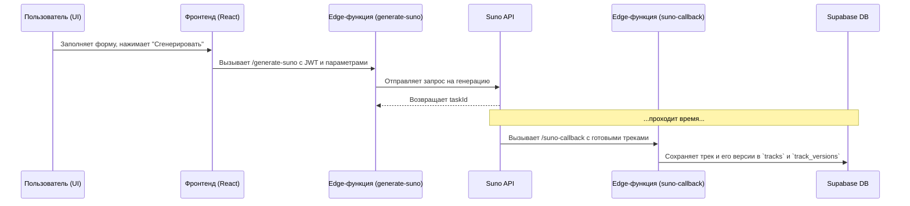
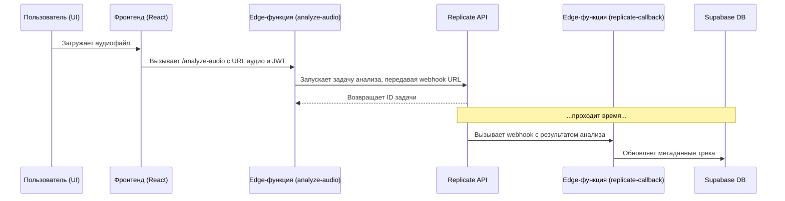

# 🏗️ Архитектура: Albert3 Muse Synth Studio

**Версия документа:** 3.0.1 (Аудит от 03.11.2025, обновлено)
**Статус:** Актуально

---

## 1. Обзор системы

Albert3 Muse Synth Studio — это **Single Page Application (SPA)**, построенное на **React**, которое взаимодействует с бэкендом на платформе **Supabase (Backend-as-a-Service)**.

Эта архитектура позволяет отделить фронтенд (вся логика отображения и взаимодействия с пользователем) от бэкенда (управление данными, аутентификация, интеграции с AI-сервисами).

### Архитектурная схема

```mermaid
graph TB
    subgraph "Frontend Layer (React + Vite)"
        A[UI Components (shadcn/ui)]
        B[State Management (React Query + Zustand)]
        C[Routing (React Router)]
    end

    subgraph "Backend Layer (Supabase)"
        F[Edge Functions (Deno)]
        G[Database (PostgreSQL + RLS)]
        H[Authentication (JWT)]
        I[Storage]
    end

    subgraph "External AI Providers"
        K[Suno AI API]
        L[Replicate.com API]
    end

    A & C --> B
    B --> F
    F --> K
    F --> L
    F --> G
    F --> I
    G --> H

    style A fill:#61DAFB,stroke:#333,stroke-width:2px
    style F fill:#3ECF8E,stroke:#333,stroke-width:2px
    style K fill:#FF6F61,stroke:#333,stroke-width:2px
    style L fill:#9B59B6,stroke:#333,stroke-width:2px
```

## 2. Технологический стек

| Слой | Технология | Назначение |
| :--- | :--- | :--- |
| **Frontend** | React, TypeScript, Vite | UI, типизация и сборка |
| **UI** | Tailwind CSS, shadcn/ui, Radix UI | Стилизация и UI-компоненты |
| **Состояние** | TanStack Query, Zustand | Управление серверным и клиентским состоянием |
| **Бэкенд** | Supabase | BaaS (база данных, аутентификация, хранилище) |
| **Edge Functions**| Deno | Среда выполнения для серверной логики |
| **AI-сервисы** | Suno, Replicate | Генерация музыки и анализ аудио |

## 3. Архитектура Фронтенда

Исходный код фронтенда находится в директории `src/` и имеет модульную структуру.

-   **`pages/`**: Компоненты-страницы, соответствующие роутам в приложении.
-   **`components/`**: Переиспользуемые React-компоненты.
-   **`hooks/`**: Кастомные хуки, инкапсулирующие бизнес-логику.
-   **`services/`**: Модули для инкапсуляции вызовов API.
-   **`stores/`**: Хранилища состояния Zustand.

## 4. Архитектура Бэкенда (Supabase Edge Functions)

Вся серверная логика и интеграции с внешними API реализованы в виде **Edge-функций** в директории `supabase/functions/`.

-   **`_shared/`**: Общий код, переиспользуемый между функциями.
-   **`generate-suno/`**: Функция для запуска генерации музыки через Suno API.
-   **`suno-callback/`**: Функция-вебхук для получения готовых треков от Suno.
-   **`analyze-audio/`**: Функция для анализа аудио через Replicate.com (в процессе миграции).

## 5. Потоки данных (Data Flows)

### Генерация трека (Suno)

Это асинхронный процесс, использующий callback для получения результата.



### Анализ аудио (Replicate) - Целевая схема

Это будет асинхронный процесс с вебхуком для получения результата.



## 6. Система версионирования треков

-   **Таблица `tracks`**: Хранит основную информацию о треке.
-   **Таблица `track_versions`**: Хранит конкретные версии (варианты) трека.
-   **Процесс создания**: `suno-callback` получает от Suno API несколько вариантов трека и создаёт для каждого запись в `track_versions`.
-   **Процесс получения**: Фронтенд использует хук `useTrackVersions` для загрузки всех доступных версий.
-   **Проблема**: **Обнаружен баг**, из-за которого на фронтенде отображается только одна версия. Требует немедленного исправления.
