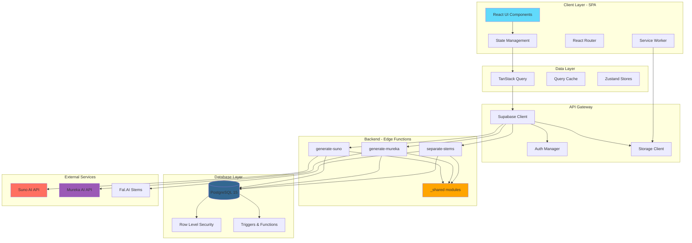
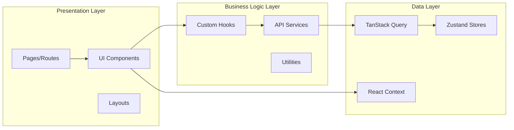
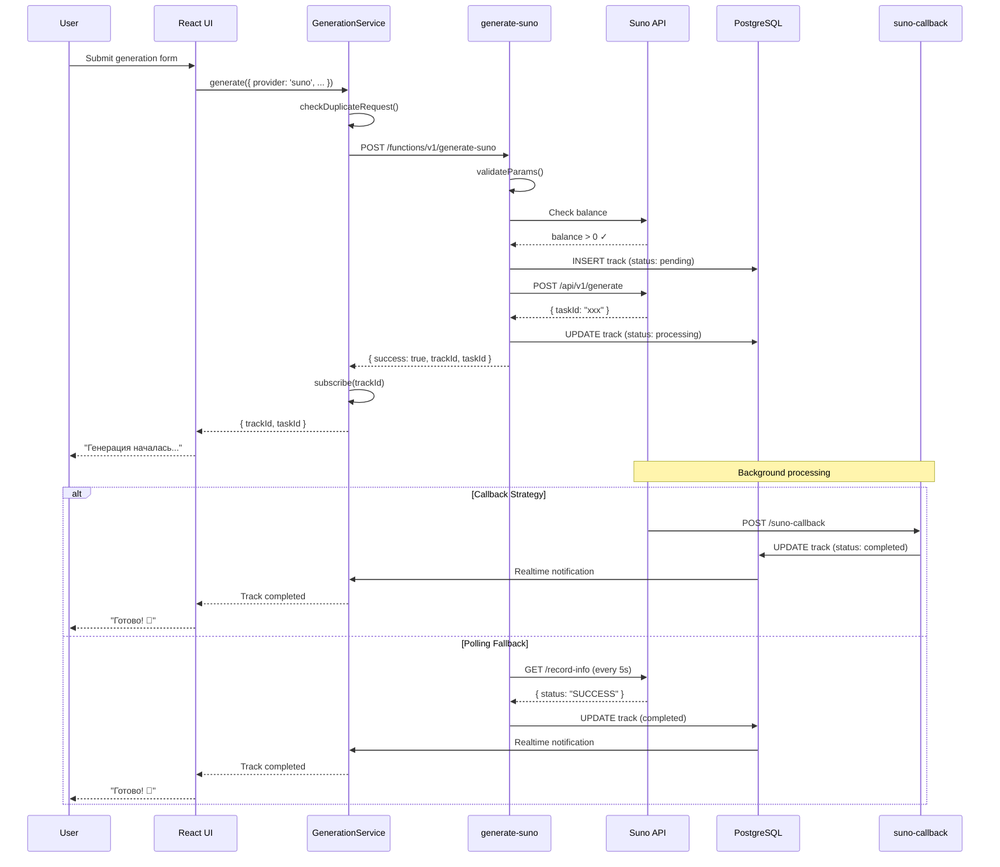

# 🏗️ Архитектура Albert3 Muse Synth Studio

> **Версия:** 2.4.0  
> **Последнее обновление:** 2025-11-02  
> **Статус:** Production Ready

---

## 📋 Содержание

1. [Обзор системы](#обзор-системы)
2. [Архитектурные принципы](#архитектурные-принципы)
3. [Компоненты системы](#компоненты-системы)
4. [Потоки данных](#потоки-данных)
5. [Единые источники истины](#единые-источники-истины)
6. [Защищенные компоненты](#защищенные-компоненты)
7. [Масштабирование](#масштабирование)

---

## Обзор системы

### Архитектурная схема



### Технологический стек

| Слой | Технология | Версия | Назначение |
|------|-----------|--------|-----------|
| **Frontend** | React | 18.3.1 | UI Framework |
| | TypeScript | 5.0 | Type Safety |
| | Vite | 5.0 | Build Tool |
| | TailwindCSS | 3.4 | Styling |
| | shadcn/ui | latest | UI Components |
| **State Management** | TanStack Query | 5.90.2 | Server State |
| | Zustand | 5.0.8 | Client State |
| **Backend** | Supabase | 2.58.0 | BaaS Platform |
| | PostgreSQL | 15 | Database |
| | Deno | latest | Edge Runtime |
| **AI Providers** | Suno AI | v1 | Music Generation |
| | Mureka AI | v1 | Music Analysis |
| | Fal.AI | latest | Stem Separation |

---

## Архитектурные принципы

### 1. Single Source of Truth (SSOT)

Все критичные типы и конфигурации хранятся в **единых источниках истины**:

```typescript
// ✅ SSOT для типов провайдеров
// src/types/providers.ts
export type MusicProvider = 'suno' | 'mureka';
export type SunoModel = 'V5' | 'V4_5PLUS' | 'V4_5' | 'V4' | 'V3_5';
export type MurekaModel = 'auto' | 'mureka-6' | 'mureka-7.5' | 'mureka-o1';

// ✅ SSOT для конфигурации моделей
// src/config/provider-models.ts
export const SUNO_MODELS = [
  { value: 'V5', label: 'V5 (Latest)', isDefault: true },
  { value: 'V4_5PLUS', label: 'V4.5+' },
  // ...
] as const;

// ❌ НЕ ДЕЛАТЬ: дублирование типов в разных файлах
```

### 2. Domain-Driven Design (DDD)

Организация кода по доменным областям:

```
src/
├── features/               # Доменные фичи
│   ├── tracks/            # Домен: Треки
│   │   ├── api/          # API слой
│   │   ├── components/   # UI компоненты
│   │   ├── hooks/        # React hooks
│   │   └── types/        # Типы домена
│   ├── projects/         # Домен: Проекты
│   └── analytics/        # Домен: Аналитика
└── shared/               # Общие утилиты
```

### 3. Separation of Concerns

Четкое разделение ответственности:

```typescript
// ✅ Правильно: API логика отделена от UI
// src/features/tracks/api/trackOperations.ts
export const createTrack = async (params: CreateTrackParams) => {
  return supabase.from('tracks').insert(params);
};

// src/features/tracks/hooks/useTracks.ts
export const useTracks = () => {
  const { data } = useQuery({
    queryKey: ['tracks'],
    queryFn: () => createTrack(/* ... */)
  });
};

// src/features/tracks/components/TrackCard.tsx
export const TrackCard = ({ trackId }) => {
  const { data: track } = useTracks();
  // только UI логика
};
```

### 4. Defense in Depth Security

Многоуровневая защита:

```
Layer 1: Frontend Validation (зod schemas)
Layer 2: Edge Function Validation (runtime checks)
Layer 3: Database RLS Policies (SQL-level)
Layer 4: JWT Authentication (Supabase Auth)
Layer 5: Rate Limiting (per-user, per-IP)
```

---

## Компоненты системы

### Frontend Architecture



### Backend Architecture (Edge Functions)

#### 🔒 Защищенные модули (_shared)

**Критически важные файлы, требующие code review перед изменением:**

##### 1. Suno API Client

**Файл:** `supabase/functions/_shared/suno.ts` (1066 строк)

```typescript
/**
 * 🔒 PROTECTED FILE - Suno AI Integration
 * 
 * CRITICAL: This file is protected and requires code review before modification.
 * See .github/CODEOWNERS for approval process.
 * 
 * @module suno
 * @version 3.0.0
 * @protected
 */

export interface CreateSunoClientOptions {
  apiKey: string;
  timeout?: number;
}

export class SunoApiError extends Error {
  constructor(message: string, public details?: any) {
    super(message);
    this.name = "SunoApiError";
  }
}

// Circuit Breaker для надежности
const SUNO_ENDPOINTS = {
  generate: [
    "https://api.sunoapi.org/api/v1/generate",
    "https://api.sunoapi.org/api/v2/generate", // fallback
  ],
  query: [
    "https://api.sunoapi.org/api/v1/generate/record-info",
  ],
  stems: [
    "https://api.sunoapi.org/api/v1/vocal-removal/generate",
  ],
} as const;

export const createSunoClient = (options: CreateSunoClientOptions) => {
  // Implementation with retry logic, circuit breaker
};
```

**Ключевые методы:**
- `generateTrack()` - генерация музыки
- `queryTask()` - проверка статуса
- `generateLyrics()` - генерация текстов
- `requestStemSeparation()` - разделение на стемы
- `extendTrack()` - продление треков
- `createCover()` - кавер-версии

**Circuit Breaker Pattern:**
```typescript
// Exponential backoff: 1s → 2s → 4s → 8s
// Max retries: 3
// Fallback endpoints при сбое основного
```

---

## Потоки данных

### Поток генерации музыки (Suno)



---

## Единые источники истины

### 1. Provider Types (`src/types/providers.ts`)

```typescript
/**
 * 🔒 SINGLE SOURCE OF TRUTH - Provider Types
 * 
 * All provider-related types MUST be imported from here.
 * Do NOT duplicate these types in other files.
 * 
 * @module types/providers
 * @version 3.1.0
 * @protected
 */

// Re-export from config (single source)
export type { MusicProvider } from '@/config/provider-models';

// Provider-specific models
export type SunoModel = 'V5' | 'V4_5PLUS' | 'V4_5' | 'V4' | 'V3_5';
export type MurekaModel = 'auto' | 'mureka-6' | 'mureka-7.5' | 'mureka-o1';

// Track statuses
export type TrackStatus = 'pending' | 'preparing' | 'processing' | 'completed' | 'failed';

// Stem types
export type StemType = 
  | 'vocals' 
  | 'instrumental' 
  | 'drums' 
  | 'bass' 
  | 'guitar' 
  | 'keyboard'
  | 'percussion' 
  | 'strings' 
  | 'synth' 
  | 'fx' 
  | 'brass' 
  | 'woodwinds' 
  | 'backing_vocals';

export type SeparationMode = 'separate_vocal' | 'split_stem';
```

### 2. Provider Models Config (`src/config/provider-models.ts`)

```typescript
/**
 * 🔒 SINGLE SOURCE OF TRUTH - Provider Models Configuration
 * 
 * @module config/provider-models
 * @version 2.0.0
 * @protected
 */

export type MusicProvider = 'suno' | 'mureka';

export const SUNO_MODELS = [
  { value: 'V5', label: 'V5 (Latest)', description: 'Best quality', isDefault: true },
  { value: 'V4_5PLUS', label: 'V4.5+', description: 'High quality' },
  { value: 'V4_5', label: 'V4.5', description: 'Balanced' },
  { value: 'V4', label: 'V4', description: 'Fast' },
  { value: 'V3_5', label: 'V3.5', description: 'Legacy' },
] as const;

export const MUREKA_MODELS = [
  { value: 'auto', label: 'Auto', description: 'Automatic selection', isDefault: true },
  { value: 'mureka-o1', label: 'Mureka O1', description: 'Latest model' },
  { value: 'mureka-7.5', label: 'Mureka 7.5', description: 'Balanced' },
  { value: 'mureka-6', label: 'Mureka 6', description: 'Fast' },
] as const;

export const getDefaultModel = (provider: MusicProvider) => {
  const models = provider === 'suno' ? SUNO_MODELS : MUREKA_MODELS;
  return models.find(m => m.isDefault) || models[0];
};
```

---

## Защищенные компоненты

### CODEOWNERS Configuration

```
# .github/CODEOWNERS

# 🔒 Protected Files - Require Review

# AI Provider Integrations
/supabase/functions/_shared/suno.ts @owner @tech-lead
/supabase/functions/_shared/mureka.ts @owner @tech-lead
/supabase/functions/_shared/generation-handler.ts @owner @tech-lead

# Generation Logic
/supabase/functions/generate-suno/ @owner @tech-lead
/supabase/functions/generate-mureka/ @owner @tech-lead

# Core Types
/src/types/providers.ts @owner @tech-lead
/src/config/provider-models.ts @owner @tech-lead

# Database Schema
/supabase/migrations/ @owner @database-admin

# Security
/supabase/functions/_shared/security.ts @owner @security-team
```

### Protected Files List

| Файл | Причина защиты | Reviewers |
|------|----------------|-----------|
| `_shared/suno.ts` | Критичная интеграция Suno API (1066 строк) | @owner, @tech-lead |
| `_shared/mureka.ts` | Критичная интеграция Mureka API (1000+ строк) | @owner, @tech-lead |
| `_shared/generation-handler.ts` | Базовая логика генераций | @owner, @tech-lead |
| `generate-suno/` | Suno generation logic | @owner, @tech-lead |
| `generate-mureka/` | Mureka generation logic | @owner, @tech-lead |
| `types/providers.ts` | Single source of truth для типов | @owner, @tech-lead |
| `config/provider-models.ts` | Single source of truth для моделей | @owner, @tech-lead |
| `migrations/` | Database schema changes | @owner, @database-admin |

---

## Масштабирование

### Performance Optimizations

#### 1. Code Splitting

```typescript
// Lazy loading компонентов
export const LazyTrackCard = lazy(() => 
  import('@/features/tracks/components/TrackCard')
);

export const LazyGlobalAudioPlayer = lazy(() => 
  import('./player/GlobalAudioPlayer')
);

// Preloading on hover
export const preloadDetailPanel = () => 
  import('@/features/tracks/ui/DetailPanel');
```

**Результаты:**
- Initial bundle: 520 KB → **254 KB** (-51%)
- TTI: 3.2s → **1.5s** (-53%)

#### 2. Virtualization

```typescript
import { useVirtualizer } from '@tanstack/react-virtual';

const virtualizer = useVirtualizer({
  count: tracks.length,
  getScrollElement: () => parentRef.current,
  estimateSize: () => 150,
  overscan: 5,
});
```

**Результаты:**
- 1000 треков: 2500ms → **75ms** (-97%)
- Memory: 450 MB → **120 MB** (-73%)

---

## Заключение

Архитектура Albert3 Muse Synth Studio построена на принципах:
- ✅ **Single Source of Truth** — единые источники истины для типов и конфигураций
- ✅ **Separation of Concerns** — четкое разделение ответственности
- ✅ **Defense in Depth** — многоуровневая защита
- ✅ **Performance First** — оптимизация на всех уровнях
- ✅ **Scalability** — готовность к горизонтальному масштабированию

**Защищенные компоненты** требуют code review для предотвращения случайных поломок критичной функциональности.

---

**Версия документа:** 2.4.0  
**Последнее обновление:** 2025-11-02  
**Автор:** Albert3 Team
