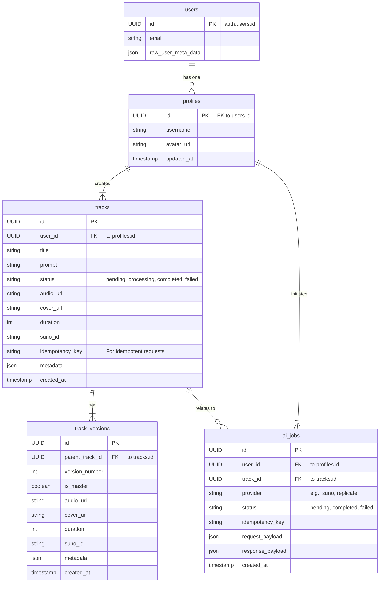

# 🏗️ Архитектура Albert3 Muse Synth Studio

В этом документе представлен обзор архитектуры приложения, включая фронтенд, бэкенд и взаимодействие между ними.

## Диаграмма архитектуры системы

Эта диаграмма показывает высокоуровневую структуру проекта, включая основные компоненты и их взаимодействие.

```mermaid
graph TD
    subgraph "Пользовательский интерфейс (Frontend)"
        A[React App (Vite + TS)]
        B[UI Components (shadcn/ui)]
        C[State Management (Zustand, React Query)]
        D[Audio Player]
        E[Service Worker (Offline/Caching)]
    end

    subgraph "Инфраструктура Supabase (Backend)"
        F[Supabase Client]
        G[Edge Functions (Deno)]
        H[Authentication]
        I[Database (PostgreSQL)]
        J[Storage]
        K[Realtime]
    end

    subgraph "Внешние API"
        L[Suno API]
    end

    A --> F
    F --> H
    F --> I
    F --> J
    F --> G
    F --> K

    G --> L
    G --> I
    G --> J

    D --> E
    E --> J

    style A fill:#61DAFB,stroke:#333,stroke-width:2px
    style L fill:#FF6F61,stroke:#333,stroke-width:2px
    style F fill:#3ECF8E,stroke:#333,stroke-width:2px
```

## Схема модели данных

Эта диаграмма описывает структуру базы данных, основные таблицы и их связи.

