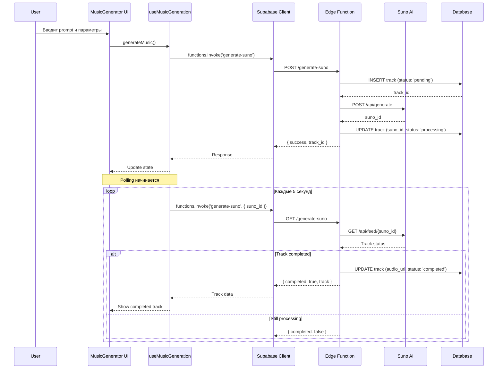
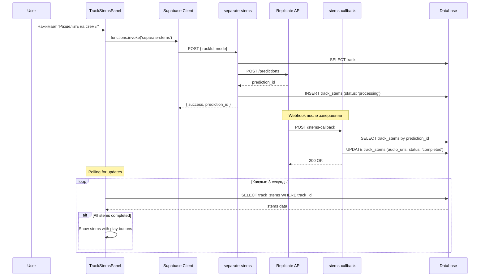
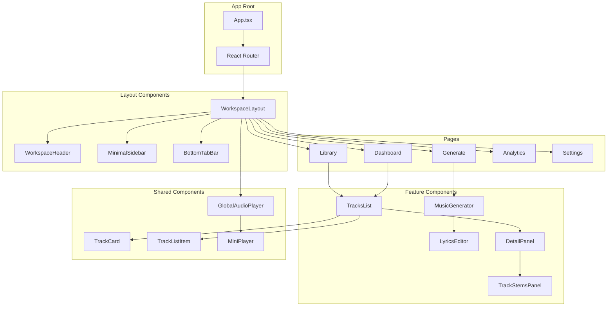
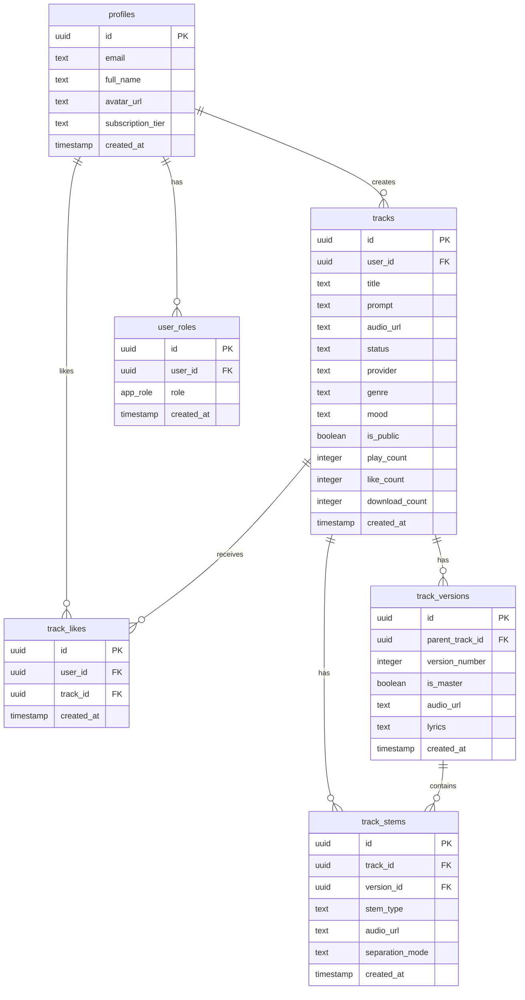
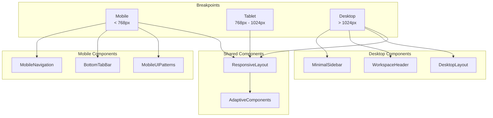

# 🏗️ Архитектурные диаграммы Albert3 Muse Synth Studio

## 📊 Обзор архитектуры системы

### Общая архитектура приложения

```mermaid
graph TB
    subgraph "Frontend Layer"
        UI[React UI Components]
        State[State Management<br/>TanStack Query + Context]
        Router[React Router]
        Player[Audio Player System]
        SW[Service Worker]
    end
    
    subgraph "Caching & Optimization"
        AC[Audio Cache<br/>IndexedDB]
        QC[Query Cache<br/>TanStack Query]
        SC[Static Cache<br/>Service Worker]
    end
    
    subgraph "API Layer"
        SC1[Supabase Client]
        Auth[Authentication]
        DB[PostgreSQL Database]
        Storage[File Storage]
        EF[Edge Functions]
    end
    
    subgraph "AI Services"
        Suno[Suno AI<br/>Music Generation]
        Lovable[Lovable AI<br/>Lyrics & Prompts]
        Replicate[Replicate<br/>Stem Separation]
    end
    
    UI --> State
    UI --> Router
    UI --> Player
    Player --> SW
    State --> SC1
    SC1 --> Auth
    SC1 --> DB
    SC1 --> Storage
    SC1 --> EF
    
    EF --> Suno
    EF --> Lovable
    EF --> Replicate
    
    SW --> AC
    State --> QC
    SW --> SC
    
    style Frontend Layer fill:#e1f5ff
    style "Caching & Optimization" fill:#fff4e1
    style "API Layer" fill:#e8f5e9
    style "AI Services" fill:#f3e5f5
```

---

## 🔄 Потоки данных

### 1. Процесс генерации музыки

```mermaid
sequenceDiagram
    participant User
    participant UI as MusicGenerator UI
    participant Hook as useMusicGeneration
    participant API as Supabase Client
    participant EF as Edge Function
    participant Suno as Suno AI
    participant DB as Database
    
    User->>UI: Вводит prompt и параметры
    UI->>Hook: generateMusic()
    Hook->>API: functions.invoke('generate-suno')
    API->>EF: POST /generate-suno
    
    EF->>DB: INSERT track (status: 'pending')
    DB-->>EF: track_id
    EF->>Suno: POST /api/generate
    Suno-->>EF: suno_id
    EF->>DB: UPDATE track (suno_id, status: 'processing')
    EF-->>API: { success, track_id }
    API-->>Hook: Response
    Hook-->>UI: Update state
    
    Note over UI,Hook: Polling начинается
    
    loop Каждые 5 секунд
        Hook->>API: functions.invoke('generate-suno', { suno_id })
        API->>EF: GET /generate-suno
        EF->>Suno: GET /api/feed/{suno_id}
        Suno-->>EF: Track status
        
        alt Track completed
            EF->>DB: UPDATE track (audio_url, status: 'completed')
            EF-->>API: { completed: true, track }
            API-->>Hook: Track data
            Hook-->>UI: Show completed track
        else Still processing
            EF-->>API: { completed: false }
        end
    end
```

---

### 2. Аудио плеер и воспроизведение

```mermaid
graph TB
    subgraph "Audio Player Context"
        APC[AudioPlayerContext]
        Queue[Play Queue]
        Audio[HTML5 Audio Element]
        MediaSession[Media Session API]
    end
    
    subgraph "UI Components"
        GP[GlobalAudioPlayer]
        MP[MiniPlayer]
        FP[FullScreenPlayer]
        TC[TrackCard]
        TL[TrackList]
    end
    
    subgraph "Caching"
        SW[Service Worker]
        Cache[Audio Cache]
    end
    
    TC -->|playTrack()| APC
    TL -->|playTrack()| APC
    
    APC --> Queue
    APC --> Audio
    APC --> MediaSession
    
    GP -->|useAudioPlayer()| APC
    MP -->|useAudioPlayer()| APC
    FP -->|useAudioPlayer()| APC
    
    Audio -->|fetch audio| SW
    SW -->|cache hit/miss| Cache
    Cache -->|cached audio| Audio
    
    MediaSession -->|OS controls| Audio
```

---

### 3. Система разделения на стемы

```mermaid
sequenceDiagram
    participant User
    participant UI as TrackStemsPanel
    participant API as Supabase Client
    participant EF as separate-stems
    participant Replicate as Replicate API
    participant Callback as stems-callback
    participant DB as Database
    
    User->>UI: Нажимает "Разделить на стемы"
    UI->>API: functions.invoke('separate-stems')
    API->>EF: POST {trackId, mode}
    
    EF->>DB: SELECT track
    EF->>Replicate: POST /predictions
    Replicate-->>EF: prediction_id
    EF->>DB: INSERT track_stems (status: 'processing')
    EF-->>API: { success, prediction_id }
    
    Note over Replicate,Callback: Webhook после завершения
    
    Replicate->>Callback: POST /stems-callback
    Callback->>DB: SELECT track_stems by prediction_id
    Callback->>DB: UPDATE track_stems (audio_urls, status: 'completed')
    Callback-->>Replicate: 200 OK
    
    Note over UI: Polling for updates
    
    loop Каждые 3 секунды
        UI->>DB: SELECT track_stems WHERE track_id
        DB-->>UI: stems data
        
        alt All stems completed
            UI->>UI: Show stems with play buttons
        end
    end
```

---

## 🎨 Архитектура компонентов

### Структура UI компонентов

```mermaid
graph TB
    subgraph "App Root"
        App[App.tsx]
        Router[React Router]
    end
    
    subgraph "Layout Components"
        WL[WorkspaceLayout]
        Header[WorkspaceHeader]
        Sidebar[MinimalSidebar]
        Bottom[BottomTabBar]
    end
    
    subgraph "Pages"
        Dashboard[Dashboard]
        Generate[Generate]
        Library[Library]
        Analytics[Analytics]
        Settings[Settings]
    end
    
    subgraph "Feature Components"
        MG[MusicGenerator]
        LE[LyricsEditor]
        TL[TracksList]
        DP[DetailPanel]
        TSP[TrackStemsPanel]
    end
    
    subgraph "Shared Components"
        TC[TrackCard]
        TLI[TrackListItem]
        Player[GlobalAudioPlayer]
        MP[MiniPlayer]
    end
    
    App --> Router
    Router --> WL
    
    WL --> Header
    WL --> Sidebar
    WL --> Bottom
    WL --> Dashboard
    WL --> Generate
    WL --> Library
    WL --> Analytics
    WL --> Settings
    
    Generate --> MG
    MG --> LE
    
    Library --> TL
    TL --> TC
    TL --> DP
    
    DP --> TSP
    
    Dashboard --> TL
    TL --> TLI
    
    WL --> Player
    Player --> MP
```

---

## 📦 Структура данных

### Database Schema

```mermaid
erDiagram
    profiles ||--o{ tracks : creates
    profiles ||--o{ track_likes : likes
    profiles ||--o{ user_roles : has
    
    tracks ||--o{ track_versions : has
    tracks ||--o{ track_stems : has
    tracks ||--o{ track_likes : receives
    
    track_versions ||--o{ track_stems : contains
    
    profiles {
        uuid id PK
        text email
        text full_name
        text avatar_url
        text subscription_tier
        timestamp created_at
    }
    
    tracks {
        uuid id PK
        uuid user_id FK
        text title
        text prompt
        text audio_url
        text status
        text provider
        text genre
        text mood
        boolean is_public
        integer play_count
        integer like_count
        integer download_count
        timestamp created_at
    }
    
    track_versions {
        uuid id PK
        uuid parent_track_id FK
        integer version_number
        boolean is_master
        text audio_url
        text lyrics
        timestamp created_at
    }
    
    track_stems {
        uuid id PK
        uuid track_id FK
        uuid version_id FK
        text stem_type
        text audio_url
        text separation_mode
        timestamp created_at
    }
    
    track_likes {
        uuid id PK
        uuid user_id FK
        uuid track_id FK
        timestamp created_at
    }
    
    user_roles {
        uuid id PK
        uuid user_id FK
        app_role role
        timestamp created_at
    }
```

---

## 🔒 Безопасность и RLS

### Row Level Security Policies

```mermaid
graph TB
    subgraph "Public Access"
        PA1[Public tracks viewable by all]
        PA2[Public track likes viewable]
        PA3[Public stems viewable]
    end
    
    subgraph "Authenticated Users"
        AU1[View own tracks]
        AU2[Create own tracks]
        AU3[Update own tracks]
        AU4[Delete own tracks]
        AU5[Like/Unlike tracks]
        AU6[View own profile]
        AU7[Update own profile]
    end
    
    subgraph "Admin Role"
        AD1[View all tracks]
        AD2[Update any track]
        AD3[Delete any track]
        AD4[Manage user roles]
    end
    
    style "Public Access" fill:#e8f5e9
    style "Authenticated Users" fill:#fff3e0
    style "Admin Role" fill:#fce4ec
```

---

## 🔄 State Management

### State Flow

```mermaid
graph TB
    subgraph "Global State"
        APC[AudioPlayerContext<br/>Current track, queue, playback]
        ThemeContext[ThemeContext<br/>Dark/Light mode]
    end
    
    subgraph "Server State - TanStack Query"
        Tracks[Tracks Query<br/>useTracks()]
        User[User Query<br/>useUser()]
        Likes[Likes Query<br/>useTrackLike()]
    end
    
    subgraph "Local State"
        Forms[Form State<br/>useState, useReducer]
        UI[UI State<br/>Modals, Dropdowns]
    end
    
    subgraph "Components"
        C1[Component A]
        C2[Component B]
        C3[Component C]
    end
    
    C1 -->|useContext| APC
    C2 -->|useContext| ThemeContext
    C3 -->|useQuery| Tracks
    C1 -->|useQuery| User
    C2 -->|useMutation| Likes
    C3 -->|useState| Forms
    C1 -->|useState| UI
```

---

## 📱 Адаптивная архитектура

### Responsive Design System

```mermaid
graph TB
    subgraph "Breakpoints"
        Mobile[Mobile<br/>< 768px]
        Tablet[Tablet<br/>768px - 1024px]
        Desktop[Desktop<br/>> 1024px]
    end
    
    subgraph "Mobile Components"
        BTB[BottomTabBar]
        MobileNav[MobileNavigation]
        MobileUI[MobileUIPatterns]
    end
    
    subgraph "Desktop Components"
        Sidebar[MinimalSidebar]
        Header[WorkspaceHeader]
        DesktopLayout[DesktopLayout]
    end
    
    subgraph "Shared Components"
        Responsive[ResponsiveLayout]
        Adaptive[AdaptiveComponents]
    end
    
    Mobile --> MobileNav
    Mobile --> BTB
    Mobile --> MobileUI
    
    Desktop --> Sidebar
    Desktop --> Header
    Desktop --> DesktopLayout
    
    Tablet --> Responsive
    Mobile --> Responsive
    Desktop --> Responsive
    
    Responsive --> Adaptive
```

---

## ⚡ Оптимизация производительности

### Performance Strategy

```mermaid
graph TB
    subgraph "Code Optimization"
        Memo[React.memo<br/>Component Memoization]
        Lazy[React.lazy<br/>Code Splitting]
        Callback[useCallback<br/>Function Memoization]
        UseMemo[useMemo<br/>Value Memoization]
    end
    
    subgraph "Caching Strategy"
        SWCache[Service Worker Cache<br/>Audio files]
        QueryCache[TanStack Query Cache<br/>API responses]
        LocalStorage[LocalStorage<br/>User preferences]
    end
    
    subgraph "Loading Optimization"
        VirtualList[VirtualizedList<br/>Large datasets]
        IntersectionObs[Intersection Observer<br/>Lazy loading]
        Skeleton[Skeleton Loaders<br/>UX improvement]
    end
    
    subgraph "Bundle Optimization"
        TreeShaking[Tree Shaking<br/>Remove unused code]
        Minification[Minification<br/>Reduce file size]
        Compression[Gzip/Brotli<br/>Network optimization]
    end
    
    style "Code Optimization" fill:#e3f2fd
    style "Caching Strategy" fill:#f3e5f5
    style "Loading Optimization" fill:#e8f5e9
    style "Bundle Optimization" fill:#fff3e0
```

---

## 🚀 Deployment Architecture

### Deployment Flow

```mermaid
graph LR
    subgraph "Development"
        Dev[Local Dev<br/>npm run dev]
        Git[Git Commit]
    end
    
    subgraph "CI/CD"
        GH[GitHub Actions]
        Build[Build Process<br/>npm run build]
        Test[Run Tests<br/>Vitest, Playwright]
    end
    
    subgraph "Production"
        Lovable[Lovable Hosting]
        CDN[CDN Distribution]
        Monitor[Monitoring<br/>Analytics]
    end
    
    subgraph "Backend"
        Supabase[Supabase<br/>Database + Functions]
        Storage[Supabase Storage<br/>Audio files]
    end
    
    Dev --> Git
    Git --> GH
    GH --> Build
    Build --> Test
    Test --> Lovable
    Lovable --> CDN
    CDN --> Monitor
    
    Lovable <--> Supabase
    Lovable <--> Storage
    
    style Development fill:#e8f5e9
    style "CI/CD" fill:#fff3e0
    style Production fill:#e3f2fd
    style Backend fill:#f3e5f5
```

---

## 🔌 API Integration

### Edge Functions Architecture

```mermaid
graph TB
    subgraph "Client Side"
        App[React App]
    end
    
    subgraph "Supabase Edge Functions"
        GM[generate-music]
        GL[generate-lyrics]
        IP[improve-prompt]
        SS[suggest-styles]
        SepStems[separate-stems]
        SC[stems-callback]
        IL[improve-lyrics<br/>НОВАЯ - Sprint 19]
    end
    
    subgraph "External AI APIs"
        Suno[Suno AI]
        Lovable[Lovable AI Gateway]
        Replicate[Replicate]
    end
    
    App -->|invoke| GM
    App -->|invoke| GL
    App -->|invoke| IP
    App -->|invoke| SS
    App -->|invoke| SepStems
    App -->|invoke| IL
    
    GM --> Suno
    GL --> Lovable
    IP --> Lovable
    SS --> Lovable
    IL --> Lovable
    SepStems --> Replicate
    
    Replicate -->|webhook| SC
    
    style "Client Side" fill:#e3f2fd
    style "Supabase Edge Functions" fill:#fff3e0
    style "External AI APIs" fill:#f3e5f5
```

---

## 📊 Мониторинг и аналитика

### Monitoring Stack

```mermaid
graph TB
    subgraph "User Interactions"
        UI[User Actions]
        Events[Event Tracking]
    end
    
    subgraph "Performance Metrics"
        WebVitals[Web Vitals<br/>FCP, LCP, FID, CLS]
        Custom[Custom Metrics<br/>API latency, errors]
    end
    
    subgraph "Error Tracking"
        ErrorBoundary[Error Boundaries]
        Logger[Logger System]
        Console[Console Logging]
    end
    
    subgraph "Analytics Platform"
        Supabase[Supabase Analytics]
        Dashboard[Analytics Dashboard]
    end
    
    UI --> Events
    Events --> Supabase
    
    WebVitals --> Supabase
    Custom --> Supabase
    
    ErrorBoundary --> Logger
    Logger --> Supabase
    Console --> Logger
    
    Supabase --> Dashboard
    
    style "User Interactions" fill:#e8f5e9
    style "Performance Metrics" fill:#e3f2fd
    style "Error Tracking" fill:#fce4ec
    style "Analytics Platform" fill:#fff3e0
```

---

*Документ создан: Sprint 18*  
*Последнее обновление: Sprint 18*
