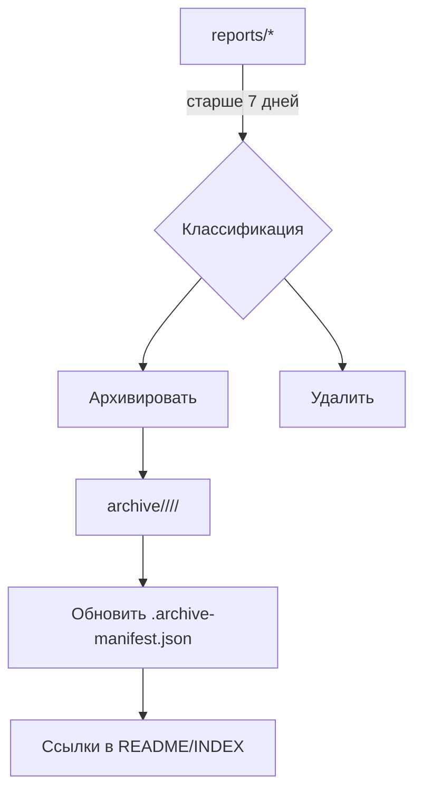

# 🗄️ Политика хранения и архивирования отчётов

Этот документ описывает критерии устаревания, правила перемещения материалов в архив и структуру хранения.

## 🎯 Цели
- Сократить шум в разделе `reports/` и ускорить навигацию
- Сохранить важные исторические артефакты с понятной категоризацией
- Минимизировать дубли и противоречия в документации

## 📆 Критерии устаревания
- **Оперативные отчёты** (ежедневные/еженедельные): актуальны **7 дней** с даты создания
- **Специальные отчёты** (аудит, миграции, релизы): актуальны до завершения инициативы, затем **архивируются**
- **Черновики/дубли/противоречивые документы**: **удаляются** после ревизии

## 🔁 Процесс
1. Выявить материалы старше 7 дней в `reports/*`
2. Разделить на два типа: «архивировать» и «удалить»
3. Переместить в `archive/<year>/<month>/<category>/` с корректным именованием
4. Обновить `archive/.archive-manifest.json` (дата, счётчик, список файлов)
5. В README и `docs/INDEX.md` добавить/обновить ссылки на архив и политику

## 🗂️ Структура архива
```
archive/
  2025/
    october/
      reports/
        2025-10-08-remote-audit.md
        2025-10-14-full-project-audit.md
      releases/
      migrations/
    november/
      reports/
```



## 🧭 Именование и категории
- Формат файла: `YYYY-MM-DD-title.md`
- Категории: `reports`, `releases`, `migrations`, `security`, `performance`, `ui`

## ✅ Контрольный список
- [x] Переместить устаревшие материалы
- [x] Обновить манифест архива
- [x] Обновить навигацию (README, INDEX)
- [ ] Провести повторную ревизию через 2 недели

## 📌 Примечания
- Папка `reports/` исключена из линтинга (`.eslintignore.workspace`) — это ожидаемо
- Храните только актуальные материалы в `reports/`, остальное — в `archive/`
