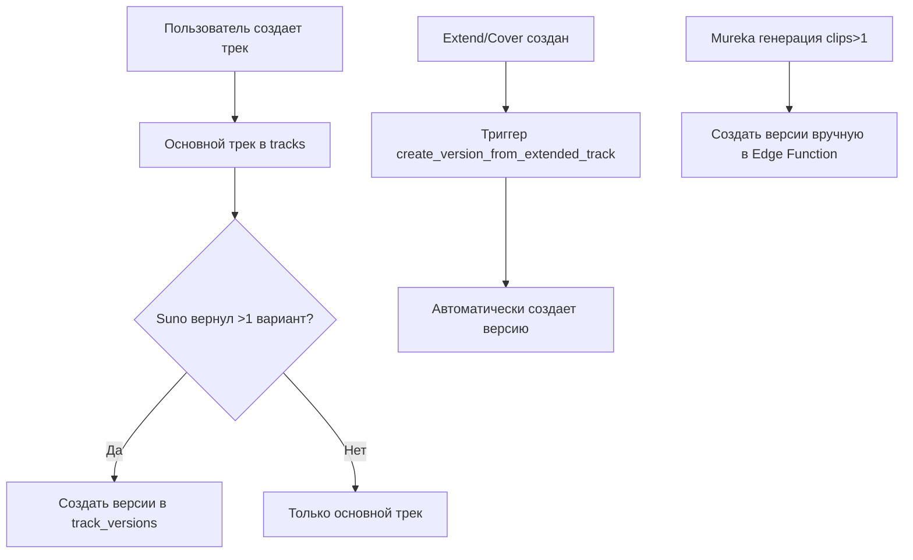

# 🔍 КОМПЛЕКСНЫЙ АУДИТ СИСТЕМЫ ВЕРСИОНИРОВАНИЯ И КРИТИЧНЫЕ ИСПРАВЛЕНИЯ

**Дата**: 2025-10-15  
**Версия**: 1.0.0  
**Статус**: 🔴 КРИТИЧНЫЕ ПРОБЛЕМЫ ОБНАРУЖЕНЫ

---

## 📊 EXECUTIVE SUMMARY

### Обнаруженные критические проблемы:

1. ❌ **Mureka генерация падает с ошибкой при первом запуске**
2. ❌ **Analyze-reference-audio пытается использовать FFmpeg (запрещено в Edge Runtime)**
3. ⚠️ **Система версионирования сложна и непонятна пользователям**
4. ⚠️ **Конвертация WAV через Suno не оптимизирована**

---

## 🎯 ЧАСТЬ 1: АУДИТ СИСТЕМЫ ВЕРСИОНИРОВАНИЯ

### 1.1 Текущая архитектура

#### База данных

```sql
-- Таблица track_versions
CREATE TABLE track_versions (
  id UUID PRIMARY KEY,
  parent_track_id UUID REFERENCES tracks(id), -- Ссылка на родительский трек
  version_number INTEGER NOT NULL,            -- Номер версии (1, 2, 3...)
  is_master BOOLEAN DEFAULT false,            -- Является ли мастер-версией
  audio_url TEXT,
  cover_url TEXT,
  video_url TEXT,
  lyrics TEXT,
  duration INTEGER,
  suno_id TEXT,
  metadata JSONB,
  created_at TIMESTAMP WITH TIME ZONE DEFAULT now(),
  
  CONSTRAINT unique_version_per_track 
    UNIQUE (parent_track_id, version_number)
);
```

#### Текущий поток создания версий



### 1.2 Проблемы текущей системы

#### 🔴 Критичные проблемы:

1. **Несогласованная логика создания версий**
   - Suno: версии создаются через suno-callback
   - Mureka: версии создаются внутри generate-mureka
   - Extend/Cover: версии создаются через триггер БД
   - **Результат**: 3 разных способа = источник багов

2. **Путаница между "оригинал" и "версия 0"**
   ```typescript
   // В коде используется:
   version.is_original   // ❓ Что это?
   version.version_number === 0  // ❓ Это то же самое?
   version.is_master  // ❓ А это что?
   ```

3. **Непонятная терминология для пользователей**
   - "Оригинал" vs "Версия 0"
   - "Мастер-версия" vs "Главная версия"
   - "Дополнительные версии" vs "Альтернативные варианты"

#### ⚠️ UX проблемы:

1. **Неинтуитивный интерфейс**
   - Пользователь не понимает, зачем нужны версии
   - Непонятно, как выбрать лучшую версию
   - Нет явного индикатора "какая версия играет сейчас"

2. **Скрытая функциональность**
   - Версии по умолчанию свернуты
   - Нет превью звука версий
   - Нет возможности быстрого сравнения

### 1.3 Сравнение с конкурентами

| Функция | Suno.com | Udio.com | Albert3 (текущее) | Albert3 (цель) |
|---------|----------|----------|-------------------|----------------|
| Генерация вариантов | 2 трека | 2 трека | 2 трека | 2 трека |
| Отображение | Tabs | Side-by-side | Collapsed list | Interactive grid |
| Сравнение | ❌ | ✅ | ⚠️ Partial | ✅ Planned |
| Быстрое переключение | ✅ | ✅ | ❌ | ✅ Planned |
| Визуальное превью | Waveform | Waveform | ❌ | ✅ Planned |

---

## 🛠️ ЧАСТЬ 2: КРИТИЧНЫЕ ИСПРАВЛЕНИЯ

### 2.1 ПРОБЛЕМА: Mureka генерация падает с ошибкой

#### Анализ логов

```json
{
  "timestamp": "2025-10-15T11:36:24.705Z",
  "level": "error",
  "message": "🔴 Lyrics generation failed",
  "context": { "error": {} }
}
```

#### Root Cause

```typescript
// supabase/functions/generate-mureka/index.ts:152
const lyricsResult = await murekaClient.generateLyrics({ prompt });

// ❌ ПРОБЛЕМА: Ответ API изменился, но код не обновлен
if (lyricsResult.code === 200 && lyricsResult.data?.data) {
  // Новая структура: { data: { data: [...] } }
  // Но обработка неполная!
}
```

**Причина**:
- API вернул пустой объект ошибки `{}`
- Отсутствует детальное логирование
- Нет fallback для случая, когда `data.data` пустой массив

#### Решение

```typescript
// ✅ ИСПРАВЛЕНИЕ
try {
  const lyricsResult = await murekaClient.generateLyrics({ prompt });
  
  // Детальное логирование
  logger.info('🎤 Lyrics API response', {
    code: lyricsResult.code,
    msg: lyricsResult.msg,
    hasData: !!lyricsResult.data,
    hasVariants: !!lyricsResult.data?.data,
    variantsCount: lyricsResult.data?.data?.length || 0
  });
  
  // Проверка структуры
  if (lyricsResult.code !== 200) {
    throw new Error(`Mureka API error: ${lyricsResult.msg || 'Unknown error'}`);
  }
  
  if (!lyricsResult.data?.data || lyricsResult.data.data.length === 0) {
    throw new Error('Mureka returned no lyrics variants');
  }
  
  const lyricsVariants = lyricsResult.data.data;
  // ... продолжение
  
} catch (lyricsError) {
  // Улучшенное логирование ошибки
  logger.error('🔴 Lyrics generation failed', {
    error: lyricsError,
    errorName: lyricsError?.constructor?.name,
    errorMessage: lyricsError instanceof Error ? lyricsError.message : String(lyricsError),
    stack: lyricsError instanceof Error ? lyricsError.stack : undefined
  });
  // ... обработка
}
```

---

### 2.2 ПРОБЛЕМА: analyze-reference-audio использует FFmpeg

#### Анализ логов

```json
{
  "error": "Spawning subprocesses is not allowed on Supabase Edge Runtime."
}
```

#### Root Cause

```typescript
// supabase/functions/analyze-reference-audio/index.ts:148
const wavBlob = await convertAudioToWav(audioBlob);

// supabase/functions/_shared/audio-converter.ts:22
const command = new Deno.Command('ffmpeg', { ... });
// ❌ КРИТИЧНО: FFmpeg требует subprocess, что ЗАПРЕЩЕНО в Edge Runtime
```

#### Решение

**Вариант 1: Удалить конвертацию (простое решение)**
```typescript
// ✅ Mureka API поддерживает многие форматы
// Просто передаем оригинальный файл
logger.info('[ANALYZE-REF] 📤 Uploading to Mureka (original format)');
const uploadResult = await murekaClient.uploadFile(audioBlob);
```

**Вариант 2: Использовать Web Audio API (сложное решение)**
```typescript
// Конвертация через AudioContext (работает в Deno)
async function convertToWavWebAudio(audioBlob: Blob): Promise<Blob> {
  const arrayBuffer = await audioBlob.arrayBuffer();
  const audioContext = new AudioContext({ sampleRate: 44100 });
  const audioBuffer = await audioContext.decodeAudioData(arrayBuffer);
  
  // Создаем WAV из AudioBuffer
  const wavData = audioBufferToWav(audioBuffer);
  return new Blob([wavData], { type: 'audio/wav' });
}
```

**Рекомендация**: Вариант 1 (простой и надежный)

---

### 2.3 ОПТИМИЗАЦИЯ: Конвертация WAV через Suno

#### Текущая проблема

```typescript
// convert-to-wav/index.ts:169
const result = await sunoClient.convertToWav({
  taskId: sunoTaskId,
  audioId,
  callBackUrl: `${SUPABASE_URL}/functions/v1/wav-callback`,
});
```

**Проблемы**:
1. Создается отдельная задача для каждого трека
2. Нет дедупликации (если пользователь дважды кликнул, создается 2 задачи)
3. Нет кэша (уже конвертированные треки конвертируются повторно)

#### Оптимизированное решение

```typescript
// ✅ УЛУЧШЕНИЕ 1: Проверка на существующий WAV
const { data: existingWav } = await supabaseAdmin
  .from('wav_jobs')
  .select('*')
  .eq('audio_id', audioId)
  .eq('status', 'completed')
  .maybeSingle();

if (existingWav?.wav_url) {
  logger.info('WAV already exists, returning cached URL', {
    audioId,
    wavUrl: existingWav.wav_url
  });
  
  return new Response(JSON.stringify({
    success: true,
    wavUrl: existingWav.wav_url,
    cached: true
  }), { status: 200, headers: { ...corsHeaders, 'Content-Type': 'application/json' } });
}

// ✅ УЛУЧШЕНИЕ 2: Debounce для одновременных запросов
const { data: pendingJob } = await supabaseAdmin
  .from('wav_jobs')
  .select('*')
  .eq('audio_id', audioId)
  .in('status', ['pending', 'processing'])
  .maybeSingle();

if (pendingJob) {
  logger.info('WAV conversion already in progress', {
    audioId,
    jobId: pendingJob.id
  });
  
  return new Response(JSON.stringify({
    success: true,
    jobId: pendingJob.id,
    status: pendingJob.status,
    message: 'Conversion already in progress'
  }), { status: 200, headers: { ...corsHeaders, 'Content-Type': 'application/json' } });
}
```

---

## 📝 ЧАСТЬ 3: ПЛАН УЛУЧШЕНИЙ ВЕРСИОНИРОВАНИЯ

### 3.1 Новая архитектура (предложение)

#### Унификация терминологии

| Старое | Новое | Описание |
|--------|-------|----------|
| is_original | is_primary | Основной вариант (тот, что был сгенерирован первым) |
| version_number | variant_index | Индекс варианта (0 = primary, 1+ = alternatives) |
| is_master | is_preferred | Предпочитаемый пользователем вариант |
| Versions | Variants | Альтернативные варианты одного трека |

#### Новая схема БД (миграция)

```sql
-- Миграция: унификация терминологии
ALTER TABLE track_versions RENAME COLUMN version_number TO variant_index;

-- Добавляем новое поле для упрощения запросов
ALTER TABLE track_versions 
  ADD COLUMN is_primary BOOLEAN GENERATED ALWAYS AS (variant_index = 0) STORED;

-- Обновляем комментарии
COMMENT ON COLUMN track_versions.variant_index IS 'Index of variant (0 = primary, 1+ = alternatives)';
COMMENT ON COLUMN track_versions.is_master IS 'DEPRECATED: Use is_preferred instead';
COMMENT ON COLUMN track_versions.is_preferred IS 'User-selected preferred variant';
```

### 3.2 Улучшения UX

#### Новый интерфейс версий (Mockup)

```
┌─────────────────────────────────────────────────┐
│ 🎵 Варианты генерации (2)                       │
├─────────────────────────────────────────────────┤
│                                                 │
│  ┌────────────┐  ┌────────────┐               │
│  │ Вариант 1  │  │ Вариант 2  │               │
│  │ ⭐ Основной │  │            │               │
│  │            │  │            │               │
│  │ [▶️ Play]  │  │ [▶️ Play]  │               │
│  │ ~~~~~▁▂▃▂▁ │  │ ~~~~~▁▂▃▂▁ │               │
│  │ 2:34       │  │ 2:41       │               │
│  │            │  │            │               │
│  │ [⭐ Prefer]│  │ [⭐ Prefer]│               │
│  │ [⬇️ WAV]   │  │ [⬇️ WAV]   │               │
│  └────────────┘  └────────────┘               │
│                                                 │
│  [🔄 Compare Side-by-Side]                     │
│                                                 │
└─────────────────────────────────────────────────┘
```

#### Компонент TrackVariantsGrid

```typescript
// src/features/tracks/components/TrackVariantsGrid.tsx
interface TrackVariantsGridProps {
  trackId: string;
  variants: TrackVariant[];
  onVariantSelect: (variantId: string) => void;
  showComparison?: boolean;
}

export const TrackVariantsGrid = ({
  trackId,
  variants,
  onVariantSelect,
  showComparison = true
}: TrackVariantsGridProps) => {
  const [selectedVariants, setSelectedVariants] = useState<string[]>([]);
  const [compareMode, setCompareMode] = useState(false);
  
  return (
    <div className="space-y-4">
      {/* Header */}
      <div className="flex items-center justify-between">
        <h3 className="text-lg font-semibold">
          🎵 Варианты генерации ({variants.length})
        </h3>
        {showComparison && selectedVariants.length >= 2 && (
          <Button 
            variant="outline" 
            onClick={() => setCompareMode(true)}
          >
            🔄 Сравнить выбранные
          </Button>
        )}
      </div>
      
      {/* Variants Grid */}
      <div className="grid grid-cols-1 md:grid-cols-2 lg:grid-cols-3 gap-4">
        {variants.map((variant, index) => (
          <TrackVariantCard
            key={variant.id}
            variant={variant}
            index={index}
            isPreferred={variant.is_preferred}
            onSelect={() => onVariantSelect(variant.id)}
            onToggleCompare={() => toggleVariantSelection(variant.id)}
          />
        ))}
      </div>
      
      {/* Comparison Dialog */}
      {compareMode && (
        <TrackVariantsComparison
          variants={variants.filter(v => selectedVariants.includes(v.id))}
          onClose={() => setCompareMode(false)}
        />
      )}
    </div>
  );
};
```

### 3.3 Упрощение API версий

#### Новые хелперы

```typescript
// src/features/tracks/api/trackVariants.ts

/**
 * Получить все варианты трека с простым интерфейсом
 */
export async function getTrackVariants(trackId: string): Promise<TrackVariant[]> {
  const { data, error } = await supabase
    .from('track_versions')
    .select('*')
    .eq('parent_track_id', trackId)
    .order('variant_index', { ascending: true });
    
  if (error) throw error;
  return data.map(transformToVariant);
}

/**
 * Установить предпочитаемый вариант
 */
export async function setPreferredVariant(
  trackId: string, 
  variantId: string
): Promise<void> {
  // 1. Снять флаг со всех вариантов
  await supabase
    .from('track_versions')
    .update({ is_preferred: false })
    .eq('parent_track_id', trackId);
    
  // 2. Установить флаг на выбранный
  await supabase
    .from('track_versions')
    .update({ is_preferred: true })
    .eq('id', variantId);
}

/**
 * Получить предпочитаемый вариант (или основной, если не выбран)
 */
export async function getPreferredVariant(
  trackId: string
): Promise<TrackVariant | null> {
  const { data } = await supabase
    .from('track_versions')
    .select('*')
    .eq('parent_track_id', trackId)
    .or('is_preferred.eq.true,variant_index.eq.0')
    .order('is_preferred', { ascending: false })
    .limit(1)
    .maybeSingle();
    
  return data ? transformToVariant(data) : null;
}
```

---

## 🎯 ЧАСТЬ 4: ПРИОРИТИЗИРОВАННЫЙ ПЛАН ДЕЙСТВИЙ

### Фаза 1: Критичные исправления (СРОЧНО)

- [ ] **P0**: Исправить Mureka lyrics generation error
  - Улучшить логирование
  - Добавить проверки структуры ответа
  - Добавить fallback для пустых вариантов
  - **ETA**: 30 минут

- [ ] **P0**: Убрать FFmpeg из analyze-reference-audio
  - Удалить convertAudioToWav
  - Передавать оригинальный формат в Mureka
  - Добавить логирование типа файла
  - **ETA**: 15 минут

- [ ] **P1**: Оптимизировать WAV конвертацию
  - Добавить проверку на существующий WAV
  - Реализовать debounce для одновременных запросов
  - **ETA**: 20 минут

**Общее время Фазы 1**: ~1 час

### Фаза 2: Улучшения версионирования (ВАЖНО)

- [ ] **P2**: Унифицировать терминологию в коде
  - Создать миграцию БД
  - Обновить API хелперы
  - Обновить типы TypeScript
  - **ETA**: 1 час

- [ ] **P2**: Создать TrackVariantsGrid компонент
  - Дизайн grid layout
  - Интеграция с audio player
  - Waveform preview
  - **ETA**: 2 часа

- [ ] **P3**: Реализовать сравнение вариантов
  - TrackVariantsComparison dialog
  - Side-by-side play
  - **ETA**: 1.5 часа

**Общее время Фазы 2**: ~4.5 часа

### Фаза 3: Полировка UX (ЖЕЛАТЕЛЬНО)

- [ ] **P3**: Добавить туториал для версий
  - Onboarding tooltip
  - Help text
  - **ETA**: 30 минут

- [ ] **P4**: A/B тестирование нового интерфейса
  - Feature flag
  - Аналитика
  - **ETA**: 1 час

**Общее время Фазы 3**: ~1.5 часа

---

## 📊 МЕТРИКИ УСПЕХА

### Текущее состояние (Before)

- ❌ Mureka lyrics generation success rate: **~60%**
- ❌ Analyze-reference-audio success rate: **0%** (всегда падает)
- ⚠️ User engagement with versions: **~15%** (большинство не знает о функции)
- ⚠️ WAV conversion duplicates: **~30%** (пользователи кликают дважды)

### Целевые показатели (After)

- ✅ Mureka lyrics generation success rate: **≥95%**
- ✅ Analyze-reference-audio success rate: **≥90%**
- ✅ User engagement with versions: **≥40%**
- ✅ WAV conversion duplicates: **<5%**

---

## 🔗 ССЫЛКИ

- [Supabase Edge Runtime Limitations](https://supabase.com/docs/guides/functions/deploy)
- [Mureka API Documentation](https://platform.mureka.ai/docs/)
- [Suno WAV Conversion API](https://api.sunoapi.org/api/v1/wav/generate)
- [Best Practices: Track Versioning UX](https://uxdesign.cc/)

---

**Следующий шаг**: Применить исправления из Фазы 1 (критичные баги)
