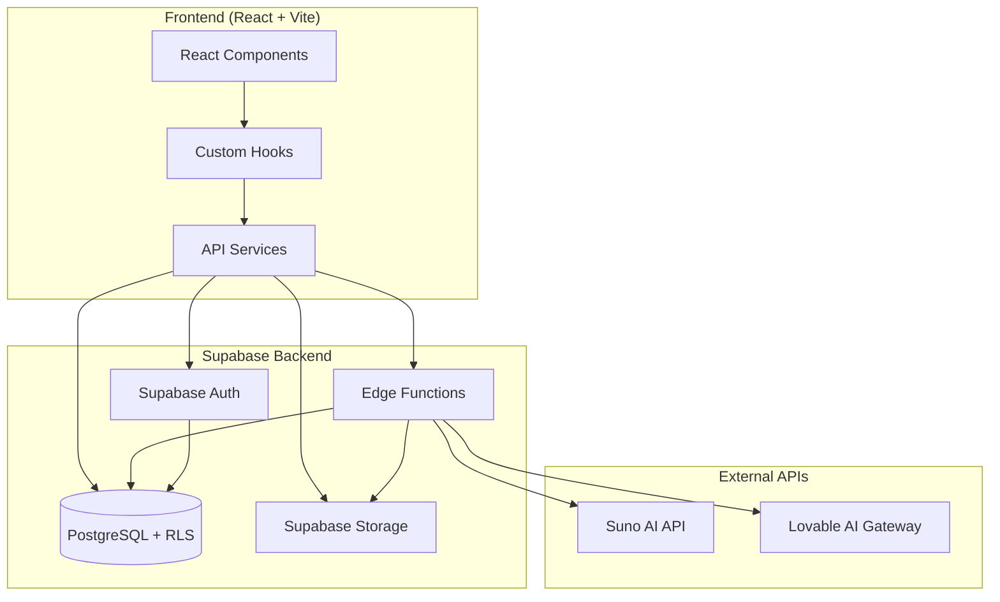
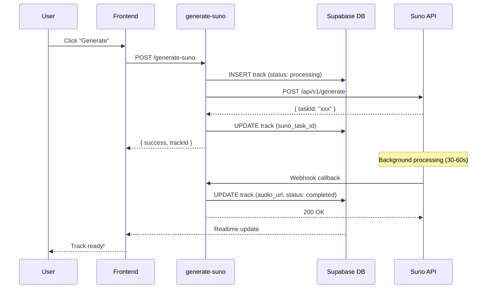
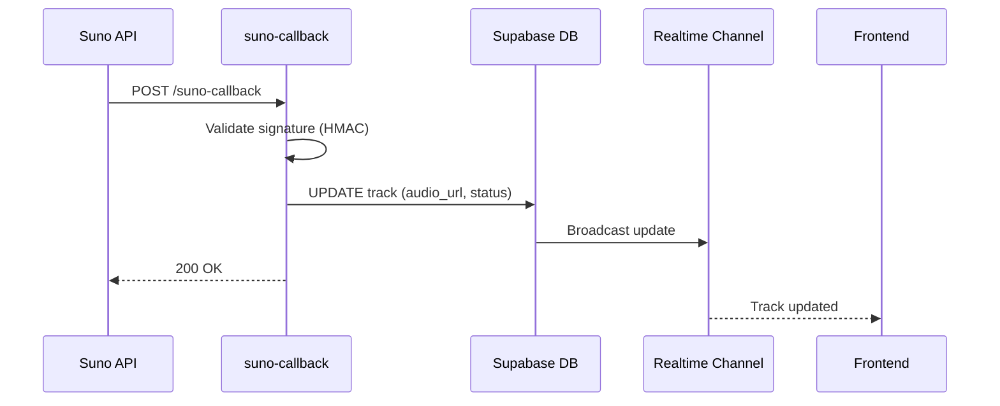

# 🏗️ Backend Architecture - Albert3 Muse Synth Studio

**Последнее обновление:** 2025-10-11  
**Версия:** 2.7.0  
**Backend**: Supabase + Edge Functions (Deno)

---

## 📐 Архитектурный обзор



---

## 🔧 Edge Functions

### Список функций

| Функция | Endpoint | Назначение | JWT | Rate Limit |
|---------|----------|------------|-----|------------|
| `generate-suno` | `/functions/v1/generate-suno` | Генерация музыки | ✅ | 10/min |
| `generate-lyrics` | `/functions/v1/generate-lyrics` | Генерация текстов | ✅ | 10/min |
| `improve-prompt` | `/functions/v1/improve-prompt` | Улучшение промптов | ✅ | 20/min |
| `separate-stems` | `/functions/v1/separate-stems` | Разделение стемов | ❌ | 5/min |
| `extend-track` | `/functions/v1/extend-track` | Расширение треков | ✅ | 10/min |
| `create-cover` | `/functions/v1/create-cover` | Создание каверов | ✅ | 10/min |
| `upload-extend-audio` | `/functions/v1/upload-extend-audio` | Загрузка аудио для расширения | ✅ | 5/min |
| `add-instrumental` | `/functions/v1/add-instrumental` | Добавление инструментала | ✅ | 10/min |
| `get-balance` | `/functions/v1/get-balance` | Баланс провайдера | ✅ | - |
| `suno-callback` | `/functions/v1/suno-callback` | Webhook для Suno | ❌ | - |
| `lyrics-callback` | `/functions/v1/lyrics-callback` | Webhook для текстов | ❌ | - |
| `stems-callback` | `/functions/v1/stems-callback` | Webhook для стемов | ❌ | - |
| `sync-lyrics-job` | `/functions/v1/sync-lyrics-job` | Синхронизация lyrics jobs | ✅ | - |
| `sync-stem-job` | `/functions/v1/sync-stem-job` | Синхронизация stem jobs | ❌ | - |

---

## 🎵 Music Generation Flow



---

## 🔐 Security Model

### 1. Authentication Flow

```typescript
// Edge Function authentication
const authHeader = req.headers.get('Authorization');
if (!authHeader) {
  return new Response('Unauthorized', { status: 401 });
}

const supabase = createClient(
  Deno.env.get('SUPABASE_URL')!,
  Deno.env.get('SUPABASE_SERVICE_ROLE_KEY')!
);

const { data: { user }, error } = await supabase.auth.getUser(
  authHeader.replace('Bearer ', '')
);

if (error || !user) {
  return new Response('Invalid token', { status: 401 });
}
```

### 2. Row Level Security (RLS)

**Принципы**:
- ✅ Все таблицы защищены RLS
- ✅ Security Definer функции для проверки ролей
- ✅ Политики на уровне операций (SELECT, INSERT, UPDATE, DELETE)

**Пример политики**:
```sql
-- Пользователи видят только свои треки
CREATE POLICY "Users can view their own tracks"
  ON public.tracks FOR SELECT
  USING (auth.uid() = user_id);

-- Админы видят все
CREATE POLICY "Admins can view all tracks"
  ON public.tracks FOR SELECT
  USING (has_role(auth.uid(), 'admin'));
```

### 3. Rate Limiting

```typescript
import { withRateLimit } from '../_shared/security.ts';

export default withRateLimit(handler, {
  maxRequests: 10,
  windowMinutes: 1,
  endpoint: 'generate-suno'
});
```

**Хранение лимитов**:
```sql
CREATE TABLE rate_limits (
  id UUID PRIMARY KEY,
  user_id UUID NOT NULL,
  endpoint TEXT NOT NULL,
  request_count INTEGER DEFAULT 1,
  window_start TIMESTAMPTZ NOT NULL,
  UNIQUE(user_id, endpoint, window_start)
);
```

---

## 📦 Shared Modules

### 1. **_shared/suno.ts** - Suno API Client

```typescript
import { createSunoClient } from '../_shared/suno.ts';

const sunoClient = createSunoClient({
  apiKey: Deno.env.get('SUNO_API_KEY')!,
  endpoints: {
    generate: 'https://api.sunoapi.org/api/v1/generate',
    query: 'https://api.sunoapi.org/api/v1/generate/record-info'
  }
});

const result = await sunoClient.generateTrack({
  prompt: "Epic rock song",
  tags: ["rock", "energetic"],
  model: "V5"
});
```

**Возможности**:
- ✅ Centralized configuration
- ✅ Circuit breaker pattern
- ✅ Automatic retries (429, 5xx)
- ✅ Response normalization
- ✅ Comprehensive error handling

### 2. **_shared/cors.ts** - CORS Headers

```typescript
import { createCorsHeaders } from '../_shared/cors.ts';

const corsHeaders = createCorsHeaders();

// OPTIONS preflight
if (req.method === 'OPTIONS') {
  return new Response(null, { headers: corsHeaders });
}
```

### 3. **_shared/validation.ts** - Input Validation

```typescript
import { validateInput } from '../_shared/validation.ts';

const validated = validateInput(body, {
  trackId: { type: 'string', required: true, maxLength: 100 },
  prompt: { type: 'string', required: true, maxLength: 5000 }
});
```

### 4. **_shared/logger.ts** - Structured Logging

```typescript
import { logger } from '../_shared/logger.ts';

logger.info('🎵 Generating track', { 
  userId: user.id, 
  model: 'V5' 
});

logger.error('Generation failed', error, 'generate-suno', { 
  trackId 
});
```

### 5. **_shared/security.ts** - Security Utilities

```typescript
import { createSecurityHeaders, withRateLimit } from '../_shared/security.ts';

// Security headers
const headers = createSecurityHeaders();

// Rate limiting wrapper
export default withRateLimit(handler, {
  maxRequests: 10,
  windowMinutes: 1
});
```

---

## 🗄️ Database Operations

### 1. **Создание трека**

```typescript
const { data: track, error } = await supabase
  .from('tracks')
  .insert({
    user_id: user.id,
    title: 'My Track',
    prompt: 'Epic rock',
    status: 'processing',
    provider: 'suno',
    metadata: {
      suno_generation_endpoint: '/api/v1/generate'
    }
  })
  .select()
  .single();
```

### 2. **Обновление статуса**

```typescript
await supabase
  .from('tracks')
  .update({
    status: 'completed',
    audio_url: 'https://...',
    metadata: {
      ...track.metadata,
      suno_last_poll_at: new Date().toISOString(),
      suno_last_poll_response: sunoResponse
    }
  })
  .eq('id', trackId);
```

### 3. **Получение версий трека**

```typescript
const { data: versions } = await supabase
  .from('track_versions')
  .select('*')
  .eq('parent_track_id', trackId)
  .order('version_number', { ascending: true });
```

---

## 📁 Storage Operations

### 1. **Upload Reference Audio**

```typescript
const fileName = `${user.id}/${Date.now()}-${crypto.randomUUID()}.${ext}`;

const { data, error } = await supabase.storage
  .from('reference-audio')
  .upload(fileName, fileBuffer, {
    contentType: mimeType,
    cacheControl: '3600'
  });

const { data: { publicUrl } } = supabase.storage
  .from('reference-audio')
  .getPublicUrl(fileName);
```

### 2. **Delete Track Files**

```typescript
// Удаление аудио
if (track.audio_url) {
  const audioPath = track.audio_url.split('/reference-audio/')[1];
  await supabase.storage
    .from('reference-audio')
    .remove([audioPath]);
}
```

---

## 🔄 Callback Handling

### Suno Callback Flow



**Implementation**:
```typescript
// suno-callback/index.ts
const signature = req.headers.get('X-Suno-Signature');
const bodyText = await req.text();

if (signature) {
  const isValid = await verifyWebhookSignature(
    bodyText, 
    signature, 
    Deno.env.get('SUNO_WEBHOOK_SECRET')!
  );
  
  if (!isValid) {
    return new Response('Invalid signature', { status: 401 });
  }
}

const payload = JSON.parse(bodyText);

// Update track in DB
await supabase
  .from('tracks')
  .update({
    status: 'completed',
    audio_url: payload.data.sunoData[0].audioUrl
  })
  .eq('suno_task_id', payload.data.taskId);
```

---

## 🧪 Testing Strategy

### 1. **Unit Tests** (Deno Test)

```typescript
// supabase/functions/tests/generate-suno.test.ts
Deno.test('should create track and call Suno API', async () => {
  const response = await fetch('http://localhost:54321/functions/v1/generate-suno', {
    method: 'POST',
    headers: {
      'Authorization': `Bearer ${testToken}`,
      'Content-Type': 'application/json'
    },
    body: JSON.stringify({
      prompt: 'Test track',
      tags: ['rock']
    })
  });
  
  assertEquals(response.status, 200);
  const data = await response.json();
  assert(data.trackId);
});
```

### 2. **Integration Tests**

```bash
# Запуск локального Supabase
npx supabase start

# Запуск тестов
cd supabase/functions
deno task test
```

### 3. **E2E Tests** (Playwright)

```typescript
// tests/e2e/music-generation.spec.ts
test('should generate track end-to-end', async ({ page }) => {
  await loginToApp(page);
  await page.goto('/workspace/generate');
  
  await page.fill('[name="prompt"]', 'Epic rock song');
  await page.click('button:has-text("Generate")');
  
  await expect(page.getByText('Музыка создается')).toBeVisible();
  
  // Wait for track to complete (realtime update)
  await expect(
    page.getByText('Трек готов').first()
  ).toBeVisible({ timeout: 90000 });
});
```

---

## 📊 Monitoring & Observability

### 1. **Structured Logging**

```typescript
logger.info('🎵 Track generation started', {
  userId: user.id,
  trackId: track.id,
  model: 'V5',
  hasCustomMode: !!customMode,
  timestamp: new Date().toISOString()
});
```

### 2. **Error Tracking**

```typescript
try {
  // Operation
} catch (error) {
  logger.error('Generation failed', error, 'generate-suno', {
    trackId,
    userId,
    provider: 'suno'
  });
  
  // Store error in DB
  await supabase.from('tracks').update({
    status: 'failed',
    error_message: error.message
  }).eq('id', trackId);
  
  throw error;
}
```

### 3. **Performance Metrics**

```typescript
const startTime = Date.now();

// Operation

const duration = Date.now() - startTime;
logger.info('Operation completed', { duration });
```

---

## 🔧 Best Practices

### 1. **Always use shared modules**
```typescript
// ✅ GOOD
import { createCorsHeaders } from '../_shared/cors.ts';
import { createSunoClient } from '../_shared/suno.ts';

// ❌ BAD
const corsHeaders = { 'Access-Control-Allow-Origin': '*' };
```

### 2. **Validate all inputs**
```typescript
// ✅ GOOD
const validated = validateInput(body, {
  prompt: { type: 'string', required: true, maxLength: 5000 }
});

// ❌ BAD
const { prompt } = await req.json();
```

### 3. **Handle errors gracefully**
```typescript
// ✅ GOOD
try {
  await operation();
} catch (error) {
  logger.error('Operation failed', error);
  return new Response(
    JSON.stringify({ error: 'Generation failed' }),
    { status: 500, headers: corsHeaders }
  );
}

// ❌ BAD
await operation(); // может упасть без обработки
```

### 4. **Use transactions for multi-table operations**
```typescript
// ✅ GOOD - atomic operation
const { error } = await supabase.rpc('create_track_with_version', {
  track_data: {...},
  version_data: {...}
});

// ❌ BAD - может остаться inconsistent state
await supabase.from('tracks').insert({...});
await supabase.from('track_versions').insert({...});
```

---

## 📞 Связанные документы

- [DATABASE_SCHEMA.md](./DATABASE_SCHEMA.md)
- [SUNO_API_COMPLETE_REFERENCE.md](./integrations/SUNO_API_COMPLETE_REFERENCE.md)
- [SECURITY_AUDIT_2025.md](../reports/security/SECURITY_AUDIT_2025.md)
- [EDGE_FUNCTION_DEPLOYMENT_GUIDE.md](../EDGE_FUNCTION_DEPLOYMENT_GUIDE.md)

---

**Версия:** 2.7.0  
**Дата:** 2025-10-11  
**Статус:** Актуально
