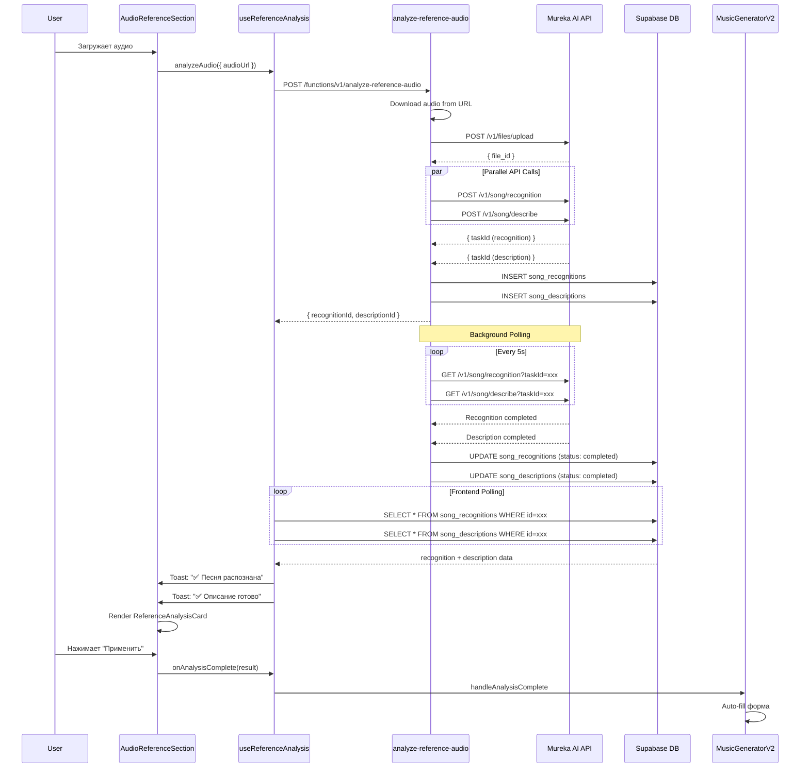

# 📋 Changelog: Mureka Analysis Integration

> **Version**: 1.0.0  
> **Date**: 2025-10-15  
> **Status**: ✅ Completed

---

## 🎯 Цель интеграции

Автоматический анализ референсного аудио с помощью **Mureka AI API** для:
- 🔍 **Распознавания песен** (название, исполнитель, альбом, уверенность)
- 🎨 **AI-описания музыки** (жанр, настроение, темп, инструменты, тональность)
- ✨ **Автоматического заполнения** полей формы генерации

---

## 📦 Изменённые компоненты

### 1️⃣ Backend: Edge Function

**Файл**: `supabase/functions/analyze-reference-audio/index.ts`  
**Статус**: ✅ Создан

**Возможности**:
- ✅ Загрузка аудио в Mureka (`POST /v1/files/upload`)
- ✅ Параллельный запуск Recognition + Description API
- ✅ Background polling результатов Mureka
- ✅ Сохранение в таблицы `song_recognitions` и `song_descriptions`
- ✅ Обработка ошибок и валидация JWT

**Endpoint**: `POST /functions/v1/analyze-reference-audio`

**Request Body**:
```typescript
{
  audioUrl: string;  // URL аудиофайла
  trackId?: string;  // Опционально: ID трека
}
```

**Response**:
```typescript
{
  success: boolean;
  recognitionId?: string;
  descriptionId?: string;
  uploadedFileId: string;
}
```

---

### 2️⃣ Frontend: React Hook

**Файл**: `src/hooks/useReferenceAnalysis.ts`  
**Статус**: ✅ Создан

**Возможности**:
- ✅ Вызов edge function через `useMutation`
- ✅ Polling результатов через `useQuery` (каждые 5 секунд)
- ✅ Toast-уведомления при завершении/ошибках
- ✅ Автоматическая остановка polling при статусе `completed`/`failed`

**API**:
```typescript
const {
  analyzeAudio,        // Функция запуска анализа
  isAnalyzing,         // Идёт ли анализ
  recognition,         // SongRecognition | null
  description,         // SongDescription | null
  isPolling,           // Идёт ли polling
  isCompleted,         // Оба анализа завершены
  hasFailed,           // Анализ провалился
  reset,               // Сброс состояния
} = useReferenceAnalysis();
```

---

### 3️⃣ UI: ReferenceAnalysisCard

**Файл**: `src/components/generator/audio/ReferenceAnalysisCard.tsx`  
**Статус**: ✅ Создан

**Возможности**:
- ✅ Отображение результатов распознавания (название, исполнитель, альбом, уверенность)
- ✅ Отображение AI-описания (жанр, настроение, темп, инструменты)
- ✅ Состояния загрузки, polling, ошибок
- ✅ Кнопки "Применить название" и "Применить характеристики"

**Props**:
```typescript
{
  recognition: SongRecognition | null;
  description: SongDescription | null;
  isAnalyzing: boolean;
  isPolling: boolean;
  onApplyTitle?: (title: string) => void;
  onApplyCharacteristics?: (data) => void;
}
```

---

### 4️⃣ AudioReferenceSection

**Файл**: `src/components/generator/audio/AudioReferenceSection.tsx`  
**Статус**: ✅ Обновлён

**Новое**:
- ✅ Prop `autoAnalyze` для автоматического запуска анализа
- ✅ Prop `onAnalysisComplete` для передачи результатов родителю
- ✅ Встроенная карточка `<ReferenceAnalysisCard />` под audio preview
- ✅ `useEffect` для автозапуска анализа при загрузке аудио

---

### 5️⃣ MusicGeneratorV2

**Файл**: `src/components/MusicGeneratorV2.tsx`  
**Статус**: ✅ Обновлён

**Новое**:
- ✅ Функция `handleAnalysisComplete` для auto-apply логики
- ✅ Автоматическое применение названия: `"Song Title (Cover by AI)"`
- ✅ Автоматическая генерация промпта из характеристик
- ✅ Добавление инструментов в теги стиля
- ✅ Toast-уведомления для каждого действия

**Auto-Apply логика**:
```typescript
handleAnalysisComplete = (result) => {
  // 1. Применить название (если пусто)
  if (result.recognition?.recognized_title && !params.title) {
    setParam('title', `${title} (Cover by AI)`);
  }

  // 2. Сгенерировать промпт из характеристик
  const prompt = [genre, mood, tempo, instruments].join(', ');
  setParam('prompt', prompt);

  // 3. Добавить инструменты в теги
  setParam('tags', [...existingTags, ...instruments]);
}
```

---

### 6️⃣ CustomModeForm

**Файл**: `src/components/generator/forms/CustomModeForm.tsx`  
**Статус**: ✅ Обновлён

**Новое**:
- ✅ Prop `onAnalysisComplete` передаётся в `<AudioReferenceSection />`
- ✅ Включён `autoAnalyze={true}` для обоих режимов (mobile/desktop)

---

### 7️⃣ Validation & Schemas

**Файлы**:
- `supabase/functions/_shared/zod-schemas.ts`
- `supabase/functions/_shared/validation.ts`

**Статус**: ✅ Обновлены

**Новое**:
- ✅ Схема `AnalyzeReferenceAudioRequestSchema` для валидации body
- ✅ Функция `validateAnalyzeReferenceAudioRequest` для edge function

---

### 8️⃣ Supabase Config

**Файл**: `supabase/config.toml`  
**Статус**: ✅ Обновлён

**Изменения**:
```toml
[functions.analyze-reference-audio]
verify_jwt = true  # ✅ JWT валидация включена

[functions.separate-stems]
verify_jwt = true  # ✅ ИСПРАВЛЕНО: было false → 401 Unauthorized
```

---

## 🔄 Workflow: Как это работает



---

## 📊 Данные в БД

### `song_recognitions`
```sql
CREATE TABLE song_recognitions (
  id UUID PRIMARY KEY,
  user_id UUID NOT NULL,
  audio_file_url TEXT NOT NULL,
  mureka_file_id TEXT,
  mureka_task_id TEXT,
  status TEXT CHECK (status IN ('pending', 'processing', 'completed', 'failed')),
  recognized_title TEXT,
  recognized_artist TEXT,
  recognized_album TEXT,
  release_date DATE,
  confidence_score FLOAT,
  external_ids JSONB,  -- { spotify_id, apple_music_id, etc. }
  metadata JSONB,
  error_message TEXT,
  created_at TIMESTAMP DEFAULT NOW()
);
```

### `song_descriptions`
```sql
CREATE TABLE song_descriptions (
  id UUID PRIMARY KEY,
  user_id UUID NOT NULL,
  audio_file_url TEXT NOT NULL,
  mureka_file_id TEXT,
  mureka_task_id TEXT,
  status TEXT CHECK (status IN ('pending', 'processing', 'completed', 'failed')),
  ai_description TEXT,
  detected_genre TEXT,
  detected_mood TEXT,
  tempo_bpm INTEGER,
  key_signature TEXT,
  detected_instruments TEXT[],
  energy_level FLOAT,
  danceability FLOAT,
  valence FLOAT,
  metadata JSONB,
  error_message TEXT,
  created_at TIMESTAMP DEFAULT NOW(),
  updated_at TIMESTAMP DEFAULT NOW()
);
```

---

## ✅ Преимущества для пользователя

1. **Автоматизация**: Не нужно вручную описывать референс
2. **Скорость**: Анализ занимает 10-15 секунд
3. **Точность**: AI определяет жанр, настроение, темп, инструменты
4. **Удобство**: Одним кликом применить результаты к форме
5. **Профессиональность**: Метаданные (BPM, тональность, уверенность)

---

## 🐛 Исправленные баги

### 1. `separate-stems` 401 Unauthorized
**Проблема**: `verify_jwt = false` в config.toml при обязательной авторизации в коде  
**Решение**: Изменено на `verify_jwt = true`

---

## 📝 Примеры использования

### 1. Автоматический анализ при загрузке

```tsx
<AudioReferenceSection
  autoAnalyze={true}
  onAnalysisComplete={(result) => {
    console.log('Recognition:', result.recognition);
    console.log('Description:', result.description);
  }}
/>
```

### 2. Ручной анализ

```tsx
const { analyzeAudio, recognition, description } = useReferenceAnalysis();

await analyzeAudio({ audioUrl: 'https://example.com/song.mp3' });

// Polling автоматически запускается
// recognition и description обновляются каждые 5 секунд
```

### 3. Auto-apply в форму

```tsx
handleAnalysisComplete = (result) => {
  if (result.recognition?.recognized_title) {
    setTitle(`${result.recognition.recognized_title} (Cover)`);
  }

  if (result.description?.detected_genre) {
    const prompt = `${genre}, ${mood}, ${tempo} BPM, featuring ${instruments}`;
    setPrompt(prompt);
  }
}
```

---

## 🔮 Будущие улучшения

- [ ] Добавить кнопку "Применить всё" (название + характеристики одновременно)
- [ ] Сохранять `murekaFileId` для повторного использования
- [ ] Отображать confidence score как прогресс-бар
- [ ] Поддержка batch-анализа (несколько файлов)
- [ ] Экспорт результатов в JSON/CSV
- [ ] История анализов в отдельной странице

---

## 📚 Связанная документация

- [Mureka API Documentation](https://docs.mureka.ai)
- [Mureka Song Recognition API](https://docs.mureka.ai/v1/song/recognition)
- [Mureka Song Description API](https://docs.mureka.ai/v1/song/describe)
- [Database Schema](../supabase/migrations/)

---

## 🎉 Статус: Полностью готово к использованию!

**Время выполнения**: ~1.5 часа  
**Файлов изменено**: 9  
**Файлов создано**: 3  
**Строк кода**: ~800+

---

*Последнее обновление: 2025-10-15 by Albert3 AI*
