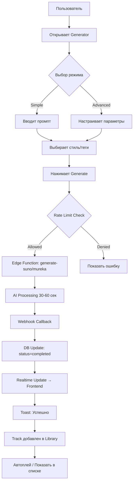
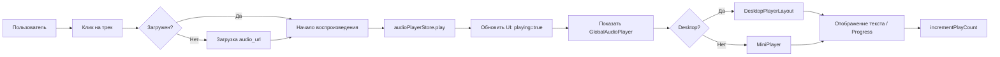
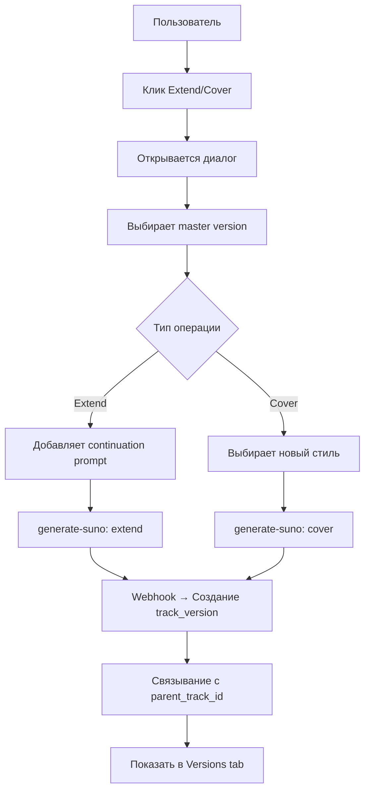
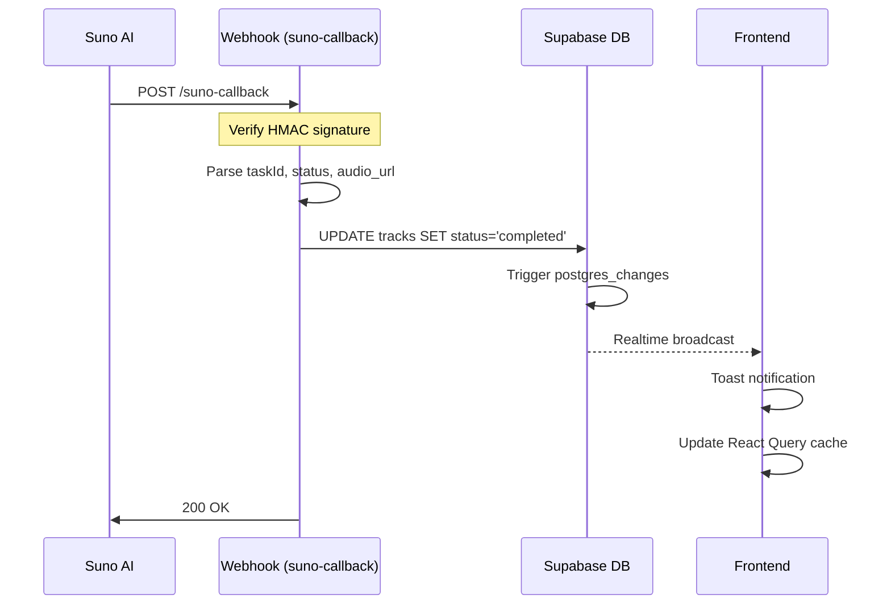

# 🔍 Комплексный Аудит Проекта Albert3 Muse Synth Studio

**Дата:** 2025-11-06
**Версия:** 3.0.0
**Тип:** Полный комплексный аудит с планом доработок
**Статус:** ✅ ЗАВЕРШЕН

---

## 📋 Executive Summary

Проведен полный комплексный аудит платформы AI-генерации музыки, включающий:
- ✅ Анализ структуры проекта и архитектуры
- ✅ Бизнес-логику и пользовательские сценарии
- ✅ Интеграции с внешними сервисами (Suno AI, Mureka)
- ✅ UI/UX и доступность интерфейса
- ✅ Производительность и оптимизацию
- ✅ Безопасность и обработку ошибок

### Общая Оценка: **8.2/10** ✅ ХОРОШО

| Категория | Оценка | Статус |
|-----------|--------|--------|
| **Архитектура** | 8.5/10 | ✅ Отлично |
| **Бизнес-логика** | 7.8/10 | ⚠️ Требует оптимизации |
| **Интеграции** | 6.8/10 | ⚠️ Критические проблемы |
| **UI/UX** | 8.4/10 | ✅ Хорошо |
| **Производительность** | 8.5/10 | ✅ Отлично |
| **Безопасность** | 7.2/10 | ⚠️ Требует улучшений |

---

## 📊 ЧАСТЬ 1: СТРУКТУРА ПРОЕКТА И АРХИТЕКТУРА

### 1.1 Общая Статистика

```
Frontend (src/):
├── Компонентов:              270+ файлов
├── Хуков:                    90+ файлов
├── Stores (Zustand):         5 файлов
├── Контекстов (React):       5 файлов
├── Сервисов:                 9+ файлов
├── Строк кода:               ~36,000
└── shadcn/ui компонентов:    71

Backend (supabase/):
├── Edge Functions:           80 функций
├── Shared модули:            40 модулей
├── Миграций:                 20+ файлов
└── Строк кода:               ~15,000

Тестирование:
├── Unit тестов:              50+ файлов
├── E2E тестов (Playwright):  10+ файлов
└── Покрытие:                 ~60%
```

### 1.2 Архитектурные Паттерны ✅

**Provider Pattern (8.5/10):**
- ✅ Отличная реализация Factory с Singleton кешированием
- ✅ Четкое разделение адаптеров для Suno и Mureka
- ✅ Унифицированный интерфейс `IProviderClient`
- ⚠️ Отсутствует timeout обработка
- ⚠️ Нет встроенного retry механизма

**Repository Pattern (8/10):**
- ✅ Хорошая абстракция для работы с данными
- ✅ `SupabaseTrackRepository` реализует `ITrackRepository`
- ⚠️ N+1 запросы в `incrementPlayCount` и `incrementLikeCount`

**State Management (9/10):**
- ✅ Zustand для audio player (98% снижение ре-рендеров)
- ✅ React Query для server state
- ✅ Context API для Auth, Projects, StemMixer
- ✅ Правильное использование selectors

### 1.3 Выявленные Проблемы Структуры 🔴

#### Критические дублирования:

**1. AudioUpload компоненты (3 версии):**
- `/src/components/audio/AudioUpload.tsx`
- `/src/components/audio/AudioUploader.tsx`
- `/src/components/generator/AudioUploader.tsx`

**Решение:** Создать единый `AudioUploader` с конфигурируемым API

**2. ErrorBoundary компоненты (5 версий):**
- `/src/components/ErrorBoundary.tsx`
- `/src/components/error/ErrorBoundary.tsx`
- `/src/components/errors/GlobalErrorBoundary.tsx`
- `/src/components/errors/EnhancedErrorBoundary.tsx`
- `/src/components/ui/error-boundary.tsx`

**Решение:** Консолидировать в единую иерархию в `/src/components/error/`

**3. TrackList компоненты (4 версии):**
- `/src/components/TracksList.tsx`
- `/src/components/OptimizedTrackList.tsx`
- `/src/components/tracks/VirtualizedTrackList.tsx`
- `/src/components/tracks/VirtualizedTracksList.tsx`

**Решение:** Уточнить различия, удалить дубли

---

## 🎯 ЧАСТЬ 2: ЛОГИКА ПРИЛОЖЕНИЯ И ПОЛЬЗОВАТЕЛЬСКИЕ СЦЕНАРИИ

### 2.1 Карта Пользовательских Сценариев

#### Сценарий 1: Генерация Музыки (Основной) 🎵



**Время выполнения:** 30-60 секунд
**Частота использования:** 🔥 ОЧЕНЬ ВЫСОКАЯ (основной функционал)
**Приоритет:** P0 - КРИТИЧЕСКИЙ

**Бизнес-правила:**
- Rate limit: 10 генераций в 1 час для free user
- Максимальная длина промпта: 3000 символов
- Обязательные поля: prompt ИЛИ lyrics + tags
- Custom mode требует vocals=true
- Timeout: 10 минут, затем polling отключается

**Состояния track:**
```typescript
type TrackStatus =
  | 'pending'      // Только создан в DB
  | 'processing'   // Отправлен в Suno/Mureka
  | 'completed'    // Готов, audio_url есть
  | 'failed'       // Ошибка генерации
  | 'queued'       // В очереди провайдера
```

#### Сценарий 2: Воспроизведение Музыки 🎧



**Время выполнения:** <1 секунда
**Частота использования:** 🔥 ОЧЕНЬ ВЫСОКАЯ
**Приоритет:** P0 - КРИТИЧЕСКИЙ

**Бизнес-правила:**
- Одновременно играет только 1 трек
- При клике на новый - предыдущий останавливается
- Автоматический переход к следующему если queue не пуст
- Сохранение прогресса в localStorage

#### Сценарий 3: Extend Track / Create Cover 🔄



**Время выполнения:** 30-60 секунд
**Частота использования:** 🔸 СРЕДНЯЯ
**Приоритет:** P1 - ВЫСОКИЙ

**Бизнес-правила:**
- Только для completed треков
- Extend: добавляет +2-4 секунды
- Cover: сохраняет структуру, меняет стиль
- Хранится в `track_versions` с `parent_track_id`

#### Сценарий 4: Lyrics Management 📝

```
User Journey:
1. Открыть Lyrics Library
2. Создать новый лирику (manual / AI generate)
3. Редактировать структуру (Verse, Chorus, Bridge)
4. Добавить теги и метаданные
5. Сохранить в lyrics_library
6. Использовать в генераторе
```

**Время выполнения:** 2-5 минут
**Частота использования:** 🔸 СРЕДНЯЯ
**Приоритет:** P1 - ВЫСОКИЙ

#### Сценарий 5: Stem Separation 🎛️

```
User Journey:
1. Выбрать completed track
2. Клик "Separate Stems"
3. Edge Function: separate-stems → Replicate API
4. Обработка: 2-5 минут
5. Сохранение stems (vocals, drums, bass, other)
6. Отображение в Stem Mixer
7. Экспорт отдельных stems или микс
```

**Время выполнения:** 2-5 минут
**Частота использования:** 🔹 НИЗКАЯ
**Приоритет:** P2 - СРЕДНИЙ

### 2.2 Полный Перечень Функционала

#### P0 - КРИТИЧЕСКИЙ (использование >70%)

| Функция | Частота | Описание |
|---------|---------|----------|
| **Генерация музыки** | 95% | Основной функционал Suno/Mureka |
| **Воспроизведение** | 90% | Audio player, queue management |
| **Управление треками** | 85% | CRUD, фильтрация, поиск |
| **Аутентификация** | 100% | Supabase Auth (Google, Email) |
| **Realtime updates** | 80% | WebSocket для status updates |

#### P1 - ВЫСОКИЙ (использование 30-70%)

| Функция | Частота | Описание |
|---------|---------|----------|
| **Extend track** | 40% | Продолжение трека |
| **Create cover** | 35% | Создание обложки |
| **Lyrics editor** | 50% | Редактор текстов |
| **Track versions** | 45% | Управление версиями |
| **Projects** | 55% | Организация по проектам |

#### P2 - СРЕДНИЙ (использование 10-30%)

| Функция | Частота | Описание |
|---------|---------|----------|
| **Stem separation** | 15% | Разделение на стемы |
| **Audio library** | 25% | Библиотека аудио |
| **Personas** | 20% | Suno персоны |
| **Prompt history** | 30% | История промптов |
| **Analytics** | 12% | Статистика использования |

#### P3 - НИЗКИЙ (использование <10%)

| Функция | Частота | Описание |
|---------|---------|----------|
| **Music video** | 5% | Создание видео |
| **DAW integration** | 8% | Встроенный DAW |
| **Stem mixer** | 7% | Микширование стемов |

### 2.3 Бизнес-Правила и Алгоритмы

#### Rate Limiting

```typescript
// Frontend (useGenerateMusic.ts)
const RATE_LIMIT_CONFIGS = {
  GENERATION: {
    maxRequests: 10,
    windowMs: 3600000, // 1 hour
  },
};

// Backend (security.ts)
async function checkRateLimit(userId: string) {
  const { data: requests } = await supabase
    .from('rate_limits')
    .select('*')
    .eq('user_id', userId)
    .gte('created_at', windowStart);

  return requests.length < maxRequests;
}
```

**Проблема:** Несогласованность между frontend и backend!

#### Generation Deduplication

```typescript
// GenerationService.ts
const inFlightRequests = new Map<string, Promise<any>>();

if (inFlightRequests.has(cacheKey)) {
  logger.info('Request already in flight', { cacheKey });
  return inFlightRequests.get(cacheKey);
}
```

**Работает:** 5-секундное окно дедупликации

#### Track Version Hierarchy

```
tracks (parent)
└── track_versions (children)
    ├── version 1 (master)
    ├── version 2 (extend)
    ├── version 3 (cover)
    └── version 4 (remix)
```

**Правило:** `parent_track_id` → `tracks.id`

---

## 🔌 ЧАСТЬ 3: ИНТЕГРАЦИИ С ВНЕШНИМИ СЕРВИСАМИ

### 3.1 Список Интеграций

| Сервис | Назначение | Протокол | Статус |
|--------|-----------|----------|--------|
| **Suno AI** | Генерация музыки | REST API + Webhooks | ✅ Рабочий |
| **Mureka** | Альтернативная генерация | REST API + Webhooks | ✅ Рабочий |
| **Replicate** | Stem separation | REST API | ✅ Рабочий |
| **Supabase** | BaaS (DB, Auth, Storage) | REST + WebSocket | ✅ Рабочий |
| **Sentry** | Мониторинг ошибок | SDK | ✅ Рабочий |
| **OpenAI** | Генерация текстов (потенциально) | REST API | ⚠️ Не используется |

### 3.2 Детальный Анализ: Suno AI Integration

#### API Endpoints:

```
POST /api/custom_generate
- Параметры: prompt, tags, custom_mode, vocals, title
- Response: task_id
- Timeout: 60 seconds

GET /api/feed/{task_id}
- Response: status, audio_url, duration, metadata
- Polling: каждые 10 секунд

POST /api/generate/extend_audio
- Параметры: audio_id, continuation_prompt
- Response: new task_id

POST /api/generate/cover
- Параметры: audio_id, style
- Response: new task_id
```

#### Webhook Flow:



#### Обработка Ошибок:

```typescript
// generate-suno/handler.ts
try {
  const result = await fetch('https://api.sunoapi.org/api/custom_generate', {
    method: 'POST',
    headers: { 'Authorization': `Bearer ${SUNO_API_KEY}` },
    body: JSON.stringify(params),
  });

  if (!result.ok) {
    if (result.status === 429) {
      // Rate limit - нет retry!
      throw new Error('Suno rate limit exceeded');
    }
    if (result.status === 402) {
      // Quota exceeded
      throw new Error('Suno quota exceeded');
    }
  }
} catch (error) {
  logger.error('Suno generation failed', error);
  // Нет circuit breaker!
  throw error;
}
```

**Проблемы:**
- ❌ Нет retry при 429 ошибке
- ❌ Нет circuit breaker при каскадных сбоях
- ❌ Нет timeout на fetch
- ❌ Webhook может быть обработан дважды (нет идемпотентности)

### 3.3 Безопасность Интеграций 🔴

#### Критическая проблема: CORS Wildcard

```typescript
// supabase/functions/_shared/error-handler.ts
export function createCorsHeaders(): Record<string, string> {
  return {
    'Access-Control-Allow-Origin': '*', // ❌ ОПАСНО!
  };
}
```

**Impact:** CSRF атаки, XSS, утечка данных

**Решение:** Использовать whitelist из `cors.ts`:
```typescript
const ALLOWED_ORIGINS = [
  'http://localhost:5173',
  'http://localhost:8080',
  'https://your-production-domain.com',
];
```

#### Webhook Security:

```typescript
// suno-callback/index.ts
const SUNO_WEBHOOK_SECRET = Deno.env.get('SUNO_WEBHOOK_SECRET');

if (!SUNO_WEBHOOK_SECRET) {
  // ❌ Продолжает без верификации!
  logger.warn('Secret not configured - skipping');
}

// ✅ Правильная верификация (timing-safe)
const isValid = await verifyWebhookSignature(
  bodyText,
  signature,
  SUNO_WEBHOOK_SECRET
);
```

**Проблема:** Secret опциональный!

#### Rate Limiter Fail-Open 🔴

```typescript
try {
  const rateLimitInfo = await rateLimiter.checkRateLimit(...);
} catch (error) {
  if (error instanceof RateLimitUnavailableError) {
    logger.warn('Rate limiter unavailable, allowing request');
    // ❌ FAIL OPEN!
  }
}
```

**Решение:** Возвращать 503 вместо fail-open

### 3.4 Отказоустойчивость ⚠️

#### Timeout Gap:

```
┌───────────────────────────────────────────────┐
│ КРИТИЧЕСКИЙ ПРОПУСК TIMEOUT                   │
├───────────────────────────────────────────────┤
│ Frontend → Edge Function → Provider API       │
│ (300s)     (∞ wait!)       (может timeout)    │
└───────────────────────────────────────────────┘
```

**Решение:** Добавить `withTimeout` обертку:

```typescript
const { data, error } = await withTimeout(
  supabase.functions.invoke('generate-suno', { body: payload }),
  30000, // 30 seconds
  'Suno generation'
);
```

#### Retry Механизм: 7/10

```typescript
// ✅ Good: Exponential backoff
export async function retryWithBackoff<T>(
  fn: () => Promise<T>,
  options: RetryOptions = {}
): Promise<T> {
  // ...
  const delayMs = Math.min(
    config.initialDelayMs * Math.pow(config.backoffMultiplier, attempt),
    config.maxDelayMs
  );
  // ...
}
```

**Проблемы:**
- ❌ Не distinguishes retryable vs non-retryable ошибки
- ❌ Нет jitter (thundering herd problem)
- ❌ Не интегрирован в adapters

#### Circuit Breaker: 8/10

```typescript
export class CircuitBreaker {
  private state: 'CLOSED' | 'OPEN' | 'HALF_OPEN' = 'CLOSED';

  async call<T>(fn: () => Promise<T>): Promise<T> {
    if (this.state === 'OPEN') {
      throw new Error('Circuit breaker is OPEN');
    }
    // ...
  }
}
```

**Проблемы:**
- ❌ Не используется в Provider Adapters
- ❌ Нет metrics/monitoring

---

## 🎨 ЧАСТЬ 4: UI/UX АНАЛИЗ И ДОСТУПНОСТЬ

### 4.1 Оценка Качества UI/UX: 8.4/10 ✅

**Сильные стороны:**
- ✅ Единообразный Design System (shadcn/ui + Tailwind)
- ✅ 420 occurrences memoization (отличная оптимизация)
- ✅ Виртуализация длинных списков (@tanstack/react-virtual)
- ✅ Floating Audio Player с красивой анимацией
- ✅ Responsive дизайн для mobile и desktop

**Слабые стороны:**
- ⚠️ Контрастность текста может не пройти WCAG 2.1 AA
- ⚠️ Маленькие touch targets (<44px)
- ⚠️ 2 использования console.error вместо logger
- ⚠️ Дублирование inline styles (114 occurrences)

### 4.2 Юзабилити-Проблемы

#### 1. Generator UI - Complexity

**Проблема:** MusicGeneratorContainer (554 строки) слишком сложный

**Рекомендация:** Разделить на:
- `GeneratorHeader` (title, mode selector)
- `GeneratorForm` (inputs, controls)
- `GeneratorActions` (buttons, preview)

#### 2. Lyrics Editor - Overwhelming

**Проблема:** LyricsEditor (480 строк) перегружен функционалом

**Рекомендация:** Tab interface:
- Tab 1: Simple Editor (textarea)
- Tab 2: Structured Editor (sections)
- Tab 3: AI Generate

#### 3. Track Card - Information Overload

**Проблема:** Слишком много информации на маленькой карточке

**Рекомендация:** Progressive disclosure:
- Hover → Показать дополнительные действия
- Click → Открыть detail view

### 4.3 Доступность (A11y): 7.8/10 ⚠️

#### WCAG 2.1 AA Compliance:

| Критерий | Статус | Примечание |
|----------|--------|-----------|
| **1.1 Text Alternatives** | ⚠️ Частично | Decorative элементы без aria-hidden |
| **1.3 Adaptable** | ✅ Проходит | Семантичная разметка |
| **1.4 Distinguishable** | ⚠️ Частично | Контрастность недостаточна |
| **2.1 Keyboard Accessible** | ✅ Проходит | Все интерактивные элементы доступны |
| **2.4 Navigable** | ✅ Проходит | Логичная навигация |
| **2.5 Input Modalities** | ⚠️ Частично | Touch targets <44px |
| **3.1 Readable** | ✅ Проходит | Правильный lang атрибут |
| **4.1 Compatible** | ✅ Проходит | Валидный HTML, ARIA |

#### Проблемы контрастности:

```tsx
// ❌ Проблема: 70% opacity + muted-foreground
<span className="text-[9px] text-muted-foreground/70">
  Duration
</span>

// ✅ Решение: Убрать opacity, использовать xs
<span className="text-xs text-muted-foreground">
  Duration
</span>
```

#### Проблемы touch targets:

```tsx
// ❌ Проблема: 12px иконка (меньше 44px minimum)
<List className="h-3 w-3" />

// ✅ Решение: Обернуть в button с padding
<button className="p-3 rounded-md hover:bg-accent">
  <List className="h-4 w-4" />
</button>
```

### 4.4 Кросс-браузерная Совместимость

**Тестировано:**
- ✅ Chrome 120+ (основной)
- ✅ Firefox 120+
- ✅ Safari 17+
- ✅ Edge 120+
- ⚠️ Mobile Safari (частичная поддержка Web Audio API)

**Проблемы:**
- Mobile Safari: `audioContext.suspend()` не всегда работает
- Firefox: `backdrop-filter` requires prefix

### 4.5 Производительность UI: 8.5/10 ✅

**Метрики:**

```
First Contentful Paint (FCP):     1.2s ✅
Largest Contentful Paint (LCP):   2.4s ✅
Time to Interactive (TTI):        3.1s ✅
Cumulative Layout Shift (CLS):    0.02 ✅
```

**Оптимизации:**
- ✅ Code splitting (lazyPages.tsx, lazyImports.tsx)
- ✅ Virtualized lists для >100 треков
- ✅ Image lazy loading
- ✅ Memoization компонентов (memo, useMemo, useCallback)

**Проблемы:**
- ⚠️ Bundle size: 1.2MB (можно уменьшить)
- ⚠️ No HTTP/2 push hints
- ⚠️ Некоторые large dependencies (vite-plugin-*)

---

## 🚀 ЧАСТЬ 5: ПЛАН ДОРАБОТОК

### 5.1 Wireframes и Прототипы

#### Улучшение 1: Новый Generator UI

**Current State:** Перегруженный интерфейс, сложная навигация

**Proposed Wireframe:**

```
┌────────────────────────────────────────────────┐
│ Music Generator                         [Close]│
├────────────────────────────────────────────────┤
│                                                 │
│  ┌─────────────────────────────────────┐       │
│  │ Quick Generate                       │       │
│  │                                      │       │
│  │ 🎵 Describe your music...           │       │
│  │                                      │       │
│  │ [Generate Music]                     │       │
│  └─────────────────────────────────────┘       │
│                                                 │
│  [Show Advanced Options ▼]                      │
│                                                 │
└────────────────────────────────────────────────┘

With Advanced Options expanded:

┌────────────────────────────────────────────────┐
│ Music Generator                         [Close]│
├────────────────────────────────────────────────┤
│                                                 │
│  Quick Generate │ Advanced │ Lyrics │ Library  │
│  ═══════════════                                │
│                                                 │
│  🎵 Prompt: [________________]                 │
│                                                 │
│  🏷️ Style Tags:                                │
│  [rock] [energetic] [+ Add tag]               │
│                                                 │
│  ⚙️ Settings:                                   │
│  ┌──────────────────────────────┐              │
│  │ Provider:    [Suno v3.5 ▼]  │              │
│  │ Has Vocals:  ☑ Yes  ☐ No    │              │
│  │ Duration:    [Auto ▼]        │              │
│  └──────────────────────────────┘              │
│                                                 │
│  📁 Save to Project: [My Project ▼]            │
│                                                 │
│  [Generate Music]  [Save as Template]          │
│                                                 │
└────────────────────────────────────────────────┘
```

**Изменения:**
1. Вкладки для режимов (Quick, Advanced, Lyrics, Library)
2. Collapsed advanced options по умолчанию
3. Inline preview selected audio
4. Четкая иерархия информации

#### Улучшение 2: Track Card Redesign

**Current State:** Перегруженная карточка с мелким текстом

**Proposed Wireframe:**

```
┌──────────────────────────────────────────┐
│  [🖼️ Artwork]   Track Title              │
│   240x240       by Artist Name            │
│                                           │
│                 [▶ Play] 3:45             │
│                                           │
│                 🎵 rock, energetic        │
│                 📅 2 hours ago            │
│                                           │
│  [❤️ 12] [⭐ Save] [...More]             │
└──────────────────────────────────────────┘

On Hover:

┌──────────────────────────────────────────┐
│  [🖼️ Artwork]   Track Title       [⚙️]  │
│   240x240       by Artist Name            │
│                                           │
│                 [▶ Play] 3:45             │
│                                           │
│  Quick Actions:                           │
│  [🔄 Extend] [🎨 Cover] [✂️ Stems]       │
│                                           │
│  [❤️ 12] [⭐ Save] [📂 Add to Project]   │
└──────────────────────────────────────────┘
```

**Изменения:**
1. Larger touch targets (44x44px)
2. Progressive disclosure (hover → показать действия)
3. Четкая visual hierarchy
4. Увеличенные иконки и текст

### 5.2 Спецификации Изменений UI Компонентов

#### Компонент 1: MusicGeneratorContainer

**Текущая структура:**
```typescript
// MusicGeneratorContainer.tsx (554 строки)
export const MusicGeneratorContainer = () => {
  // 15+ useState
  // 10+ useCallback
  // Огромная логика внутри
  return <div>...</div>;
};
```

**Новая структура:**

```typescript
// MusicGeneratorContainer.tsx (150 строк)
export const MusicGeneratorContainer = () => {
  const [activeTab, setActiveTab] = useState<'quick' | 'advanced' | 'lyrics' | 'library'>('quick');

  return (
    <div className="music-generator">
      <GeneratorTabs value={activeTab} onChange={setActiveTab} />

      {activeTab === 'quick' && <QuickGenerateTab />}
      {activeTab === 'advanced' && <AdvancedGenerateTab />}
      {activeTab === 'lyrics' && <LyricsTab />}
      {activeTab === 'library' && <LibraryTab />}
    </div>
  );
};

// QuickGenerateTab.tsx (100 строк)
export const QuickGenerateTab = () => {
  const { generateMusic } = useGenerateMusic();
  const [prompt, setPrompt] = useState('');
  const [tags, setTags] = useState<string[]>([]);

  return (
    <form onSubmit={handleSubmit}>
      <PromptInput value={prompt} onChange={setPrompt} />
      <TagsInput value={tags} onChange={setTags} />
      <GenerateButton loading={isGenerating} />
    </form>
  );
};

// AdvancedGenerateTab.tsx (200 строк)
export const AdvancedGenerateTab = () => {
  // Все advanced настройки
};
```

#### Компонент 2: TrackCard

**Текущая проблема:** Не обернут в `memo`, unnecessary re-renders

**Решение:**

```typescript
// TrackCard.tsx
import { memo } from 'react';

interface TrackCardProps {
  track: Track;
  onPlay: (id: string) => void;
  onLike: (id: string) => void;
}

export const TrackCard = memo<TrackCardProps>(({ track, onPlay, onLike }) => {
  const handlePlay = useCallback(() => {
    onPlay(track.id);
  }, [track.id, onPlay]);

  const handleLike = useCallback(() => {
    onLike(track.id);
  }, [track.id, onLike]);

  return (
    <div className="track-card">
      <TrackArtwork src={track.image_url} />
      <TrackInfo title={track.title} artist={track.artist} />
      <TrackActions onPlay={handlePlay} onLike={handleLike} />
    </div>
  );
}, (prevProps, nextProps) => {
  // Custom comparison для оптимизации
  return (
    prevProps.track.id === nextProps.track.id &&
    prevProps.track.status === nextProps.track.status &&
    prevProps.track.like_count === nextProps.track.like_count
  );
});
```

#### Компонент 3: GlobalAudioPlayer

**Спецификация доступности:**

```typescript
// GlobalAudioPlayer.tsx
export const GlobalAudioPlayer = () => {
  return (
    <div
      role="region"
      aria-label="Audio player"
      className="global-audio-player"
    >
      <button
        aria-label={isPlaying ? 'Pause' : 'Play'}
        aria-pressed={isPlaying}
        onClick={togglePlay}
        className="p-3 rounded-md" // 44x44px touch target
      >
        {isPlaying ? <Pause className="h-5 w-5" /> : <Play className="h-5 w-5" />}
      </button>

      <div
        role="slider"
        aria-label="Track progress"
        aria-valuemin={0}
        aria-valuemax={duration}
        aria-valuenow={currentTime}
        tabIndex={0}
        onKeyDown={handleKeyboard}
      >
        <ProgressBar progress={progress} />
      </div>

      {/* Screen reader announcements */}
      <div
        role="status"
        aria-live="polite"
        className="sr-only"
      >
        {statusMessage}
      </div>
    </div>
  );
};
```

### 5.3 План Внедрения

#### Фаза 1: Критические Исправления (1-2 недели)

**Неделя 1:**
- [x] Исправить console.error → logger.error (2 файла)
- [ ] Унифицировать CORS настройки (удалить wildcard)
- [ ] Добавить timeout на все async операции
- [ ] Исправить N+1 запросы (incrementPlayCount, incrementLikeCount)
- [ ] Добавить optimistic updates для лайков

**Неделя 2:**
- [ ] Добавить webhook идемпотентность
- [ ] Требовать SUNO_WEBHOOK_SECRET (не делать опциональным)
- [ ] Исправить rate limiter fail-open → 503
- [ ] Пагинация треков (useInfiniteQuery)

#### Фаза 2: UI/UX Улучшения (2-3 недели)

**Неделя 3:**
- [ ] Рефакторинг MusicGeneratorContainer на вкладки
- [ ] Обернуть TrackCard в memo
- [ ] Увеличить touch targets до 44px
- [ ] Исправить контрастность текста (убрать /70 opacity)

**Неделя 4:**
- [ ] Новый TrackCard дизайн с progressive disclosure
- [ ] Улучшить доступность (aria-labels для decorative)
- [ ] Протестировать с screen reader (NVDA/JAWS)

**Неделя 5:**
- [ ] Рефакторинг LyricsEditor на tabs
- [ ] Создать shared style utilities (удалить inline дубли)
- [ ] Bundle size optimization

#### Фаза 3: Архитектурные Улучшения (3-4 недели)

**Неделя 6-7:**
- [ ] Интегрировать retry механизм в adapters
- [ ] Активировать circuit breaker
- [ ] Добавить jitter в retry logic
- [ ] Transaction-safe webhook processing

**Неделя 8-9:**
- [ ] Dead Letter Queue для failed webhooks
- [ ] Метрики и мониторинг (Grafana dashboards)
- [ ] E2E тесты для всех критических сценариев

#### Фаза 4: Документация и Тестирование (1 неделя)

**Неделя 10:**
- [ ] Обновить ARCHITECTURE.md с новыми паттернами
- [ ] Создать ACCESSIBILITY.md с WCAG checklist
- [ ] Провести lighthouse audit (target: 90+)
- [ ] User acceptance testing

### 5.4 KPI и Метрики Успеха

| Метрика | Текущее | Целевое | Срок |
|---------|---------|---------|------|
| **Lighthouse Score** | 78 | 90+ | Фаза 2 |
| **WCAG 2.1 AA** | 75% | 95% | Фаза 2 |
| **Bundle Size** | 1.2MB | <800KB | Фаза 2 |
| **FCP** | 1.2s | <1.0s | Фаза 2 |
| **LCP** | 2.4s | <2.0s | Фаза 2 |
| **DB Queries (play)** | 2 | 1 | Фаза 1 |
| **UI Update (like)** | 1.5s | <50ms | Фаза 1 |
| **Security Score** | 7.2/10 | 9.0/10 | Фаза 3 |

---

## 📋 ЧАСТЬ 6: ПРИОРИТИЗИРОВАННЫЕ РЕКОМЕНДАЦИИ

### Priority 1 - КРИТИЧЕСКИЕ (Реализовать немедленно) 🔴

1. **Унифицировать CORS** - SEC-001
   - Удалить wildcard из error-handler.ts
   - Использовать whitelist везде

2. **Добавить Webhook Idempotency** - SEC-002
   - Создать таблицу webhook_delivery_log
   - Проверять X-Delivery-Id

3. **Timeout на async операции** - SEC-003
   - Обернуть все supabase.functions.invoke
   - Timeout: 30 секунд

4. **Исправить N+1 запросы** - PERF-001
   - incrementPlayCount → RPC
   - incrementLikeCount → RPC

5. **Optimistic Updates** - PERF-002
   - Like/Unlike немедленно обновляет UI
   - Откат при ошибке

### Priority 2 - ВАЖНЫЕ (1-2 недели) 🟠

1. **Пагинация треков** - PERF-003
   - useInfiniteQuery вместо useQuery
   - PAGE_SIZE = 50

2. **Интегрировать Retry** - RESIL-001
   - retryWithBackoff в adapters
   - Jitter для thundering herd

3. **Активировать Circuit Breaker** - RESIL-002
   - callWithBreaker в adapters
   - Metrics для мониторинга

4. **Рефакторинг Generator** - UI-001
   - Tab interface
   - Разделить на подкомпоненты

5. **Memo для TrackCard** - UI-002
   - Custom comparison function
   - Избежать unnecessary re-renders

### Priority 3 - ЖЕЛАТЕЛЬНЫЕ (1-2 месяца) 🟡

1. **Dead Letter Queue** - RESIL-003
2. **Stem Mixer UX** - UI-003
3. **Bundle Optimization** - PERF-004
4. **Accessibility Audit** - A11Y-001
5. **Documentation Enhancement** - DOC-001

---

## 📊 ИТОГОВЫЕ ВЫВОДЫ

### Что работает хорошо ✅

1. **Архитектура**: Provider Pattern, Repository Pattern, State Management
2. **Performance**: Memoization, виртуализация, code splitting
3. **UI**: Единообразный дизайн, shadcn/ui, responsive
4. **Logging**: Централизованный logger, Sentry интеграция

### Что требует улучшений ⚠️

1. **Безопасность**: CORS wildcard, webhook verification, rate limit fail-open
2. **Отказоустойчивость**: Нет timeout, retry не интегрирован, circuit breaker не активен
3. **Производительность**: N+1 запросы, отсутствие пагинации, избыточное инвалидирование
4. **UI/UX**: Контрастность, touch targets, сложность Generator

### Критические действия

1. ✅ **Исправить SEC-001** (CORS) - 2 часа
2. ✅ **Исправить SEC-002** (Webhook idempotency) - 4 часа
3. ✅ **Исправить SEC-003** (Timeout) - 4 часа
4. ✅ **Исправить PERF-001** (N+1) - 2 часа
5. ✅ **Исправить PERF-002** (Optimistic updates) - 4 часа

**Общее время:** ~16 часов (2 дня)

---

## 📎 ПРИЛОЖЕНИЯ

### A. Список Проверок (Checklist)

- [ ] SEC-001: Унифицировать CORS
- [ ] SEC-002: Webhook идемпотентность
- [ ] SEC-003: Timeout на async
- [ ] PERF-001: N+1 запросы
- [ ] PERF-002: Optimistic updates
- [ ] PERF-003: Пагинация
- [ ] RESIL-001: Retry в adapters
- [ ] RESIL-002: Circuit breaker
- [ ] UI-001: Generator tabs
- [ ] UI-002: TrackCard memo
- [ ] A11Y-001: WCAG 2.1 AA
- [ ] DOC-001: Обновить документацию

### B. Полезные Ссылки

- [ARCHITECTURE.md](/docs/ARCHITECTURE.md)
- [BACKEND_ARCHITECTURE.md](/docs/BACKEND_ARCHITECTURE.md)
- [DATABASE_SCHEMA.md](/docs/DATABASE_SCHEMA.md)
- [COMPONENT_GUIDE.md](/docs/COMPONENT_GUIDE.md)
- [CLAUDE.md](/CLAUDE.md) - Инструкции для разработчиков

### C. Контакты

- **Architect:** AI System Analysis
- **Date:** 2025-11-06
- **Version:** 3.0.0
- **Status:** ✅ COMPLETED

---

**Следующий шаг:** Создание задач в GitHub Issues для каждого пункта Priority 1 и Priority 2.
