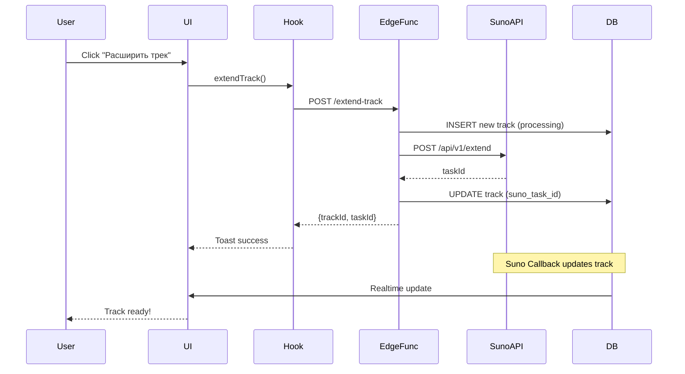
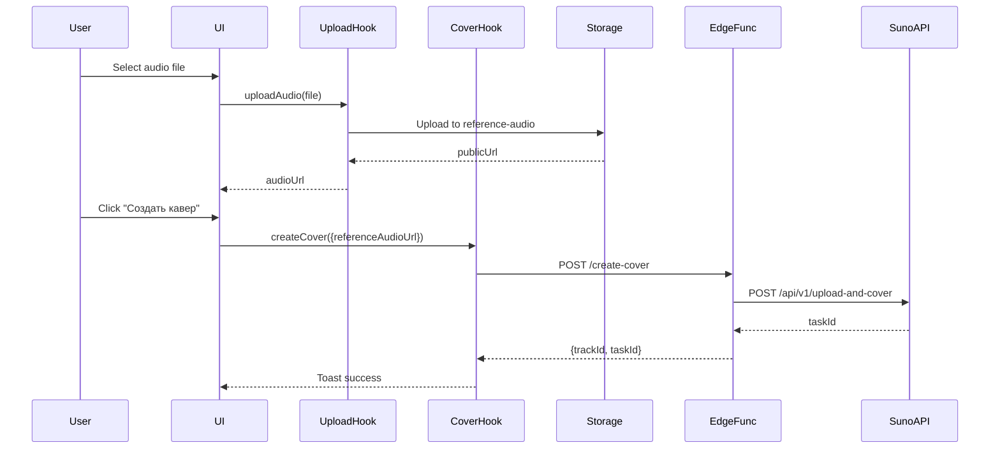

# Extend Track & Create Cover Documentation

## 📋 Обзор

Система расширения треков и создания каверов позволяет пользователям:
- 🎵 **Расширять треки** - продлевать существующие треки через Suno API
- 🎤 **Создавать каверы** - генерировать новые версии с референсным аудио

---

## 🏗️ Архитектура

### Edge Functions

#### 1. `extend-track`
**Путь:** `supabase/functions/extend-track/index.ts`

**Параметры запроса:**
```typescript
{
  trackId: string;        // ID трека для расширения
  continueAt?: number;    // Время начала расширения (секунды)
  prompt?: string;        // Промпт для расширения
  tags?: string[];        // Стилевые теги
}
```

**Процесс:**
1. Аутентификация пользователя
2. Получение оригинального трека из БД
3. Создание нового трека со статусом `processing`
4. Вызов Suno API `/api/v1/extend`
5. Обновление трека с `suno_task_id`

**Ответ:**
```typescript
{
  success: true;
  trackId: string;      // ID нового трека
  taskId: string;       // Suno task ID
}
```

---

#### 2. `create-cover`
**Путь:** `supabase/functions/create-cover/index.ts`

**Используемый Suno API:** `POST /api/v1/generate/upload-cover`

**Обязательные параметры:**
- `uploadUrl` — Публичный URL референсного аудио (автоматически определяется из `referenceTrackId` или `referenceAudioUrl`)
- `customMode` — `true` (детальный контроль) или `false` (авто-генерация), по умолчанию: `true`
- `instrumental` — С вокалом или инструментальная версия
- `model` — V3_5, V4, V4_5, V4_5PLUS, или V5
- `callBackUrl` — Webhook URL для уведомления о завершении

**Custom Mode (`customMode: true`):**
- **Обязательно:** `style` (генерируется из `tags`), `title`
- **Опционально:** `prompt` — точный текст песни (обязателен если не instrumental)

**Non-custom Mode (`customMode: false`):**
- **Обязательно:** `prompt` — идея для AI генерации текста
- `style` и `title` НЕ используются

**Опциональные параметры:**
- `audioWeight` (0-1) — Влияние референсного аудио, по умолчанию: 0.65
  - 0.0 = максимальная креативность, минимальное влияние референса
  - 0.5 = баланс между референсом и новым стилем
  - 1.0 = максимальное сохранение характеристик референса
- `negativeTags` — Стили/характеристики для исключения
- `vocalGender` — 'm' или 'f' для предпочтения вокала
- `styleWeight` (0-1) — Вес стилевого руководства
- `weirdnessConstraint` (0-1) — Ограничение креативного отклонения

**Рекомендации по audioWeight:**
- Для каверов: 0.6-0.8 (сохранить мелодию, изменить стиль)
- Для вариаций: 0.4-0.6 (больше креативности)
- Для ремейков: 0.8-1.0 (максимальное сходство)

**Ограничения:**
- Максимум 2 минуты длины аудио
- Требуется публичный URL для доступа Suno API

**Параметры запроса:**
```typescript
{
  prompt: string;               // Промпт для кавера
  tags?: string[];              // Стилевые теги
  title?: string;               // Название трека
  referenceAudioUrl?: string;   // URL референсного аудио
  referenceTrackId?: string;    // ID трека для референса
  make_instrumental?: boolean;  // Создать инструментал
}
```

**Процесс:**
1. Аутентификация пользователя
2. Получение reference audio (если задан `referenceTrackId`)
3. Создание нового трека со статусом `processing`
4. Вызов Suno API:
   - `/api/v1/upload-and-cover` (если есть reference audio)
   - `/api/v1/generate` (если нет reference audio)
5. Обновление трека с `suno_task_id`

**Ответ:**
```typescript
{
  success: true;
  trackId: string;      // ID нового трека
  taskId: string;       // Suno task ID
}
```

---

### React Hooks

#### 1. `useExtendTrack`
**Файл:** `src/hooks/useExtendTrack.ts`

```typescript
const { extendTrack, isExtending } = useExtendTrack();

// Использование
await extendTrack({
  trackId: 'uuid',
  continueAt: 120,
  prompt: 'Continue with epic guitar solo',
  tags: ['rock', 'guitar']
});
```

**Возвращает:**
- `extendTrack` - функция для расширения трека
- `isExtending` - состояние загрузки

---

#### 2. `useCreateCover`
**Файл:** `src/hooks/useCreateCover.ts`

```typescript
const { createCover, isCreating } = useCreateCover();

// Использование
await createCover({
  prompt: 'Jazz cover of this song',
  tags: ['jazz', 'smooth'],
  referenceTrackId: 'uuid',
  make_instrumental: false
});
```

**Возвращает:**
- `createCover` - функция для создания кавера
- `isCreating` - состояние загрузки

---

#### 3. `useAudioUpload`
**Файл:** `src/hooks/useAudioUpload.ts`

```typescript
const { uploadAudio, isUploading, uploadProgress } = useAudioUpload();

// Использование
const audioUrl = await uploadAudio(audioFile);
```

**Возвращает:**
- `uploadAudio` - функция загрузки файла
- `isUploading` - состояние загрузки
- `uploadProgress` - прогресс (0-100)

**Ограничения:**
- Максимальный размер: 20MB
- Форматы: audio/* (MP3, WAV, M4A и т.д.)

---

## 🗄️ Storage Bucket

### `reference-audio`
**Назначение:** Хранение референсных аудио для создания каверов

**Структура файлов:**
```
reference-audio/
  {user_id}/
    {timestamp}-{random}.mp3
```

**RLS Policies:**
- ✅ Пользователи могут загружать свои файлы
- ✅ Пользователи могут просматривать свои файлы
- ✅ Пользователи могут удалять свои файлы

---

## 🎨 UI Integration

### TrackCard Component
**Файл:** `src/features/tracks/components/TrackCard.tsx`

**Новые пропсы:**
```typescript
interface TrackCardProps {
  onExtend?: (track: Track) => void;
  onCover?: (track: Track) => void;
  onSeparateStems?: (track: Track) => void;
}
```

**Dropdown Menu:**
- 📥 Скачать MP3
- 🎵 Скачать WAV (скоро)
- 🔗 Поделиться
- 🌍 Опубликовать (скоро)
- ✂️ Разделить на стемы (скоро)
- ➕ **Расширить трек**
- 🎤 **Создать кавер**

---

## 🔄 Workflow

### Расширение трека


### Создание кавера


---

## 🧪 Тестирование

### Unit Tests
```bash
# Hook tests
npm test -- useExtendTrack
npm test -- useCreateCover
npm test -- useAudioUpload
```

### E2E Tests
```typescript
// tests/e2e/extend-cover.spec.ts
describe('Extend & Cover', () => {
  it('should extend track', async () => {
    // Test implementation
  });
  
  it('should create cover with reference audio', async () => {
    // Test implementation
  });
});
```

---

## 🚨 Error Handling

### Edge Functions
- ❌ 400: Invalid parameters
- ❌ 401: Unauthorized
- ❌ 404: Track not found
- ❌ 500: Suno API error

### UI
- Toast уведомления для всех ошибок
- Автоматический retry для failed треков
- Логирование в console

---

## 📊 Мониторинг

### Метрики
- Количество расширений в день
- Количество каверов в день
- Success rate Suno API
- Средний размер загруженных файлов

### Логи
```typescript
logger.info('🎵 [EXTEND] Starting track extension: {trackId}');
logger.info('🎤 [COVER] Cover creation started: {data}');
logger.info('📤 [UPLOAD] Audio uploaded successfully: {url}');
```

---

## 🔐 Безопасность

### Аутентификация
- ✅ JWT валидация на всех Edge Functions
- ✅ RLS политики на storage bucket
- ✅ User ownership проверки

### Валидация
- ✅ Размер файла (max 20MB)
- ✅ Тип файла (audio/*)
- ✅ TrackId ownership

---

## 📝 TODO

- [ ] Интеграция с UI для загрузки файлов
- [ ] Тесты для Edge Functions
- [ ] Мониторинг и алерты
- [ ] Документация API endpoints
- [ ] Rate limiting для Edge Functions

---

## 🔗 Связанные документы

- [SUNO_API_AUDIT.md](./integrations/SUNO_API_AUDIT.md)
- [STEMS_SYSTEM.md](./STEMS_SYSTEM.md)
- [ARCHITECTURE.md](./ARCHITECTURE.md)
