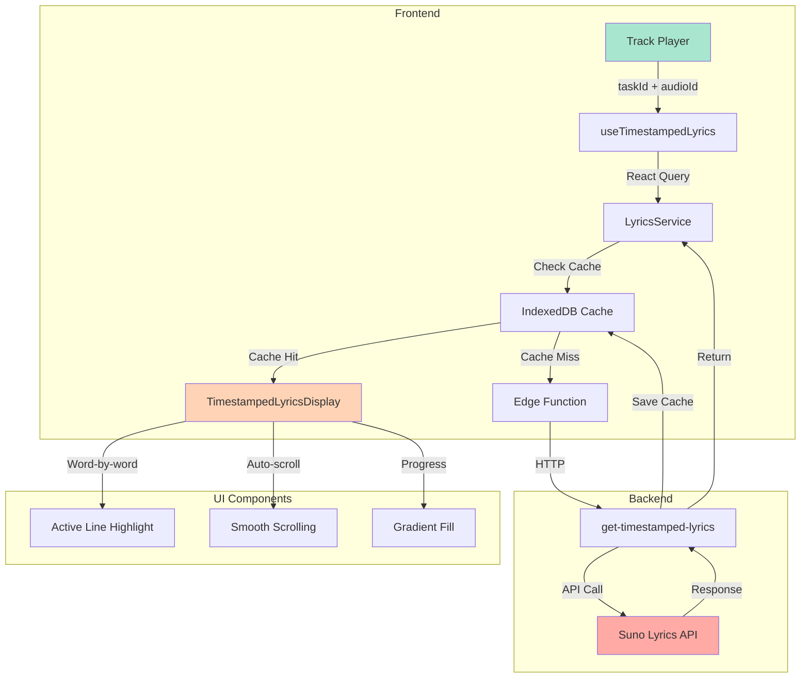
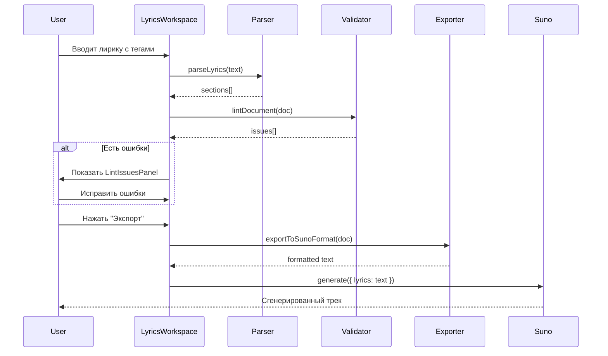
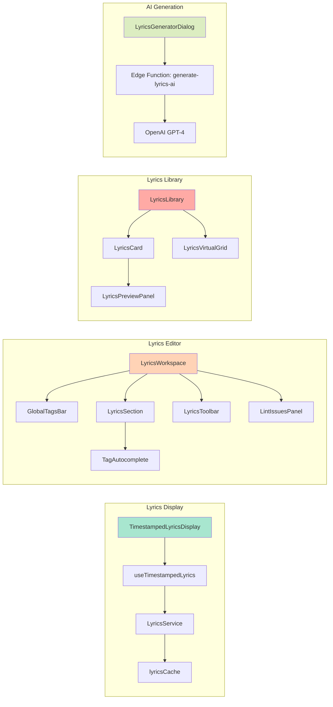
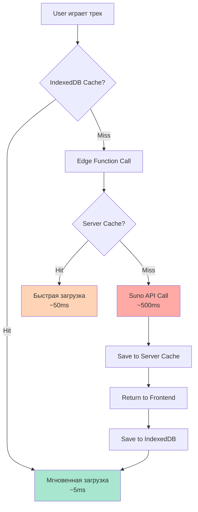

# 🎤 Система лирики Albert3 Muse Synth Studio

**Версия документа**: 2.0
**Дата**: 2025-11-12
**Статус**: Активная разработка

---

## 📋 Содержание

1. [Обзор системы](#обзор-системы)
2. [Архитектура](#архитектура)
3. [Синхронизированная лирика (Timestamped Lyrics)](#синхронизированная-лирика)
4. [Структурированная лирика с тегами](#структурированная-лирика-с-тегами)
5. [Компоненты](#компоненты)
6. [API и сервисы](#api-и-сервисы)
7. [Диаграммы](#диаграммы)
8. [Доработка интерфейса](#доработка-интерфейса)
9. [Roadmap](#roadmap)

---

## 📖 Обзор системы

Albert3 включает три уровня работы с лирикой:

### 1️⃣ **Синхронизированная лирика** (Timestamped Lyrics)
- Каждое слово имеет временные штампы (startS, endS)
- Автоматическая синхронизация с аудио
- Визуальная индикация прогресса каждого слова
- Автоматическая прокрутка к активной строке

### 2️⃣ **Структурированная лирика с тегами**
- Секции (Intro, Verse, Chorus, Bridge, Outro)
- Теги для вокала, инструментов, эмоций, FX
- Lint-проверка структуры
- Экспорт в Suno/Mureka формат

### 3️⃣ **Библиотека лирики**
- Сохранение и повторное использование текстов
- Поиск по тегам, жанрам, настроению
- Версионирование вариантов лирики
- AI-генерация текстов

---

## 🏗️ Архитектура

### Компоненты системы

```
src/
├── components/lyrics/
│   ├── TimestampedLyricsDisplay.tsx    # Синхронизированное отображение
│   ├── LyricsWorkspace.tsx              # Редактор лирики
│   ├── LyricsEditorAdvanced.tsx         # Продвинутый редактор
│   ├── MurekaLyricsVariantDialog.tsx    # Выбор вариантов Mureka
│   ├── LyricsCard.tsx                   # Карточка в библиотеке
│   ├── LyricsGeneratorDialog.tsx        # AI генератор
│   └── workspace/
│       ├── LyricsSection.tsx            # Секция (Verse/Chorus)
│       ├── LyricsToolbar.tsx            # Панель инструментов
│       ├── GlobalTagsBar.tsx            # Глобальные теги
│       └── LintIssuesPanel.tsx          # Панель ошибок
├── hooks/
│   ├── useTimestampedLyrics.ts          # Хук для временных штампов
│   ├── useSaveLyrics.ts                 # Сохранение в базу
│   └── ...
├── services/
│   ├── lyrics.service.ts                # API сервис
│   └── lyrics/
│       ├── lyricsCache.ts               # Кеширование
│       └── lyricsService.ts             # Бизнес-логика
├── types/
│   ├── lyrics.ts                        # TypeScript типы
│   └── lyricsPresets.ts                 # Пресеты
└── utils/
    └── lyricsParser.ts                  # Парсинг и экспорт
```

---

## 🎵 Синхронизированная лирика

### Типы данных

```typescript
interface TimestampedWord {
  word: string;       // "Hello" или "\n"
  success: boolean;   // Успешно распознано
  startS: number;     // Начало (секунды)
  endS: number;       // Конец (секунды)
  palign: number;     // Точность выравнивания
}
```

### Архитектура потока данных

```
Track (Suno/Mureka)
      ↓
  task_id + audio_id
      ↓
LyricsService.getTimestampedLyrics()
      ↓
   ✓ Check IndexedDB Cache
      ↓ (miss)
   ✓ Call Edge Function: get-timestamped-lyrics
      ↓
   ✓ Edge Function → Suno API
      ↓
   ✓ Save to IndexedDB Cache
      ↓
useTimestampedLyrics hook (React Query)
      ↓
TimestampedLyricsDisplay component
      ↓
  Визуализация с анимацией
```

### Ключевые возможности

#### 1. **Пословное отображение**
```tsx
<TimestampedLyricsDisplay
  lyricsData={timestampedWords}
  currentTime={audioPlayer.currentTime}
/>
```

- Группировка слов в строки по символу `\n`
- Highlight активной строки
- Прогресс-бар для каждого слова (градиент)

#### 2. **Автопрокрутка**
```typescript
useEffect(() => {
  if (activeLineIndex !== -1 && scrollRef.current) {
    const activeElement = scrollRef.current.querySelector(
      `[data-line-index="${activeLineIndex}"]`
    );
    activeElement?.scrollIntoView({
      behavior: 'smooth',
      block: 'center',
    });
  }
}, [activeLineIndex]);
```

#### 3. **Кеширование (IndexedDB)**
```typescript
// src/services/lyrics/lyricsCache.ts
class LyricsCache {
  async get(taskId: string, audioId: string): Promise<TimestampedLyricsResponse | null>
  async set(taskId: string, audioId: string, data: TimestampedLyricsResponse): Promise<void>
  async clear(): Promise<void>
}
```

**Преимущества:**
- Офлайн-доступ
- Мгновенная загрузка при повторном воспроизведении
- Экономия трафика

#### 4. **Prefetching**
```typescript
// Предзагрузка лирики следующих 3 треков в очереди
await LyricsService.prefetchLyrics(upcomingTracks);
```

---

## 🏷️ Структурированная лирика с тегами

### Категории тегов

| Категория | Примеры | Цвет | Иконка |
|-----------|---------|------|--------|
| `section` | `[Intro]`, `[Verse 1]`, `[Chorus]` | Синий | `layout` |
| `vocal` | `[Lead Vocal]`, `[Gritty]`, `[Autotune]` | Фиолетовый | `mic` |
| `emotion` | `[Melancholic]`, `[Euphoric]`, `[Angry]` | Розовый | `heart` |
| `instrument` | `[Piano]`, `[808 Sub]`, `[Analog Pad]` | Зеленый | `music` |
| `arrangement` | `[Sparse]`, `[Building Intensity]` | Оранжевый | `layers` |
| `fx` | `[Reverb Heavy]`, `[Delay]`, `[Distortion]` | Голубой | `wand` |
| `tempo` | `[Tempo: 120 BPM]` | Желтый | `gauge` |
| `key` | `[Key: C minor]` | Фиолетовый | `music-2` |
| `language` | `[Language: English]` | Серый | `globe` |
| `content` | `[Clean Lyrics]`, `[Instrumental Only]` | Серый | `shield` |
| `meta` | `[Mix: punchy]`, `[Master: loud]` | Серый | `settings` |

### Структура документа

```typescript
interface SongDocument {
  id: string;
  globalTags: Tag[];      // Теги верхнего уровня (Key, Tempo, Genre)
  sections: Section[];    // Секции лирики
  providerHints?: {};     // Подсказки для AI
  version: number;
  createdAt: string;
  updatedAt: string;
}

interface Section {
  id: string;
  title: string;          // "Verse 1", "Chorus"
  tags: Tag[];            // Теги секции (кроме section tag)
  lines: string[];        // Строки лирики
  order: number;
  isCollapsed?: boolean;
}
```

### Парсинг и экспорт

```typescript
// Парсинг из текста
import { parseLyrics, extractTags } from '@/utils/lyricsParser';

const sections = parseLyrics(`
[Tempo: 120 BPM] [Key: C minor]

[Intro] [Piano] [Melancholic]
Soft piano intro...

[Verse 1] [Lead Vocal] [Building Intensity]
First verse lyrics...

[Chorus] [Euphoric] [808 Sub]
Chorus lyrics...
`);

// Экспорт обратно в Suno формат
const exportedText = exportToSunoFormat(document);
```

### Lint-проверка

```typescript
interface LintIssue {
  id: string;
  severity: 'error' | 'warning' | 'info';
  message: string;
  sectionId?: string;
  tagId?: string;
  suggestion?: string;
}

const issues = lintDocument(document);
// [
//   { severity: 'warning', message: 'Too many instruments (6). Consider 2-3.', ... },
//   { severity: 'error', message: 'Section "Verse 2" is empty', ... },
//   { severity: 'info', message: 'Consider adding a Chorus section', ... }
// ]
```

---

## 🧩 Компоненты

### 1. TimestampedLyricsDisplay

**Путь:** `src/components/lyrics/TimestampedLyricsDisplay.tsx`

**Описание:** Отображает синхронизированную лирику с временными штампами.

**Props:**
```typescript
interface TimestampedLyricsDisplayProps {
  lyricsData: TimestampedWord[];
  currentTime: number;
  className?: string;
}
```

**Возможности:**
- Группировка слов в строки
- Highlight активной строки
- Прогресс-бар для каждого слова
- Автопрокрутка к текущей строке
- Анимация с Framer Motion

**Производительность:**
- `useMemo` для группировки строк
- `useMemo` для activeLineIndex
- Debounced scroll

---

### 2. LyricsWorkspace

**Путь:** `src/components/lyrics/workspace/LyricsWorkspace.tsx`

**Описание:** Редактор структурированной лирики с тегами.

**Возможности:**
- Drag & Drop секций
- Автокомплит тегов
- Lint-проверка в реальном времени
- Пресеты структур (Pop, Rock, Hip-Hop)
- Экспорт в Suno/Mureka

**Компоненты:**
- `LyricsToolbar` - Панель инструментов
- `GlobalTagsBar` - Глобальные теги (Key, Tempo, Genre)
- `LyricsSection` - Редактируемая секция
- `LintIssuesPanel` - Панель ошибок
- `RawTextEditor` - Режим сырого текста

---

### 3. MurekaLyricsVariantDialog

**Путь:** `src/components/lyrics/MurekaLyricsVariantDialog.tsx`

**Описание:** Выбор варианта лирики из Mureka AI (4 варианта).

**Возможности:**
- Отображение 4 вариантов
- Выбор предпочтительного
- Сохранение в metadata
- Автоматическое продолжение генерации

**Realtime обновления:**
```typescript
useMurekaLyricsSubscription({
  trackId: params.trackId,
  enabled: !!params.trackId,
  onLyricsStage: ({ trackId, jobId }) => {
    setMurekaLyricsDialog({ open: true, trackId, jobId });
  },
});
```

---

### 4. LyricsGeneratorDialog

**Путь:** `src/components/lyrics/LyricsGeneratorDialog.tsx`

**Описание:** AI генератор лирики с параметрами.

**Параметры:**
- Тема / Mood
- Жанр
- Длина (короткая/средняя/длинная)
- Язык
- Структура (Auto/Custom)

---

## 🛠️ API и сервисы

### LyricsService

**Путь:** `src/services/lyrics.service.ts`

**Методы:**

#### `getTimestampedLyrics({ taskId, audioId })`
Получить синхронизированную лирику из Suno API.

**Поток:**
1. Проверка IndexedDB cache
2. Если miss → вызов Edge Function
3. Edge Function → Suno API
4. Сохранение в cache
5. Возврат данных

**Кеширование:**
- `staleTime: Infinity` (не устаревает)
- `gcTime: 1 hour` (удаляется через час)

#### `prefetchLyrics(tracks[])`
Предзагрузка лирики следующих треков.

**Применение:** При добавлении треков в очередь плеера.

#### `clearCache()`
Очистка IndexedDB кеша.

---

### Edge Function: get-timestamped-lyrics

**Путь:** `supabase/functions/get-timestamped-lyrics/index.ts`

**Описание:** Прокси для Suno Lyrics API с кешированием.

**Эндпоинт:**
```
POST /functions/v1/get-timestamped-lyrics
Body: { taskId: string, audioId: string }
```

**Ответ:**
```typescript
{
  success: boolean;
  data: {
    alignedWords: TimestampedWord[];
    waveformData: number[];
    hootCer: number;
    isStreamed: boolean;
  };
  cached: boolean;
  error?: string;
}
```

**Оптимизации:**
- Server-side кеш (Redis или Postgres)
- Retry с exponential backoff
- Circuit breaker для Suno API

---

## 📊 Диаграммы

### Архитектура системы лирики



---

### Поток создания структурированной лирики



---

### Компонентная архитектура



---

### Кеширование и производительность



---

## 🚀 Доработка интерфейса

### Критические улучшения (P0)

#### 1. **Мобильная оптимизация TimestampedLyricsDisplay**
**Проблема:** Текст слишком мелкий на мобильных (< 768px)

**Решение:**
```tsx
// src/components/lyrics/TimestampedLyricsDisplay.tsx
<div className="text-base sm:text-2xl md:text-3xl">
  {/* Сейчас: 1rem / 1.5rem / 1.875rem */}
  {/* Нужно: 1.25rem / 2rem / 2.5rem */}
</div>
```

**Приоритет:** P0 (блокирует UX на мобильных)
**Оценка:** 30 минут

---

#### 2. **Touch-friendly элементы управления**
**Проблема:** Кнопки < 44px (WCAG минимум)

**Решение:**
```tsx
// Добавить класс touch-target-min (44px)
<Button className="touch-target-min">
  <PlayIcon />
</Button>
```

**Приоритет:** P0 (accessibility)
**Оценка:** 1 час (аудит всех кнопок)

---

### Высокоприоритетные улучшения (P1)

#### 3. **Темная тема для лирики**
**Описание:** Добавить темную тему для ночного прослушивания.

**Дизайн:**
- Черный фон (`bg-black`)
- Текст `text-white` / `text-gray-300`
- Активная строка: `text-primary`
- Прогресс: Gradient `from-primary to-accent`

**Приоритет:** P1
**Оценка:** 2 часа

---

#### 4. **Настройки отображения лирики**
**Возможности:**
- Размер шрифта (S/M/L/XL)
- Скорость прокрутки (Auto/Manual)
- Показывать/скрывать неактивные строки
- Режим караоке (только активная строка)

**UI:**
```tsx
<LyricsSettingsDialog>
  <Select label="Font Size" options={['S', 'M', 'L', 'XL']} />
  <Switch label="Auto-scroll" />
  <Switch label="Karaoke Mode" />
</LyricsSettingsDialog>
```

**Приоритет:** P1
**Оценка:** 4 часа

---

#### 5. **Prefetch Queue оптимизация**
**Описание:** Умная предзагрузка на основе вероятности проигрывания.

**Алгоритм:**
```typescript
const prefetchPriority = (track: Track, queuePosition: number) => {
  const proximityScore = 1 / (queuePosition + 1); // Ближе = выше
  const playCountScore = track.play_count / 100;
  const recentScore = isRecentlyPlayed(track) ? 0.5 : 0;

  return proximityScore + playCountScore + recentScore;
};

// Prefetch top 3 по приоритету
const topTracks = queue
  .map((t, i) => ({ track: t, priority: prefetchPriority(t, i) }))
  .sort((a, b) => b.priority - a.priority)
  .slice(0, 3);
```

**Приоритет:** P1
**Оценка:** 3 часа

---

### Среднеприоритетные улучшения (P2)

#### 6. **Экспорт лирики в файл**
**Форматы:**
- `.lrc` (Synced Lyrics)
- `.txt` (Plain text)
- `.srt` (Subtitles)

**Пример `.lrc`:**
```
[00:12.00]Hello world
[00:15.50]This is a test
[00:19.20]Synchronized lyrics
```

**Приоритет:** P2
**Оценка:** 2 часа

---

#### 7. **Поиск по лирике в библиотеке**
**Возможности:**
- Full-text search по словам
- Фильтрация по тегам
- Фильтрация по настроению
- Сортировка по релевантности

**UI:**
```tsx
<LyricsLibrary>
  <SearchBar placeholder="Поиск по словам, тегам..." />
  <TagFilter tags={['Pop', 'Rock', 'Euphoric']} />
  <LyricsGrid results={filteredLyrics} />
</LyricsLibrary>
```

**Приоритет:** P2
**Оценка:** 5 часов

---

#### 8. **Редактор временных штампов**
**Описание:** Ручная корректировка временных штампов для улучшения синхронизации.

**UI:**
```tsx
<TimestampEditor>
  <Waveform audioUrl={track.audio_url} />
  <LyricsTimeline words={timestampedWords} />
  <WordEditor
    word="Hello"
    startS={12.5}
    endS={13.2}
    onUpdate={handleUpdate}
  />
</TimestampEditor>
```

**Приоритет:** P2
**Оценка:** 8 часов

---

## 📅 Roadmap

### Q4 2025 (Ноябрь - Декабрь)

**Sprint 33** (завершён ✅)
- ✅ Webhook idempotency
- ✅ Storage cleanup
- ✅ P0 fixes (z-index, rate limiting)

**Sprint 34** (15-22 ноября)
- 📋 Webhook signature verification
- 📋 Archive tracks system
- 📋 Integration tests

**Sprint 35: Lyrics UX** (23 ноября - 6 декабря) **⭐ НОВЫЙ**
- 🎯 P0.1: Мобильная оптимизация TimestampedLyricsDisplay
- 🎯 P0.2: Touch-friendly кнопки (audit всех lyrics компонентов)
- 🎯 P1.1: Темная тема для лирики
- 🎯 P1.2: Настройки отображения (размер, прокрутка, караоке)
- 🎯 P1.3: Prefetch queue оптимизация

**Sprint 36: Lyrics Features** (7-20 декабря)
- 📝 P2.1: Экспорт лирики (.lrc, .txt, .srt)
- 📝 P2.2: Поиск по лирике в библиотеке
- 📝 P2.3: Bulk операции в библиотеке

---

### Q1 2026 (Январь - Март)

**Sprint 37: Advanced Lyrics** (Январь)
- 🔧 Редактор временных штампов
- 🔧 Импорт .lrc файлов
- 🔧 Синхронизация с YouTube Music

**Sprint 38: AI Enhancements** (Февраль)
- 🤖 Перевод лирики на другие языки
- 🤖 Улучшение качества AI-генерированной лирики
- 🤖 Автоматическая категоризация по эмоциям

**Sprint 39: Collaboration** (Март)
- 👥 Shared lyrics библиотека
- 👥 Комментарии и annotations
- 👥 Version control для лирики

---

## 📚 Дополнительные ресурсы

### Документация
- [Suno API Lyrics Docs](https://docs.suno.ai/lyrics)
- [LRC Format Specification](https://en.wikipedia.org/wiki/LRC_(file_format))
- [Web Audio API](https://developer.mozilla.org/en-US/docs/Web/API/Web_Audio_API)

### Внутренние документы
- `docs/ARCHITECTURE.md` - Общая архитектура
- `docs/BACKEND_ARCHITECTURE.md` - Edge Functions
- `project-management/SPRINT_STATUS.md` - Статус спринтов

### Примеры использования
- `src/components/player/LyricsDisplay.tsx` - Интеграция в плеер
- `tests/unit/utils/lyricsParser.test.ts` - Unit тесты
- `tests/e2e/lyrics-library.spec.ts` - E2E тесты

---

## 🎯 Метрики успеха

### Производительность
- ⚡ Загрузка лирики: < 100ms (с кешем)
- ⚡ Первая загрузка: < 500ms
- ⚡ Размер IndexedDB: < 50MB (для 100 треков)

### UX
- 👍 Синхронизация: ±50ms точность
- 👍 Плавность прокрутки: 60 FPS
- 👍 Touch targets: ≥ 44px (WCAG AAA)

### Adoption
- 📊 Использование синхронизированной лирики: > 70% пользователей
- 📊 Сохранение в библиотеку: > 30% треков
- 📊 AI-генерация: > 40% новых треков

---

**Версия документа**: 2.0
**Последнее обновление**: 2025-11-12
**Авторы**: Albert3 Development Team
**Контакт**: [GitHub Issues](https://github.com/HOW2AI-AGENCY/albert3-muse-synth-studio/issues)
