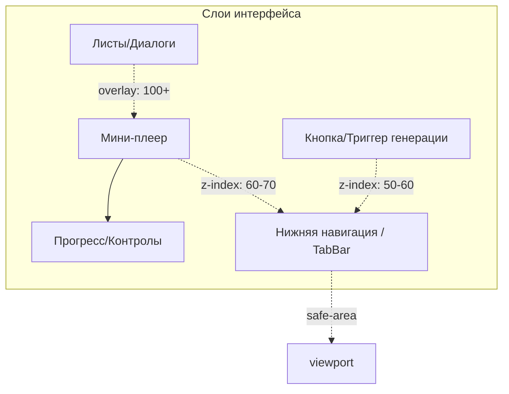
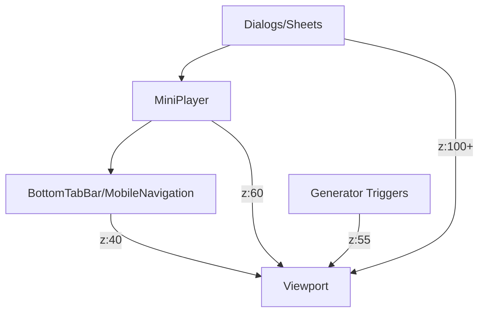
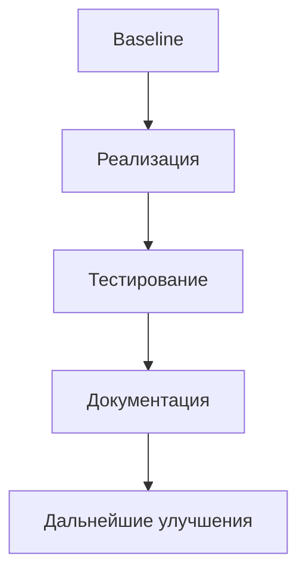

# 📱 План улучшения мобильного интерфейса (UI/UX)

Документ описывает детальный план работ по улучшению интерфейса с акцентом на мобильную версию, включая анализ текущих проблем, переработку формы генерации, реализацию изменений, тестирование и документирование. План привязан к существующим компонентам кода для прозрачной интеграции.

## 🎯 Цели и критерии завершения
- Устранить конфликты перекрытия элементов (`z-index`, позиционирование) между мини-плеером, нижним навбаром и триггерами формы генерации.
- Переработать форму генерации под мобильные устройства: семантика, адаптив, доступность, UX.
- Обеспечить стабильную работу интерфейса на 10+ реальных моделей устройств и основных мобильных браузерах.
- Зафиксировать измеримые улучшения производительности: сокращение времени рендера, повышение FPS анимаций, снижение layout shifts.
- Обновить документацию: гайд по верстке, чек-лист изменений, рекомендации на будущее.

## 🔎 Контекст компонентов (привязка к коду)
- Нижняя навигация: `src/components/navigation/MobileNavigation.tsx`, `src/components/navigation/BottomTabBar.tsx`
- Мини-плеер: `src/components/player/MiniPlayer.tsx`
- Десктопный плеер (связанные контролы/слои): `src/components/player/desktop/DesktopPlayerLayout.tsx`, `src/components/player/desktop/PlaybackControls.tsx`
- Форма генерации и диалоги: 
  - Компактная форма: `src/components/generator/forms/CompactCustomForm.tsx`
  - Контент генератора: `src/components/generator/MusicGeneratorContent.tsx`
  - Мастер проектов: `src/components/projects/ProjectWizardDialog.tsx`
  - Создание проекта: `src/components/projects/CreateProjectDialog.tsx`
  - Выбор проекта: `src/components/generator/ProjectSelectorDialog.tsx`, `src/components/generator/InspoProjectDialog.tsx`
- Карточки треков (мобильные): `src/features/tracks/components/TrackCardMobile.tsx`

## 🧭 Этап 1 — Анализ текущих проблем

### Обследование конфликтов перекрытия
- Проанализировать взаимодействие слоев: мини-плеер, нижний таб-бар/навигация, кнопки/триггеры генерации и листы/диалоги.
- Проверить поведение при следующих состояниях: воспроизведение трека, открытие меню/драйвера (drawer), открытие листов (`Sheet`), диалогов (`Dialog`).



### Матрица тестирования устройств
- iOS: iPhone SE (2/3), iPhone 12/13/14, iPhone 14/15 Pro Max.
- Android: Pixel 5/7, Samsung Galaxy S10/S20/S22, Xiaomi Redmi Note.
- Планшеты: iPad Mini, iPad 9.7, Samsung Tab A (проверка адаптивности и «safe areas»).

### Аудит `z-index` и позиционирования
- Собрать список всех классов/стилей, где используется `position: fixed|absolute|sticky` и явные `z-index`.
- Зафиксировать пересечения: нижняя навигация, мини-плеер, `Sheet/Dialog`, всплывающие меню (`Dropdown/Tooltip`).
- Определить единый масштаб слоев (см. раздел «Политика z-index»).

### Замеры производительности
- Lighthouse Mobile, Web Vitals (TTI, FCP, CLS), React Profiler для ключевых компонентов.
- Отслеживание анимаций (FPS) для `framer-motion` участков.
- Создать baseline: замеры до правок на 3 устройствах (iOS/Android) и 2 браузерах.

Чек-лист Этапа 1
- [ ] Матрица устройств согласована и покрыта.
- [ ] Список конфликтов z-index/позиций собран.
- [ ] Baseline метрик производительности зафиксирован.

## 🏗 Этап 2 — Доработка формы генерации

### HTML-разметка
- Ввести семантическую структуру: заголовки `h2/h3`, группы форм с `fieldset/legend` при необходимости.
- Гарантировать валидность: обязательные атрибуты (`aria-*`), ассоциации `label` ↔ `input`.
- Использовать логичные контейнеры: секции для основных/дополнительных настроек.

### CSS/Адаптив
- Медиа-запросы: ширины `360–480–768–1024+`, плотности DPI, ориентации (`portrait/landscape`).
- Минимальные touch-таргеты: `min-height: 44px`, `min-width: 44px`.
- Работа с ограниченным пространством: сворачиваемые секции (`Collapsible`), компактные слайдеры, lazy-модули.
- Учет `safe-area` на iOS: `padding-bottom: env(safe-area-inset-bottom)` для элементов у нижнего края.
- Управление скроллом: стабильная высота области контента, `ScrollArea` без двойных прокруток.

### UI/UX
- Четкая визуальная иерархия: первичные действия слева/справа по платформенным рекомендациям, вторичные — в меню.
- Touch-контролы: большие кликабельные области, явная обратная связь (haptic/активные состояния).
- Совместимость с Material Design/HIG: отступы, типографика, контраст, состояния (hover/active/focus).

```mermaid
graph TD
  Form[Форма генерации (CompactCustomForm)] --> Section1[Основные параметры]
  Form --> Section2[Доп. настройки]
  Section2 --> Collapsible[Сворачиваемые блоки]
  Form --> Actions[Панель действий]
  Actions --> Primary[Генерация]
  Actions --> Secondary[Сохранить / История]
```

Чек-лист Этапа 2
- [ ] Семантическая разметка обновлена.
- [ ] Медиа-запросы покрывают ключевые брейкпоинты.
- [ ] Touch-таргеты не меньше 44px.
- [ ] Проверена валидность HTML и ARIA.

## 🔧 Этап 3 — Реализация изменений

### Политика слоев (z-index)
- Ввести единый масштаб `z-index` через CSS-переменные (пример):
  - `--z-base: 0` — базовые слои.
  - `--z-navbar: 40` — нижняя навигация.
  - `--z-player: 60` — мини-плеер и его панель.
  - `--z-trigger: 55` — кнопки/триггеры поверх контента, но под плеером.
  - `--z-overlay: 100` — листы/диалоги/меню.
- Применить переменные в: `MobileNavigation.tsx`, `BottomTabBar.tsx`, `MiniPlayer.tsx`, `CompactCustomForm.tsx` (для триггеров), диалоги (`ProjectWizardDialog.tsx`, `CreateProjectDialog.tsx`).

### Позиционирование
- Избегать `position: fixed` там, где возможен `sticky` для снижения конфликтов.
- Стандартизировать контейнер нижней навигации: фиксированная высота, safe-area, отступы от мини-плеера.
- Мини-плеер должен иметь собственный контейнер/стек, исключающий перекрытие активных кнопок навигации.

### Адаптация интерфейса
- Брейкпоинты: выровнять сетку/отступы, обеспечить читаемость на 320–360px ширине.
- Оптимизация формы генерации: компактные контролы, сворачиваемые блоки, lazy для тяжелых подсказчиков.
- Карточка трека (мобильная): проверить все интеракции (play/like/more), исключить перекрытия.



Чек-лист Этапа 3
- [ ] Единая шкала z-index внедрена.
- [ ] Позиционирование унифицировано (fixed/sticky где нужно).
- [ ] Интерфейс адаптирован под ключевые разрешения.
- [ ] Карточка трека прошла аудит интеракций.

## 🧪 Этап 4 — Тестирование

### Кросс-браузерное и кросс-девайсное
- Минимум 10 моделей устройств (см. Этап 1) и браузеры: Safari, Chrome, Firefox, Edge (мобильные версии где доступны).
- Проверка в `portrait/landscape`, с включенными/выключенными safe areas.

### Юзабилити
- Сессии с 5–10 пользователями: сценарии генерации, воспроизведение треков, навигация.
- Сбор фидбека: проблемные зоны, понятность элементов, подтверждение касаний и анимаций.

### Производительность
- Повторные замеры Lighthouse/Web Vitals/React Profiler.
- Сравнение с baseline: фиксируем улучшения и узкие места.

Чек-лист Этапа 4
- [ ] Тестирование на устройствах выполнено.
- [ ] Юзабилити-сессии проведены, фидбек обработан.
- [ ] Метрики улучшены относительно baseline.

## 📘 Этап 5 — Документирование

### Руководство по мобильной верстке
- Принципы работы с `z-index` и позиционированием.
- Рекомендации по адаптиву, брейкпоинтам и `safe-area`.
- Стандарты touch-таргетов, типографики и контраста.

### Фиксация изменений
- Чек-лист выполненных задач: компоненты, слои, стили.
- Описание принятых решений и компромиссов.

### Рекомендации по развитию
- План дальнейших улучшений: анимации, микровзаимодействия, прогрессивные улучшения.
- Приоритеты следующих итераций: расширение тестовой матрицы, внедрение визуальных регресс-тестов.



## 🔨 Конкретные точки изменений (пошагово)
- Ввести CSS-переменные для шкалы `z-index` в общих стилях (например, `tokens.css` или корневой `:root`).
- Обновить `MobileNavigation.tsx` и `BottomTabBar.tsx`: применить `--z-navbar`, учесть `env(safe-area-inset-bottom)`.
- Обновить `MiniPlayer.tsx`: применить `--z-player`, корректный контейнер, исключить перекрытие.
- Переработать `CompactCustomForm.tsx`: семантика, адаптив, touch-таргеты ≥44px.
- Проверить диалоги (`ProjectWizardDialog.tsx`, `CreateProjectDialog.tsx`): `--z-overlay`, блокировка прокрутки и фокуса.
- Аудит `TrackCardMobile.tsx`: проверка кнопок и состояний, отсутствие перекрытий.

## ✅ Итоговый чек-лист проекта
- [ ] Анализ проблем и сбор baseline.
- [ ] Переработка формы генерации (HTML/CSS/UX).
- [ ] Системная корректировка `z-index` и позиционирования.
- [ ] Адаптация интерфейса под мобильные разрешения.
- [ ] Полный аудит и оптимизация карточки трека.
- [ ] Комплексное тестирование + юзабилити.
- [ ] Документация и рекомендации.

---

Если потребуется, дополню документ схемами внедрения токенов `z-index`, примерами CSS-правил и checklist для визуальных регресс-тестов.