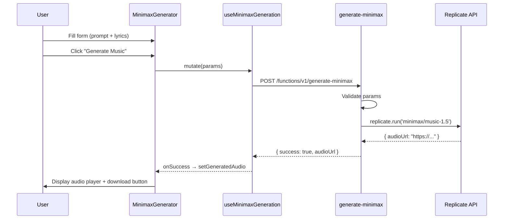
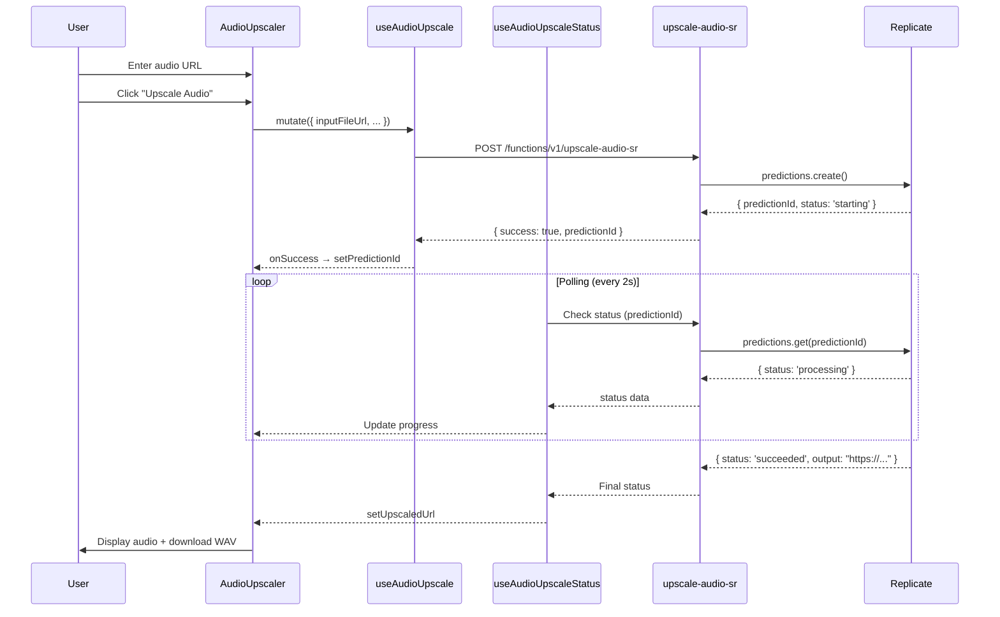

# 🎹 Music Studio — Документация

## Обзор

**Music Studio** — комплексная страница для продвинутой работы с музыкой, объединяющая три мощных инструмента:

1. **MiniMax Music-1.5** — генерация полноценных песен (до 4 минут)
2. **AudioSR** — AI-апсемплинг аудио до 48kHz
3. **Prompt DJ** — реалтайм-микширование промптов

## 🎛️ Вкладки Studio

### 1. MiniMax Generator

**Назначение:** Генерация музыки с вокалом через MiniMax Music-1.5 (Replicate API)

**Основные возможности:**
- 🎵 Длительность до 4 минут
- 🎤 Естественный вокал
- 🎹 Богатая инструментовка
- 📝 Поддержка lyrics (10-600 символов)
- 🎨 Reference audio для стиля

**Параметры:**

| Параметр | Обязательный | Лимиты | Описание |
|----------|--------------|---------|----------|
| **Prompt** | ✅ | 10-300 символов | Описание стиля, жанра, настроения |
| **Lyrics** | ✅ | 10-600 символов | Текст песни с поддержкой тегов |
| **Reference Audio URL** | ❌ | — | Ссылка на референсный трек |
| **Style Strength** | ❌ | 0.0-1.0 | Влияние референса (если указан) |
| **Sample Rate** | ❌ | 44100 Hz | Частота дискретизации |
| **Bitrate** | ❌ | 256 kbps | Битрейт аудио |
| **Audio Format** | ❌ | mp3/wav | Формат выхода |

**Поддержка тегов в Lyrics:**
```
[intro]
Opening instrumental

[verse]
First verse lyrics here
Another line

[chorus]
Hook lyrics
Catchy part

[bridge]
Bridge section

[outro]
Ending part
```

**Примеры промптов:**

```typescript
// Blues
{
  prompt: "blues, melancholic, raw, lonely bar, heartbreak",
  lyrics: "[verse]\nDim lights on a dusty floor\n[chorus]\nOh these barroom blues"
}

// Alt-Pop
{
  prompt: "Fast paced alt-pop with ragga breaks, Tempo 120-135 BPM, glitch pop, y2k-inspired",
  lyrics: "[verse 1]\nStuck in my head but I feel better\n[chorus]\nI put on my gold jacket"
}

// Jazz
{
  prompt: "Jazz, Smooth Jazz, Romantic, Dreamy",
  lyrics: "[Verse]\nIn the hush of night, we find our space\n[Bridge]\nYour voice, a lullaby"
}
```

**Технический поток:**



---

### 2. Audio Upscaler

**Назначение:** AI-апсемплинг аудио до 48kHz через AudioSR

**Основные возможности:**
- ✨ Улучшение качества аудио
- 📈 Upsampling до 48 kHz
- 🎚️ Поддержка длинных файлов (truncated batches)
- ⚙️ Настройки DDIM steps и Guidance Scale

**Параметры:**

| Параметр | Обязательный | Лимиты | Описание |
|----------|--------------|---------|----------|
| **Input URL** | ✅ | — | Ссылка на аудиофайл (MP3/WAV/M4A) |
| **DDIM Steps** | ❌ | 10-100 | Количество шагов инференса |
| **Guidance Scale** | ❌ | 1.0-10.0 | Classifier-free guidance |
| **Truncated Batches** | ❌ | true | Для длинных файлов (>5.12s) |

**Технический поток:**



**Состояния обработки:**
- `starting` → Инициализация
- `processing` → Обработка (показывается Progress bar)
- `succeeded` → Готово (audio player + download)
- `failed` → Ошибка (показывается сообщение)

---

### 3. Prompt DJ

**Назначение:** Реалтайм-микширование музыки с Gemini Lyria API

**Подробности:** См. `docs/PROMPT_DJ_GUIDE.md`

**Краткое описание:**
- 🎛️ 16 промпт-контроллеров
- 🔄 Реалтайм-микширование
- 🎨 Визуализация аудио
- 🎧 WebSocket стриминг

---

## 🏗️ Архитектура

### Backend (Edge Functions)

**1. generate-minimax**

```typescript
// supabase/functions/generate-minimax/index.ts

interface MinimaxGenerationRequest {
  prompt: string;           // 10-300 chars
  lyrics: string;          // 10-600 chars
  referenceAudioUrl?: string;
  styleStrength?: number;  // 0-1
  sampleRate?: number;     // default 44100
  bitrate?: number;        // default 256000
  audioFormat?: 'mp3' | 'wav';
}

// Returns:
{
  success: true,
  audioUrl: "https://replicate.delivery/...",
  prompt: "...",
  lyrics: "..."
}
```

**2. upscale-audio-sr**

```typescript
// supabase/functions/upscale-audio-sr/index.ts

interface AudioUpscaleRequest {
  inputFileUrl: string;
  truncatedBatches?: boolean; // default true
  ddimSteps?: number;        // default 50
  guidanceScale?: number;    // default 3.5
  seed?: number;
  predictionId?: string;     // For status check
}

// Returns (initial):
{
  success: true,
  predictionId: "abc123...",
  status: "starting"
}

// Returns (status check):
{
  status: "succeeded",
  output: "https://replicate.delivery/...wav"
}
```

### Frontend

**Структура компонентов:**

```
src/
├── pages/workspace/
│   └── Studio.tsx                 # Main page (tabs)
├── components/studio/
│   ├── MinimaxGenerator.tsx       # MiniMax form
│   └── AudioUpscaler.tsx          # AudioSR form
├── components/prompt-dj/
│   └── PromptDJ.tsx               # Prompt DJ UI
├── hooks/
│   ├── useMinimaxGeneration.ts    # MiniMax hook
│   └── useAudioUpscale.ts         # AudioSR hook
└── utils/
    └── PromptDJHelper.ts          # Prompt DJ logic
```

---

## 🚀 Использование

### MiniMax Generator

```typescript
import { useMinimaxGeneration } from '@/hooks/useMinimaxGeneration';

const { mutate, isPending } = useMinimaxGeneration();

const handleGenerate = () => {
  mutate(
    {
      prompt: "blues, melancholic, heartbreak",
      lyrics: "[verse]\nSad lyrics here\n[chorus]\nMore sadness",
      sampleRate: 44100,
      bitrate: 256000,
      audioFormat: 'mp3'
    },
    {
      onSuccess: (data) => {
        console.log('Generated:', data.audioUrl);
      }
    }
  );
};
```

### Audio Upscaler

```typescript
import { useAudioUpscale, useAudioUpscaleStatus } from '@/hooks/useAudioUpscale';

const { mutate: upscale } = useAudioUpscale();
const [predictionId, setPredictionId] = useState<string | null>(null);

// Start upscaling
upscale(
  {
    inputFileUrl: 'https://example.com/audio.mp3',
    truncatedBatches: true,
    ddimSteps: 50,
    guidanceScale: 3.5
  },
  {
    onSuccess: (data) => setPredictionId(data.predictionId)
  }
);

// Poll status
const { data: status } = useAudioUpscaleStatus(predictionId, !!predictionId);

useEffect(() => {
  if (status?.status === 'succeeded') {
    console.log('Upscaled:', status.output);
  }
}, [status]);
```

---

## ⚙️ Конфигурация

### Переменные окружения

**Required:**
- `REPLICATE_API_KEY` — Replicate API ключ (уже настроен)
- `GOOGLE_AI_API_KEY` — Для Prompt DJ (уже настроен)

### Навигация

Страница Studio доступна по адресу:
- **Path:** `/workspace/studio`
- **Icon:** `Headphones` (уже в навигации)
- **Tab Index:** Уже активен в боковой панели

---

## 🐛 Troubleshooting

### MiniMax Generator

**Ошибка: "Prompt must be 10-300 characters"**
- Проверьте длину промпта
- Убедитесь, что промпт не пустой

**Ошибка: "Lyrics must be 10-600 characters"**
- Проверьте длину текста
- Минимум 10 символов, максимум 600

**Генерация не начинается:**
- Проверьте `REPLICATE_API_KEY` в Supabase secrets
- Убедитесь, что Replicate API доступен
- Проверьте консоль браузера

### Audio Upscaler

**Статус застрял на "processing":**
- Обработка может занять до 2-5 минут
- Проверьте размер входного файла
- Для больших файлов используйте `truncatedBatches: true`

**Ошибка "prediction failed":**
- Проверьте формат входного файла (MP3/WAV/M4A)
- Убедитесь, что URL доступен публично
- Проверьте логи edge function

### Prompt DJ

См. `docs/PROMPT_DJ_GUIDE.md`

---

## 📊 Ограничения

### MiniMax Music-1.5

| Параметр | Лимит |
|----------|-------|
| Макс. длительность | 240 секунд (4 минуты) |
| Макс. lyrics | 600 символов |
| Reference audio | 60 MB, 5-30 секунд |
| Поддерживаемые языки | English, Chinese |

### AudioSR

| Параметр | Лимит |
|----------|-------|
| Макс. размер файла | Зависит от Replicate |
| Truncated batches | 5.12 секунд на батч |
| Output format | WAV 48kHz |

### Prompt DJ

| Параметр | Лимит |
|----------|-------|
| Макс. промптов | 16 |
| Веса | 0.0 - 1.0 |
| WebSocket timeout | 30 секунд keepalive |

---

## 🔮 Будущие улучшения

### Планируется:

1. **MiniMax:**
   - Upload local reference audio
   - Batch generation
   - Save to Library integration

2. **AudioSR:**
   - Batch upscaling
   - Queue management
   - Compare before/after

3. **Studio:**
   - Workflow automation (MiniMax → AudioSR)
   - Preset management
   - Export to projects

4. **Integration:**
   - Save generated tracks to Library
   - Apply personas/styles
   - Share to projects

---

**Версия:** 1.0.0  
**Дата:** 2025-11-02  
**Статус:** Production Ready
