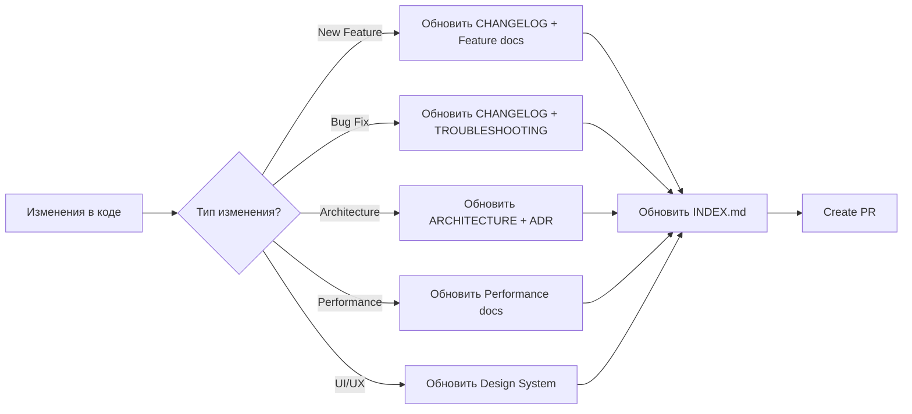

# 🧭 Навигационная карта документации

**Быстрые ссылки:** [Главная README](../README.md) • [Индекс документации](INDEX.md) • [Защищенные файлы](PROTECTED_FILES.md)

---

## 📊 Интерактивная карта связей

```mermaid
graph TB
    README[📖 README.md]
    INDEX[📚 INDEX.md]
    PROTECTED[🔒 PROTECTED_FILES.md]
    CONTRIBUTING[🤝 CONTRIBUTING.md]
    
    README --> INDEX
    README --> PROTECTED
    README --> CONTRIBUTING
    
    INDEX --> ARCH[🏗️ Архитектура]
    INDEX --> DEV[💻 Разработка]
    INDEX --> FEATURES[🎵 Features]
    INDEX --> AUDIT[📊 Аудиты]
    INDEX --> IMPL[🚀 Имплементация]
    
    ARCH --> ARCH_MAIN[ARCHITECTURE.md]
    ARCH --> ARCH_DIAG[ARCHITECTURE_DIAGRAMS.md]
    ARCH --> BACKEND[BACKEND_ARCHITECTURE.md]
    ARCH --> DB[DATABASE_SCHEMA.md]
    
    DEV --> QUICK[QUICK_START_V3.md]
    DEV --> DEVGUIDE[DEVELOPER_GUIDE.md]
    DEV --> TROUBLE[TROUBLESHOOTING.md]
    
    FEATURES --> PLAYER[PLAYER_ARCHITECTURE.md]
    FEATURES --> GEN[GENERATION_SYSTEM_AUDIT.md]
    FEATURES --> LYRICS[LYRICS_SYSTEM.md]
    
    PROTECTED --> TYPES[src/types/domain/track.types.ts]
    PROTECTED --> REPO[src/repositories/]
    PROTECTED --> SUNO[supabase/functions/_shared/suno.ts]
    PROTECTED --> MUREKA[supabase/functions/_shared/mureka.ts]
```



---

## 🎯 1. Маршруты для новых разработчиков

### Путь 1: Быстрый старт (15 минут)
```
START → Quick Start V3 → Developer Guide → First Issue
  ↓         ↓                ↓                ↓
 Setup    Понимание       Настройка      Первый
         архитектуры       окружения     контрибьют
```

**Файлы:**
1. [QUICK_START_V3.md](QUICK_START_V3.md) - 5 мин
2. [DEVELOPER_GUIDE.md](DEVELOPER_GUIDE.md) - 10 мин
3. [CONTRIBUTING.md](CONTRIBUTING.md) - Изучить перед PR

### Путь 2: Глубокое погружение (2-3 часа)
```
START → Architecture → Components → Testing → Deploy
  ↓          ↓             ↓           ↓         ↓
README  ARCHITECTURE  COMPONENT   Testing    Deploy
         .md          GUIDE.md    Guide    Checklist
```

**Файлы:**
1. [README.md](README.md)
2. [ARCHITECTURE.md](ARCHITECTURE.md)
3. [COMPONENT_GUIDE.md](COMPONENT_GUIDE.md)
4. [Testing Guide](../tests/README.md)
5. [DEPLOYMENT_CHECKLIST.md](DEPLOYMENT_CHECKLIST.md)

---

## 🏗️ 2. Архитектурные связи

### Core System Documentation Flow
```
ARCHITECTURE.md (main)
    ├── BACKEND_ARCHITECTURE.md
    ├── DATABASE_SCHEMA.md
    ├── PLAYER_ARCHITECTURE.md
    ├── GENERATION_SYSTEM_AUDIT.md
    └── VERSIONING_SYSTEM.md
```

### Code → Docs Mapping
```
src/types/domain/track.types.ts
    ↓ документация
    └── PROTECTED_FILES.md → ARCHITECTURE.md

src/repositories/
    ↓ документация
    └── PROTECTED_FILES.md → Repository Pattern section

supabase/functions/_shared/suno.ts
    ↓ документация
    └── SUNO_API_INTEGRATION.md → PROTECTED_FILES.md
```

---

## 🎵 3. Feature Documentation Flow

### Music Generation
```
User Flow → API Docs → Implementation → Testing
    ↓           ↓            ↓             ↓
USER_FLOWS  API.md   GENERATION_    TESTING.md
   .md              SYSTEM_AUDIT.md
```

**Связанные файлы:**
- [USER_FLOWS.md](USER_FLOWS.md) - Пользовательские сценарии
- [API.md](API.md) - REST API
- [GENERATION_SYSTEM_AUDIT.md](GENERATION_SYSTEM_AUDIT.md) - Система генерации
- [SUNO_API_INTEGRATION.md](SUNO_API_INTEGRATION.md) - Suno интеграция
- [MUSIC_PROVIDERS_GUIDE.md](MUSIC_PROVIDERS_GUIDE.md) - Сравнение провайдеров

### Audio Player
```
Player Architecture → Components → Hooks → Testing
        ↓                  ↓         ↓         ↓
PLAYER_ARCHITECTURE  Component  Audio     Testing
       .md           Guide      Hooks      Guide
```

**Связанные файлы:**
- [PLAYER_ARCHITECTURE.md](PLAYER_ARCHITECTURE.md) - Архитектура плеера
- [PLAYER_SYSTEM_AUDIT.md](PLAYER_SYSTEM_AUDIT.md) - Системный аудит
- [AUDIO_PLAYER_AUDIT.md](AUDIO_PLAYER_AUDIT.md) - Детальный аудит
- [WEEK_5_MODULAR_REFACTORING.md](WEEK_5_MODULAR_REFACTORING.md) - Рефакторинг Week 5

---

## 📊 4. Audit & Status Reports Flow

### Weekly Status Reports
```
Week 1 → Week 2 → Week 3 → Week 4 → Week 5 → Week 6
  ↓        ↓        ↓        ↓        ↓        ↓
Phase 1  Phase 2  Smart   Loading  Modular  Advanced
Complete Complete Loading Screens Refactor Performance
```

**Хронология файлов:**
1. [PHASE_1_COMPLETE.md](PHASE_1_COMPLETE.md) - Week 1
2. [WEEK_2_COMPONENT_REFACTORING.md](WEEK_2_COMPONENT_REFACTORING.md) - Week 2
3. [WEEK_3_STATUS.md](WEEK_3_STATUS.md) - Week 3 Smart Loading
4. [WEEK_4_STATUS.md](WEEK_4_STATUS.md) - Week 4 Skeletons
5. [WEEK_5_MODULAR_REFACTORING.md](WEEK_5_MODULAR_REFACTORING.md) - Week 5
6. [WEEK_6_ADVANCED_PERFORMANCE.md](WEEK_6_ADVANCED_PERFORMANCE.md) - Week 6

### Comprehensive Audits
```
Project Audit → System Audits → Component Audits → Fixes
      ↓               ↓                ↓              ↓
COMPREHENSIVE   GENERATION      AUDIO_PLAYER    BUG_FIXES
PROJECT_AUDIT   SYSTEM_AUDIT    AUDIT           _2025.md
```

---

## 🔧 5. Maintenance Documentation

### Database Migrations
```
Migration Guide → Naming Guidelines → Schema Docs → RLS Policies
       ↓                 ↓                ↓             ↓
MIGRATION_GUIDE  MIGRATION_NAMING  DATABASE_    SECURITY.md
    .md          _GUIDELINES.md    SCHEMA.md
```

### Deployment Flow
```
Development → Testing → Staging → Production
     ↓           ↓         ↓          ↓
DEVELOPER   TESTING   DEPLOY    SENTRY
GUIDE.md    GUIDE     CHECKLIST SETUP.md
```

---

## 🚀 6. Implementation Plans

### Roadmap Structure
```
Master Roadmap
    ├── 10 Week Plan
    ├── Implementation Roadmap 2025
    └── Weekly Status Reports
            ├── Week 1-2: Performance
            ├── Week 3-4: Loading
            ├── Week 5-6: Refactoring
            └── Week 7+: Advanced Features
```

**Главные файлы:**
- [MASTER_IMPROVEMENT_ROADMAP.md](MASTER_IMPROVEMENT_ROADMAP.md) - Главный план
- [10_WEEK_IMPLEMENTATION_PLAN.md](10_WEEK_IMPLEMENTATION_PLAN.md) - 10 недель
- [IMPLEMENTATION_ROADMAP_2025-11-04.md](IMPLEMENTATION_ROADMAP_2025-11-04.md) - Дорожная карта

---

## 📱 7. Mobile Development Path

```
Mobile Audit → Optimization → Testing → Deployment
      ↓             ↓            ↓          ↓
MOBILE_AUDIT  MOBILE_OPT   MOBILE_TEST  RESPONSIVE
_2025.md      .md          CHECKLIST    DESIGN.md
```

**Связанные файлы:**
- [MOBILE_AUDIT_2025_10_12.md](MOBILE_AUDIT_2025_10_12.md) - Октябрьский аудит
- [MOBILE_OPTIMIZATION.md](MOBILE_OPTIMIZATION.md) - План оптимизации
- [MOBILE_OPTIMIZATION_IMPLEMENTATION.md](MOBILE_OPTIMIZATION_IMPLEMENTATION.md) - Имплементация
- [MOBILE_OPTIMIZATION_SUMMARY_2025-11-13.md](MOBILE_OPTIMIZATION_SUMMARY_2025-11-13.md) - Итоги
- [MOBILE_TESTING_CHECKLIST.md](MOBILE_TESTING_CHECKLIST.md) - Чеклист тестирования
- [RESPONSIVE_DESIGN_GUIDE.md](RESPONSIVE_DESIGN_GUIDE.md) - Responsive дизайн

---

## 🎨 8. Design System Evolution

```
V1 → V2 → V3 → V4 (current)
                 ↓
         DESIGN_SYSTEM_V4.md
                 ↓
         ├── spacing.css
         ├── effects.css
         ├── player.css
         └── lyrics.css
```

**Активные файлы:**
- [DESIGN_SYSTEM_V4.md](DESIGN_SYSTEM_V4.md) - Текущая версия
- [UI_UX_DESIGN_SYSTEM.md](UI_UX_DESIGN_SYSTEM.md) - UI/UX принципы
- [Z_INDEX_SYSTEM.md](Z_INDEX_SYSTEM.md) - Z-index управление

**Deprecated:**
- [DESIGN_SYSTEM_V3.md](DESIGN_SYSTEM_V3.md) - Устарела, использовать V4

---

## 🔗 9. Cross-Reference Guide

### Когда читать какой документ?

| Вопрос | Документ |
|--------|----------|
| Как начать разработку? | [QUICK_START_V3.md](QUICK_START_V3.md) |
| Какие файлы нельзя менять? | [PROTECTED_FILES.md](PROTECTED_FILES.md) |
| Как устроена архитектура? | [ARCHITECTURE.md](ARCHITECTURE.md) |
| Как деплоить? | [DEPLOYMENT_CHECKLIST.md](DEPLOYMENT_CHECKLIST.md) |
| Как добавить feature? | [CONTRIBUTING.md](CONTRIBUTING.md) |
| Как работает player? | [PLAYER_ARCHITECTURE.md](PLAYER_ARCHITECTURE.md) |
| Как работает генерация? | [GENERATION_SYSTEM_AUDIT.md](GENERATION_SYSTEM_AUDIT.md) |
| Проблемы с mobile? | [MOBILE_OPTIMIZATION_SUMMARY_2025-11-13.md](MOBILE_OPTIMIZATION_SUMMARY_2025-11-13.md) |
| Ошибки в коде? | [TROUBLESHOOTING.md](TROUBLESHOOTING.md) |
| История изменений? | [CHANGELOG.md](CHANGELOG.md) |

---

## 📖 10. Documentation Update Flow

### Когда обновлять документацию?



### Checklist обновления документации
- [ ] Обновлен ли [CHANGELOG.md](CHANGELOG.md)?
- [ ] Обновлен ли [INDEX.md](INDEX.md)?
- [ ] Добавлены ли ссылки в [NAVIGATION.md](NAVIGATION.md)?
- [ ] Обновлен ли [PROTECTED_FILES.md](PROTECTED_FILES.md) (если новые критичные файлы)?
- [ ] Обновлена ли дата "Последнее обновление"?

---

## 🔍 11. Search Guide

### Как найти нужную информацию?

1. **По теме:**
   - Используйте [INDEX.md](INDEX.md) - структурированный поиск
   
2. **По ключевым словам:**
   - `Ctrl+F` в [INDEX.md](INDEX.md)
   - GitHub Search: `repo:HOW2AI-AGENCY/albert3-muse-synth-studio "keyword"`
   
3. **По типу информации:**
   - Архитектура → [ARCHITECTURE.md](ARCHITECTURE.md)
   - API → [API.md](API.md)
   - Баги → [TROUBLESHOOTING.md](TROUBLESHOOTING.md)
   - Статус → Weekly Status Reports
   
4. **По дате:**
   - Проверяйте "Последнее обновление" в конце документов
   - Новые документы обычно в корне `docs/`
   - Старые в `docs/archive/`

---

## 📞 Support & Questions

**Не нашли нужную информацию?**

1. Проверьте [TROUBLESHOOTING.md](TROUBLESHOOTING.md)
2. Используйте [INDEX.md](INDEX.md) для поиска
3. Создайте Issue с тегом `documentation`
4. Спросите в Slack/Discord канале проекта

---

## ✅ Quick Actions

### Хочу начать разрабатывать:
```bash
# 1. Прочитать
docs/QUICK_START_V3.md
docs/PROTECTED_FILES.md  # КРИТИЧНО!
CONTRIBUTING.md

# 2. Setup
npm install
npm run dev

# 3. First PR
# Следовать CONTRIBUTING.md
```

### Хочу понять архитектуру:
```bash
# Читать в этом порядке:
1. docs/ARCHITECTURE.md
2. docs/ARCHITECTURE_DIAGRAMS.md
3. docs/BACKEND_ARCHITECTURE.md
4. docs/PLAYER_ARCHITECTURE.md
5. docs/GENERATION_SYSTEM_AUDIT.md
```

### Хочу найти bug fix:
```bash
# Проверить эти файлы:
docs/TROUBLESHOOTING.md
docs/BUG_FIXES_2025-11-07.md
docs/FIXES_APPLIED.md
CHANGELOG.md
```

---

*Последнее обновление: 2025-11-17*  
*Версия навигации: 1.0.0*  
*Всего документов: 150+*
