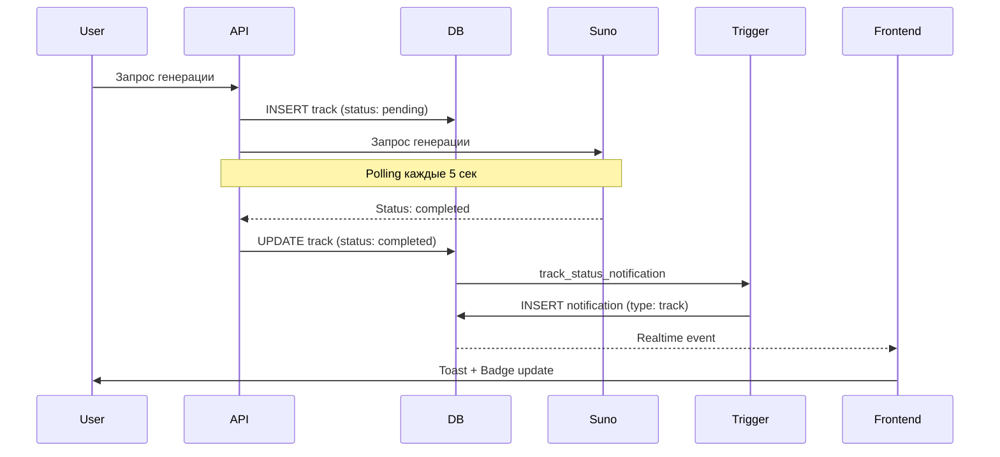
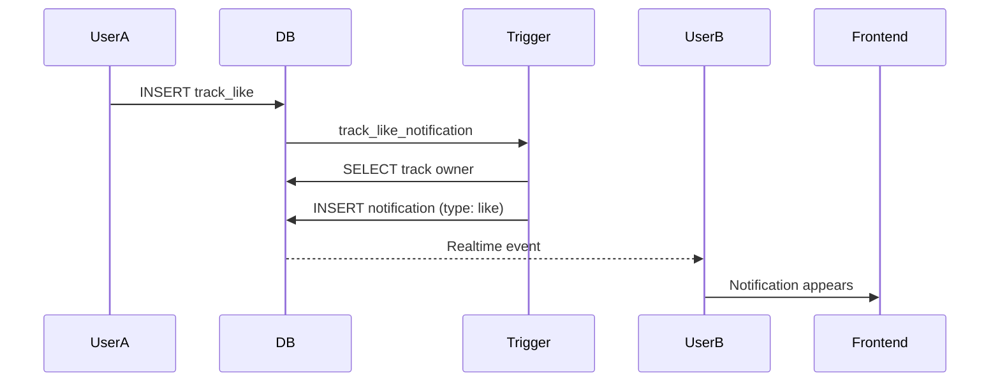

# Система уведомлений Albert3 Muse Synth Studio

## 📋 Обзор

Система уведомлений обеспечивает информирование пользователей о важных событиях в приложении в режиме реального времени.

## 🗄️ Архитектура базы данных

### Таблица `notifications`

```sql
CREATE TABLE public.notifications (
  id UUID PRIMARY KEY DEFAULT gen_random_uuid(),
  user_id UUID NOT NULL REFERENCES auth.users(id) ON DELETE CASCADE,
  type TEXT NOT NULL CHECK (type IN ('track', 'like', 'comment', 'system', 'generation', 'error')),
  title TEXT NOT NULL,
  message TEXT NOT NULL,
  link TEXT,
  read BOOLEAN NOT NULL DEFAULT false,
  created_at TIMESTAMP WITH TIME ZONE NOT NULL DEFAULT now(),
  updated_at TIMESTAMP WITH TIME ZONE NOT NULL DEFAULT now()
);
```

### Типы уведомлений

| Тип | Описание | Иконка | Цвет |
|-----|----------|--------|------|
| `track` | Трек успешно сгенерирован | 🎵 Music | Primary |
| `like` | Новый лайк на треке | ❤️ Heart | Red |
| `comment` | Новый комментарий | 💬 MessageCircle | Blue |
| `system` | Системные сообщения | 🔔 Bell | Accent |
| `generation` | Процесс генерации | 🎵 Music | Primary |
| `error` | Ошибка генерации | ⚠️ AlertCircle | Destructive |

### Индексы

```sql
-- Для быстрого поиска уведомлений пользователя
CREATE INDEX idx_notifications_user_id ON notifications(user_id);

-- Для фильтрации по статусу прочтения
CREATE INDEX idx_notifications_read ON notifications(read);

-- Для сортировки по времени создания
CREATE INDEX idx_notifications_created_at ON notifications(created_at DESC);

-- Композитный индекс для непрочитанных уведомлений
CREATE INDEX idx_notifications_user_unread ON notifications(user_id, read) WHERE read = false;
```

## 🔒 Row Level Security (RLS)

### Политики доступа

```sql
-- Пользователи видят только свои уведомления
CREATE POLICY "Users can view their own notifications"
  ON notifications FOR SELECT
  USING (auth.uid() = user_id);

-- Пользователи могут обновлять свои уведомления
CREATE POLICY "Users can update their own notifications"
  ON notifications FOR UPDATE
  USING (auth.uid() = user_id);

-- Пользователи могут удалять свои уведомления
CREATE POLICY "Users can delete their own notifications"
  ON notifications FOR DELETE
  USING (auth.uid() = user_id);

-- Система может создавать уведомления
CREATE POLICY "System can create notifications"
  ON notifications FOR INSERT
  WITH CHECK (true);
```

## 🤖 Автоматические триггеры

### 1. Уведомление о готовом треке

```sql
CREATE OR REPLACE FUNCTION notify_track_ready()
RETURNS TRIGGER AS $$
BEGIN
  IF NEW.status = 'completed' AND OLD.status != 'completed' THEN
    INSERT INTO notifications (user_id, type, title, message, link)
    VALUES (
      NEW.user_id,
      'track',
      'Трек готов',
      'Ваш трек "' || NEW.title || '" успешно сгенерирован',
      '/workspace/library?track=' || NEW.id
    );
  ELSIF NEW.status = 'failed' AND OLD.status != 'failed' THEN
    INSERT INTO notifications (user_id, type, title, message, link)
    VALUES (
      NEW.user_id,
      'error',
      'Ошибка генерации',
      'Не удалось сгенерировать трек "' || NEW.title || '"',
      '/workspace/library'
    );
  END IF;
  RETURN NEW;
END;
$$ LANGUAGE plpgsql SECURITY DEFINER SET search_path = 'public';

CREATE TRIGGER track_status_notification
  AFTER UPDATE ON tracks
  FOR EACH ROW
  EXECUTE FUNCTION notify_track_ready();
```

### 2. Уведомление о лайке

```sql
CREATE OR REPLACE FUNCTION notify_track_like()
RETURNS TRIGGER AS $$
DECLARE
  track_owner UUID;
  track_title TEXT;
BEGIN
  SELECT user_id, title INTO track_owner, track_title
  FROM tracks WHERE id = NEW.track_id;
  
  IF track_owner != NEW.user_id THEN
    INSERT INTO notifications (user_id, type, title, message, link)
    VALUES (
      track_owner,
      'like',
      'Новый лайк',
      'Пользователь отметил ваш трек "' || track_title || '"',
      '/workspace/library?track=' || NEW.track_id
    );
  END IF;
  RETURN NEW;
END;
$$ LANGUAGE plpgsql SECURITY DEFINER SET search_path = 'public';

CREATE TRIGGER track_like_notification
  AFTER INSERT ON track_likes
  FOR EACH ROW
  EXECUTE FUNCTION notify_track_like();
```

## 📱 Frontend интеграция

### Хук `useNotifications`

```typescript
import { useNotifications } from '@/hooks/useNotifications';

const Component = () => {
  const {
    notifications,      // Массив уведомлений
    isLoading,         // Статус загрузки
    unreadCount,       // Количество непрочитанных
    markAsRead,        // Отметить как прочитанное
    markAllAsRead,     // Отметить все как прочитанные
    deleteNotification // Удалить уведомление
  } = useNotifications();

  return (
    <div>
      {notifications.map(notification => (
        <div key={notification.id}>
          {notification.title}
        </div>
      ))}
    </div>
  );
};
```

### Realtime подписка

Хук автоматически подписывается на realtime обновления:

```typescript
useEffect(() => {
  const channel = supabase
    .channel('notifications-changes')
    .on('postgres_changes', {
      event: '*',
      schema: 'public',
      table: 'notifications',
      filter: `user_id=eq.${userId}`,
    }, (payload) => {
      // Автоматическое обновление UI
      queryClient.invalidateQueries(['notifications']);
      
      // Toast для новых уведомлений
      if (payload.eventType === 'INSERT') {
        toast({ title: payload.new.title });
      }
    })
    .subscribe();

  return () => supabase.removeChannel(channel);
}, [userId]);
```

## 🎨 UI компоненты

### NotificationsDropdown

Расположение: `src/components/workspace/NotificationsDropdown.tsx`

**Особенности:**
- Иконка с бейджем количества непрочитанных
- Dropdown меню с прокруткой (ScrollArea)
- Группировка по статусу прочтения
- Действия: отметить прочитанным, удалить
- Навигация по клику на уведомление

**Интеграция:**
```typescript
import { NotificationsDropdown } from '@/components/workspace/NotificationsDropdown';

<NotificationsDropdown />
```

### Размещение в UI

- **Сайдбар (Desktop)**: Над отображением кредитов
- **Мобильная версия**: В составе сайдбара

## 📊 Сценарии использования

### 1. Генерация трека



### 2. Лайк трека



## 🔧 API методы

### Создание уведомления (Edge Function)

```typescript
import { supabase } from './supabase.ts';

async function createNotification(
  userId: string,
  type: 'track' | 'like' | 'system' | 'error',
  title: string,
  message: string,
  link?: string
) {
  const { error } = await supabase
    .from('notifications')
    .insert({
      user_id: userId,
      type,
      title,
      message,
      link
    });

  if (error) throw error;
}
```

### Массовая отправка

```typescript
async function notifyAllUsers(title: string, message: string) {
  const { data: users } = await supabase.auth.admin.listUsers();
  
  const notifications = users.users.map(user => ({
    user_id: user.id,
    type: 'system',
    title,
    message
  }));

  await supabase.from('notifications').insert(notifications);
}
```

## 📈 Мониторинг и метрики

### Важные метрики

1. **Количество уведомлений по типам**
2. **Среднее время до прочтения**
3. **Процент удаленных без прочтения**
4. **Частота генерации уведомлений**

### Запросы аналитики

```sql
-- Статистика по типам за последние 7 дней
SELECT 
  type,
  COUNT(*) as total,
  COUNT(*) FILTER (WHERE read = true) as read_count,
  COUNT(*) FILTER (WHERE read = false) as unread_count
FROM notifications
WHERE created_at > NOW() - INTERVAL '7 days'
GROUP BY type;

-- Среднее время до прочтения
SELECT 
  AVG(EXTRACT(EPOCH FROM (updated_at - created_at))) / 60 as avg_minutes_to_read
FROM notifications
WHERE read = true;
```

## 🚀 Планы развития

### Фаза 1 (Текущая)
- ✅ База данных и RLS
- ✅ Автоматические триггеры (треки, лайки)
- ✅ Frontend компоненты
- ✅ Realtime обновления

### Фаза 2 (Ближайшее)
- [ ] Email дайджесты
- [ ] Push уведомления (PWA)
- [ ] Настройки предпочтений пользователя
- [ ] Группировка похожих уведомлений

### Фаза 3 (Будущее)
- [ ] Уведомления о комментариях
- [ ] Система подписок на других пользователей
- [ ] Уведомления о новых функциях
- [ ] Персонализация по приоритетам

## 🔍 Troubleshooting

### Уведомления не приходят

1. **Проверить RLS политики:**
```sql
SELECT * FROM pg_policies WHERE tablename = 'notifications';
```

2. **Проверить триггеры:**
```sql
SELECT * FROM pg_trigger WHERE tgname LIKE '%notification%';
```

3. **Проверить подписку Realtime:**
```sql
SELECT * FROM pg_publication_tables WHERE pubname = 'supabase_realtime';
```

### Realtime не работает

```typescript
// Убедиться что таблица добавлена в публикацию
ALTER PUBLICATION supabase_realtime ADD TABLE notifications;
```

## 📚 Связанная документация

- [Supabase Realtime](https://supabase.com/docs/guides/realtime)
- [Row Level Security](https://supabase.com/docs/guides/auth/row-level-security)
- [Database Triggers](https://www.postgresql.org/docs/current/triggers.html)
- [TanStack Query](https://tanstack.com/query/latest)

---

**Последнее обновление:** 2025-10-10  
**Версия:** 1.0.0  
**Автор:** Albert3 Development Team
