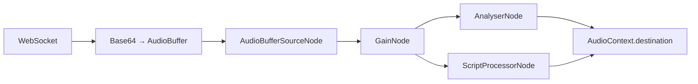

# 🎛️ Prompt DJ — Руководство пользователя

## Обзор

**Prompt DJ** — это мощный инструмент для реалтайм-микширования музыки с помощью Gemini Lyria Live Music API. Он позволяет динамически смешивать до 8 промптов, сохранять ваши любимые комбинации в пресеты и записывать сессии в высоком качестве.

## ✨ Возможности

- 🎤 **Запись сессий** — сохраняйте свои миксы в формате WAV.
- 💾 **Управление пресетами** — создавайте, загружайте и удаляйте наборы промптов.
- 📊 **Визуализация спектра** — получайте визуальную обратную связь о звуке в реальном времени.
- 🎚️ **8 вертикальных контроллеров** — интуитивное управление весами промптов.
- 🔄 **Реалтайм-микширование** — изменения применяются мгновенно.
- 🎧 **WebSocket стриминг** — бесшовное воспроизведение через Web Audio API.

## 🚀 Как использовать

### 1. Панель управления (Toolbar)

В верхней части интерфейса находится панель управления, которая содержит:
- **Менеджер пресетов:**
  - **Загрузить пресет:** Выпадающий список для выбора ранее сохраненных пресетов.
  - **Поле ввода:** Введите название нового пресета.
  - **Сохранить:** Сохраняет текущую конфигурацию промптов и весов как новый пресет.
- **Управление записью:**
  - **Запись:** Начинает запись текущей сессии. Кнопка доступна только во время воспроизведения.
  - **Стоп:** Останавливает запись и начинает кодирование файла.
  - **Скачать:** Появляется после обработки записи, позволяет скачать WAV-файл.

### 2. Запуск и микширование

1. **Настройте промпты:** Заполните текстовые поля под каждым из 8 вертикальных слайдеров.
2. **Настройте веса:** Используйте вертикальные слайдеры для установки веса каждого промпта (0 = выкл, 1 = макс).
3. **Нажмите "Запустить"**: Система установит WebSocket соединение, и начнется генерация музыки.
4. **Микшируйте в реальном времени:** Двигайте слайдеры и меняйте текст промптов прямо во время воспроизведения.

## 🏗️ Техническая архитектура

### Frontend (React)

Компонент был полностью переработан для лучшей масштабируемости.

- **`PromptDJ.tsx`**: Основной компонент-контейнер, управляющий состоянием.
- **`components/`**:
  - **`PromptDJHeader.tsx`**: Отображает заголовок, основные элементы управления и анализатор спектра.
  - **`PromptDJToolbar.tsx`**: Содержит менеджер пресетов и управление записью.
  - **`PromptGrid.tsx`**: Управляет сеткой из контроллеров.
  - **`PromptController.tsx`**: Индивидуальный вертикальный контроллер для одного промпта.
  - **`SpectrumAnalyzer.tsx`**: Компонент на Canvas для визуализации аудио.
- **`utils/PromptDJHelper.ts`**: Класс, инкапсулирующий логику WebSocket, Web Audio API, запись и анализ аудио.

### Web Audio API Flow

## 🔮 Будущие улучшения

### Реализовано в v2.0:
- ✅ **Сохранение пресетов**
- ✅ **Запись сессий**
- ✅ **Визуализация спектра**

### Планируется:

1. **MIDI контроллер поддержка** — управление весами через MIDI-устройства.
2. **Совместная работа** — несколько пользователей микшируют одновременно.
3. **AI-ассистент** — автоматические переходы между промптами.
4. **Экспорт в MP3** — добавление альтернативного формата для записи.

---

**Версия:** 2.0.0
**Дата:** 2025-11-17
**Статус:** Стабильная версия
