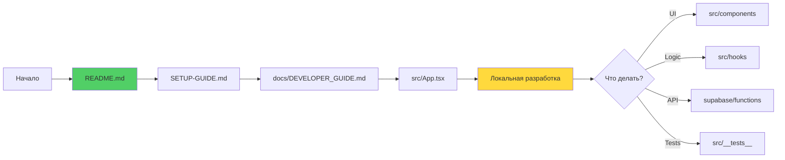
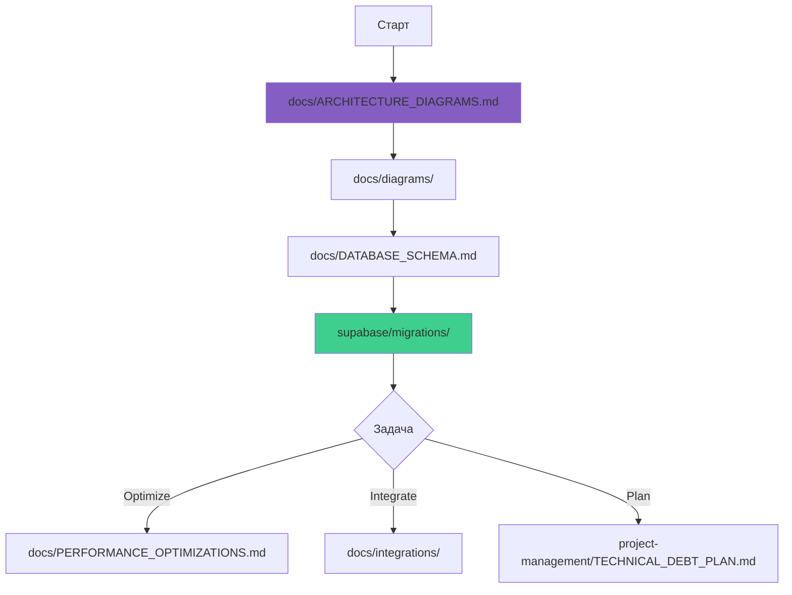
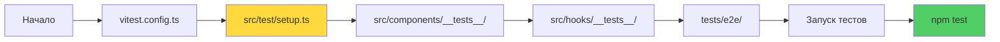
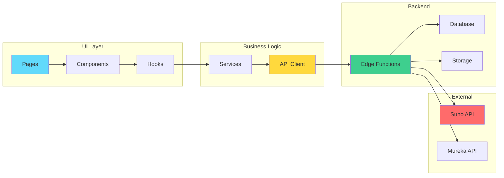
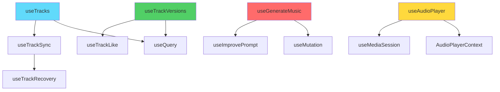

# 🗺️ Repository Map - Albert3 Muse Synth Studio

**Последнее обновление**: 13 октября 2025  
**Версия**: 2.7.1  
**Назначение**: Навигация по структуре репозитория и взаимосвязям компонентов

---

## 📂 Визуальная карта репозитория

```mermaid
graph TB
    subgraph "Root Level"
        Root["/"]
        Docs["/docs"]
        Src["/src"]
        Supabase["/supabase"]
        PM["/project-management"]
        Reports["/reports"]
        Archive["/archive"]
        Tests["/tests"]
    end

    subgraph "Documentation Hub"
        Docs --> Arch["/architecture"]
        Docs --> API["/api"]
        Docs --> Diag["/diagrams"]
        Docs --> Integ["/integrations"]
        Docs --> Perf["/performance"]
        Docs --> Iface["/interface"]
        Docs --> Storage["/storage"]
    end

    subgraph "Source Code"
        Src --> Comp["/components"]
        Src --> Hooks["/hooks"]
        Src --> Pages["/pages"]
        Src --> Services["/services"]
        Src --> Contexts["/contexts"]
        Src --> Features["/features"]
        Src --> Utils["/utils"]
    end

    subgraph "Backend Infrastructure"
        Supabase --> Functions["/functions"]
        Supabase --> Migrations["/migrations"]
        Supabase --> Shared["/functions/_shared"]
    end

    subgraph "Project Management"
        PM --> Tasks["/tasks"]
        PM --> PMReports["/reports"]
        PM --> Workflows["/workflows"]
        PM --> Milestones["/milestones"]
    end

    style Root fill:#FFD93D
    style Src fill:#61DAFB
    style Supabase fill:#3ECF8E
    style PM fill:#FF6B6B
```



---

## 🎯 1. Критические пути навигации

### 1.1 Для разработчиков (Новички)



**Обязательные файлы для чтения**:
1. `README.md` - Обзор проекта
2. `SETUP-GUIDE.md` - Настройка окружения
3. `docs/DEVELOPER_GUIDE.md` - Best practices
4. `docs/COMPONENT_GUIDE.md` - UI компоненты
5. `project-management/QUICK-REFERENCE.md` - Команды и shortcuts

### 1.2 Для Tech Lead (Архитектура)



**Критические документы**:
1. `docs/ARCHITECTURE_DIAGRAMS.md` - 10+ диаграмм
2. `docs/diagrams/data-flow-architecture.md` - Потоки данных
3. `docs/DATABASE_SCHEMA.md` - Схема БД
4. `docs/BACKEND_ARCHITECTURE.md` - Архитектура backend
5. `project-management/TECHNICAL_DEBT_PLAN.md` - Техдолг

### 1.3 Для QA/Testing



## 🆕 Latest Updates (2025-11-17)

### Music Classification System (Phase 1)
- ✅ **Database Tables**: `music_classifications`, `classification_jobs`
- ✅ **TypeScript Types**: `MusicClassificationMetadata` interface
- ✅ **RLS Policies**: Secure access control for classifications
- ✅ **Cleanup Functions**: Auto-delete old jobs (30 days retention)
- 📖 **Documentation**: [MUSIC_CLASSIFICATION_GUIDE.md](./MUSIC_CLASSIFICATION_GUIDE.md)

**Next**: Phase 2 - Edge Functions (`classify-music-mtg`, `classify-music-discogs`)

---

**Testing Stack**:
- **Unit**: Vitest + Testing Library
- **E2E**: Playwright
- **Coverage**: >80% target
- **Config**: `vitest.config.ts`, `playwright.config.ts`

---

## 📁 2. Детальная структура директорий

### 2.1 `/src` - Основной код приложения

```
src/
├── 📱 App.tsx                    # Root компонент
├── 🎨 index.css                  # Global styles + Design tokens
├── ⚙️ main.tsx                   # Entry point
├── 🧭 router.tsx                 # React Router config
│
├── components/                   # React компоненты
│   ├── ui/                       # shadcn/ui базовые компоненты (35+)
│   ├── player/                   # Audio Player (Global, Mini, FullScreen)
│   ├── tracks/                   # Track управление (Dialogs, Progress, Versions)
│   ├── workspace/                # Workspace UI (Header, Sidebar, DetailPanel)
│   ├── navigation/               # Навигация (BottomTabBar, MobileNav)
│   ├── animations/               # Анимационные компоненты
│   ├── mobile/                   # Мобильные UI паттерны
│   ├── mureka/                   # Mureka provider компоненты
│   ├── lyrics/                   # Lyrics редакторы и генераторы
│   ├── audio/                    # Audio utilities (Recorder, Uploader)
│   ├── layout/                   # Layout компоненты (EmptyState, PageHeader)
│   ├── errors/                   # Error boundaries
│   └── __tests__/                # Component tests
│
├── hooks/                        # Custom React hooks (40+)
│   ├── use-mobile.tsx            # Mobile detection
│   ├── useTracks.ts              # Track CRUD operations
│   ├── useAudioPlayer.ts         # Player management
│   ├── useGenerateMusic.ts       # Music generation
│   ├── useTrackVersions.ts       # Version management
│   ├── useStemSeparation.ts      # Stem separation
│   └── __tests__/                # Hook tests
│
├── contexts/                     # React Context providers
│   ├── AudioPlayerContext.tsx    # Global player state (LEGACY)
│   ├── StemMixerContext.tsx      # Stem mixer state
│   └── audio-player/             # New modular player context
│       ├── AudioPlayerProvider.tsx
│       ├── useAudioPlayback.ts
│       ├── useAudioQueue.ts
│       └── useAudioVersions.ts
│
├── features/                     # Feature modules (Domain-driven)
│   └── tracks/
│       ├── components/           # Track-specific components
│       ├── hooks/                # Track-specific hooks
│       ├── api/                  # Track API layer
│       └── ui/                   # Track UI components
│
├── pages/                        # Route pages
│   ├── Auth.tsx                  # Login/Signup
│   ├── Index.tsx                 # Home page
│   ├── Landing.tsx               # Landing page
│   └── workspace/                # Workspace routes
│       ├── Generate.tsx          # Music generation
│       ├── Library.tsx           # Track library
│       ├── Analytics.tsx         # Analytics dashboard
│       ├── Settings.tsx          # User settings
│       └── Admin.tsx             # Admin panel
│
├── services/                     # Business logic & API
│   ├── api.service.ts            # Main API service
│   ├── analytics.service.ts      # Analytics tracking
│   ├── likes.service.ts          # Like/unlike logic
│   ├── monitoring.service.ts     # Performance monitoring
│   └── providers/                # Music provider adapters
│       ├── suno.adapter.ts
│       ├── mureka.adapter.ts
│       └── router.ts
│
├── utils/                        # Утилиты
│   ├── logger.ts                 # Centralized logging
│   ├── formatters.ts             # Data formatters
│   ├── trackNormalizer.ts        # Track data normalization
│   ├── lyricsParser.ts           # Lyrics parsing
│   └── musicStyles.ts            # Music style registry
│
├── types/                        # TypeScript типы
│   ├── track.ts                  # Track types
│   ├── lyrics.ts                 # Lyrics types
│   └── supabase.d.ts             # Supabase generated types
│
├── integrations/                 # Third-party integrations
│   └── supabase/
│       ├── client.ts             # Supabase client
│       └── types.ts              # Auto-generated DB types
│
├── data/                         # Static data
│   └── music-styles/             # Music style registry
│       ├── electronic.ts
│       ├── rock.ts
│       ├── hip-hop.ts
│       └── index.ts
│
├── config/                       # App configuration
│   ├── env.ts                    # Environment variables
│   └── provider-models.ts        # AI provider models
│
└── test/                         # Test utilities
    ├── setup.ts                  # Test setup
    └── mocks/                    # Test mocks
```

**Ключевые метрики**:
- **Компоненты**: 120+ React компонентов
- **Hooks**: 40+ custom hooks
- **Pages**: 15+ роутов
- **Services**: 10+ сервисов
- **Utils**: 20+ утилитных функций

### 2.2 `/supabase` - Backend Infrastructure

```
supabase/
├── 📝 config.toml                # Supabase configuration
├── 🔄 types.ts                   # Auto-generated TypeScript types
│
├── functions/                    # Edge Functions (Deno runtime)
│   ├── _shared/                  # Shared utilities
│   │   ├── cors.ts               # CORS headers
│   │   ├── security.ts           # Security headers
│   │   ├── logger.ts             # Structured logging
│   │   ├── suno.ts               # Suno API client
│   │   ├── mureka.ts             # Mureka API client
│   │   ├── storage.ts            # Storage utilities
│   │   ├── validation.ts         # Input validation
│   │   └── zod-schemas.ts        # Zod validation schemas
│   │
│   ├── generate-suno/            # Suno music generation
│   │   └── index.ts
│   ├── generate-mureka/          # Mureka music generation
│   │   └── index.ts
│   ├── generate-lyrics/          # Lyrics generation
│   │   └── index.ts
│   ├── separate-stems/           # Stem separation
│   │   └── index.ts
│   ├── improve-prompt/           # AI prompt enhancement
│   │   └── index.ts
│   ├── get-balance/              # Provider balance check
│   │   └── index.ts
│   ├── suno-callback/            # Suno webhook receiver
│   │   └── index.ts
│   ├── stems-callback/           # Stems webhook receiver
│   │   └── index.ts
│   ├── lyrics-callback/          # Lyrics webhook receiver
│   │   └── index.ts
│   ├── upload-extend-audio/      # Upload & extend functionality
│   │   └── index.ts
│   └── ... (25+ total functions)
│
└── migrations/                   # SQL migrations (chronological)
    ├── 00_initial_schema.sql
    ├── 01_create_tracks_table.sql
    ├── 02_create_track_versions.sql
    ├── 03_create_track_stems.sql
    └── ... (50+ migrations)
```

**Edge Functions Stats**:
- **Total**: 25+ functions
- **External APIs**: Suno, Mureka, Lovable AI
- **Webhooks**: 3 callback handlers
- **Utilities**: 12 shared modules

### 2.3 `/docs` - Документация

```
docs/
├── 📖 INDEX.md                   # Master index (этот файл)
├── 📘 README.md                  # Docs overview
├── 🏗️ ARCHITECTURE_DIAGRAMS.md  # 10+ Mermaid diagrams
├── 👨‍💻 DEVELOPER_GUIDE.md         # Dev handbook
├── 📖 USER_GUIDE.md              # End-user guide
├── 🎨 UI_UX_DESIGN_SYSTEM.md     # Design system
├── 🔄 USER_FLOWS.md              # User journeys
│
├── architecture/                 # Architecture docs
│   ├── ARCHITECTURE.md
│   ├── KNOWLEDGE_GRAPH.md
│   ├── PROJECT_MAP.md
│   └── OPTIMIZATION_PLAN.md
│
├── diagrams/                     # Mermaid diagrams
│   ├── system-architecture.md
│   ├── data-flow-architecture.md
│   ├── database-erd.md
│   ├── music-generation-flow.md
│   ├── stem-separation-flow.md
│   └── user-journey-map.md
│
├── integrations/                 # Third-party integrations
│   ├── SUNO_API_AUDIT.md
│   ├── SUNO_API_COMPLETE_REFERENCE.md
│   ├── THIRD_PARTY_OVERVIEW.md
│   └── UPLOAD_AND_EXTEND_GUIDE.md
│
├── performance/                  # Performance docs
│   └── PERFORMANCE.md
│
└── interface/                    # UI component docs
    └── COMPONENT_SYSTEM.md
```

### 2.4 `/project-management` - Управление проектом

```
project-management/
├── 📋 README.md                  # PM overview
├── 🧭 NAVIGATION_INDEX.md        # Navigation guide
├── ⚡ QUICK-REFERENCE.md         # Quick commands
├── 🚀 DEVELOPMENT_ROADMAP.md    # Long-term roadmap
├── 🔧 TECHNICAL_DEBT_PLAN.md    # Tech debt tracking
│
├── tasks/                        # Sprint tasks
│   ├── current-sprint.md         # Active sprint (Sprint 27)
│   ├── STATUS_DASHBOARD.md       # Task dashboard
│   ├── TASKS_STATUS.md           # All task statuses
│   ├── backlog.md                # Product backlog
│   └── sprint-{N}-plan.md        # Historical sprints
│
├── reports/                      # Reports & analytics
│   ├── sprint-logs.md            # Sprint journals
│   ├── team-dashboard.md         # Team metrics
│   ├── automated-reports.md      # Auto-generated reports
│   └── 2025-10-{DD}-{topic}.md   # Date-based reports
│
├── milestones/                   # Milestones & roadmap
│   ├── roadmap.md
│   └── tracking-system.md
│
└── workflows/                    # Development processes
    └── development.md
```

---

## 🔗 3. Взаимосвязи компонентов

### 3.1 Data Flow между модулями



### 3.2 Component Hierarchy (Top-level)

```
App.tsx
├── GlobalErrorBoundary
│   ├── QueryClientProvider (TanStack Query)
│   │   ├── TooltipProvider (Radix UI)
│   │   │   ├── AudioPlayerProvider (Custom Context)
│   │   │   │   ├── RouterProvider (React Router)
│   │   │   │   │   ├── Root Route (/)
│   │   │   │   │   │   └── Landing Page
│   │   │   │   │   ├── Auth Routes (/auth)
│   │   │   │   │   │   └── AuthForm
│   │   │   │   │   └── Workspace Routes (/workspace)
│   │   │   │   │       ├── WorkspaceLayout
│   │   │   │   │       │   ├── WorkspaceHeader
│   │   │   │   │       │   ├── MinimalSidebar
│   │   │   │   │       │   └── Outlet (Route Content)
│   │   │   │   │       │       ├── /generate → Generate
│   │   │   │   │       │       ├── /library → Library
│   │   │   │   │       │       ├── /analytics → Analytics
│   │   │   │   │       │       └── /settings → Settings
│   │   │   │   │       └── GlobalAudioPlayer (Fixed position)
│   │   │   │   │           ├── MiniPlayer (default)
│   │   │   │   │           └── FullScreenPlayer (on expand)
│   │   │   │   └── Toaster (Sonner)
```

### 3.3 Hook Dependencies Graph



---

## 🎯 4. Критические файлы (Top 20)

### 4.1 Frontend

| Файл | Назначение | Зависимости | Статус |
|------|-----------|-------------|--------|
| `src/App.tsx` | Root component | React Router, TanStack Query | ✅ Stable |
| `src/router.tsx` | Route configuration | React Router DOM | ✅ Stable |
| `src/contexts/audio-player/AudioPlayerProvider.tsx` | Audio player context | useAudioPlayback, useAudioQueue | ✅ Stable |
| `src/hooks/useTracks.ts` | Track CRUD operations | TanStack Query, Supabase | ⚠️ Refactor needed |
| `src/hooks/useGenerateMusic.ts` | Music generation | Edge Functions | ✅ Stable |
| `src/components/MusicGeneratorV2.tsx` | Music generation UI | Multiple hooks | ✅ Stable |
| `src/pages/workspace/Generate.tsx` | Generation page | ResizablePanels | ✅ Stable |
| `src/components/player/GlobalAudioPlayer.tsx` | Global player | AudioPlayerContext | ✅ Stable |
| `src/features/tracks/components/TrackCard.tsx` | Track display | Multiple hooks | ✅ Stable |
| `src/services/api.service.ts` | API abstraction | Supabase Client | ⚠️ Needs testing |

### 4.2 Backend

| Файл | Назначение | External APIs | Статус |
|------|-----------|---------------|--------|
| `supabase/functions/generate-suno/index.ts` | Suno generation | Suno AI API | ✅ Production ready |
| `supabase/functions/suno-callback/index.ts` | Suno webhook | Supabase DB/Storage | ✅ Production ready |
| `supabase/functions/separate-stems/index.ts` | Stem separation | Suno AI API | ✅ Production ready |
| `supabase/functions/_shared/suno.ts` | Suno client | Suno AI API | ✅ Stable |
| `supabase/functions/_shared/storage.ts` | Storage utilities | Supabase Storage | ✅ Stable |
| `supabase/migrations/latest_migration.sql` | Schema updates | PostgreSQL | 🔄 Active |

### 4.3 Configuration

| Файл | Назначение | Managed By | Статус |
|------|-----------|------------|--------|
| `vite.config.ts` | Vite configuration | Manual | ✅ Stable |
| `tailwind.config.ts` | Tailwind config | Manual | ✅ Stable |
| `tsconfig.json` | TypeScript config | Manual | ✅ Stable |
| `supabase/config.toml` | Supabase config | Manual + Auto | ⚠️ Auto-generated |

---

## 🔍 5. Поиск по функционалу

### 5.1 Генерация музыки
**Точки входа**:
- UI: `src/components/MusicGeneratorV2.tsx`
- Hook: `src/hooks/useGenerateMusic.ts`
- API: `supabase/functions/generate-suno/`
- Callback: `supabase/functions/suno-callback/`

**Связанные файлы**:
- `src/hooks/useImprovePrompt.ts` - AI prompt improvement
- `src/data/music-styles/` - Style presets
- `supabase/functions/_shared/suno.ts` - Suno client

### 5.2 Audio Player
**Точки входа**:
- Context: `src/contexts/audio-player/AudioPlayerProvider.tsx`
- Components: `src/components/player/`
- Hooks: `src/hooks/useAudioPlayer.ts`

**Связанные файлы**:
- `src/hooks/useMediaSession.ts` - Media Session API
- `src/contexts/audio-player/useAudioPlayback.ts` - Playback logic
- `src/contexts/audio-player/useAudioQueue.ts` - Queue management

### 5.3 Track Versions
**Точки входа**:
- UI: `src/features/tracks/components/TrackVersions.tsx`
- Hook: `src/features/tracks/hooks/useTrackVersions.ts`
- API: `src/features/tracks/api/trackVersions.ts`

**Связанные файлы**:
- `supabase/functions/extend-track/` - Extend functionality
- `src/hooks/useExtendTrack.ts` - Extend hook
- `src/components/tracks/ExtendTrackDialog.tsx` - UI Dialog

### 5.4 Stem Separation
**Точки входа**:
- UI: `src/features/tracks/components/TrackStemsPanel.tsx`
- Hook: `src/hooks/useStemSeparation.ts`
- API: `supabase/functions/separate-stems/`

**Связанные файлы**:
- `supabase/functions/stems-callback/` - Webhook handler
- `src/contexts/StemMixerContext.tsx` - Stem mixer state
- `src/features/tracks/components/AdvancedStemMixer.tsx` - Mixer UI

---

## 📊 6. Статистика репозитория

### 6.1 Code Metrics
```
Total Files:     450+
TypeScript:      350+
React Components: 120+
Hooks:           40+
Edge Functions:  25+
SQL Migrations:  50+
Test Files:      60+
Documentation:   80+
```

### 6.2 Lines of Code
```
Frontend (src/):         ~35,000 lines
Backend (supabase/):     ~15,000 lines
Tests:                   ~8,000 lines
Documentation:           ~20,000 lines
Total:                   ~78,000 lines
```

### 6.3 Dependencies
```
Production:    67 packages
Development:   42 packages
Total:         109 packages
Bundle Size:   ~280KB (gzipped)
```

---

## 🎯 7. Quick Links по темам

### Development
- [Setup Guide](../SETUP-GUIDE.md)
- [Developer Guide](DEVELOPER_GUIDE.md)
- [Quick Reference](../project-management/QUICK-REFERENCE.md)
- [Component Guide](COMPONENT_GUIDE.md)

### Architecture
- [Architecture Overview](ARCHITECTURE_DIAGRAMS.md)
- [Data Flow Diagram](diagrams/data-flow-architecture.md)
- [Database Schema](DATABASE_SCHEMA.md)
- [System Architecture](diagrams/system-architecture.md)

### Project Management
- [Current Sprint](../project-management/tasks/current-sprint.md)
- [Roadmap](ROADMAP.md)
- [Technical Debt Plan](../project-management/TECHNICAL_DEBT_PLAN.md)
- [Task Dashboard](../project-management/tasks/STATUS_DASHBOARD.md)

### Testing
- [Test Setup](../src/test/setup.ts)
- [Test Configuration](../vitest.config.ts)
- [E2E Tests](../tests/e2e/)
- [Component Tests](../src/components/__tests__/)

---

## 🔄 Maintenance

**Обновление этого документа**:
- После major рефакторинга
- При добавлении новых модулей
- При изменении структуры директорий
- Каждый Sprint (minor updates)

**Ответственные**:
- Tech Lead: Архитектурные изменения
- Developers: Новые компоненты/модули
- PM: Структура документации

---

*Последнее обновление: 13 октября 2025*  
*Версия: 2.7.1*  
*Maintainer: Tech Lead*
