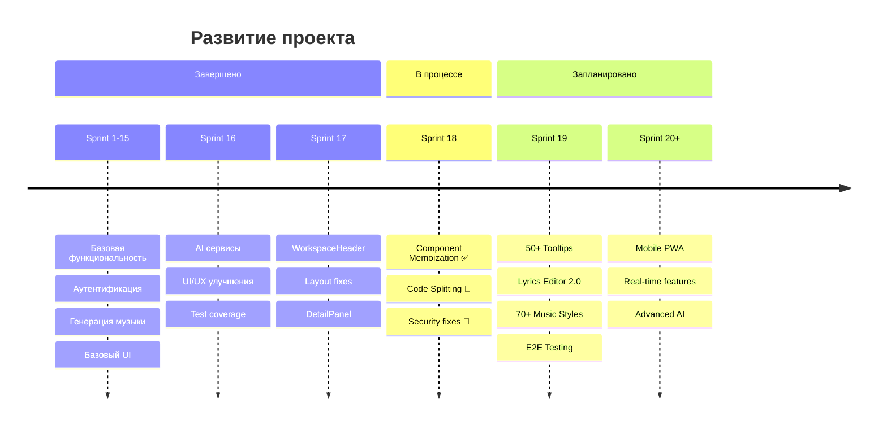
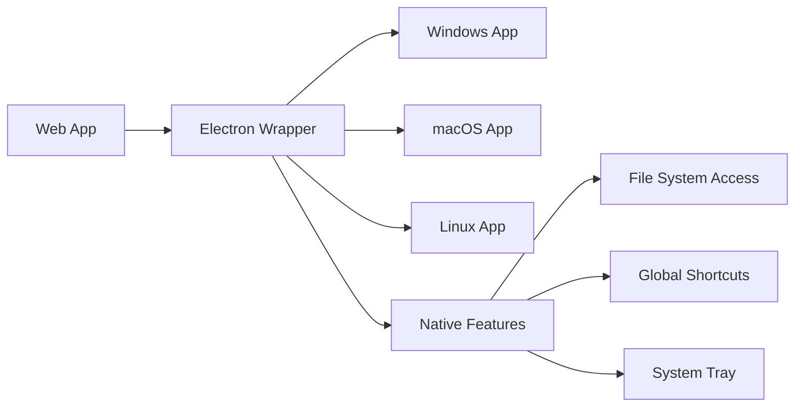
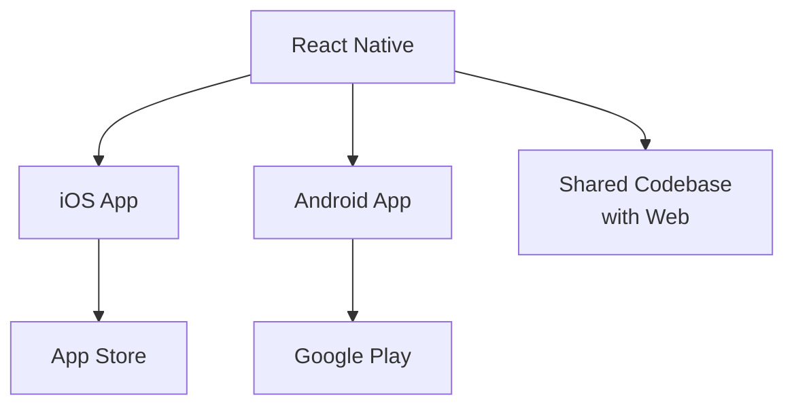
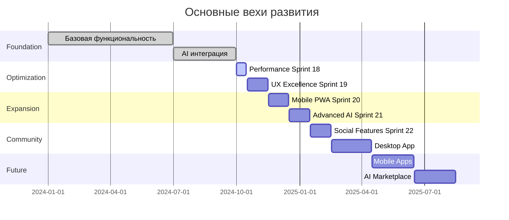

# 🚀 Roadmap Albert3 Muse Synth Studio

## 📍 Текущая позиция

**Текущий спринт**: Sprint 18 - Performance & Security (60% завершено)  
**Следующий спринт**: Sprint 19 - UX Excellence & AI Content Quality

---

## 🎯 Sprint 19: UX Excellence & AI Content Quality

### Неделя 1: Критические исправления
**Цель**: Устранить блокирующие проблемы и добавить базовый UX

- ⚡ **UX-001**: Исправление AI функций (8 часов)
  - generate-lyrics API endpoint
  - improve-prompt system prompt
  - suggest-styles structured output
  
- 🎯 **UX-002**: Реализация Library функций (6 часов)
  - handleLike()
  - handleDownload()
  - handleShare()
  
- 💡 **UX-003**: Система Tooltips Часть 1 (12 часов)
  - MusicGenerator: 20 tooltips
  - DetailPanel: 15 tooltips
  - Player: 10 tooltips

**Deliverables**: 3 критические функции исправлены, 45+ tooltips добавлено

### Неделя 2: AI контент улучшения
**Цель**: Значительно улучшить качество AI генерации

- 📝 **AI-001**: Расширенный редактор лирики (16 часов)
  - Вкладки: AI Генерация / Ручной ввод
  - Языки: Русский / English
  - Структура песни
  - Вокальные стили
  - Edge Function: improve-lyrics
  
- 🎨 **AI-002**: 70+ музыкальных стилей (14 часов)
  - 8 категорий жанров
  - Поиск по стилям
  - История использования
  - AI рекомендации

**Deliverables**: Полностью переработанный lyrics editor, 70+ стилей доступны

### Неделя 3: Производительность
**Цель**: Ускорить приложение на 30-40%

- 📊 **PERF-002**: Централизованное логирование (8 часов)
  - Замена 69+ console.* на logger.*
  - Structured logging
  - Error tracking
  
- ⚡ **PERF-003**: Мемоизация компонентов (10 часов)
  - TrackCard, TrackListItem
  - MiniPlayer, PlayerQueue
  
- 🔧 **PERF-004**: Оптимизация API (6 часов)
  - Exponential backoff
  - Database indexes
  - Query optimization

**Deliverables**: FCP < 0.8s, 0 console.* в production, 60%+ меньше re-renders

### Неделя 4: Технический долг и тестирование
**Цель**: Снизить технический долг и повысить надежность

- 🔧 **TECH-001**: useTrackOperations хук (8 часов)
  - Централизация логики треков
  - 60% меньше дублирования
  
- 🧪 **TEST-001**: E2E тестирование (12 часов)
  - Playwright setup
  - 5 критических flows
  - CI/CD интеграция
  
- 🔍 **AUDIT-001**: Suno API аудит (4 часов)
  - Проверка endpoints
  - Обновление типов
  - Документация

**Deliverables**: Test coverage > 70%, useTrackOperations везде, актуальная документация

---

## 🚀 Sprint 20: Mobile PWA & Real-time

### Основные задачи

**PWA Capabilities:**
- 📱 Install prompt для iOS/Android
- 💾 Offline mode с Service Worker
- 🔔 Push notifications
- 📲 Add to Home Screen

**Real-time Features:**
- ⚡ WebSocket для real-time collaboration
- 👥 Live collaborative editing
- 🔄 Real-time track status updates
- 💬 Live chat для collaboration

**Mobile Optimization:**
- 📱 Touch gestures enhancement
- 🎨 Mobile-first UI refinements
- ⚡ Performance для слабых устройств
- 📶 Offline-first architecture

**Playlist Management:**
- 📂 Создание плейлистов
- 🔄 Drag & drop треков
- 🔀 Shuffle/Repeat для плейлистов
- 📊 Playlist analytics

**Целевые метрики:**
- PWA install rate: >30%
- Offline usage: >15%
- Mobile performance score: >85
- Real-time latency: <100ms

---

## 🌟 Sprint 21: Advanced AI Features

### AI Voice Cloning
- 🎤 Клонирование голоса пользователя
- 🎵 Применение к сгенерированным трекам
- 🔊 Voice samples management
- 🎚️ Voice modulation controls

### MIDI Export
- 🎹 Экспорт треков в MIDI
- 🎼 Multi-track MIDI support
- 🎛️ Instrument mapping
- 📝 MIDI editing interface

### VST Integration
- 🔌 VST plugin support
- 🎛️ Effect chain builder
- 🎚️ Real-time audio processing
- 💾 Preset management

### Advanced Audio Effects
- 🎚️ Equalizer (10-band)
- 🔊 Compressor/Limiter
- 🌊 Reverb/Delay effects
- 🎵 Pitch correction
- 🎤 Vocal enhancement

**Целевые метрики:**
- Voice cloning accuracy: >90%
- MIDI export success rate: 100%
- VST compatibility: Top 50 plugins
- Effect processing latency: <10ms

---

## 👥 Sprint 22: Social & Community

### Social Features
- 💬 Система комментариев
- 👍 Advanced like/reaction system
- 🔄 Репосты и sharing
- 📊 Social analytics

### User Profiles
- 👤 Публичные профили пользователей
- 🎵 Showcase треков
- 📈 User statistics
- 🏆 Achievements и badges

### Community Features
- 👥 Follow/Followers system
- 📢 Activity feed
- 🏅 Trending tracks
- 🎯 Genre-based communities

### Collaboration
- 👥 Co-authoring треков
- 💬 In-app messaging
- 📁 Shared projects
- 🔄 Version control для collaboration

**Целевые метрики:**
- Daily active users: +50%
- Engagement rate: >40%
- Shares per track: >5
- Community retention: >60%

---

## 🎯 Long-term Vision (Sprints 23-30)

### Desktop Application

**Features:**
- 🖥️ Native desktop app (Electron)
- 📁 Local file system access
- ⌨️ Global keyboard shortcuts
- 🔔 Native notifications
- 🎚️ System tray integration

### Mobile Apps

**Features:**
- 📱 Native iOS/Android apps (React Native)
- 🎤 Native audio recording
- 📲 Deep linking
- 💾 Offline-first storage
- 🔔 Rich push notifications

### DAW Integration
- 🎛️ Плагины для Ableton/FL Studio/Logic
- 🔄 Direct export to DAW
- 🎹 MIDI routing
- 🎚️ Parameter automation
- 🔌 ReWire protocol support

### AI Marketplace
- 🤖 Custom AI models marketplace
- 💰 Monetization для создателей моделей
- 🎯 Specialized genre models
- 🎨 Style transfer models
- 🔊 Audio enhancement models

### Advanced Analytics
- 📊 Comprehensive analytics dashboard
- 🎯 Audience insights
- 💰 Earnings tracking (если monetization)
- 📈 Growth metrics
- 🎵 Music trends analysis

---

## 📈 Roadmap Metrics

### Успех каждого спринта измеряется:

**User Experience:**
- User satisfaction score
- Feature adoption rate
- User retention
- Session duration

**Technical Quality:**
- Performance metrics (FCP, TTI)
- Test coverage
- Bug count
- Technical debt reduction

**Business Metrics:**
- Active users growth
- Feature usage
- Community engagement
- Platform stability

---

## 🎯 Milestone Timeline

---

## 🌟 Vision Statement

**К концу 2025 года Albert3 Muse Synth Studio станет:**

1. **Лидирующей платформой** для AI-генерации музыки
2. **Полноценной экосистемой** с web, desktop и mobile apps
3. **Сообществом музыкантов** с >100K активных пользователей
4. **Интегрированным решением** для DAW и производства музыки
5. **Marketplace платформой** для AI моделей и пресетов

---

*Обновлено: Sprint 18*  
*Roadmap регулярно пересматривается и обновляется*
