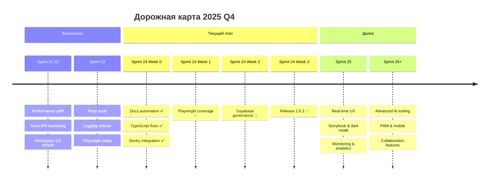

# 🚀 Roadmap Albert3 Muse Synth Studio

**Последнее обновление:** 10 октября 2025 · **Версия фокуса:** 2.6.x (Stabilization & Delivery)

---

## 📍 Текущая позиция

- **Спринт:** Sprint 24 — Stabilization & Delivery (23.10–05.11)
- **Состояние:** Week 0 завершается, документация синхронизирована, TypeScript ошибки исправлены, Sentry интегрирован.
- **Ключевые инициативы:**
  1. Playwright E2E покрытие плеера и библиотеки (TEST-001) — в работе.
  2. ✅ Production observability с Sentry завершена (LOG-001).
  3. AI style recommendations + Supabase migration governance (STYLE-001, DATA-001) — в работе.

```mermaid
timeline
    title Дорожная карта 2025 Q4
    section Выполнено
        Sprint 21-22 : Performance uplift
                      : Suno API hardening
                      : Workspace UX refresh
        Sprint 23 : Repo audit
                  : Logging refactor
                  : Playwright setup
    section Текущий этап
        Sprint 24 Week 0 : Docs automation ✅
                         : TypeScript fixes ✅
                         : Sentry integration ✅
        Sprint 24 Week 1 : Playwright coverage 🔄
        Sprint 24 Week 2 : Supabase governance 🔄
        Sprint 24 Week 3 : Release 2.6.3 📅
    section Далее
        Sprint 25 : Real-time UX
                  : Storybook & dark mode
                  : Monitoring & analytics
        Sprint 26+ : Advanced AI tooling
                    : PWA & mobile
                    : Collaboration features
```

---

## 🛠️ 2025 Q4 Focus (Sprints 24–26)

### Sprint 24 — Stabilization & Delivery
- Завершить Playwright сценарии плеера/библиотеки и включить их в CI.
- Настроить Sentry (frontend + Edge Functions), алёрты и отчёты.
- Интегрировать AI рекомендации стилей, провести UX-тесты, формализовать миграции Supabase.
- Выпустить релиз 2.6.3, подготовить ретроспективу и метрики.

### Sprint 25 — Experience Expansion (предварительно)
- Реализовать real-time уведомления и совместное редактирование (MED-005, MED-006).
- Подготовить Storybook и тёмную тему (UI-002), стандартизировать дизайн-токены.
- Возобновить unit-тестирование (TEST-001 Unit, TEST-004) и запустить визуальные регрессии.
- Включить мониторинг производительности (MON-001) и расширить Sentry Performance.

### Sprint 26 — Collaboration & Distribution (черновик)
- Выпустить публичные профили и социальные шеринги треков.
- Реализовать экспорт в внешние сервисы (Spotify/Apple Music).
- Добавить расширенный аналитический дашборд и автоматическую категоризацию треков.
- Подготовить бета PWA и оффлайн-режим для мобильных устройств.

---

## 📦 Долгосрочные инициативы (H1 2026)

| Направление | Инициативы |
|-------------|------------|
| **AI & Content** | Voice cloning, MIDI export, расширенные AI пресеты, мультиязычные лирики |
| **Collaboration** | Совместное редактирование проектов, live-комментарии, workflow approvals |
| **Distribution** | Интеграции с DSP, лицензирование, платёжные шлюзы |
| **Pro Tools** | Расширенный плеер (стемы, эффекты), плагины VST/AU, модуль мастеринга |
| **Operations** | Self-service onboarding, billing, расширенные отчёты, SLA мониторинг |

---

## 🧭 Контрольные точки

1. **Release 2.6.3 (05.11.2025):** Playwright ≥80% критических flow, Sentry alerts активны, AI пресеты готовы.
2. **Sprint 25 mid-review:** Storybook и dark mode в бете, WebSocket уведомления покрывают основные события.
3. **Release 2.7.0 (план):** Mobile-first улучшения, мониторинг, unit/visual regression >80% покрытие.
4. **2026 Q1 Goal:** Collaboration toolkit (live editing, комментарии) + distribution pipelines.

---

## 📋 Синхронизация и отчётность

- Обновлять `docs/DEVELOPMENT_PLAN.md`, `project-management/TECHNICAL_DEBT_PLAN.md` и `tasks/TASKS_STATUS.md` после каждой вехи.
- Публиковать еженедельные журналы в `project-management/reports/sprint-logs.md`.
- Хранить UX/AI отчёты в `project-management/reports` и ссылаться из README/Index.
- Проверять `npm run docs:validate` перед релизами и обновлениями roadmap.

