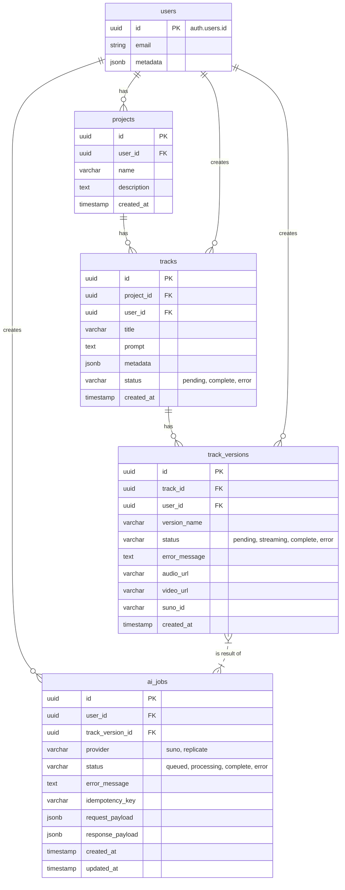

### Albert3 Muse Synth Studio — Полная спецификация UX/UI, архитектуры, API-интеграций и Storybook

**Версия:** 1.1
**Дата:** 2025-11-18
**Автор:** GitHub-native Assistant

---

# 📘 Оглавление

1. Введение
2. Цели платформы
3. Общая UX-архитектура
4. Общие UI-области
5. Детальная спецификация экранов
6. Диаграммы (Mermaid)
7. **Техническая спецификация Backend**
8. Storybook-архитектура
9. API-контракты
10. Realtime / Jobs / Queue
11. Acceptance Criteria
12. Accessibility Checklist
13. Риски, метрики, дорожная карта
14. Источники / ссылки на Suno API

---

# 1. Введение ...
_... (предыдущие разделы остаются без изменений) ..._

---

# 7. Техническая спецификация Backend

Этот раздел описывает архитектуру базы данных, детали реализации Edge Functions и механизм работы с асинхронными задачами.

## 7.1 Схема Базы Данных (Supabase Postgres)

### ERD Диаграмма



### Описание таблиц

-   **users**: Стандартная таблица Supabase Auth.
-   **projects**: Контейнер для треков. Позволяет группировать работы.
-   **tracks**: Основная сущность. Содержит исходный промпт и метаданные. Статус `complete` означает, что хотя бы одна версия успешно сгенерирована.
-   **track_versions**: Конкретная сгенерированная версия трека. Хранит ссылку на аудиофайл и `suno_id` для связи с внешним API.
-   **ai_jobs**: Журнал всех асинхронных задач. Обеспечивает идемпотентность и отслеживание статуса генерации.

## 7.2 Supabase Edge Functions

Все функции должны быть защищены (требуют JWT) и использовать Zod для валидации входных данных.

### 7.2.1 `generate-suno`

-   **Endpoint**: `POST /functions/v1/generate-suno`
-   **Auth**: Требуется JWT пользователя.
-   **Цель**: Принять промпт от клиента, создать запись в `tracks` и `track_versions`, запустить задачу генерации через Suno API и записать её в `ai_jobs`.
-   **Zod Schema (Request Body)**:
    ```typescript
    const GenerateSunoSchema = z.object({
      prompt: z.string().min(10).max(500),
      title: z.string().min(1).max(100).optional(),
      tags: z.string().optional(),
      duration: z.number().optional(),
      project_id: z.string().uuid().optional(),
    });
    ```
-   **Логика**:
    1.  Валидировать JWT и тело запроса.
    2.  Проверить баланс пользователя (если применимо).
    3.  Создать `idempotency_key` (например, `uuidv5` от `user_id` + `prompt`).
    4.  Проверить наличие `ai_jobs` с таким ключом и статусом `complete`. Если есть, вернуть результат.
    5.  Создать запись в `tracks` (status: 'pending') и `track_versions` (status: 'pending').
    6.  Создать запись в `ai_jobs` (status: 'queued').
    7.  Вызвать Suno API (`POST /api/v1/generate`).
    8.  Обновить `ai_jobs` (status: 'processing') и `track_versions` (suno_id).
    9.  Вернуть клиенту `track_id` и `track_version_id`.
-   **Response (Success)**:
    ```json
    {
      "track_id": "...",
      "track_version_id": "...",
      "job_id": "..."
    }
    ```

### 7.2.2 `suno-callback`

-   **Endpoint**: `POST /functions/v1/suno-callback`
-   **Auth**: Защищено секретным ключом (передаётся в URL или заголовке).
-   **Цель**: Принять вебхук от Suno API, обновить статус `track_versions` и `ai_jobs`.
-   **Логика**:
    1.  Проверить секретный ключ.
    2.  Найти `track_versions` по `suno_id` из тела вебхука.
    3.  Обновить `track_versions`:
        -   `status`: 'streaming' или 'complete'.
        -   `audio_url`, `video_url`.
    4.  Обновить `ai_jobs`:
        -   `status`: 'complete'.
        -   `response_payload`.
    5.  Если статус 'complete', обновить родительский `tracks.status` на 'complete'.
-   **Важно**: Supabase Realtime автоматически уведомит клиента об изменении в `track_versions`.

### 7.2.3 `get-job-status`

-   **Endpoint**: `GET /functions/v1/get-job-status?version_ids=...`
-   **Auth**: Требуется JWT пользователя.
-   **Цель**: Получить текущий статус одной или нескольких версий треков. Используется для синхронизации, если Realtime-соединение было потеряно.
-   **Логика**:
    1.  Валидировать JWT.
    2.  Получить `version_ids` из query string.
    3.  Выполнить запрос к таблице `track_versions`, выбрав только те, что принадлежат текущему пользователю.
    4.  Вернуть массив статусов.
-   **Response**:
    ```json
    [
      { "id": "...", "status": "complete", "audio_url": "..." },
      { "id": "...", "status": "processing", "audio_url": null }
    ]
    ```

## 7.3 Realtime и Очередь

-   **Механизм**: Frontend подписывается на изменения в таблице `track_versions`, фильтруя по `user_id`.
-   **Запрос на подписку (JS)**:
    ```javascript
    supabase
      .channel('track-versions-changes')
      .on('postgres_changes', {
          event: 'UPDATE',
          schema: 'public',
          table: 'track_versions',
          filter: `user_id=eq.${userId}`
        },
        payload => {
          console.log('Track version updated:', payload.new);
          // Обновить UI
        }
      )
      .subscribe();
    ```
-   **Гарантии**: Этот подход обеспечивает немедленное обновление UI при изменении статуса задачи, без необходимости в постоянном опросе (polling).

---
_... (остальные разделы, начиная со Storybook, сдвигаются по нумерации) ..._
