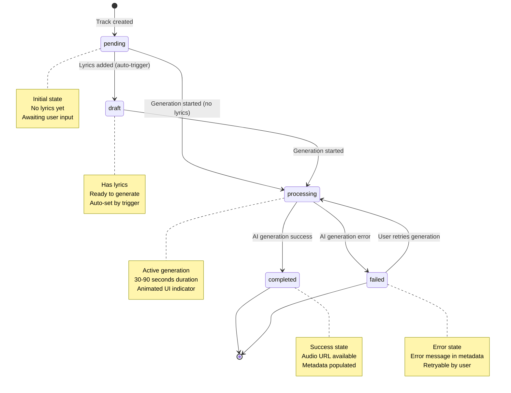

# Track Status Workflow Documentation

## Table of Contents
- [Overview](#overview)
- [Status Lifecycle](#status-lifecycle)
- [State Diagram](#state-diagram)
- [Status Definitions](#status-definitions)
- [Trigger Conditions](#trigger-conditions)
- [Database Implementation](#database-implementation)
- [Usage Examples](#usage-examples)
- [Best Practices](#best-practices)

## Overview

The Albert3 Muse Synth Studio implements a comprehensive status workflow system for tracking music generation lifecycle. This system ensures clear visibility of track states and smooth user experience throughout the generation process.

**Key Features:**
- 5 distinct statuses with clear semantic meaning
- Automatic status transitions via database triggers
- Visual status indicators with animations
- Type-safe implementation across frontend and backend
- Database-level validation using PostgreSQL ENUM

## Status Lifecycle

The track status follows a linear progression with branching at completion:

```
pending → draft → processing → completed
                               ↘ failed
```

### Lifecycle Duration
- **pending**: 0-∞ (until lyrics added)
- **draft**: 0-∞ (until user initiates generation)
- **processing**: 30-90 seconds (AI provider generation time)
- **completed**: terminal state
- **failed**: terminal state (retryable)

## State Diagram



## Status Definitions

### 1. `pending`
**Semantic Meaning**: Track created, awaiting lyrics or generation start

**Characteristics:**
- Initial status when track is created
- No lyrics present yet
- User can add metadata, style tags, references
- Not yet ready for generation

**UI Indicator:**
- Color: Gray (`bg-gray-100 text-gray-700`)
- Icon: Clock
- Label: "Ожидание" / "Pending"
- Animation: None

**Database State:**
```sql
status = 'pending'::track_status
lyrics IS NULL OR lyrics = ''
audio_url IS NULL
```

### 2. `draft`
**Semantic Meaning**: Track has lyrics, ready for generation

**Characteristics:**
- Automatically set when lyrics are added to a pending track
- User has provided all necessary input
- Ready for generation button is enabled
- Can still edit before generating

**UI Indicator:**
- Color: Blue (`bg-blue-100 text-blue-700`)
- Icon: FileEdit
- Label: "Черновик" / "Draft"
- Animation: None

**Database State:**
```sql
status = 'draft'::track_status
lyrics IS NOT NULL AND lyrics != ''
audio_url IS NULL
```

**Auto-Trigger Condition:**
```sql
-- Trigger fires on UPDATE
IF NEW.lyrics IS NOT NULL AND NEW.lyrics != ''
   AND (OLD.lyrics IS NULL OR OLD.lyrics = '')
   AND NEW.status = 'pending'::track_status
THEN
  NEW.status := 'draft'::track_status;
END IF;
```

### 3. `processing`
**Semantic Meaning**: Active generation in progress by AI provider

**Characteristics:**
- Track sent to AI provider (Suno/Mureka)
- Awaiting webhook callback (30-90 seconds)
- User cannot edit during this phase
- UI shows animated indicator

**UI Indicator:**
- Color: Amber (`bg-amber-100 text-amber-700`)
- Icon: Loader2 (spinning)
- Label: "Генерация" / "Processing"
- Animation: Pulse + rotation

**Database State:**
```sql
status = 'processing'::track_status
metadata->>'provider_track_id' IS NOT NULL
audio_url IS NULL (until webhook)
```

**Entry Conditions:**
- User clicks "Generate" button
- Edge function successfully submits to AI provider
- Provider returns track ID

### 4. `completed`
**Semantic Meaning**: Generation completed successfully

**Characteristics:**
- AI provider returned audio URL
- Track is playable
- Metadata populated with generation details
- Duration and other metadata available

**UI Indicator:**
- Color: Green (`bg-green-100 text-green-700`)
- Icon: CheckCircle
- Label: "Завершено" / "Completed"
- Animation: None

**Database State:**
```sql
status = 'completed'::track_status
audio_url IS NOT NULL
duration_seconds > 0
metadata->>'provider_track_id' IS NOT NULL
metadata->>'completed_at' IS NOT NULL
```

**Webhook Updates:**
```typescript
// Suno webhook updates:
{
  audio_url: "https://cdn.suno.ai/...",
  duration_seconds: 180,
  metadata: {
    provider_track_id: "abc-123",
    completed_at: "2025-11-05T12:34:56Z",
    // ... other metadata
  }
}
```

### 5. `failed`
**Semantic Meaning**: Generation failed with error

**Characteristics:**
- AI provider returned error
- Error message stored in metadata
- User can retry generation
- Original track data preserved

**UI Indicator:**
- Color: Red (`bg-red-100 text-red-700`)
- Icon: XCircle
- Label: "Ошибка" / "Failed"
- Animation: None

**Database State:**
```sql
status = 'failed'::track_status
audio_url IS NULL
metadata->>'error_message' IS NOT NULL
metadata->>'failed_at' IS NOT NULL
```

**Error Storage:**
```typescript
// Edge function stores error:
{
  status: 'failed',
  metadata: {
    error_message: "Provider timeout",
    error_code: "PROVIDER_TIMEOUT",
    failed_at: "2025-11-05T12:34:56Z",
    retry_count: 1
  }
}
```

## Trigger Conditions

### Automatic Status Transitions

#### 1. `pending` → `draft` (Database Trigger)
**Trigger Name**: `trigger_auto_draft_status`

**Condition**:
```sql
OLD.status = 'pending'::track_status
AND (OLD.lyrics IS NULL OR OLD.lyrics = '')
AND NEW.lyrics IS NOT NULL AND NEW.lyrics != ''
```

**Implementation**:
```sql
CREATE OR REPLACE FUNCTION auto_set_draft_status()
RETURNS TRIGGER AS $$
BEGIN
  IF NEW.lyrics IS NOT NULL AND NEW.lyrics != ''
     AND (OLD.lyrics IS NULL OR OLD.lyrics = '')
     AND NEW.status = 'pending'::track_status THEN
    NEW.status := 'draft'::track_status;
  END IF;
  RETURN NEW;
END;
$$ LANGUAGE plpgsql;

CREATE TRIGGER trigger_auto_draft_status
  BEFORE UPDATE ON tracks
  FOR EACH ROW
  EXECUTE FUNCTION auto_set_draft_status();
```

**When It Fires**:
- User adds lyrics in lyrics editor
- User imports lyrics from library
- Auto-fill from reference track includes lyrics

#### 2. `pending/draft` → `processing` (Edge Function)
**Triggered By**: Edge function `generate-suno` or `generate-mureka`

**Condition**:
```typescript
// Check track can be generated
const canGenerate = await supabase
  .rpc('can_generate_track', { track_id: trackId })
  .single();

if (!canGenerate.data) {
  throw new Error('Track is not in a generatable state');
}

// Update status to processing
await supabase
  .from('tracks')
  .update({
    status: 'processing',
    metadata: { ...metadata, started_at: new Date().toISOString() }
  })
  .eq('id', trackId);
```

**Helper Function**:
```sql
CREATE OR REPLACE FUNCTION can_generate_track(track_id UUID)
RETURNS BOOLEAN AS $$
DECLARE
  track_status track_status;
BEGIN
  SELECT status INTO track_status
  FROM tracks
  WHERE id = track_id;

  RETURN track_status IN ('pending', 'draft');
END;
$$ LANGUAGE plpgsql STABLE;
```

#### 3. `processing` → `completed` (Webhook)
**Triggered By**: Suno/Mureka webhook callback

**Condition**:
```typescript
// Suno callback webhook
const { audio_url, duration, metadata } = webhookPayload;

await supabase
  .from('tracks')
  .update({
    status: 'completed',
    audio_url,
    duration_seconds: duration,
    metadata: {
      ...existingMetadata,
      ...metadata,
      completed_at: new Date().toISOString()
    }
  })
  .eq('id', trackId)
  .eq('status', 'processing'); // Safety check
```

#### 4. `processing` → `failed` (Webhook/Error Handler)
**Triggered By**: AI provider error or timeout

**Condition**:
```typescript
// Error handler in webhook
await supabase
  .from('tracks')
  .update({
    status: 'failed',
    metadata: {
      ...existingMetadata,
      error_message: error.message,
      error_code: error.code,
      failed_at: new Date().toISOString(),
      retry_count: (existingMetadata.retry_count || 0) + 1
    }
  })
  .eq('id', trackId)
  .eq('status', 'processing');
```

#### 5. `failed` → `processing` (User Retry)
**Triggered By**: User clicks "Retry" button

**Condition**:
```typescript
// Frontend retry handler
const handleRetry = async () => {
  const { error } = await generateMusic({
    trackId: track.id,
    // ... same parameters as original generation
  });

  if (!error) {
    toast.success('Generation restarted');
  }
};
```

## Database Implementation

### ENUM Type Definition
```sql
-- Migration: 20251105120000_add_draft_status.sql
CREATE TYPE track_status AS ENUM (
  'pending',    -- Track created, awaiting lyrics or generation
  'draft',      -- Track has lyrics, ready for generation
  'processing', -- Currently being generated by AI provider
  'completed',  -- Generation completed successfully
  'failed'      -- Generation failed with error
);
```

### Column Definition
```sql
ALTER TABLE tracks
  ADD COLUMN status track_status NOT NULL DEFAULT 'pending'::track_status;
```

### Index for Performance
```sql
CREATE INDEX IF NOT EXISTS idx_tracks_status ON tracks(status);
```

### Constraints and Validation

**Database Level:**
- ENUM constraint prevents invalid values
- NOT NULL constraint ensures status always set
- Default value 'pending' for new records

**Application Level (TypeScript):**
```typescript
export type TrackStatus =
  | 'pending'
  | 'draft'
  | 'processing'
  | 'completed'
  | 'failed';

const isTrackStatus = (status: string): status is TrackStatus =>
  ['pending', 'draft', 'processing', 'completed', 'failed'].includes(status);
```

## Usage Examples

### Frontend: Display Status Badge
```typescript
import { TrackStatusBadge } from '@/components/tracks/TrackStatusBadge';

// In TrackCard component
<TrackStatusBadge
  status={track.status}
  variant="default"
/>

// Compact variant for mobile
<TrackStatusBadge
  status={track.status}
  variant="compact"
  className="sm:hidden"
/>

// Icon-only variant
<TrackStatusBadge
  status={track.status}
  variant="icon-only"
  className="lg:hidden"
/>
```

### Frontend: Filter by Status
```typescript
// In ProjectTracksListMobile
const [statusFilter, setStatusFilter] = useState<TrackStatus | 'all'>('all');

const filteredTracks = useMemo(() => {
  if (statusFilter === 'all') return tracks;
  return tracks.filter(track => track.status === statusFilter);
}, [tracks, statusFilter]);

// Status filter dropdown
<Select value={statusFilter} onValueChange={setStatusFilter}>
  <SelectItem value="all">Все треки</SelectItem>
  <SelectItem value="completed">Завершённые</SelectItem>
  <SelectItem value="processing">В процессе</SelectItem>
  <SelectItem value="draft">Черновики</SelectItem>
  <SelectItem value="pending">Ожидание</SelectItem>
  <SelectItem value="failed">С ошибками</SelectItem>
</Select>
```

### Frontend: Check if Track Can Be Generated
```typescript
const canGenerate = track.status === 'pending' || track.status === 'draft';

<Button
  disabled={!canGenerate}
  onClick={handleGenerate}
>
  {track.status === 'processing' ? 'Генерация...' : 'Сгенерировать'}
</Button>
```

### Backend: Check Generation Eligibility
```typescript
// In Edge Function handler
const { data: canGenerate } = await supabase
  .rpc('can_generate_track', { track_id: trackId })
  .single();

if (!canGenerate) {
  return new Response(
    JSON.stringify({
      error: 'Track cannot be generated in current state',
      current_status: track.status
    }),
    { status: 400, headers: corsHeaders }
  );
}
```

### Backend: Handle Webhook Success
```typescript
// In suno-callback or mureka-webhook
export const handler = async (req: Request): Promise<Response> => {
  const payload = await req.json();

  // Update track to completed
  const { error } = await supabase
    .from('tracks')
    .update({
      status: 'completed',
      audio_url: payload.audio_url,
      duration_seconds: payload.duration,
      metadata: {
        ...existingMetadata,
        completed_at: new Date().toISOString(),
        provider_metadata: payload.metadata
      }
    })
    .eq('id', payload.track_id)
    .eq('status', 'processing'); // Safety: only update if still processing

  if (error) {
    logger.error('Failed to update track status', error, 'webhook-callback');
    return new Response('Internal error', { status: 500 });
  }

  return new Response('OK', { status: 200 });
};
```

### Backend: Handle Webhook Failure
```typescript
// Error handler in webhook
try {
  // ... webhook logic
} catch (error) {
  await supabase
    .from('tracks')
    .update({
      status: 'failed',
      metadata: {
        error_message: error.message,
        error_code: error.code || 'UNKNOWN_ERROR',
        failed_at: new Date().toISOString(),
        retry_count: (track.metadata?.retry_count || 0) + 1
      }
    })
    .eq('id', trackId);

  logger.error('Generation failed', error, 'generation', { trackId });
}
```

## Best Practices

### 1. Always Use Type-Safe Status Values
```typescript
// ✅ GOOD
const status: TrackStatus = 'draft';

// ❌ BAD
const status = 'Draft'; // Wrong casing
const status = 'in_progress'; // Invalid value
```

### 2. Check Status Before State Transitions
```typescript
// ✅ GOOD
if (track.status === 'pending' || track.status === 'draft') {
  await startGeneration(track.id);
}

// ❌ BAD
await startGeneration(track.id); // No status check
```

### 3. Use Database Helper Functions
```typescript
// ✅ GOOD
const { data: canGenerate } = await supabase
  .rpc('can_generate_track', { track_id: trackId });

// ❌ BAD
const canGenerate = track.status !== 'processing' && track.status !== 'completed';
```

### 4. Handle All Status Cases in UI
```typescript
// ✅ GOOD
switch (track.status) {
  case 'pending':
    return <PendingState />;
  case 'draft':
    return <DraftState />;
  case 'processing':
    return <ProcessingState />;
  case 'completed':
    return <CompletedState />;
  case 'failed':
    return <FailedState />;
  default:
    // TypeScript ensures exhaustive check
    const _exhaustive: never = track.status;
    return null;
}

// ❌ BAD
if (track.status === 'completed') {
  return <CompletedState />;
}
// Missing other cases
```

### 5. Provide User Feedback for Status Changes
```typescript
// ✅ GOOD
useEffect(() => {
  if (prevStatus === 'processing' && track.status === 'completed') {
    toast.success('Track generation completed!');
    hapticFeedback.success();
  }
  if (prevStatus === 'processing' && track.status === 'failed') {
    toast.error('Generation failed. Please retry.');
    hapticFeedback.error();
  }
}, [track.status, prevStatus]);

// ❌ BAD
// Silent status changes confuse users
```

### 6. Log Status Transitions
```typescript
// ✅ GOOD
logger.info('Status transition', 'track-status', {
  trackId: track.id,
  oldStatus: oldStatus,
  newStatus: newStatus,
  timestamp: new Date().toISOString()
});

// ❌ BAD
console.log(`Status changed to ${newStatus}`); // Use centralized logger
```

### 7. Preserve Metadata Across Status Changes
```typescript
// ✅ GOOD
await supabase
  .from('tracks')
  .update({
    status: 'processing',
    metadata: {
      ...existingMetadata, // Preserve existing data
      started_at: new Date().toISOString()
    }
  })
  .eq('id', trackId);

// ❌ BAD
await supabase
  .from('tracks')
  .update({
    status: 'processing',
    metadata: { started_at: new Date().toISOString() } // Overwrites existing metadata!
  })
  .eq('id', trackId);
```

### 8. Implement Retry Logic for Failed Tracks
```typescript
// ✅ GOOD
const MAX_RETRIES = 3;
const retryCount = track.metadata?.retry_count || 0;

if (track.status === 'failed' && retryCount < MAX_RETRIES) {
  return <Button onClick={handleRetry}>Retry Generation</Button>;
} else if (retryCount >= MAX_RETRIES) {
  return <ErrorMessage>Maximum retries exceeded. Please contact support.</ErrorMessage>;
}

// ❌ BAD
<Button onClick={handleRetry}>Retry</Button> // No retry limit
```

### 9. Use Optimistic UI Updates with Rollback
```typescript
// ✅ GOOD
const handleGenerate = async () => {
  const previousStatus = track.status;

  // Optimistic update
  updateTrackLocally({ ...track, status: 'processing' });

  try {
    await generateMusic(track.id);
  } catch (error) {
    // Rollback on error
    updateTrackLocally({ ...track, status: previousStatus });
    toast.error('Failed to start generation');
  }
};

// ❌ BAD
await generateMusic(track.id); // Wait for server, no optimistic update
```

### 10. Monitor Status Distribution
```typescript
// ✅ GOOD - Analytics tracking
const statusCounts = tracks.reduce((acc, track) => {
  acc[track.status] = (acc[track.status] || 0) + 1;
  return acc;
}, {} as Record<TrackStatus, number>);

logger.info('Status distribution', 'analytics', { statusCounts });

// Helpful for:
// - Identifying bottlenecks (many stuck in processing)
// - Monitoring failure rates
// - Understanding user workflow
```

## Troubleshooting

### Track Stuck in 'processing'
**Symptoms**: Track shows "processing" for > 5 minutes

**Causes**:
1. Webhook not received from AI provider
2. Provider timeout/error
3. Network issues

**Resolution**:
```sql
-- Check if webhook was received
SELECT
  id,
  status,
  created_at,
  metadata->>'started_at' as started,
  metadata->>'provider_track_id' as provider_id
FROM tracks
WHERE status = 'processing'
  AND created_at < NOW() - INTERVAL '5 minutes';

-- Manual recovery (if needed)
UPDATE tracks
SET
  status = 'failed',
  metadata = metadata || jsonb_build_object(
    'error_message', 'Provider timeout - manual recovery',
    'failed_at', NOW()::text
  )
WHERE status = 'processing'
  AND created_at < NOW() - INTERVAL '10 minutes';
```

### Auto-Draft Trigger Not Firing
**Symptoms**: Status stays 'pending' after adding lyrics

**Causes**:
1. Lyrics field is empty string vs NULL
2. Status was already 'draft' or other non-pending value
3. Trigger disabled or dropped

**Resolution**:
```sql
-- Check trigger exists
SELECT * FROM pg_trigger WHERE tgname = 'trigger_auto_draft_status';

-- Check trigger function exists
SELECT * FROM pg_proc WHERE proname = 'auto_set_draft_status';

-- Test trigger manually
UPDATE tracks
SET lyrics = 'Test lyrics'
WHERE id = 'xxx-xxx-xxx'
  AND status = 'pending'
RETURNING status; -- Should return 'draft'
```

### Status Badge Not Updating in UI
**Symptoms**: UI shows old status after generation

**Causes**:
1. Realtime subscription not active
2. React Query cache not invalidating
3. Component not re-rendering

**Resolution**:
```typescript
// Check realtime subscription
useEffect(() => {
  const subscription = supabase
    .channel('tracks')
    .on('postgres_changes', {
      event: 'UPDATE',
      schema: 'public',
      table: 'tracks'
    }, (payload) => {
      queryClient.invalidateQueries({ queryKey: ['tracks'] });
    })
    .subscribe();

  return () => {
    subscription.unsubscribe();
  };
}, []);
```

## Related Documentation

- [Database Schema](./DATABASE_SCHEMA.md) - Full database structure
- [Backend Architecture](./BACKEND_ARCHITECTURE.md) - Edge Functions guide
- [API Service](../src/services/api.service.ts) - Frontend API client
- [Track Types](../src/types/domain/track.types.ts) - TypeScript types
- [Migration File](../supabase/migrations/20251105120000_add_draft_status.sql) - Database migration

## Changelog

### 2025-11-05 - Phase 1: Critical Status System
- Added 'draft' status to ENUM type
- Created auto_set_draft_status() trigger function
- Created can_generate_track() helper function
- Created TrackStatusBadge component
- Updated all TypeScript types

### Future Enhancements
- [ ] Status transition analytics dashboard
- [ ] Automated recovery for stuck processing tracks
- [ ] Status history tracking (audit log)
- [ ] Bulk status operations
- [ ] Status-based notifications
