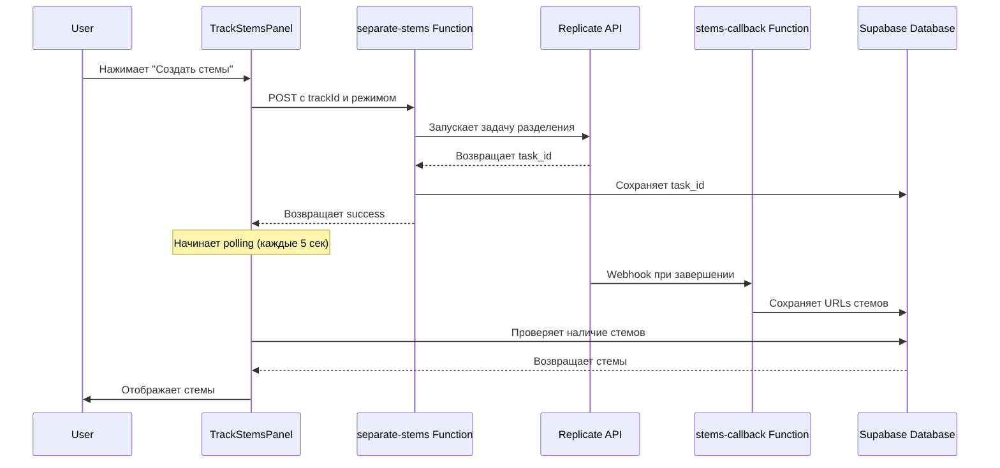

# 🎚️ Система разделения на стемы

## Обзор

Система разделения аудио на стемы (stems) позволяет извлекать отдельные музыкальные элементы из готового трека, такие как вокал, инструменталы, ударные и другие инструменты.

## 🎯 Возможности

### Режимы разделения

#### 1. Базовое разделение (2 стема)
**Режим**: `separate_vocal`

Разделяет трек на:
- 🎤 **Вокал** - все вокальные партии
- 🎹 **Инструментал** - все инструменты без вокала

**Применение**:
- Создание минусовок
- Ремиксы
- Караоке версии
- Замена вокала

#### 2. Детальное разделение (до 8 стемов)
**Режим**: `split_stem`

Разделяет трек на отдельные инструменты:
- 🥁 **Drums** (Ударные)
- 🎸 **Bass** (Бас)
- 🎸 **Guitar** (Гитара)
- 🎹 **Keyboard** (Клавишные)
- 🎻 **Strings** (Струнные)
- 🎺 **Brass** (Духовые медные)
- 🎷 **Woodwinds** (Духовые деревянные)
- 🎛️ **Synth** (Синтезатор)
- 🔊 **Percussion** (Перкуссия)
- ✨ **FX** (Эффекты)

**Применение**:
- Профессиональный ремастеринг
- Детальные миксы
- Сэмплирование
- Обучение музыке

## 🏗️ Архитектура



## 📊 База данных

### Таблица `track_stems`

```sql
CREATE TABLE track_stems (
  id UUID PRIMARY KEY DEFAULT gen_random_uuid(),
  track_id UUID NOT NULL REFERENCES tracks(id) ON DELETE CASCADE,
  version_id UUID REFERENCES track_versions(id) ON DELETE CASCADE,
  stem_type TEXT NOT NULL, -- 'vocals', 'instrumental', 'drums', etc.
  audio_url TEXT NOT NULL,
  separation_mode TEXT NOT NULL, -- 'separate_vocal' или 'split_stem'
  suno_task_id TEXT, -- ID задачи в Replicate
  metadata JSONB DEFAULT '{}',
  created_at TIMESTAMPTZ DEFAULT NOW()
);
```

### Индексы
```sql
CREATE INDEX idx_track_stems_track_id ON track_stems(track_id);
CREATE INDEX idx_track_stems_version_id ON track_stems(version_id);
CREATE INDEX idx_track_stems_mode ON track_stems(separation_mode);
```

### RLS Policies
```sql
-- Пользователи могут просматривать стемы своих треков
CREATE POLICY "Users can view stems of their own tracks"
  ON track_stems FOR SELECT
  USING (EXISTS (
    SELECT 1 FROM tracks
    WHERE tracks.id = track_stems.track_id
    AND tracks.user_id = auth.uid()
  ));

-- Пользователи могут просматривать стемы публичных треков
CREATE POLICY "Users can view stems of public tracks"
  ON track_stems FOR SELECT
  USING (EXISTS (
    SELECT 1 FROM tracks
    WHERE tracks.id = track_stems.track_id
    AND tracks.is_public = true
  ));
```

## 🔧 Компоненты

### TrackStemsPanel

**Путь**: `src/components/tracks/TrackStemsPanel.tsx`

#### Пропсы
```typescript
interface TrackStemsPanelProps {
  trackId: string;          // ID родительского трека
  versionId?: string;       // ID версии (опционально)
  stems: TrackStem[];       // Массив существующих стемов
  onStemsGenerated?: () => void; // Callback после генерации
}
```

#### Основные функции

##### 1. Генерация стемов
```typescript
const handleGenerateStems = async (
  mode: 'separate_vocal' | 'split_stem'
) => {
  // Вызов Edge Function
  const { data, error } = await supabase.functions.invoke('separate-stems', {
    body: { trackId, versionId, separationMode: mode }
  });

  // Запуск polling для проверки готовности
  const pollInterval = setInterval(async () => {
    const { data: stemsData } = await supabase
      .from('track_stems')
      .select('*')
      .eq('track_id', trackId);
    
    if (stemsData && stemsData.length > 0) {
      clearInterval(pollInterval);
      onStemsGenerated?.();
    }
  }, 5000);
};
```

##### 2. Воспроизведение стема
```typescript
const handlePlayStem = (stem: TrackStem) => {
  const stemKey = `stem-${stem.id}`;
  const isCurrentStem = currentTrack?.id === stemKey;

  if (isCurrentStem && isPlaying) {
    togglePlayPause();
  } else {
    playTrack({
      id: stemKey,
      title: stemTypeLabels[stem.stem_type],
      audio_url: stem.audio_url,
    });
  }
};
```

##### 3. Скачивание стема
```typescript
const handleDownloadStem = (stem: TrackStem) => {
  window.open(stem.audio_url, '_blank');
};
```

#### UI структура

```tsx
{stems.length === 0 ? (
  // Кнопки выбора режима разделения
  <div className="grid grid-cols-1 sm:grid-cols-2 gap-3">
    <Button onClick={() => handleGenerateStems('separate_vocal')}>
      Вокал + Инструментал
    </Button>
    <Button onClick={() => handleGenerateStems('split_stem')}>
      По инструментам
    </Button>
  </div>
) : (
  // Список сгенерированных стемов
  <div className="space-y-2">
    {stems.map(stem => (
      <div key={stem.id} className="flex items-center gap-3">
        <Button onClick={() => handlePlayStem(stem)}>
          {isPlaying ? <Pause /> : <Play />}
        </Button>
        <span>{stemTypeLabels[stem.stem_type]}</span>
        <Button onClick={() => handleDownloadStem(stem)}>
          <Download />
        </Button>
      </div>
    ))}
  </div>
)}
```

## 🔌 API

### Edge Function: `separate-stems`

**Путь**: `supabase/functions/separate-stems/index.ts`

**Endpoint**: `POST https://api.sunoapi.org/api/v1/vocal-removal/generate`

#### Входные данные
```typescript
interface SeparateStemsRequest {
  trackId: string;
  versionId?: string;
  separationMode: 'separate_vocal' | 'split_stem';
}
```

#### Процесс
1. Валидация входных данных
2. Получение аудио URL трека
3. Вызов Suno API для разделения
4. Сохранение task_id в БД
5. Возврат успешного ответа

#### Коды ошибок
- **200**: Success - Stem separation completed
- **400**: Bad Request - Parameter error or unsupported audio format
- **451**: Download Failed - Unable to download source audio file
- **500**: Server Error - Please try again later

#### Пример
```typescript
const response = await supabase.functions.invoke('separate-stems', {
  body: {
    trackId: 'uuid-here',
    separationMode: 'separate_vocal'
  }
});
```

### Callback Function: `stems-callback`

**Путь**: `supabase/functions/stems-callback/index.ts`

#### Назначение
Получает webhook от Replicate API при завершении разделения.

#### Процесс
1. Получает URLs сгенерированных стемов
2. Сохраняет каждый стем в таблицу `track_stems`
3. Обновляет флаг `has_stems = true` у трека
4. Возвращает успешный ответ

## 🎨 Дизайн

### Цветовая схема стемов

```typescript
const stemColors = {
  vocals: 'bg-purple-500',
  instrumental: 'bg-blue-500',
  drums: 'bg-red-500',
  bass: 'bg-orange-500',
  guitar: 'bg-yellow-500',
  keyboard: 'bg-green-500',
  strings: 'bg-teal-500',
  brass: 'bg-amber-500',
  synth: 'bg-pink-500',
  fx: 'bg-indigo-500',
};
```

### Иконки
- 🎤 Vocals
- 🎹 Instrumental
- 🥁 Drums
- 🎸 Bass/Guitar
- 🎹 Keyboard
- 🎻 Strings
- 🎺 Brass
- 🎛️ Synth
- ✨ FX

## 🚀 Использование

### 1. В DetailPanel

```typescript
<TrackStemsPanel
  trackId={track.id}
  stems={stems}
  onStemsGenerated={loadVersionsAndStems}
/>
```

### 2. Отображение в Accordion

```typescript
<AccordionItem value="stems">
  <AccordionTrigger>
    Стемы {stems.length > 0 && `(${stems.length})`}
  </AccordionTrigger>
  <AccordionContent>
    <TrackStemsPanel {...props} />
  </AccordionContent>
</AccordionItem>
```

## ⚡ Производительность

### Оптимизации
- **Lazy loading**: Стемы загружаются только при открытии секции
- **Polling timeout**: Автоматическая остановка через 5 минут
- **Мемоизация**: Используется `useMemo` и `useCallback`

### Время обработки
- **Базовое разделение (separate_vocal)**: 30-90 секунд
- **Детальное разделение (split_stem)**: 60-180 секунд

## 🔒 Безопасность

### Валидация
```typescript
// Проверка владения треком
const { data: track } = await supabase
  .from('tracks')
  .select('user_id')
  .eq('id', trackId)
  .single();

if (track.user_id !== user.id) {
  throw new Error('Unauthorized');
}
```

### RLS Policies
- Только владелец может генерировать стемы
- Публичные треки: стемы видны всем
- Приватные треки: стемы видны только владельцу

## 🐛 Troubleshooting

### Стемы не отображаются

**Причины**:
1. Стемы еще не сгенерированы
2. Ошибка в процессе генерации
3. Webhook не был получен

**Решение**:
```typescript
// Проверьте наличие стемов в БД
const { data } = await supabase
  .from('track_stems')
  .select('*')
  .eq('track_id', trackId);

console.log('Stems:', data);
```

### Polling не останавливается

**Причина**: Стемы не были сохранены в БД

**Решение**:
- Проверьте логи Edge Function (`stems-callback`)
- Убедитесь что callback URL корректен
- Проверьте что Suno API вернул результаты
- Проверьте код ошибки в metadata трека:
  - 400: Parameter error or unsupported format
  - 451: Failed to download source audio
  - 500: Suno server error

### Ошибки разделения стемов

#### 400 - Parameter Error
**Причина**: Неправильный формат аудио или неверные параметры

**Решение**:
- Убедитесь что трек был создан через Suno API
- Проверьте что `taskId` и `audioId` корректны
- Попробуйте другой режим разделения

#### 451 - Download Failed
**Причина**: Suno не смог скачать исходный аудио файл

**Решение**:
- Проверьте доступность audio_url
- Попробуйте регенерировать трек
- Подождите несколько минут и попробуйте снова

#### 500 - Server Error
**Причина**: Внутренняя ошибка Suno API

**Решение**:
- Подождите несколько минут
- Попробуйте запустить разделение снова
- Проверьте статус Suno API

## 📈 Метрики

### Отслеживание
- Количество генераций
- Среднее время обработки
- Успешность разделения
- Популярные режимы

### Аналитика
```typescript
// Запись метрики генерации
await supabase
  .from('analytics_events')
  .insert({
    event_type: 'stems_generated',
    track_id: trackId,
    metadata: {
      mode: separationMode,
      duration: processingTime,
    }
  });
```

## 🔮 Будущие улучшения

- [ ] Предпросмотр стемов перед сохранением
- [ ] Batch обработка нескольких треков
- [ ] Кастомные настройки разделения
- [ ] Визуальные волновые формы для стемов
- [ ] Экспорт в различных форматах (WAV, FLAC)
- [ ] AI-powered улучшение качества стемов
- [ ] Сравнение "до/после" разделения

---

**Версия**: 1.5.0  
**Последнее обновление**: Январь 2025  
**Статус**: ✅ Production Ready
