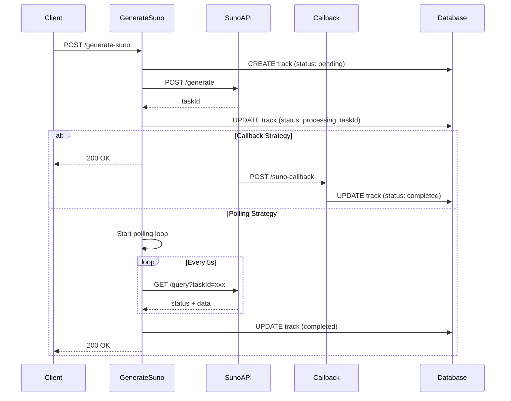

# Suno API Integration Guide

**Version:** 2.7.0  
**Last Updated:** 2025-10-12

---

## 📋 Содержание

1. [Архитектура](#архитектура)
2. [Механизм callback vs polling](#механизм-callback-vs-polling)
3. [Безопасность webhook](#безопасность-webhook)
4. [Обработка ошибок и retry](#обработка-ошибок-и-retry)
5. [Мониторинг](#мониторинг)
6. [Тестирование](#тестирование)
7. [Troubleshooting](#troubleshooting)

---

## 🏗️ Архитектура

### Основной поток генерации



### Компоненты интеграции

| Компонент | Файл | Назначение |
|-----------|------|------------|
| **Suno Client** | `supabase/functions/_shared/suno.ts` | API клиент для Suno |
| **Generate Function** | `supabase/functions/generate-suno/index.ts` | Основная функция генерации |
| **Callback Handler** | `supabase/functions/suno-callback/index.ts` | Обработчик webhook от Suno |
| **Polling Logic** | `pollSunoCompletion()` в generate-suno | Fallback polling |
| **Balance Check** | `supabase/functions/_shared/suno-balance.ts` | Проверка кредитов |
| **Retry Handler** | `supabase/functions/retry-failed-tracks/index.ts` | Автоматический retry |
| **Health Monitor** | `supabase/functions/monitor-suno-health/index.ts` | Мониторинг API |

---

## 🔄 Механизм callback vs polling

### Callback Strategy (по умолчанию)

**Преимущества:**
- ⚡ Мгновенное обновление статуса
- 💰 Меньше нагрузки на API
- 🎯 Точное отслеживание каждого события

**Требования:**
- Публично доступный callback URL
- HTTPS endpoint
- Быстрая обработка (< 15s)

**Конфигурация:**
```typescript
// В generate-suno/index.ts
const callbackUrl = `${SUPABASE_URL}/functions/v1/suno-callback`;
```

**Fallback polling:**
- Автоматически запускается через 3 минуты
- На случай если callback не сработал

### Polling Strategy

**Когда использовать:**
- callback URL недоступен
- Тестирование в локальной среде
- Нестабильная сеть

**Параметры:**
- Интервал: 5 секунд
- Максимум попыток: 60 (= 5 минут)

---

## 🛡️ Безопасность webhook

### Верификация подписи (HMAC-SHA256)

**Файл:** `supabase/functions/_shared/webhook-verify.ts`

```typescript
import { verifyWebhookSignature } from '../_shared/webhook-verify.ts';

const signature = req.headers.get('X-Suno-Signature');
const secret = Deno.env.get('SUNO_WEBHOOK_SECRET');
const bodyText = await req.text();

const isValid = await verifyWebhookSignature(bodyText, signature, secret);
if (!isValid) {
  return new Response(JSON.stringify({ error: 'invalid_signature' }), {
    status: 401
  });
}
```

**Настройка secret:**
```bash
# В Supabase Dashboard -> Settings -> Edge Functions
SUNO_WEBHOOK_SECRET=<получить_от_sunoapi.org>
```

### Лимиты безопасности

| Параметр | Значение |
|----------|----------|
| Max payload size | 5 MB |
| Request timeout | 15 секунд |
| Rate limit | 10 генераций/час на пользователя |
| Max retries | 3 попытки на webhook |

---

## 🔄 Обработка ошибок и retry

### Автоматический retry (Phase 3.2)

**Edge Function:** `retry-failed-tracks`

**Логика:**
1. Каждые 5 минут запускается через `pg_cron`
2. Ищет треки со status='failed' старше 5 минут
3. Проверяет retry_count < 3
4. Повторно вызывает generate-suno с оригинальными параметрами

**Cron настройка:**
```sql
SELECT cron.schedule(
  'retry-failed-tracks',
  '*/5 * * * *', -- Каждые 5 минут
  $$
  SELECT net.http_post(
    url := 'https://<project-ref>.supabase.co/functions/v1/retry-failed-tracks',
    headers := '{"Authorization": "Bearer <service-role-key>"}'::jsonb
  );
  $$
);
```

### Error handling стратегия

**В generate-suno:**
```typescript
try {
  generationResult = await sunoClient.generateTrack(payload);
} catch (err) {
  // ✅ Сохранить детали ошибки в metadata
  await supabase
    .from('tracks')
    .update({
      status: 'failed',
      error_message: err.message,
      metadata: {
        last_error: {
          type: 'suno_api_error',
          message: err.message,
          timestamp: new Date().toISOString(),
          payload_sent: { /* параметры запроса */ }
        }
      }
    });
  
  // ✅ Возвращаем 200 OK чтобы не trigger retry на клиенте
  return new Response(JSON.stringify({ success: false, error: err.message }), {
    status: 200
  });
}
```

### Race condition prevention (Phase 1.4)

**Проблема:** `pollSunoCompletion` может вызываться дважды (из callback fallback + из прямого вызова)

**Решение:** Флаг `is_polling_active` в metadata

```typescript
// При старте polling
metadata: {
  is_polling_active: true
}

// В pollSunoCompletion
const { data: track } = await supabase
  .from('tracks')
  .select('metadata')
  .eq('id', trackId)
  .single();

if (track.metadata?.is_polling_active === false) {
  logger.warn('Polling already stopped by another process');
  return;
}

// При завершении
await supabase
  .from('tracks')
  .update({ 
    metadata: { ...metadata, is_polling_active: false } 
  });
```

---

## 📊 Мониторинг

### Health Monitor (Phase 3.3)

**Edge Function:** `monitor-suno-health`

**Проверки:**
1. **Stuck tracks** (processing > 10 минут)
2. **Low balance** (< 100 credits)
3. **Critical balance** (< 10 credits)

**Автоматические уведомления:**
- Отправляются админам через таблицу `notifications`
- Логируются в console + Sentry

**Cron настройка:**
```sql
SELECT cron.schedule(
  'monitor-suno-health',
  '*/10 * * * *', -- Каждые 10 минут
  $$
  SELECT net.http_post(
    url := 'https://<project-ref>.supabase.co/functions/v1/monitor-suno-health',
    headers := '{"Authorization": "Bearer <service-role-key>"}'::jsonb
  );
  $$
);
```

### Метрики для отслеживания

| Метрика | Источник | Порог |
|---------|----------|-------|
| Generation Success Rate | `tracks.status='completed'` | > 95% |
| Avg Generation Time | `tracks.created_at - tracks.updated_at` | < 60s |
| Stuck Tracks Count | `tracks.status='processing' AND created_at < now() - interval '10 min'` | = 0 |
| Suno Balance | `get-balance` API | > 100 |
| Callback Failures | `callback_logs.error_message IS NOT NULL` | < 1% |

---

## 🧪 Тестирование

### Unit тесты

**Файл:** `supabase/functions/tests/generate-suno.test.ts`

**Покрытие:**
- ✅ Идемпотентность (повторные вызовы с одним `idempotencyKey`)
- ✅ Insufficient balance (402 error)
- ✅ Resume existing task
- ✅ Failed generation handling

**Файл:** `supabase/functions/_shared/suno_test.ts`

**Покрытие:**
- ✅ TaskId parsing (разные форматы Suno API)
- ✅ Circuit breaker logic
- ✅ Retry mechanism

### Integration тесты

**Сценарии:**
1. **Full generation flow:**
   - POST /generate-suno
   - Callback received
   - Track status updated
   - Assets uploaded to storage

2. **Polling fallback:**
   - POST /generate-suno без callback URL
   - Polling loop
   - Track completed

3. **Error scenarios:**
   - Insufficient balance
   - Suno API timeout
   - Invalid payload

### Load testing (k6)

```javascript
import http from 'k6/http';
import { check } from 'k6';

export let options = {
  stages: [
    { duration: '1m', target: 10 },  // Ramp up
    { duration: '3m', target: 10 },  // Stay at 10 RPS
    { duration: '1m', target: 0 },   // Ramp down
  ],
};

export default function () {
  const payload = JSON.stringify({
    prompt: 'energetic rock music',
    tags: ['rock', 'energetic'],
  });

  const res = http.post('https://xxx.supabase.co/functions/v1/generate-suno', payload, {
    headers: { 
      'Authorization': `Bearer ${__ENV.SUPABASE_ANON_KEY}`,
      'Content-Type': 'application/json' 
    },
  });

  check(res, {
    'status is 200': (r) => r.status === 200,
    'has trackId': (r) => JSON.parse(r.body).trackId !== undefined,
  });
}
```

---

## 🔧 Troubleshooting

### Проблема: Callback не приходит

**Симптомы:**
- Track застревает в status='processing'
- Логи не показывают вызов suno-callback

**Решения:**
1. Проверить callback URL доступность:
   ```bash
   curl https://xxx.supabase.co/functions/v1/suno-callback
   ```

2. Проверить Suno Dashboard -> Webhooks:
   - Статус последних callbacks
   - Retry attempts
   - Error messages

3. Fallback polling должен сработать через 3 минуты:
   ```sql
   SELECT id, status, metadata->>'suno_task_id', created_at 
   FROM tracks 
   WHERE status = 'processing' AND created_at < now() - interval '5 minutes';
   ```

### Проблема: Generation failed without error

**Симптомы:**
- status='failed'
- error_message = NULL

**Диагностика:**
```sql
SELECT 
  id, 
  status, 
  metadata->'last_error' as error_details,
  metadata->'suno_callback_type' as callback_type
FROM tracks 
WHERE status = 'failed' 
ORDER BY created_at DESC 
LIMIT 10;
```

**Частые причины:**
- Content policy violation
- Invalid prompt/lyrics
- Suno API internal error

### Проблема: Stuck tracks > 10 минут

**Автоматическое обнаружение:**
- `monitor-suno-health` отправит notification админу

**Ручная проверка:**
```sql
SELECT id, title, created_at, metadata->>'suno_task_id' as task_id
FROM tracks
WHERE status = 'processing' AND created_at < now() - interval '10 minutes';
```

**Ручной retry:**
```bash
curl -X POST https://xxx.supabase.co/functions/v1/retry-failed-tracks \
  -H "Authorization: Bearer <service-role-key>"
```

### Проблема: Low Suno balance

**Автоматические alerts:**
- < 100 credits: Warning notification
- < 10 credits: Critical error log

**Проверка баланса:**
```bash
curl https://xxx.supabase.co/functions/v1/get-balance \
  -H "Authorization: Bearer <anon-key>"
```

**Пополнение:**
1. Перейти на https://sunoapi.org
2. Dashboard -> Billing
3. Add Credits

---

## 📚 Дополнительные ресурсы

- [Suno API Documentation](https://sunoapi.org/docs)
- [BACKEND_ARCHITECTURE.md](./BACKEND_ARCHITECTURE.md) - Общая архитектура бэкенда
- [DATABASE_SCHEMA.md](./DATABASE_SCHEMA.md) - Схема БД
- [TROUBLESHOOTING.md](./TROUBLESHOOTING.md) - Общий troubleshooting

---

**Статус:** ✅ Production Ready  
**Последняя аудит:** 2025-10-12  
**Следующая проверка:** 2025-11-12
