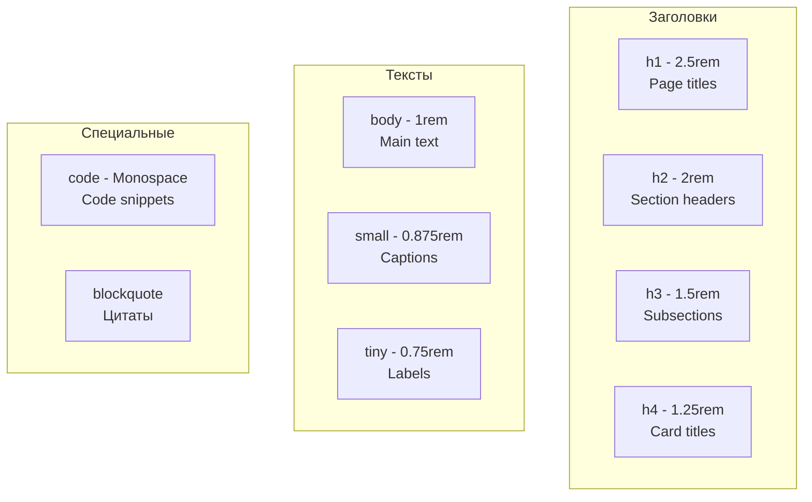
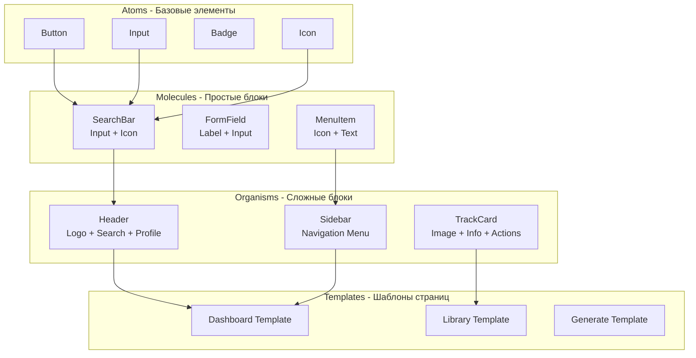
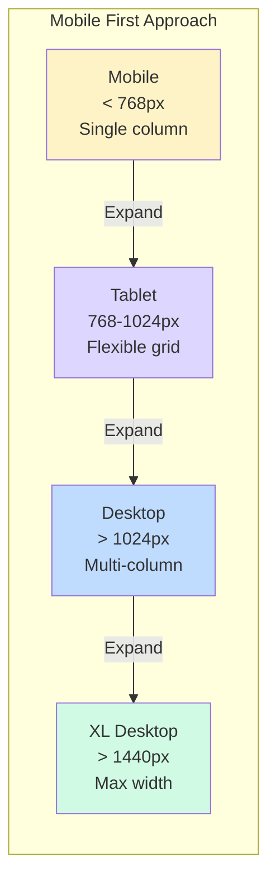
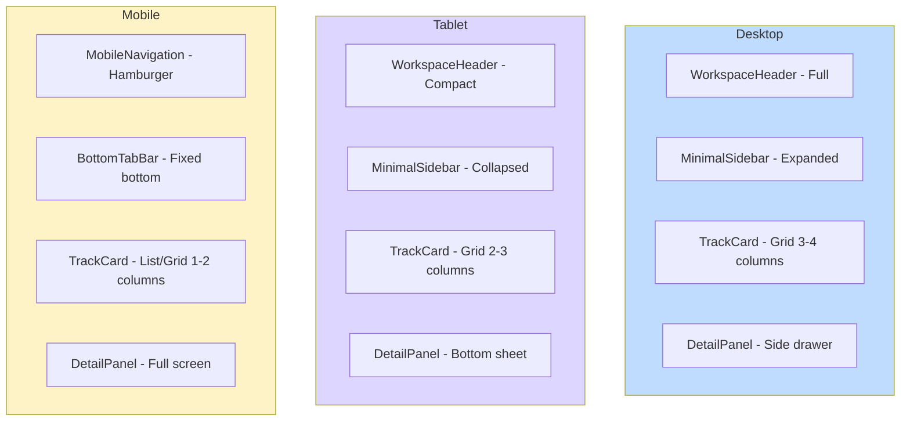
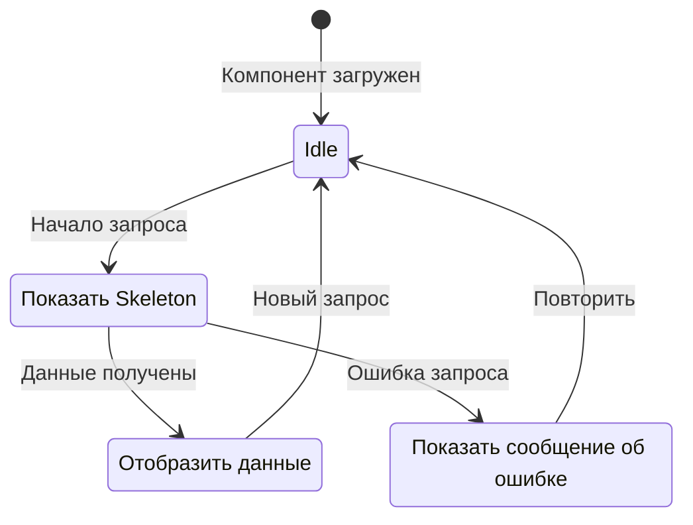
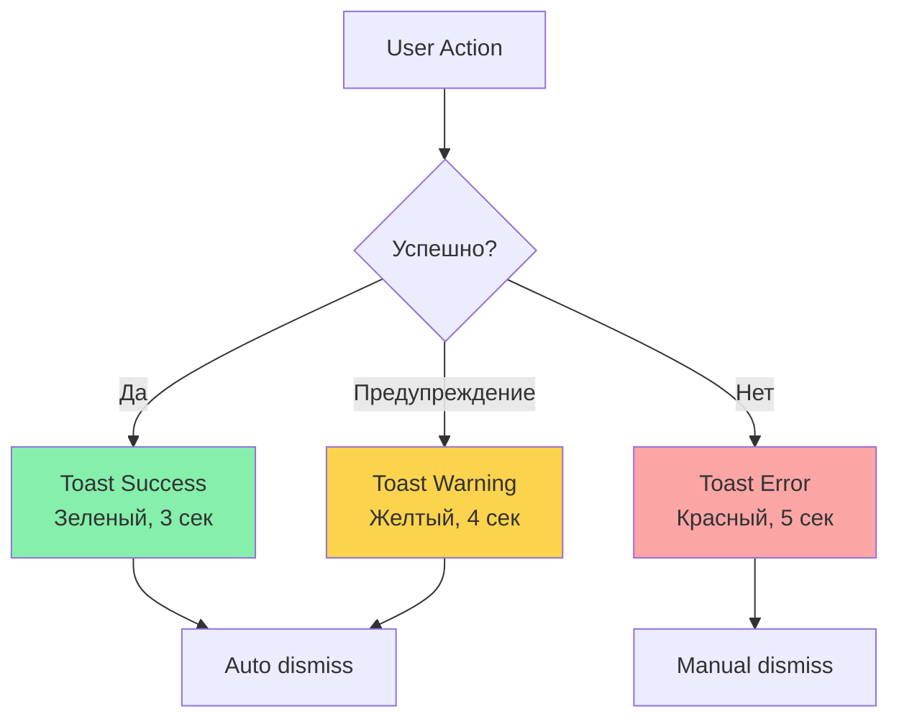
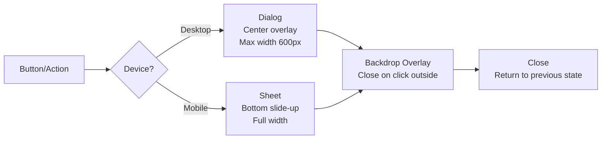
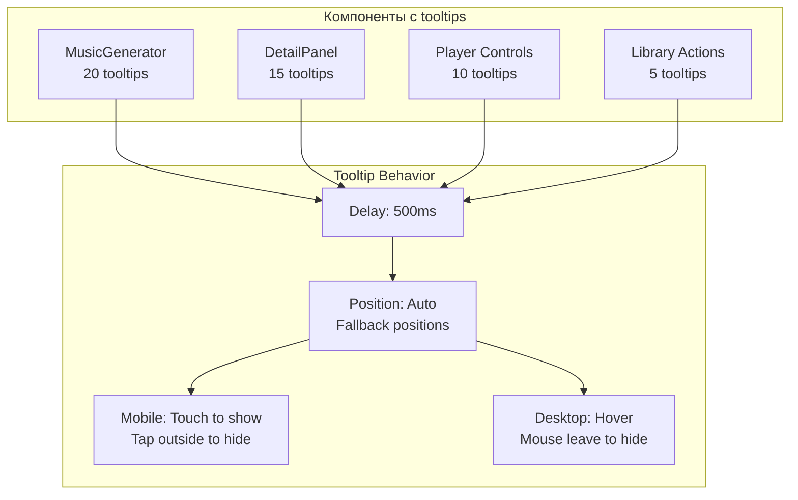
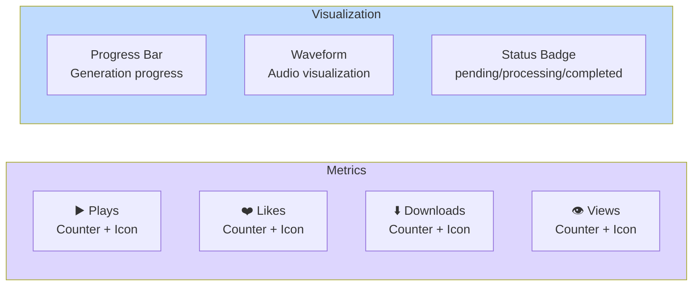

# 🎨 UI/UX Дизайн система и паттерны

## 🎯 Дизайн-система

### Цветовая палитра

```mermaid
graph LR
    subgraph "Primary Colors"
        P1[Primary<br/>Основной акцент]
        P2[Primary Variant<br/>Светлый вариант]
        P3[Primary Glow<br/>Эффект свечения]
    end
    
    subgraph "Semantic Colors"
        S1[Success<br/>Успешные действия]
        S2[Warning<br/>Предупреждения]
        S3[Error<br/>Ошибки]
        S4[Info<br/>Информация]
    end
    
    subgraph "Neutral Colors"
        N1[Background<br/>Фон]
        N2[Foreground<br/>Текст]
        N3[Muted<br/>Приглушенный]
        N4[Border<br/>Границы]
    end
    
    style "Primary Colors" fill:#818cf8
    style "Semantic Colors" fill:#34d399
    style "Neutral Colors" fill:#94a3b8
```

### Типографика



---

## 🎨 UI Компоненты

### Иерархия компонентов



---

## 📱 Адаптивный дизайн

### Breakpoints



### Компонентная адаптация



---

## 🎭 UI Паттерны

### Loading States



### Toast Notifications Flow



### Modal/Dialog Patterns



---

## 🎯 Tooltips система (Sprint 19)

### Tooltip Architecture



### Tooltip содержание

| Элемент | Tooltip текст (RU) | Цель |
|---------|-------------------|------|
| Provider selector | "Выберите AI провайдер для генерации музыки" | Объяснить выбор |
| Improve Prompt | "Улучшить промпт с помощью AI для лучших результатов" | Мотивировать использование |
| Has Vocals toggle | "Включить вокал в трек" | Простое объяснение |
| Generate button | "Генерация займет 2-5 минут" | Установить ожидания |
| Like button | "Добавить в избранное" | Действие |
| Share button | "Поделиться публичной ссылкой" | Действие |

---

## 🌈 Анимации и переходы

### Animation Patterns

```mermaid
graph LR
    subgraph "Entrance Animations"
        FadeIn[Fade In<br/>Opacity 0 → 1]
        SlideUp[Slide Up<br/>translateY +20px → 0]
        ScaleIn[Scale In<br/>scale 0.9 → 1]
    end
    
    subgraph "Exit Animations"
        FadeOut[Fade Out<br/>Opacity 1 → 0]
        SlideDown[Slide Down<br/>translateY 0 → +20px]
        ScaleOut[Scale Out<br/>scale 1 → 0.9]
    end
    
    subgraph "Interaction"
        Hover[Hover<br/>Scale 1.05<br/>Shadow increase]
        Active[Active<br/>Scale 0.98]
        Focus[Focus<br/>Ring outline]
    end
    
    style "Entrance Animations" fill:#86efac
    style "Exit Animations" fill:#fca5a5
    style Interaction fill:#93c5fd
```

### Transition Timing

```css
/* Smooth transitions */
--transition-smooth: all 0.3s cubic-bezier(0.4, 0, 0.2, 1);

/* Fast interactions */
--transition-fast: all 0.15s ease-in-out;

/* Slow emphasis */
--transition-slow: all 0.5s cubic-bezier(0.4, 0, 0.2, 1);
```

---

## 🎨 Themed Components

### Light/Dark Mode

```mermaid
graph TB
    subgraph "Light Mode"
        L1[Background: white]
        L2[Text: gray-900]
        L3[Border: gray-200]
        L4[Shadow: subtle]
    end
    
    subgraph "Dark Mode"
        D1[Background: gray-900]
        D2[Text: gray-100]
        D3[Border: gray-700]
        D4[Shadow: strong]
    end
    
    subgraph "Theme Toggle"
        Toggle[Theme Switch<br/>localStorage persistence]
    end
    
    Toggle --> L1
    Toggle --> D1
    
    style "Light Mode" fill:#f3f4f6
    style "Dark Mode" fill:#1f2937
    style "Theme Toggle" fill:#818cf8
```

---

## 📊 Data Visualization

### Track Stats Display



---

## ✨ Микровзаимодействия

### Button States

```mermaid
stateDiagram-v2
    [*] --> Default
    Default --> Hover: Mouse enter
    Hover --> Active: Mouse down
    Active --> Loading: Async action
    Loading --> Success: Action complete
    Loading --> Error: Action failed
    Success --> Default: Auto transition
    Error --> Default: User dismiss
    
    Default: bg-primary
    Hover: bg-primary-dark + scale(1.02)
    Active: bg-primary-darker + scale(0.98)
    Loading: Spinner + disabled
    Success: Checkmark animation
    Error: Shake animation
```

---

*Обновлено: Sprint 18*  
*Дизайн-система: Tailwind CSS + shadcn/ui*
