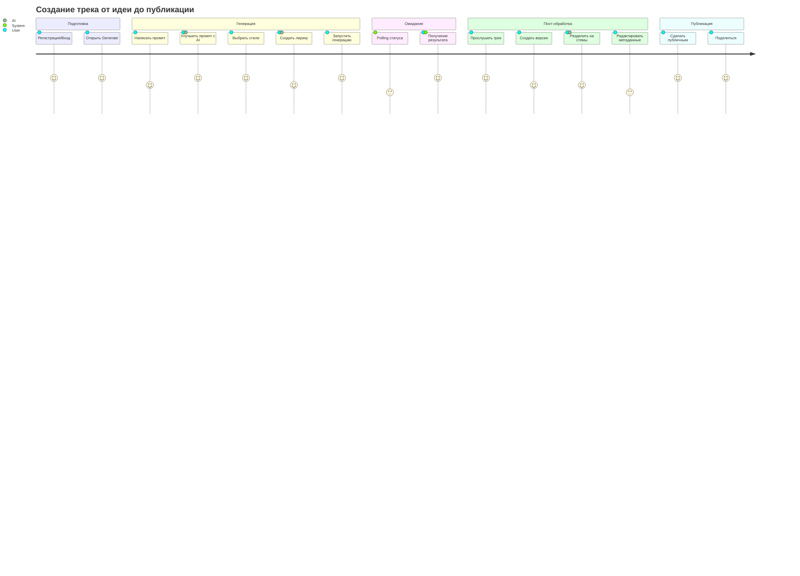
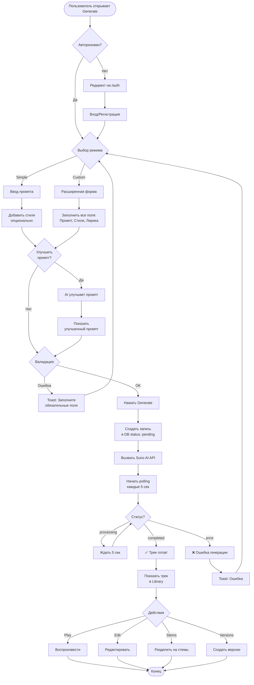
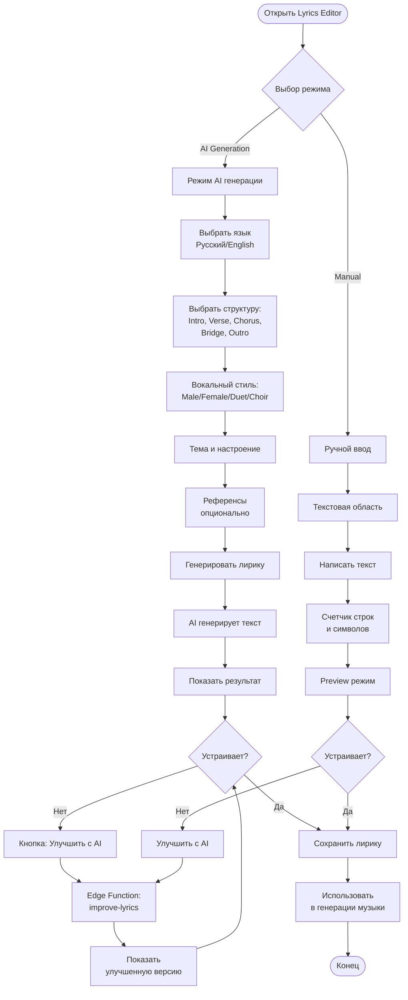
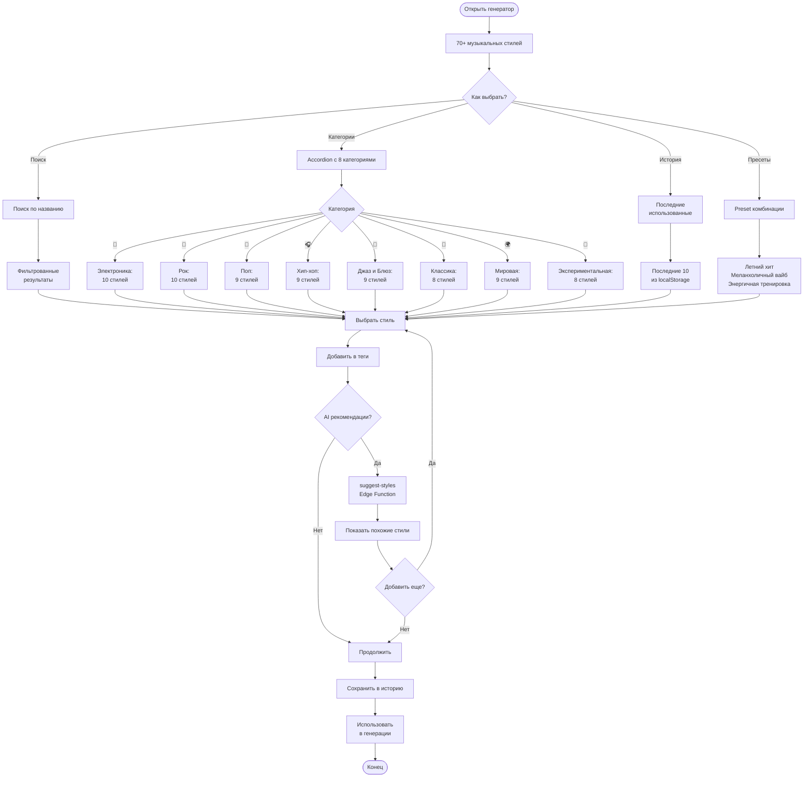
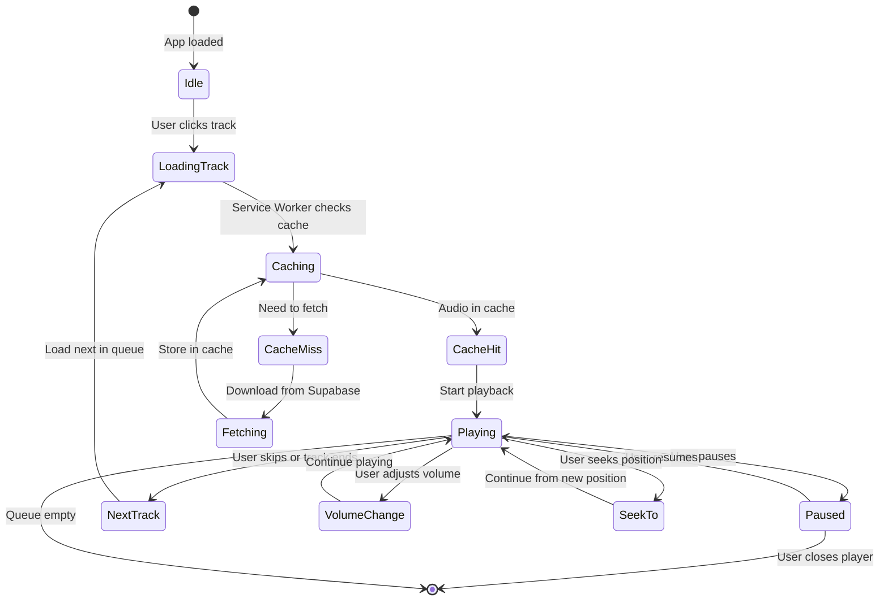
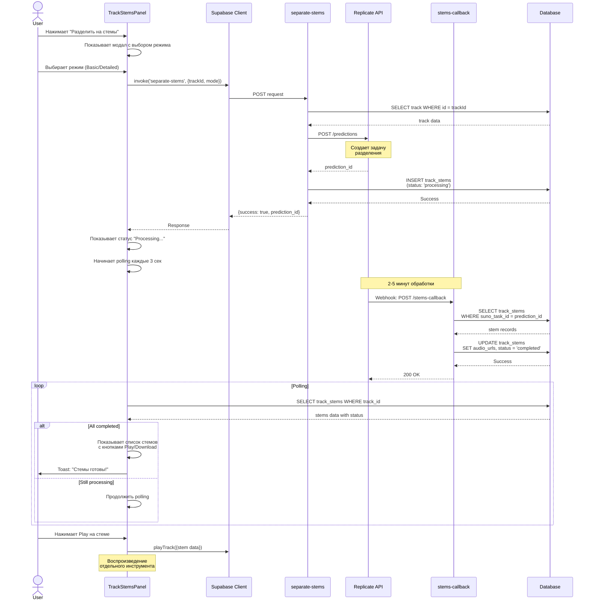
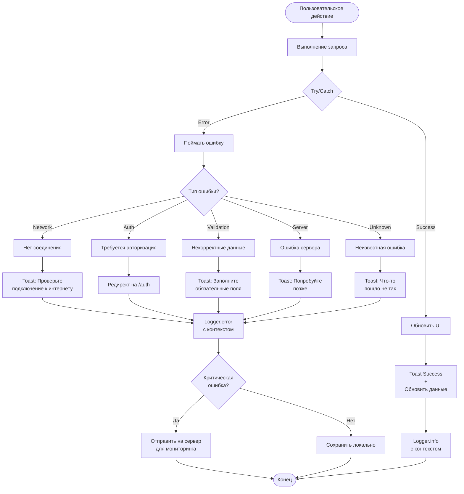

# 🔄 Пользовательские потоки (User Flows)

## 🎵 Основные сценарии использования

### 1. Полный цикл создания трека



---

### 2. Music Generation Flow (Детальный)



---

### 3. Lyrics Editor Flow (Sprint 19 - NEW)



---

### 4. Music Styles Selection (Sprint 19 - NEW)



---

### 5. Audio Player Flow



---

### 6. Track Stems Separation Flow



---

### 7. Authentication Flow

```mermaid
flowchart TD
    Start([Пользователь открывает приложение]) --> CheckSession{Есть сессия?}
    
    CheckSession -->|Да| Dashboard[Перейти в Dashboard]
    CheckSession -->|Нет| Landing[Показать Landing Page]
    
    Landing --> AuthChoice{Выбор действия}
    
    AuthChoice -->|Sign Up| SignUpForm[Форма регистрации]
    AuthChoice -->|Log In| LogInForm[Форма входа]
    AuthChoice -->|Continue as Guest| GuestMode[Ограниченный режим<br/>только просмотр публичных треков]
    
    SignUpForm --> FillSignUp[Ввести email и password]
    FillSignUp --> SubmitSignUp[Нажать Sign Up]
    
    SubmitSignUp --> CreateAccount[Supabase Auth:<br/>createUser()]
    CreateAccount --> AutoConfirm{Auto confirm<br/>enabled?}
    
    AutoConfirm -->|Да| CreateProfile[Trigger: handle_new_user<br/>Создать profile]
    AutoConfirm -->|Нет| SendConfirm[Отправить<br/>письмо подтверждения]
    
    SendConfirm --> WaitConfirm[Пользователь<br/>подтверждает email]
    WaitConfirm --> CreateProfile
    
    CreateProfile --> SetSession[Установить session]
    SetSession --> Dashboard
    
    LogInForm --> FillLogIn[Ввести email и password]
    FillLogIn --> SubmitLogIn[Нажать Log In]
    
    SubmitLogIn --> VerifyCredentials[Supabase Auth:<br/>signInWithPassword()]
    
    VerifyCredentials -->|Success| SetSession
    VerifyCredentials -->|Error| ShowError[Toast: Неверные<br/>учетные данные]
    
    ShowError --> LogInForm
    
    GuestMode --> PublicTracks[Просмотр только<br/>публичных треков]
    PublicTracks --> GuestLimitation[Нельзя создавать,<br/>лайкать, комментировать]
    
    Dashboard --> UserActions[Полный доступ<br/>ко всем функциям]
    UserActions --> Logout{Выход?}
    
    Logout -->|Да| SignOut[Supabase Auth:<br/>signOut()]
    SignOut --> Landing
    
    Logout -->|Нет| Continue[Продолжить работу]
```

---

### 8. Error Handling Flow



---

*Обновлено: Sprint 18*  
*Все flows учитывают изменения Sprint 19*
