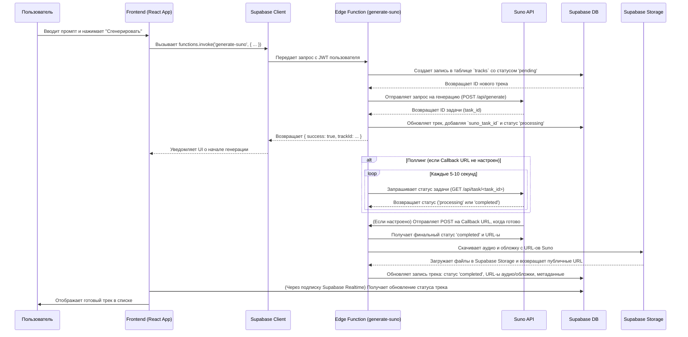

# 🧑‍🚀 Пользовательские сценарии

В этом документе описаны основные пользовательские сценарии (User Flows), которые реализует приложение.

## 1. Регистрация и аутентификация

- **Описание:** Пользователь может создать аккаунт, войти в систему и выйти из нее.
- **Технологии:** Supabase Auth.
- **Процесс:**
    1. Пользователь заходит на страницу логина/регистрации.
    2. Вводит свои данные (email/пароль или использует OAuth провайдера).
    3. Supabase Auth обрабатывает запрос, создает сессию и возвращает JWT токен.
    4. Фронтенд сохраняет токен и использует его для всех последующих запросов к API.

## 2. Генерация музыкального трека

- **Описание:** Основной сценарий, в котором пользователь создает музыку по текстовому описанию.
- **Технологии:** React, Supabase Edge Functions, Suno API, Supabase DB, Supabase Storage, Supabase Realtime.
- **Диаграмма последовательности:**

## 3. Прослушивание и управление треками

- **Описание:** Пользователь может просматривать список своих треков, прослушивать их, просматривать разные версии и удалять.
- **Технологии:** React, Supabase DB, Supabase Storage, Audio Player component.
- **Процесс:**
    1. Пользователь открывает страницу со списком своих треков.
    2. Фронтенд запрашивает у Supabase DB список треков для текущего пользователя.
    3. Данные отображаются в виде списка.
    4. При нажатии на кнопку "Play", URL аудио-файла из Supabase Storage передается в компонент аудиоплеера.
    5. При удалении трека, фронтенд отправляет запрос в Supabase (через Edge Function или напрямую), который удаляет запись из БД и связанные файлы из Storage.