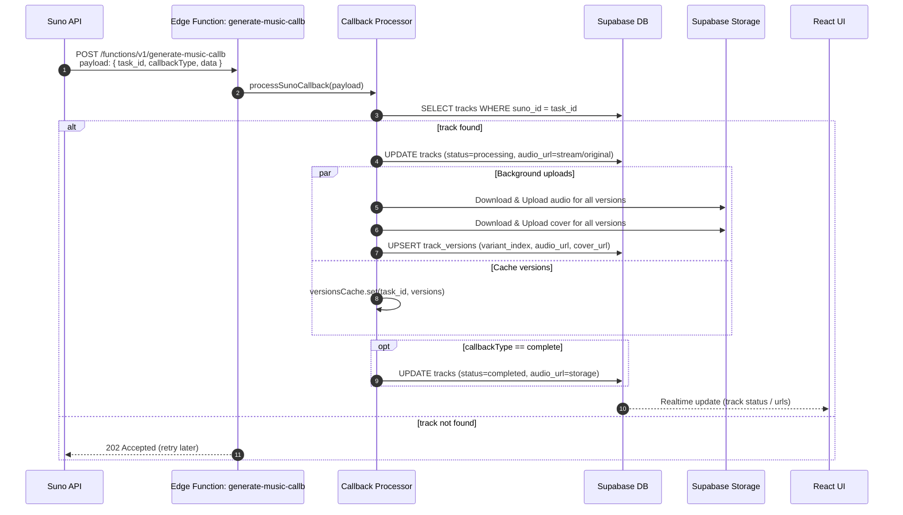

# generate-music-callb — Унифицированный обработчик Suno Callback

Этот модуль обрабатывает callback-запросы от Suno API и обеспечивает:

- Мгновенное воспроизведение первой доступной версии для пользователя
- Параллельную фоновую загрузку всех версий трека в Supabase Storage
- Кеширование версий (TTL 30 минут) для ускорения последующих запросов
- Финализацию трека на этапе `complete` с заменой ссылок на стабильные (Storage)

## Архитектура



## Точка входа

- `supabase/functions/generate-music-callb/index.ts` — Edge-функция, принимающая JSON-коллбек и вызывающая общий процессор.
- `supabase/functions/_shared/callback-processor.ts` — Общая логика обработки, кеширования и фоновых загрузок.

## Формат запроса (SunoCallbackPayload)

```json
{
  "code": 200,
  "msg": "OK",
  "data": {
    "callbackType": "first | complete | text | error",
    "task_id": "...",
    "data": [
      {
        "id": "suno-clip-id",
        "audio_url": "https://...",
        "stream_audio_url": "https://...",
        "image_url": "https://...",
        "duration": 180
      }
    ]
  }
}
```

## Ответы

- `200 OK` — Обработка успешна: `{ ok: true, trackId, stage, cached }`
- `202 Accepted` — Трек не найден; провайдеру рекомендуется повторить callback позже: `{ ok: false, retryable: true }`
- `400/500` — Ошибка валидации/серверная ошибка

## Безопасность вебхуков

- Подпись: ожидается заголовок `X-Suno-Signature` c HMAC-SHA256 от «сырого» тела запроса.
- Секрет: задается переменной окружения `SUNO_WEBHOOK_SECRET` (в Supabase Secrets).
- Поведение:
  - Если секрет задан, но подпись отсутствует/некорректна — `401 Unauthorized`.
  - Валидная подпись — продолжается обработка как обычно.
- Это защищает от несанкционированных вызовов и «подделки» callback-запросов.

## CORS

- Генерация заголовков CORS выполняется на основе реального объекта запроса (`createCorsHeaders(req)`).
- Предзапрос `OPTIONS` поддерживается и возвращает `204 No Content` с корректными заголовками.
- Заголовки:
  - `Access-Control-Allow-Origin` — отражает источник
  - `Access-Control-Allow-Headers` — включает `content-type`, `x-webhook-id`, `x-delivery-id`, `x-suno-signature`

## Проверка (PowerShell / curl)

```powershell
# Предзапрос CORS
curl -X OPTIONS "http://localhost:54321/functions/v1/generate-music-callb" -I

# Неверная подпись (при установленном SUNO_WEBHOOK_SECRET): ожидаем 401
$body = '{"code":200,"msg":"OK","data":{"callbackType":"first","task_id":"t-123","data":[]}}'
curl -X POST "http://localhost:54321/functions/v1/generate-music-callb" \
     -H "Content-Type: application/json" \
     -H "X-Suno-Signature: invalid" \
     -d $body -i

# Трек не найден: ожидаем 202 (при корректной подписи)
# Пример для случая, когда в БД ещё нет записи с таким task_id
curl -X POST "http://localhost:54321/functions/v1/generate-music-callb" \
     -H "Content-Type: application/json" \
     -H "X-Suno-Signature: <валидная-подпись>" \
     -H "X-Webhook-Id: wh-1" \
     -H "X-Delivery-Id: dv-1" \
     -d '{"code":200,"msg":"OK","data":{"callbackType":"first","task_id":"unknown-task","data":[]}}' -i
```

Ожидаемые ответы:

- `401 Unauthorized` — при неверной подписи
- `202 Accepted` — при `track_not_found`
- `200 OK` — при успешной обработке, если запись трека найдена и обновлена

## Хранилище

- Бакеты настроены миграцией:
  - `tracks-audio` (публичный доступ, MIME: `audio/mpeg` и т.п.)
  - `tracks-covers` (публичный доступ)
- Путь файла: `tracks-audio/{userId}/{trackId}/{fileName}`
- Именование: `main.mp3`, `version-1.mp3`, `version-2.mp3`, `version-1-cover.webp`, ...

## UI-поведение

- При получении `first`: UI сразу может начать проигрывание по `audio_url` (возможен `stream_audio_url`)
- При `complete`: UI получает стабильные ссылки из Storage (через realtime-обновления)
- Блок «Версии» может отображать и переключать `track_versions`

## Тестирование

- Unit-тесты: `supabase/functions/_shared/callback-processor_test.ts`
- Интеграционные тесты: рекомендуется добавить вызовы функции `generate-music-callb` с фиктивными данными Suno

## Примечания по производительности

- Кеш версий: 30 минут (TTL) снижает нагрузку при повторных callback/запросах
- Фоновые загрузки выполняются параллельно (`Promise.allSettled`), не блокируя быстрый ответ
- Используется обработка ошибок с фолбэком на оригинальные URL при сбое загрузки