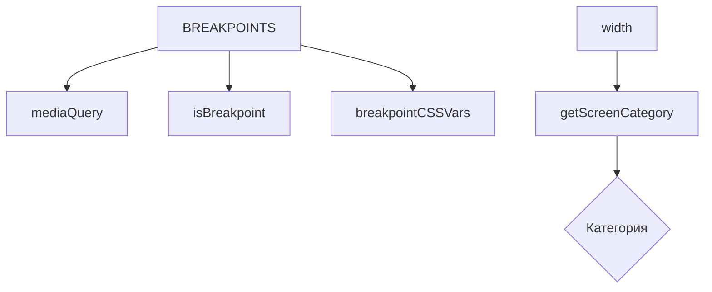

# Контракт брейкпоинтов и responsive-логики

Этот документ фиксирует единый контракт модуля `src/config/breakpoints.config.ts`, который используется для медиазапросов, категоризации экранов и инъекции CSS‑переменных. Цель — избежать регрессий и дублирования логики.

## Экспорты модуля

- `BREAKPOINTS`: словарь порогов в пикселях (синхронизирован с Tailwind)
- `isBreakpoint(width, key)`: проверка `width >= BREAKPOINTS[key]`
- `mediaQuery(key, type)`: генерация строк медиазапросов `(min|max-width: ...)`
- `getScreenCategory(width)`: категоризация ширины: `mobile | tablet | desktop | wide | ultrawide`
- `breakpointCSSVars`: CSS‑переменные для использования в стилях

```ts
import {
  BREAKPOINTS,
  isBreakpoint,
  mediaQuery,
  getScreenCategory,
  breakpointCSSVars,
} from '@/config/breakpoints.config';
```

## Значения брейкпоинтов

- `sm = 640`
- `md = 768`
- `lg = 1024`
- `xl = 1280`
- `2xl = 1536` (Tailwind)
- `3xl = 1920` (внутренний)
- `4k = 2560` (внутренний)

## Примеры использования

```ts
// Медиазапросы
const mdMin = mediaQuery('md', 'min'); // (min-width: 768px)
const mdMax = mediaQuery('md', 'max'); // (max-width: 767px)

// Категории экрана
const category = getScreenCategory(window.innerWidth);

// Инъекция CSS переменных
Object.entries(breakpointCSSVars).forEach(([name, value]) => {
  document.documentElement.style.setProperty(name, value);
});
```

## Диаграмма



## Правила

- Не дублировать определение брейкпоинтов в других модулях
- Изменения в контракте выполнять через миграции импортов, а затем рефакторинг
- Любое изменение значений — сопровождается обновлением тестов `tests/unit/config/breakpoints.config.test.ts`