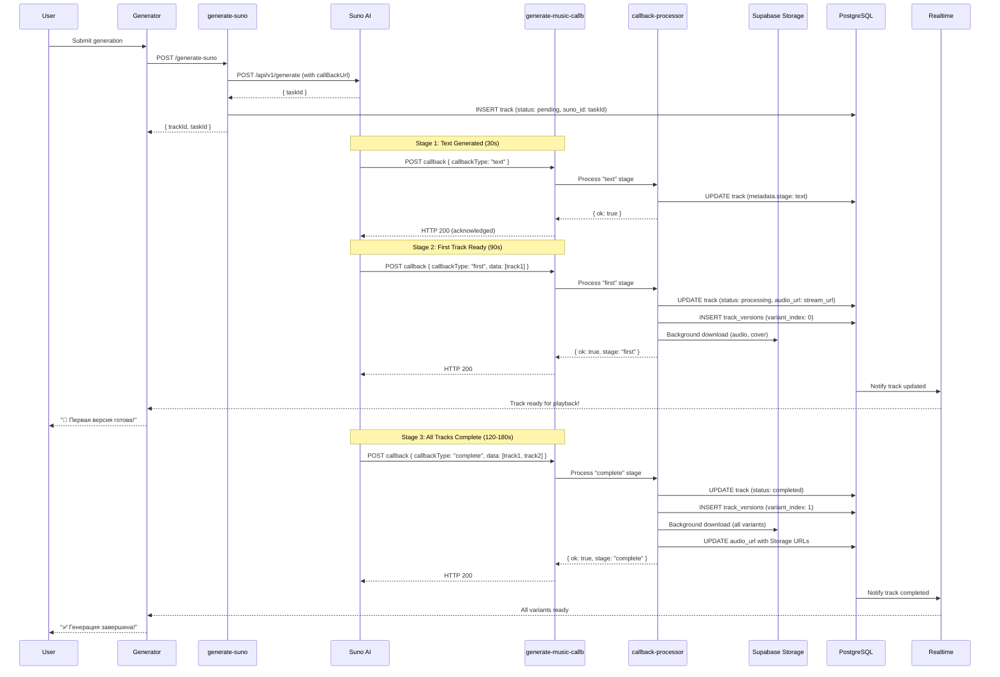

# 🔄 Suno Callback System Architecture
**Version:** 2.0.0  
**Last Updated:** November 17, 2025  
**Status:** ✅ Production Ready

---

## 📋 Overview

Albert3 Muse Synth Studio использует **callback-based architecture** для обработки результатов генерации музыки от Suno AI. Это исключает необходимость polling и обеспечивает немедленную доступность треков.

### Key Benefits
- ⚡ **Instant Playback:** Первая версия доступна через 1-2 минуты
- 📦 **Background Processing:** Загрузка в Storage асинхронно
- 🔒 **Idempotent:** Защита от дублирования
- 🛡️ **Secure:** HMAC-SHA256 signature verification
- 📊 **Multi-Stage:** text → first → complete

---

## 🏗️ Architecture Diagram



---

## 📦 Callback Payload Format

### Standard Format (Suno API Response)

```typescript
interface SunoCallbackPayload {
  code: 200 | 400 | 451 | 500;
  msg: string;
  data: {
    callbackType: 'text' | 'first' | 'complete' | 'error';
    task_id: string;
    data: SunoCallbackMusicData[] | null;
  };
}

interface SunoCallbackMusicData {
  id: string;                       // Suno music ID
  audio_url: string;                // Permanent download URL
  source_audio_url?: string;        // Original URL
  stream_audio_url?: string;        // Streaming URL (instant play)
  source_stream_audio_url?: string;
  image_url?: string;               // Cover image URL
  source_image_url?: string;
  video_url?: string;
  prompt?: string;                  // Generated lyrics
  model_name?: string;              // "chirp-v3-5" etc.
  title?: string;                   // Track title
  tags?: string;                    // "pop, energetic"
  createTime?: string;              // "2025-01-01 00:00:00"
  duration?: number;                // Duration in seconds
}
```

### Status Codes

| Code | Meaning | Action |
|------|---------|--------|
| **200** | Success | Process music data |
| **400** | Bad Request | Mark track as failed (parameter/content violation) |
| **451** | Download Failed | Mark track as failed (source audio unavailable) |
| **500** | Server Error | Retry or mark failed |

### Callback Types

| Type | Stage | Action |
|------|-------|--------|
| **text** | Lyrics generated | Update metadata (stage: text) |
| **first** | First variant ready | Make playable, save to DB |
| **complete** | All variants ready | Finalize track, download all |
| **error** | Generation failed | Mark as failed |

---

## 🔐 Security: Webhook Signature Verification

### HMAC-SHA256 Signature

Suno API отправляет заголовок `X-Suno-Signature` для проверки подлинности:

```
X-Suno-Signature: sha256=abc123...
```

### Verification Algorithm

```typescript
// supabase/functions/_shared/webhook-verify.ts
export async function verifyWebhookSignature(
  payload: string,
  signature: string,
  secret: string
): Promise<boolean> {
  const encoder = new TextEncoder();
  const key = await crypto.subtle.importKey(
    'raw',
    encoder.encode(secret),
    { name: 'HMAC', hash: 'SHA-256' },
    false,
    ['sign']
  );

  const signatureBuffer = await crypto.subtle.sign(
    'HMAC',
    key,
    encoder.encode(payload)
  );

  const expectedSignature = 'sha256=' + Array.from(new Uint8Array(signatureBuffer))
    .map(b => b.toString(16).padStart(2, '0'))
    .join('');

  return signature === expectedSignature;
}
```

### Implementation in Handler

```typescript
// supabase/functions/generate-music-callb/index.ts
const SUNO_WEBHOOK_SECRET = Deno.env.get('SUNO_WEBHOOK_SECRET');

if (SUNO_WEBHOOK_SECRET) {
  const signature = req.headers.get('X-Suno-Signature');
  if (!signature) {
    return new Response(JSON.stringify({ ok: false, error: 'missing_signature' }), {
      status: 401,
      headers: corsHeaders
    });
  }

  const rawBody = await req.text();
  const isValid = await verifyWebhookSignature(rawBody, signature, SUNO_WEBHOOK_SECRET);
  
  if (!isValid) {
    logger.error('Invalid webhook signature');
    return new Response(JSON.stringify({ ok: false, error: 'invalid_signature' }), {
      status: 401,
      headers: corsHeaders
    });
  }

  payload = JSON.parse(rawBody);
} else {
  logger.warn('SUNO_WEBHOOK_SECRET not configured - skipping signature verification');
  payload = await req.json();
}
```

### Setting Up Webhook Secret

```bash
# In Supabase Edge Functions secrets
supabase secrets set SUNO_WEBHOOK_SECRET="your-secret-here"
```

---

## 🔄 Callback Processing Flow

### Stage 1: Text Generated (callbackType: "text")

**Timing:** ~30 seconds after submission

```json
{
  "code": 200,
  "msg": "Text generated successfully",
  "data": {
    "callbackType": "text",
    "task_id": "2fac****9f72",
    "data": null
  }
}
```

**Processing:**
```typescript
// Update track metadata
await supabase
  .from('tracks')
  .update({
    metadata: {
      ...metadata,
      suno_callback_stage: 'text',
      text_generated_at: new Date().toISOString(),
    }
  })
  .eq('id', trackId);
```

---

### Stage 2: First Track Ready (callbackType: "first")

**Timing:** ~90-120 seconds after submission

```json
{
  "code": 200,
  "msg": "First track generated",
  "data": {
    "callbackType": "first",
    "task_id": "2fac****9f72",
    "data": [
      {
        "id": "8551****662c",
        "stream_audio_url": "https://cdn.suno.com/stream/abc123",
        "audio_url": "https://cdn.suno.com/audio/abc123.mp3",
        "image_url": "https://cdn.suno.com/image/abc123.jpeg",
        "title": "Iron Man",
        "duration": 198.44
      }
    ]
  }
}
```

**Processing:**
```typescript
// 1. Make track immediately playable with stream_url
const firstTrack = musicData[0];
await supabase
  .from('tracks')
  .update({
    status: 'processing', // Not 'completed' yet!
    audio_url: firstTrack.stream_audio_url || firstTrack.audio_url,
    cover_url: firstTrack.image_url,
    title: firstTrack.title || track.title,
    duration: firstTrack.duration ? Math.floor(firstTrack.duration) : null,
    metadata: {
      ...metadata,
      suno_callback_stage: 'first',
      first_track_ready_at: new Date().toISOString(),
    }
  })
  .eq('id', trackId);

// 2. Save first variant to track_versions
await supabase
  .from('track_versions')
  .insert({
    parent_track_id: trackId,
    variant_index: 0,
    is_primary_variant: true,
    is_preferred_variant: true,
    audio_url: firstTrack.stream_audio_url || firstTrack.audio_url,
    cover_url: firstTrack.image_url,
    suno_id: firstTrack.id,
    duration: firstTrack.duration ? Math.floor(firstTrack.duration) : null,
  });

// 3. Background: Download and upload to Storage
EdgeRuntime.waitUntil(async () => {
  const storageAudioUrl = await downloadAndUploadAudio(
    firstTrack.audio_url,
    userId,
    trackId,
    supabase
  );
  
  const storageCoverUrl = await downloadAndUploadCover(
    firstTrack.image_url,
    userId,
    trackId,
    supabase
  );

  // Update with stable Storage URLs
  await supabase
    .from('tracks')
    .update({
      audio_url: storageAudioUrl || firstTrack.audio_url,
      cover_url: storageCoverUrl || firstTrack.image_url,
    })
    .eq('id', trackId);
});
```

**User Experience:**
- ✅ Track playable immediately via `stream_audio_url`
- 📦 Stable Storage URLs replace CDN URLs in background
- 🔄 Realtime update triggers UI refresh

---

### Stage 3: All Tracks Complete (callbackType: "complete")

**Timing:** ~180-240 seconds after submission

```json
{
  "code": 200,
  "msg": "All generated successfully.",
  "data": {
    "callbackType": "complete",
    "task_id": "2fac****9f72",
    "data": [
      {
        "id": "8551****662c",
        "audio_url": "https://cdn.suno.com/audio/abc123.mp3",
        "stream_audio_url": "https://cdn.suno.com/stream/abc123",
        "image_url": "https://cdn.suno.com/image/abc123.jpeg",
        "title": "Iron Man",
        "duration": 198.44
      },
      {
        "id": "bd15****1873",
        "audio_url": "https://cdn.suno.com/audio/def456.mp3",
        "stream_audio_url": "https://cdn.suno.com/stream/def456",
        "image_url": "https://cdn.suno.com/image/def456.jpeg",
        "title": "Iron Man",
        "duration": 228.28
      }
    ]
  }
}
```

**Processing:**
```typescript
// 1. Mark track as completed
await supabase
  .from('tracks')
  .update({
    status: 'completed',
    metadata: {
      ...metadata,
      suno_callback_stage: 'complete',
      all_variants_ready_at: new Date().toISOString(),
      total_variants: musicData.length,
    }
  })
  .eq('id', trackId);

// 2. Save all variants to track_versions
for (let i = 0; i < musicData.length; i++) {
  const variant = musicData[i];
  
  await supabase
    .from('track_versions')
    .upsert({
      parent_track_id: trackId,
      variant_index: i,
      is_primary_variant: i === 0,
      audio_url: variant.stream_audio_url || variant.audio_url,
      cover_url: variant.image_url,
      video_url: variant.video_url,
      suno_id: variant.id,
      duration: variant.duration ? Math.floor(variant.duration) : null,
      lyrics: variant.prompt,
      metadata: {
        model_name: variant.model_name,
        tags: variant.tags,
        createTime: variant.createTime,
      }
    }, {
      onConflict: 'parent_track_id, variant_index',
      ignoreDuplicates: false,
    });
}

// 3. Background: Download all variants to Storage
EdgeRuntime.waitUntil(async () => {
  for (const variant of musicData) {
    await downloadAndUploadAudio(variant.audio_url, userId, trackId, supabase);
    await downloadAndUploadCover(variant.image_url, userId, trackId, supabase);
    if (variant.video_url) {
      await downloadAndUploadVideo(variant.video_url, userId, trackId, supabase);
    }
  }

  // Update track with final Storage URLs
  const { data: versions } = await supabase
    .from('track_versions')
    .select('audio_url, cover_url')
    .eq('parent_track_id', trackId)
    .eq('variant_index', 0)
    .single();

  if (versions) {
    await supabase
      .from('tracks')
      .update({
        audio_url: versions.audio_url,
        cover_url: versions.cover_url,
      })
      .eq('id', trackId);
  }
});
```

**User Experience:**
- ✅ Track status: `processing` → `completed`
- 🎵 All variants available
- 📦 Storage URLs replace CDN URLs
- 🔄 Realtime update triggers UI refresh

---

### Stage 4: Error (callbackType: "error")

**Timing:** Any stage if error occurs

```json
{
  "code": 400,
  "msg": "Content violation detected",
  "data": {
    "callbackType": "error",
    "task_id": "2fac****9f72",
    "data": null
  }
}
```

**Processing:**
```typescript
// Mark track as failed
await supabase
  .from('tracks')
  .update({
    status: 'failed',
    error_message: getDetailedErrorMessage(code, msg),
    metadata: {
      ...metadata,
      suno_callback_stage: 'error',
      suno_last_callback_code: code,
      suno_last_callback_msg: msg,
      failed_at: new Date().toISOString(),
    }
  })
  .eq('id', trackId);

// Send notification to user
await supabase
  .from('notifications')
  .insert({
    user_id: userId,
    type: 'error',
    title: 'Ошибка генерации',
    message: `Не удалось сгенерировать трек: ${msg}`,
    link: `/workspace/library?track=${trackId}`
  });
```

**Error Messages by Code:**

| Code | User Message | Technical Reason |
|------|--------------|------------------|
| **400** | "Параметры некорректны или нарушена политика контента" | Bad Request, content violation |
| **451** | "Не удалось скачать референсное аудио" | Download failed |
| **500** | "Ошибка сервера Suno. Попробуйте позже" | Server error |

---

## 🛡️ Idempotency & Deduplication

### Problem
Suno может отправить один и тот же callback **несколько раз** из-за:
- Network retries
- Load balancer timeouts
- API resend logic

### Solution: Webhook ID

```typescript
// Generate unique webhook ID
const webhookId = 
  req.headers.get('x-delivery-id') ||     // Preferred (if Suno sends)
  req.headers.get('x-webhook-id') ||       // Alternative
  `suno:${taskId}:${callbackType}`;        // Fallback

// Check if already processed
const { data: alreadyProcessed } = await supabase.rpc('check_webhook_processed', {
  p_webhook_id: webhookId,
  p_ttl_minutes: 60
});

if (alreadyProcessed) {
  logger.info('Callback already processed (duplicate)', { webhookId, taskId });
  return new Response(JSON.stringify({ ok: true, cached: true }), {
    status: 200,
    headers: corsHeaders
  });
}

// Process callback...

// Mark as processed
await supabase.rpc('mark_webhook_processed', {
  p_webhook_id: webhookId,
  p_payload: payload,
  p_ttl_minutes: 60
});
```

### Database Function

```sql
-- Function to check if webhook was processed
CREATE OR REPLACE FUNCTION check_webhook_processed(
  p_webhook_id TEXT,
  p_ttl_minutes INTEGER DEFAULT 60
) RETURNS BOOLEAN
LANGUAGE plpgsql
SECURITY DEFINER
AS $$
DECLARE
  processed BOOLEAN;
BEGIN
  SELECT EXISTS (
    SELECT 1 FROM webhook_log
    WHERE webhook_id = p_webhook_id
      AND processed_at > NOW() - (p_ttl_minutes || ' minutes')::INTERVAL
  ) INTO processed;
  
  RETURN processed;
END;
$$;
```

---

## ⚡ Performance Optimizations

### 1. In-Memory Caching

```typescript
// Cache versions for 30 minutes
const versionsCache = new MemoryCache<SunoCallbackMusicData[]>(1800); // 30 min TTL

// Cache on first/complete stage
versionsCache.set(taskId, musicData);

// Use cached data on retry
const cached = versionsCache.get(taskId);
if (cached && !musicData) {
  logger.info('Using cached versions', { taskId });
  musicData = cached;
}
```

### 2. Background Tasks

```typescript
// Use EdgeRuntime.waitUntil for non-blocking operations
EdgeRuntime.waitUntil(async () => {
  // Download and upload to Storage
  await downloadAndUploadAudio(audioUrl, userId, trackId, supabase);
  await downloadAndUploadCover(coverUrl, userId, trackId, supabase);
  
  // Update lyrics
  await autoSaveLyrics(trackId, lyrics, supabase);
});

// Return immediately
return new Response(JSON.stringify({ ok: true }), {
  status: 200,
  headers: corsHeaders
});
```

### 3. Quick Response (<15s)

**Priority Order:**
1. **Immediate (0-2s):** Signature verification, DB lookup, status update
2. **Background (2-60s):** Storage downloads, lyrics processing
3. **Return HTTP 200:** Acknowledge callback received

---

## 🧪 Testing Callback Handler

### Local Testing

```bash
# Start Supabase locally
supabase start

# Deploy function
supabase functions deploy generate-music-callb

# Test with curl
curl -X POST http://localhost:54321/functions/v1/generate-music-callb \
  -H "Authorization: Bearer eyJhbG..." \
  -H "Content-Type: application/json" \
  -H "X-Suno-Signature: sha256=abc123..." \
  -d '{
    "code": 200,
    "msg": "First track generated",
    "data": {
      "callbackType": "first",
      "task_id": "test-task-123",
      "data": [{
        "id": "test-audio-456",
        "audio_url": "https://cdn.suno.com/test.mp3",
        "image_url": "https://cdn.suno.com/test.jpeg",
        "title": "Test Track",
        "duration": 120
      }]
    }
  }'
```

### Integration Tests

```typescript
// supabase/functions/generate-music-callb/test.ts
import { assertEquals } from "https://deno.land/std@0.168.0/testing/asserts.ts";

Deno.test("Callback: First stage", async () => {
  const response = await fetch("http://localhost:54321/functions/v1/generate-music-callb", {
    method: "POST",
    headers: {
      "Content-Type": "application/json",
      "Authorization": "Bearer <service-role-key>"
    },
    body: JSON.stringify({
      code: 200,
      msg: "First track generated",
      data: {
        callbackType: "first",
        task_id: "test-123",
        data: [{ id: "audio-456", audio_url: "https://...", title: "Test" }]
      }
    })
  });

  assertEquals(response.status, 200);
  const result = await response.json();
  assertEquals(result.ok, true);
  assertEquals(result.stage, "first");
});
```

---

## 📊 Monitoring & Logging

### Callback Logs Table

```sql
CREATE TABLE callback_logs (
  id UUID PRIMARY KEY DEFAULT gen_random_uuid(),
  track_id UUID REFERENCES tracks(id),
  callback_type TEXT NOT NULL, -- 'suno', 'mureka', etc.
  payload JSONB,
  error_message TEXT,
  created_at TIMESTAMPTZ DEFAULT NOW()
);
```

### Log All Callbacks

```typescript
await supabase
  .from('callback_logs')
  .insert({
    track_id: trackId,
    callback_type: 'suno',
    payload: payload,
    error_message: error?.message || null,
  });
```

### Monitoring Queries

```sql
-- Failed callbacks in last 24h
SELECT * FROM callback_logs
WHERE error_message IS NOT NULL
  AND created_at > NOW() - INTERVAL '24 hours'
ORDER BY created_at DESC;

-- Callback stages distribution
SELECT 
  payload->>'data'->>'callbackType' as stage,
  COUNT(*) as count
FROM callback_logs
WHERE created_at > NOW() - INTERVAL '7 days'
GROUP BY stage;

-- Average time between stages
SELECT 
  AVG(EXTRACT(EPOCH FROM (
    SELECT MIN(created_at) FROM callback_logs c2
    WHERE c2.track_id = c1.track_id
      AND c2.payload->>'data'->>'callbackType' = 'complete'
  ) - created_at)) as avg_time_to_complete
FROM callback_logs c1
WHERE payload->>'data'->>'callbackType' = 'first';
```

---

## 🔧 Troubleshooting

### Issue 1: Callback Not Received

**Symptoms:**
- Track stuck in `processing` for >5 minutes
- No callback logs in database

**Diagnosis:**
```sql
SELECT id, title, status, suno_id, created_at, updated_at, metadata
FROM tracks
WHERE status = 'processing'
  AND created_at < NOW() - INTERVAL '5 minutes'
ORDER BY created_at DESC;
```

**Solutions:**
1. **Check callBackUrl:** Ensure it's publicly accessible
2. **Verify SUNO_WEBHOOK_SECRET:** Must match Suno dashboard
3. **Check firewall:** Allow inbound POST from Suno IPs
4. **Fallback:** Use polling via `check-stuck-tracks` Edge Function

---

### Issue 2: Invalid Signature

**Symptoms:**
- HTTP 401 in Suno callback logs
- Error: `invalid_signature`

**Diagnosis:**
```typescript
// Test signature locally
const testSignature = await generateWebhookSignature(
  JSON.stringify(payload),
  SUNO_WEBHOOK_SECRET
);

console.log('Expected:', testSignature);
console.log('Received:', req.headers.get('X-Suno-Signature'));
```

**Solutions:**
1. **Update secret:** `supabase secrets set SUNO_WEBHOOK_SECRET="new-secret"`
2. **Check encoding:** UTF-8 for payload
3. **Verify algorithm:** HMAC-SHA256
4. **Temporary fix:** Disable signature check (not recommended for prod)

---

### Issue 3: Duplicate Callbacks

**Symptoms:**
- Same track updated multiple times
- Duplicate `track_versions` records

**Diagnosis:**
```sql
SELECT webhook_id, COUNT(*) as count
FROM webhook_log
WHERE created_at > NOW() - INTERVAL '1 hour'
GROUP BY webhook_id
HAVING COUNT(*) > 1;
```

**Solutions:**
- ✅ **Already handled:** `check_webhook_processed()` function
- ✅ **Idempotency key:** `webhook_id` prevents duplicates
- ✅ **UPSERT:** `track_versions` uses `ON CONFLICT` clause

---

## 🎯 Best Practices

### 1. Always Return HTTP 200

```typescript
// ✅ CORRECT: Return 200 even on errors
try {
  await processCallback(payload);
  return new Response(JSON.stringify({ ok: true }), {
    status: 200,
    headers: corsHeaders
  });
} catch (error) {
  logger.error('Callback processing failed', error);
  
  // Still return 200 to acknowledge receipt
  return new Response(JSON.stringify({ ok: true, error: 'processing_failed' }), {
    status: 200,
    headers: corsHeaders
  });
}
```

### 2. Use Background Tasks

```typescript
// ✅ CORRECT: Non-blocking downloads
EdgeRuntime.waitUntil(async () => {
  await downloadAndUploadAudio(...);
  await downloadAndUploadCover(...);
});

// Return immediately
return new Response(JSON.stringify({ ok: true }), { status: 200 });
```

### 3. Log Everything

```typescript
logger.info('Callback received', 'suno-callback', {
  taskId,
  stage: callbackType,
  code,
  variantsCount: musicData?.length || 0,
});

logger.info('Track updated', 'suno-callback', {
  trackId,
  status: 'completed',
  audioUrl: track.audio_url,
});
```

### 4. Handle All Stages

```typescript
switch (callbackType) {
  case 'text':
    // Update metadata only
    break;
  case 'first':
    // Make playable + save variant 0
    break;
  case 'complete':
    // Finalize + save all variants
    break;
  case 'error':
    // Mark as failed + notify user
    break;
  default:
    logger.warn('Unknown callback type', { callbackType });
}
```

---

## 📁 File References

### Edge Functions
- **Handler:** `supabase/functions/generate-music-callb/index.ts` (165 lines)
- **Processor:** `supabase/functions/_shared/callback-processor.ts` (243 lines)
- **Types:** `supabase/functions/_shared/types/callbacks.ts` (51 lines)
- **Signature Verify:** `supabase/functions/_shared/webhook-verify.ts`

### Frontend
- **Generator:** `src/components/generator/MusicGeneratorContainer.tsx`
- **Realtime:** `src/services/realtimeSubscriptionManager.ts`
- **Hook:** `src/hooks/useGenerateMusic.ts`

### Database
- **Tables:** `tracks`, `track_versions`, `callback_logs`, `webhook_log`
- **Functions:** `check_webhook_processed()`, `mark_webhook_processed()`

---

## 🔜 Future Enhancements

1. **Metrics Dashboard**
   - Callback success rate
   - Average time per stage
   - Error distribution

2. **Retry Logic**
   - Exponential backoff
   - Max 3 retries
   - Alert on repeated failures

3. **Advanced Caching**
   - Redis for distributed systems
   - CDN integration
   - Pre-warm popular tracks

---

**Last Updated:** November 17, 2025  
**Version:** 2.0.0  
**Status:** ✅ Production Ready
