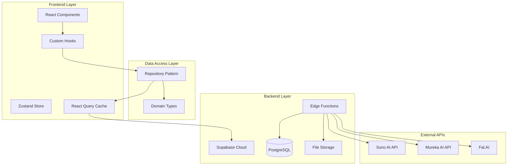
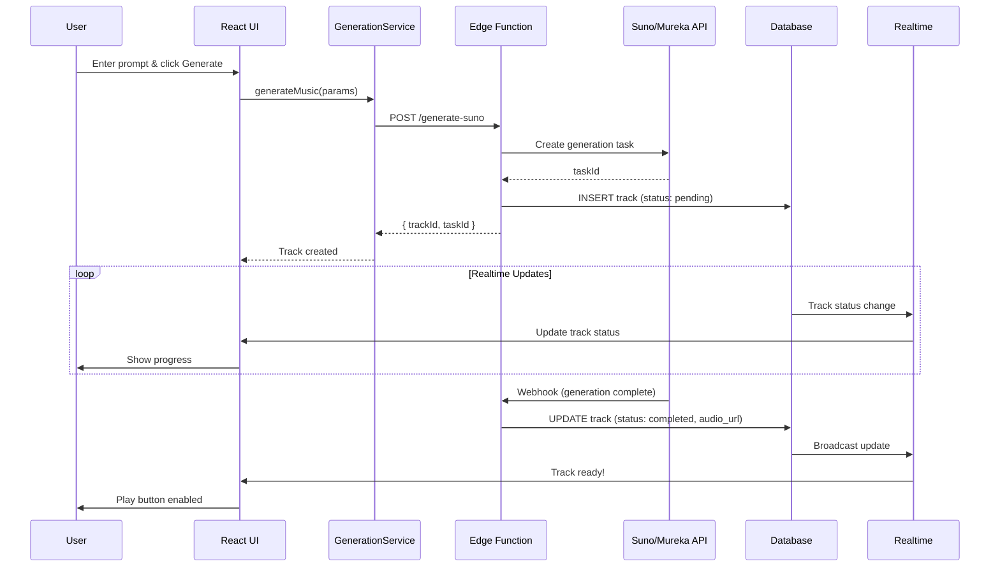
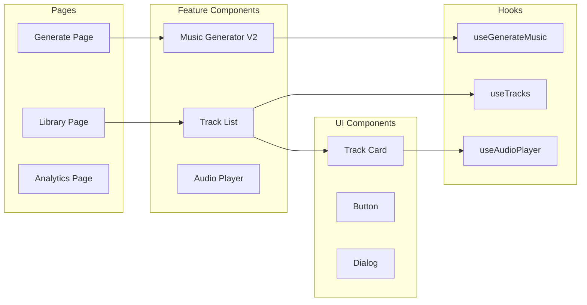
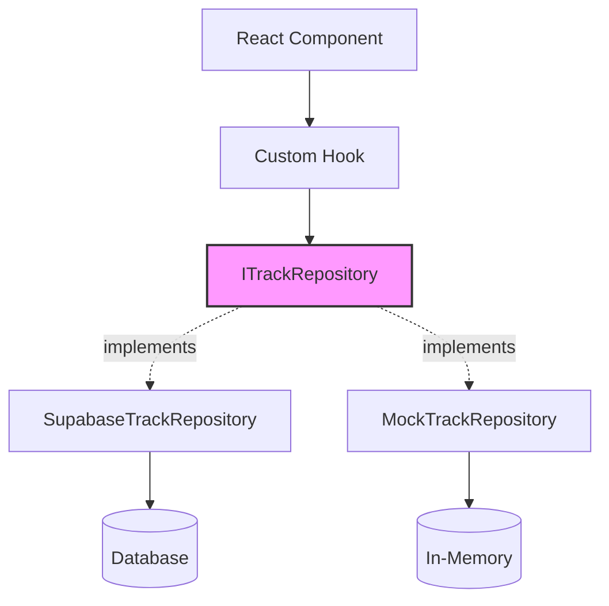
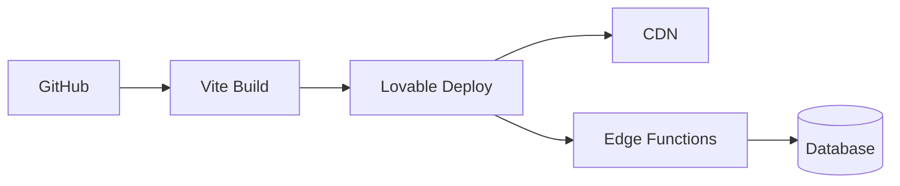

# 🏗️ Albert3 Muse Synth Studio - System Architecture

## High-Level Architecture



## Music Generation Flow



## Component Architecture



## Data Flow - Repository Pattern



## Key Architectural Patterns

### 1. Repository Pattern

**Purpose:** Abstract data access layer from business logic

```typescript
// Interface (contract)
interface ITrackRepository {
  findAll(filters?: TrackFilters): Promise<Track[]>;
  findById(id: string): Promise<Track | null>;
  create(track: Partial<Track>): Promise<Track>;
  // ...
}

// Implementation (Supabase)
class SupabaseTrackRepository implements ITrackRepository {
  async findAll(filters) {
    return supabase.from('tracks').select('*');
  }
}

// Implementation (Mock for tests)
class MockTrackRepository implements ITrackRepository {
  async findAll(filters) {
    return mockData.tracks;
  }
}
```

**Benefits:**
- ✅ Easy to swap implementations (Supabase → REST API)
- ✅ Easy to test (use MockRepository)
- ✅ Single responsibility (data access separated from UI)

### 2. Custom Hooks Pattern

**Purpose:** Encapsulate reusable logic

```typescript
// Modular hooks
const { data: tracks } = useTracksQuery();
const { deleteTrack } = useTracksMutations();
useTracksRealtime(userId);
useTracksPolling(tracks, refetch);

// Composite hook
const useTracks = () => {
  const query = useTracksQuery();
  const mutations = useTracksMutations();
  useTracksRealtime(userId);
  useTracksPolling(query.data, query.refetch);
  
  return { ...query, ...mutations };
};
```

### 3. Single Source of Truth (Domain Types)

**Purpose:** Centralize type definitions

```
src/types/domain/
├── track.types.ts       # Track, TrackVersion, TrackStem
├── lyrics.types.ts      # LyricsJob, LyricsVariant
└── project.types.ts     # Project, ProjectSettings
```

All components import from `@/types/domain/*` - no duplicate type definitions.

### 4. Protected Files System

**Purpose:** Prevent accidental breaking changes

```json
{
  "protected": {
    "files": [
      "src/config/breakpoints.config.ts",
      "src/types/domain/track.types.ts",
      "src/repositories/interfaces/TrackRepository.ts"
    ],
    "rules": {
      "requireApproval": true,
      "requireTests": true
    }
  }
}
```

Pre-commit hook validates protected files.

## Technology Stack

### Frontend
- **React 18.3** - UI library
- **TypeScript** - Type safety
- **Tailwind CSS** - Styling
- **Vite** - Build tool
- **TanStack Query** - Server state management
- **Zustand** - Client state management
- **Radix UI** - Headless components

### Backend
- **Supabase** - Backend platform
- **PostgreSQL** - Database
- **Deno Edge Functions** - Serverless logic
- **Supabase Realtime** - WebSocket updates

### External Services
- **Suno AI** - Music generation
- **Mureka AI** - Music generation
- **Fal.AI** - Stem separation
- **Sentry** - Error tracking

## Performance Optimizations

### 1. Code Splitting
```typescript
const Generate = lazy(() => import('@/pages/workspace/Generate'));
const Library = lazy(() => import('@/pages/workspace/Library'));
```

### 2. Virtualization
```typescript
<VirtualizedList
  items={tracks}
  itemSize={150}
  overscan={5}
/>
```

### 3. React Query Caching
```typescript
{
  staleTime: 5 * 60 * 1000,  // 5 minutes
  gcTime: 10 * 60 * 1000,     // 10 minutes
}
```

### 4. Database Indexes
```sql
CREATE INDEX idx_tracks_user_status 
ON tracks(user_id, status);
```

## Security

### 1. Row Level Security (RLS)
All tables have RLS policies:
```sql
CREATE POLICY "Users can view own tracks"
ON tracks FOR SELECT
USING (auth.uid() = user_id);
```

### 2. Protected Routes
```typescript
<ProtectedRoute>
  <WorkspaceLayout />
</ProtectedRoute>
```

### 3. API Security
- JWT authentication
- Rate limiting
- CORS headers
- Input validation (Zod schemas)

## Monitoring & Observability

- **Sentry** - Error tracking
- **Web Vitals** - Performance metrics
- **Custom Analytics** - User interactions
- **Supabase Logs** - Database queries

## Deployment



---

**Last Updated:** 2025-11-03  
**Version:** 3.0.0  
**Maintainer:** Development Team
