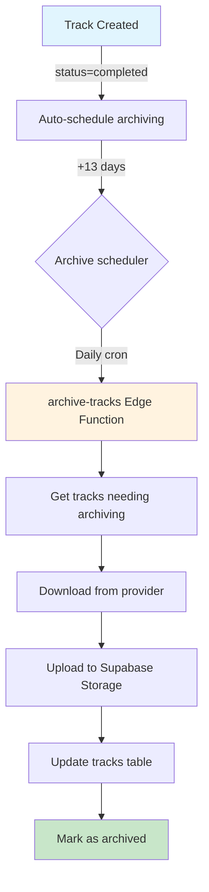

# 🗄️ Track Archiving System

> **CRITICAL**: Provider tracks expire after 15 days  
> **Sprint 31** - Архитектура автоматического архивирования  
> **Status**: ✅ Implemented

---

## ⚠️ Проблема

Треки, сгенерированные через AI провайдеры (Suno, Mureka, Replicate), **хранятся у провайдера только 15 дней**. После этого:
- ❌ Аудио файлы становятся недоступны
- ❌ Обложки удаляются
- ❌ Видео исчезают
- ❌ Пользователи теряют доступ к своему контенту

---

## ✅ Решение: Автоматическое архивирование в Supabase Storage

### Архитектура системы



---

## 🗂️ Database Schema

### New columns on `tracks` table:
```sql
ALTER TABLE tracks ADD COLUMN:
  - archived_to_storage BOOLEAN DEFAULT false
  - storage_audio_url TEXT          -- Supabase Storage URL
  - storage_cover_url TEXT          -- Supabase Storage URL  
  - storage_video_url TEXT          -- Supabase Storage URL
  - archive_scheduled_at TIMESTAMPTZ -- Когда запланировано архивирование
  - archived_at TIMESTAMPTZ          -- Когда выполнено архивирование
```

### New table: `track_archiving_jobs`
```sql
CREATE TABLE track_archiving_jobs (
  id UUID PRIMARY KEY,
  track_id UUID REFERENCES tracks(id),
  user_id UUID NOT NULL,
  status TEXT CHECK (status IN ('pending', 'processing', 'completed', 'failed')),
  
  -- Original URLs (before archiving)
  original_audio_url TEXT,
  original_cover_url TEXT,
  original_video_url TEXT,
  
  -- Storage URLs (after archiving)
  storage_audio_url TEXT,
  storage_cover_url TEXT,
  storage_video_url TEXT,
  
  -- Tracking
  started_at TIMESTAMPTZ,
  completed_at TIMESTAMPTZ,
  error_message TEXT,
  metadata JSONB
);
```

---

## 📅 Timeline

### Auto-scheduling:
1. **Day 0**: Track created (`status = 'completed'`)
2. **Day 13**: Archiving scheduled (`archive_scheduled_at = created_at + 13 days`)
3. **Day 13-14**: Archive job runs (2 days buffer before expiration)
4. **Day 15**: Provider URLs expire → Only Storage URLs work

### Why 13 days?
- ✅ 2-day safety buffer before 15-day expiration
- ✅ Time for retry if first attempt fails
- ✅ Avoids last-minute rush

---

## 🔧 Edge Function: `archive-tracks`

### Endpoint
```
POST /functions/v1/archive-tracks
```

### Request Body (optional)
```typescript
{
  "trackId": "uuid",  // Archive specific track (manual trigger)
  "limit": 50         // Max tracks to process per run (default: 50)
}
```

### Response
```json
{
  "success": true,
  "message": "Archived 42/50 tracks",
  "results": {
    "total": 50,
    "succeeded": 42,
    "failed": 8,
    "errors": [
      { "trackId": "...", "title": "...", "error": "Download failed" }
    ]
  }
}
```

---

## 🔄 Workflow

### 1. Track Creation (Automatic)
```sql
-- Trigger: schedule_track_archiving()
-- Runs on INSERT/UPDATE of tracks table

INSERT INTO tracks (title, audio_url, status, ...)
VALUES ('My Song', 'https://provider.com/audio.mp3', 'completed', ...)

-- Automatically sets:
-- archive_scheduled_at = created_at + INTERVAL '13 days'
```

### 2. Archive Job Execution (Edge Function)
```typescript
// Called by cron or manual trigger
const response = await supabase.functions.invoke('archive-tracks', {
  body: { limit: 100 }
});

// For each track:
// 1. Create archiving_job (status = 'processing')
// 2. Download audio from provider URL
// 3. Upload to Supabase Storage bucket
// 4. Update track with storage_audio_url
// 5. Mark as archived (archived_to_storage = true)
// 6. Update job (status = 'completed')
```

### 3. Fallback to Storage URLs (Frontend)
```typescript
// TrackPlayer.tsx
const audioUrl = track.archived_to_storage 
  ? track.storage_audio_url  // Use Supabase Storage
  : track.audio_url;          // Use provider URL (if not expired)

// Cover image
const coverUrl = track.storage_cover_url || track.cover_url;
```

---

## 📊 Storage Buckets

### Configuration
```sql
-- Buckets already exist:
INSERT INTO storage.buckets (id, name, public) VALUES
  ('tracks-audio', 'tracks-audio', true),
  ('tracks-covers', 'tracks-covers', true),
  ('tracks-videos', 'tracks-videos', true);
```

### File paths:
```
tracks-audio/{user_id}/{track_id}.mp3
tracks-covers/{user_id}/{track_id}.jpg
tracks-videos/{user_id}/{track_id}.mp4
```

### RLS Policies (already configured):
- ✅ Public read access
- ✅ Authenticated users can upload own files
- ✅ Users can delete own files

---

## 🔍 Monitoring Functions

### Get tracks needing archiving:
```sql
SELECT * FROM get_tracks_needing_archiving(100);
-- Returns: track_id, title, days_until_expiry, ...
```

### Archive statistics:
```sql
SELECT * FROM archive_statistics;
-- Returns:
--   total_archived: 1523
--   pending_archive: 47
--   urgent_archive_needed: 12  -- <2 days until expiry
--   expired_tracks: 3           -- Already expired
--   archive_percentage: 92.5%
```

### Manual archiving:
```sql
-- Mark track as archived after manual upload
SELECT mark_track_archived(
  'track-uuid',
  'https://supabase.co/storage/tracks-audio/user/track.mp3',
  'https://supabase.co/storage/tracks-covers/user/track.jpg',
  'https://supabase.co/storage/tracks-videos/user/track.mp4'
);
```

---

## ⚙️ Scheduled Execution

### Cron Setup (Recommended)
```bash
# Run daily at 3 AM UTC
0 3 * * * curl -X POST \
  https://your-project.supabase.co/functions/v1/archive-tracks \
  -H "Authorization: Bearer SERVICE_ROLE_KEY" \
  -H "Content-Type: application/json" \
  -d '{"limit": 200}'
```

### Alternative: Supabase Cron Extension
```sql
-- Using pg_cron (if available)
SELECT cron.schedule(
  'archive-tracks-daily',
  '0 3 * * *',  -- 3 AM daily
  $$
  SELECT net.http_post(
    url := 'https://your-project.supabase.co/functions/v1/archive-tracks',
    headers := '{"Authorization": "Bearer SERVICE_ROLE_KEY"}'::jsonb,
    body := '{"limit": 200}'::jsonb
  );
  $$
);
```

---

## 🚨 Error Handling

### Retry Logic
```typescript
// Edge function implements retry for failed downloads
const MAX_RETRIES = 3;
const RETRY_DELAY = 5000; // 5 seconds

for (let attempt = 1; attempt <= MAX_RETRIES; attempt++) {
  try {
    await downloadAndUpload(...);
    break; // Success
  } catch (error) {
    if (attempt === MAX_RETRIES) throw error;
    await sleep(RETRY_DELAY * attempt);
  }
}
```

### Failed Job Handling
- ❌ Jobs marked as `failed` with error message
- 🔄 Can be retried manually:
  ```typescript
  await supabase.functions.invoke('archive-tracks', {
    body: { trackId: 'failed-track-uuid' }
  });
  ```

### Notification (Future enhancement)
```typescript
// TODO: Notify user if archiving fails
if (jobStatus === 'failed') {
  await supabase.from('notifications').insert({
    user_id: track.user_id,
    type: 'warning',
    title: 'Не удалось архивировать трек',
    message: `Трек "${track.title}" не был сохранен. Он может стать недоступен.`,
    link: `/workspace/library?track=${track.id}`
  });
}
```

---

## 📈 Performance Considerations

### Batch Processing
- Process max 50-200 tracks per run
- Prevents timeout and memory issues
- Multiple runs per day if needed

### Storage Costs
```
Average track size:
- Audio: 4-8 MB (MP3, 3-5 min)
- Cover: 200-500 KB (JPEG)
- Video: 20-40 MB (MP4, optional)

Monthly storage for 1000 tracks:
- Audio: ~6 GB
- Covers: ~400 MB
- Videos: ~25 GB (if enabled)
Total: ~32 GB/month

Supabase Storage pricing: $0.021/GB/month
Cost: ~$0.67/month for 1000 tracks
```

### Bandwidth
- Download from provider: Free (provider's bandwidth)
- Upload to Supabase: Free (egress included in plan)
- User playback: Supabase egress charges apply

---

## 🛡️ Security

### RLS Policies
```sql
-- Users can only archive own tracks
CREATE POLICY "Users can archive own tracks"
ON track_archiving_jobs FOR INSERT
WITH CHECK (auth.uid() = user_id);

-- Service role can manage all
CREATE POLICY "Service can manage jobs"
ON track_archiving_jobs FOR ALL
USING (true);
```

### Edge Function Auth
- Requires service role key
- Not exposed to frontend
- Only callable by cron or admin

---

## 🎯 Success Metrics

### Week 1 Target:
- ✅ Database schema created
- ✅ Edge function implemented
- ✅ Auto-scheduling trigger active
- ⏳ Cron job configured
- ⏳ First batch archived

### Long-term Goals:
- 📊 95%+ tracks archived before expiration
- 📊 <1% archiving failure rate
- 📊 <5 min average archiving time per track
- 📊 Zero data loss due to provider expiration

---

## 🔗 Related Documents

- [Sprint 31 Plan](/project-management/SPRINT_31_PLAN.md)
- [Supabase Storage Guide](https://supabase.com/docs/guides/storage)
- [Edge Functions Guide](https://supabase.com/docs/guides/functions)

---

*Last updated: 2025-10-31*  
*Version: 1.0.0*  
*Status: Production Ready*
