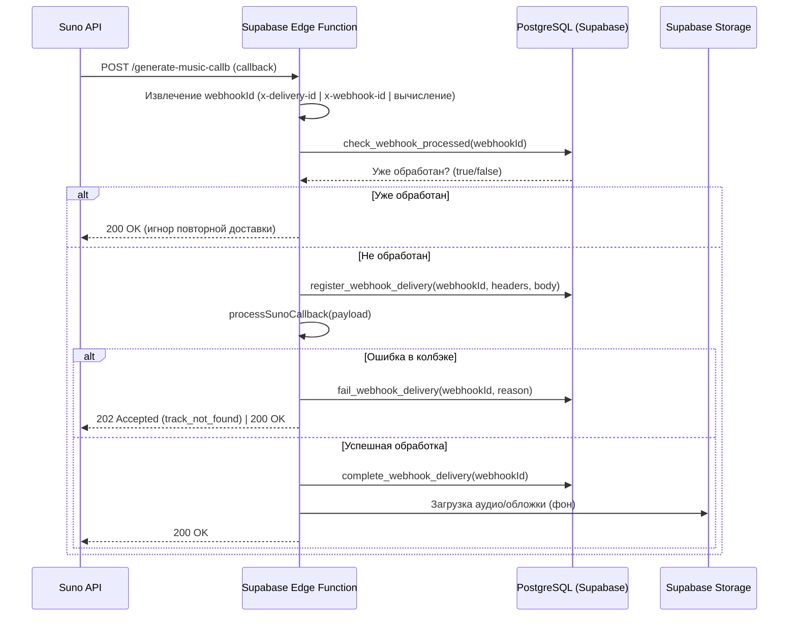

# Вебхуки Suno: идемпотентность и обработка ошибок

Этот документ описывает архитектуру и реализацию идемпотентной обработки вебхуков Suno в Albert3 Muse Synth Studio. Цель — обеспечить надёжную и повторяемую обработку событий без дублирования при повторной доставке, а также корректную реакцию на ошибки поставщика.

## Цели
- Исключить повторную обработку одного и того же вебхука (идемпотентность).
- Сохранять статусы обработки в базе (`webhook_delivery_log`).
- Корректно обрабатывать ошибочные колбэки Suno (помечать трек как `failed`).
- Обеспечить готовность к горизонтальному масштабированию обработки.

## Поток обработки



## Компоненты и файлы
- `supabase/functions/generate-music-callb/index.ts` — HTTP‑обработчик вебхука.
- `supabase/functions/_shared/callback-processor.ts` — логика обработки колбэков Suno.
- `supabase/migrations/20251106000001_webhook_idempotency.sql` — таблица `webhook_delivery_log` и RPC‑функции.

## Схема данных: webhook_delivery_log

Таблица предназначена для регистрации доставок вебхуков и отслеживания их статуса.

- Ключевые поля:
  - `webhook_id` — уникальный идентификатор доставки (из заголовков или вычисленный).
  - `status` — `registered` | `completed` | `failed`.
  - `headers`, `payload` — диагностические данные.
  - `created_at`, `updated_at` — метаданные.

- RPC‑функции:
  - `check_webhook_processed(p_webhook_id)` — вернуть флаг, был ли вебхук завершён ранее.
  - `register_webhook_delivery(p_webhook_id, p_headers, p_payload)` — зарегистрировать новую доставку.
  - `complete_webhook_delivery(p_webhook_id)` — отметить успешное завершение.
  - `fail_webhook_delivery(p_webhook_id, p_reason)` — отметить неуспех.
  - `cleanup_old_webhook_logs(p_days)` — очистить старые записи.

## Генерация webhookId

В обработчике колбэка используется следующая стратегия:

1. Попытка взять `x-delivery-id`.
2. Если отсутствует — попытка взять `x-webhook-id`.
3. Если оба отсутствуют — построение детерминированного ID на основе `taskId` и `stage` из payload (`suno:taskId:stage`).

Это обеспечивает стабильный ключ для идемпотентности даже при отсутствии заголовков.

## Обработка ошибок поставщика

В `callback-processor.ts` реализована логика:
- Если код ответа поставщика `>= 400` или `callbackType === 'error'`, трек помечается как `failed`, а текущая стадия — `error`.
- Для случая `track_not_found` возвращается `202 Accepted`, чтобы не останавливать Suno и не создавать ложную ошибку повторной доставки.

## Очистка Supabase Storage

Для устойчивой работы хранилища:
- `supabase/functions/cleanup-storage-objects/index.ts` — добавлена пагинация при обходе больших бакетов.
- Удалено обращение к несуществующему полю `deleted_at` в таблице `tracks`.
- План очистки учитывает статус трека (`failed`), возраст файла и факт существования трека.

## Тестирование и CI

- Юнит‑тесты дополнены кейсами обработки ошибок колбэков: `supabase/functions/_shared/callback-processor_test.ts`.
- GitHub Actions запускает Deno‑тесты и Supabase Edge‑функции: `.github/workflows/supabase-functions-tests.yml`.

## Локальная проверка

```bash
# Запуск Deno‑тестов Edge‑функций
deno task test

# Ручная проверка идемпотентности с повторной доставкой
curl -X POST \
  -H "Content-Type: application/json" \
  -H "x-delivery-id: test-123" \
  -d '{"taskId":"abc","stage":"complete","suno_id":"xyz"}' \
  http://localhost:54321/functions/v1/generate-music-callb
```

## Рекомендации на будущее
- Добавить проверку подписи вебхука (HMAC), если Suno будет предоставлять заголовки подписи.
- Документировать SLA и ретрай‑политику для временных ошибок сторонних API.
- Добавить `archived_at` для треков и учесть это поле в стратегии очистки.