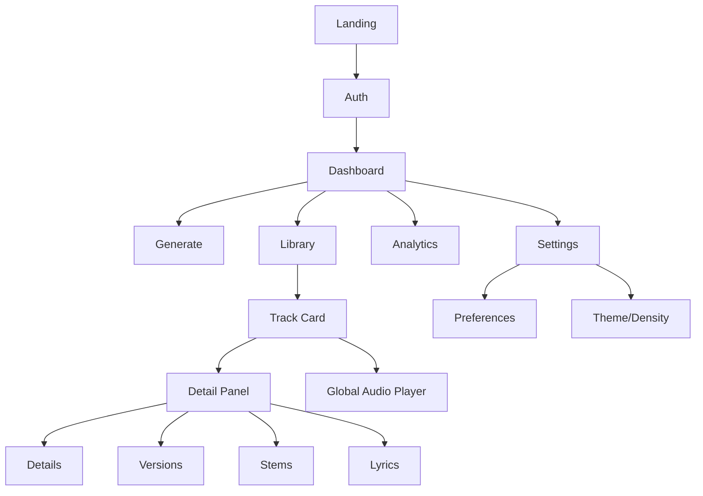
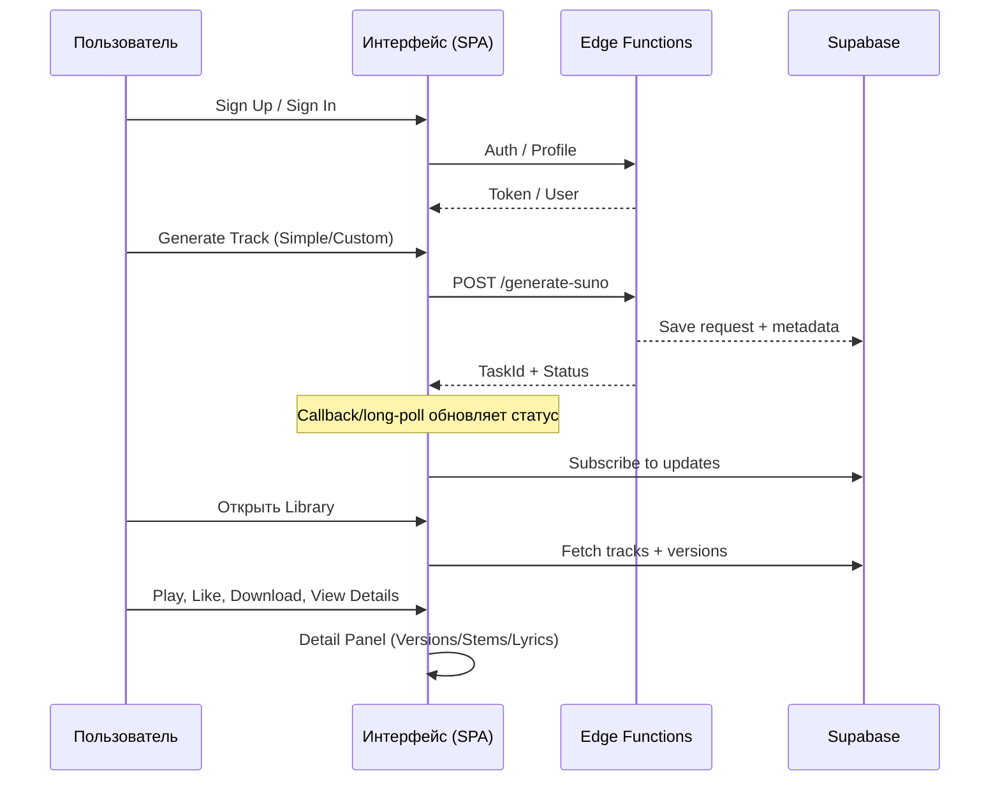

# 📊 Комплексный аудит пользовательского интерфейса (Workspace)

**Дата**: 04 ноября 2025  
**Версия**: 1.0.0  
**Область**: Albert3 Muse Synth Studio — Workspace (генерация, библиотека, плеер, детализация трека)

---

## 🎯 Цели и методология

- Оценить навигационную структуру, информационную архитектуру и критические пользовательские пути.
- Провести юзабилити‑тестирование (15–20 участников) с замерами времени, ошибок и качественных инсайтов.
- Выявить точки трения и когнитивной нагрузки (тепловые карты, eye‑tracking/веб‑взгляд).
- Разработать детальный план улучшений: визуальная иерархия, сокращение шагов, внедрение UX‑паттернов, интерактивная обратная связь.
- Особый фокус: система версионирования, иконки переключения версий, панель деталей трека.
- Сформировать поэтапную дорожную карту с KPI и ожидаемыми количественными результатами.

---

## 🗺 Архитектура навигации и пользовательские пути

### 1) Карта разделов и связей (Information Architecture)



### 2) Критические пользовательские пути (CUP)



---

## 🔬 План юзабилити‑тестирования (15–20 участников)

### Репрезентативные персоны
- Casual Creator (60%): мобильные пользователи, быстрый результат (<2 мин).
- Power User (25%): продвинутые функции, версии, экспорт.
- QA/Tech (15%): ищет стабильность, диагностику, воспроизводимость.

### Задачи и метрики
- CUP #1: «Сгенерировать первый трек» — время до завершения, шаги, ошибки.
- CUP #2: «Воспроизвести трек» — время до первого звука, ошибки плеера.
- CUP #3: «Скачать трек (WAV/MP3)» — клики, успех/провал, перезагрузки.
- CUP #4: «Найти и переключить версию трека» — распознаваемость UI, точность выбора.
- CUP #5: «Открыть детальную панель и прочитать лирику» — скроллы, фокус, поиск вкладки.

Замеры:
- Время выполнения (медиана, p90).
- Кол-во шагов (кликов/переходов).
- Ошибки и затруднения (N, тип, причина).
- SUS, NPS, CSAT, открытые комментарии (интервью по сценарию).

Инструменты:
- Sentry Session Replay (без PII) — контекст ошибок, путь до ошибки.
- Web Vitals (LCP/FID/CLS/TTFB/INP) — перформанс шагов.
- Аналитика событий (`src/services/analytics.service.ts`) — конверсии, воронки.
- Тепловые карты (PostHog/Hotjar) — клики, скроллы, hover (с учётом приватности).
- Eye‑tracking (WebGazer.js) или «веб‑взгляд» через курсор/scroll proxy.

### Скрипт интервью (15–20 минут/участник)
- Разминка: предыдущий опыт генеративной музыки.
- Демонстрация панели генерации: первое внимание, понятность блоков.
- Выполнение задач CUP #1–#5 с «think‑aloud».
- Обсуждение: затруднения, предложения, приоритеты.
- Оценка: SUS, NPS, CSAT, «что мешало/что порадовало».

---

## 🧭 Точки трения и когнитивная нагрузка

На основе текущих отчётов и UX аудитов:
- Ожидание генерации (30–120 сек) без явной оценки времени → требуется ETA/прогресс.
- Недостаточно явный статус версий трека (активная/мастер‑версия) → нужна явная маркировка.
- Детальная панель перегружена при малой ширине экрана → добавить визуальную иерархию, «скелеты», подсказки.
- Недостаточная обратная связь при ошибках внешних API → централизованные, понятные сообщения, retry.
- Мобильная навигация: пересечение с BottomTabBar, фокус и доступность (44px+).

Диагностика (рекомендована):
- Тепловые карты на: Generate, Library, TrackCard, DetailPanel.
- Eye‑tracking (или прокси): фиксация зон внимания на Versions/Details/Stems/Lyrics.
- Карта скроллов в DetailPanel: видимость ключевых вкладок без лишних действий.

---

## 🎨 Рекомендации по улучшению (с примерами)

### 1) Визуальная иерархия (Гештальт‑принципы)
- Выравнивание и группировка: объекты одной операции «рядом», расстояния консистентны.
- Контраст и акцент: активная версия — яркий badge, вторичные — приглушены.
- Иерархия заголовков: H1 (название трека) → H2 (вкладки) → H3 (контент).
- Принцип близости: действия версии рядом с индикатором версии.

### 2) Редизайн рабочих процессов (−30% шагов)
- Генерация: пресеты + авто‑заполнение (персона/стиль/референс) по выбору.
- Версии: селектор версий в TrackCard + быстрый toggle «master».
- Детали трека: sticky tabs, lazy loading, пустые состояния с подсказками.
- Скачивание WAV/MP3: прямой клик без модала, с toast и метрикой.

### 3) UX‑паттерны под аудиторию
- ToggleGroup с иконками для режимов (Simple/Custom).
- Version chips с tooltips и доступными иконками (ARIA labels).
- BottomSheet/ResponsiveDialog на мобильных для DetailPanel.
- Skeleton loaders + progress indicators для длинных операций.

### 4) Интерактивная обратная связь
- ETA для генерации + «cooldown timer»/debounce по кнопке.
- Toast‑уведомления при ошибках Suno/Mureka с действиями (retry, help).
- Анимации индикаторов (микро‑анимации) при переключении версий.
- Live regions (ARIA) для динамического контента.

### 5) Особый фокус: Версионирование и панель деталей
- Активная версия: явный `badge`/`pill` + иконка «master». 
- Иконки версий: понятные пиктограммы, достаточный контраст, hit‑area ≥ 44px.
- Панель деталей: структурированные секции (Details/Versions/Stems/Lyrics), sticky tabs, индикатор активной вкладки, подсказки.
- Сравнение версий: диалог side‑by‑side с синхронным воспроизведением.

---

## 🗓 Поэтапный план реализации

### Матрица влияния/сложности

```mermaid
quadrantChart
  title Матрица приоритизации
  x-axis Низкая сложность --> Высокая сложность
  y-axis Низкое влияние --> Высокое влияние
  quadrant-1 Быстрые победы
  quadrant-2 Стратегические
  quadrant-3 Под сомнением
  quadrant-4 Маловлиятельные
  "ETA/Прогресс генерации" : 0.2, 0.9
  "Selector версий в TrackCard" : 0.4, 0.8
  "Sticky tabs в DetailPanel" : 0.6, 0.7
  "Version comparison view" : 0.8, 0.6
  "Mobile BottomSheet для DetailPanel" : 0.7, 0.7
```

### Дорожная карта

- Быстрые победы (1–2 недели):
  - Добавить ETA/progress + cooldown для генерации.
  - Ввести селектор версий в `TrackCard` и «Set as master».
  - Sticky tabs + lazy loading вкладок в `DetailPanel`.
  - Централизованные сообщения об ошибках (toast + retry).

- Среднесрочные (1–3 месяца):
  - Версионный диалог сравнения (side‑by‑side).
  - Мобильный `BottomSheet`/`ResponsiveDialog` в деталях трека.
  - Capability‑система провайдеров (авто‑fallback, health checks).
  - Админ‑дашборд мониторинга (баланс, успех генераций, SLA).

- Стратегические (3–6 месяцев):
  - Полная PWA оптимизация (SW, prefetch, offline для плеера).
  - Индексация БД + materialized views для аналитики.
  - A/B тестирование UX (версии, генератор, подсказки).
  - Мобильная навигация: жесты, безопасные зоны, ландшафт‑режим.

---

## 📈 KPI и метрики успеха

- Время задач: −25–40% по CUP #1–#4 (медиана, p90).
- Ошибки: −50% (UI‑ошибки, повторные клики, fail callbacks).
- Удовлетворённость: +20 пунктов (NPS), CSAT ≥ 4.5/5.
- Конверсия: +15–30% в ключевых воронках (Generate → Listen → Download).
- Вовлечённость: +15–25% (время на экране, глубина просмотра).

Технические метрики:
- Web Vitals: LCP < 1.6s, INP < 200ms, CLS < 0.1.
- Error Rate: < 0.1% (Sentry issues), MTTR: минуты.
- Cache Hit Rate (версии/детали): ≥ 85%.

---

## 🧪 Инструментация и сбор данных

- `Sentry` (frontend + edge): ошибки, performance, session replay.
- `Analytics Service` (`src/services/analytics.service.ts`): события и воронки.
- `React Query`/кеш: хиты, перезагрузки, retry‑поведение.
- Тепловые карты: PostHog/Hotjar с маскированием полей.
- Eye‑tracking: WebGazer.js (локально/опционально), либо курсор/scroll‑proxy.

Пример событий:

```typescript
trackEvent('workspace.generate.start', { mode, hasPersona, hasReference });
trackEvent('workspace.generate.complete', { durationMs, provider: 'suno' });
trackEvent('versions.switch', { trackId, versionId, from, to });
trackEvent('detail.open', { tab: 'versions' });
trackEvent('download.click', { format: 'wav' });
```

---

## ⚠️ Риски и соответствие

- Приватность: не собирать PII; маскировать чувствительные данные; явное согласие.
- Надёжность провайдеров: авто‑fallback, health checks, ограничение повторных кликов.
- Мобильная доступность: touch targets ≥ 44x44px, фокус, контраст.

---

## ✅ Чек‑листы внедрения

### Навигация и доступность
- [ ] Все интерактивные элементы фокусируемы, логичный tab‑order.
- [ ] ESC закрывает модалы/диалоги; стрелки навигируют списки.
- [ ] Контраст: 4.5:1 для текста; 3:1 для UI компонентов.
- [ ] BottomTabBar не перекрывает контент; safe area учтена.

### Версионирование
- [ ] Активная/мастер‑версия явно обозначены (badge + иконка).
- [ ] Селектор версий доступен на `TrackCard` и в `DetailPanel`.
- [ ] Сравнение версий: side‑by‑side диалог с синхронным плеером.

### Детальная панель
- [ ] Sticky tabs, lazy loading, пустые состояния с подсказками.
- [ ] Адаптив: `BottomSheet`/`ResponsiveDialog` на мобильных.
- [ ] ARIA live‑regions для динамики; tooltips с описанием.

---

## 📌 Ожидаемые количественные результаты

- Время CUP #1–#4: −25–40% (медиана и p90).
- Ошибки UI/UX: −50% (двойные клики, неверное переключение версий).
- NPS: +20 пунктов; CSAT ≥ 4.5/5.
- Конверсия: +15–30% в генерации → прослушивании → скачивании.
- Вовлечённость: +15–25% (длина сессии, глубина просмотра).

---

## 🔗 Связанные документы

- `docs/USER_GUIDE.md` — пользовательские сценарии и плеер.
- `docs/diagrams/user-journey-map.md` — пути, эмоции, точки контакта.
- `docs/architecture/ARCHITECTURE.md` — системные связи.
- `docs/integrations/SUNO_API_AUDIT.md` — аудит интеграции Suno.
- `docs/monitoring/SENTRY.md` — мониторинг ошибок.
- `docs/AUDIT_VERSIONING_AND_FIXES.md` — фокус на версиях и UX.

---

## 📎 Примечания к реализации

- Быстрые победы следует оформлять отдельными PR с чёткими acceptance‑критериями и метриками.
- Все визуальные изменения сопровождать скриншотами и Lighthouse/Web Vitals отчётами.
- Для мобильных изменений сохранять видео‑демо с жестами и safe area.

**Ответственный**: UI/UX команда  
**Следующий обзор**: Sprint 33 — контроль выполнения быстрых побед