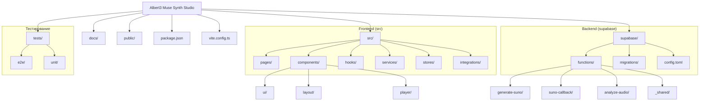
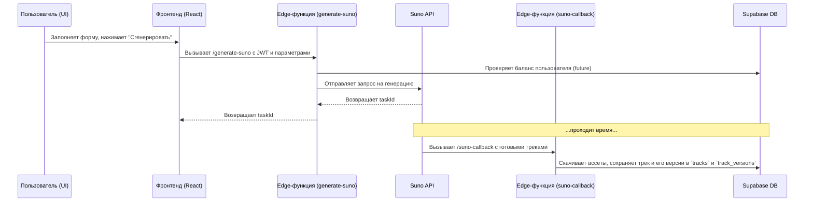
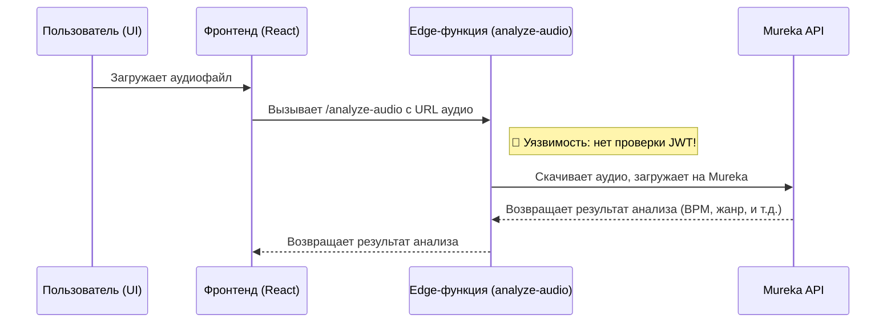

# Карта репозитория (Repo Map)

Это визуальное представление структуры проекта, сгенерированное с помощью Mermaid.js.

## Общая структура

## Потоки данных (Data Flows)

### 1. Генерация трека (Suno)

### 2. Анализ аудио (Mureka)

