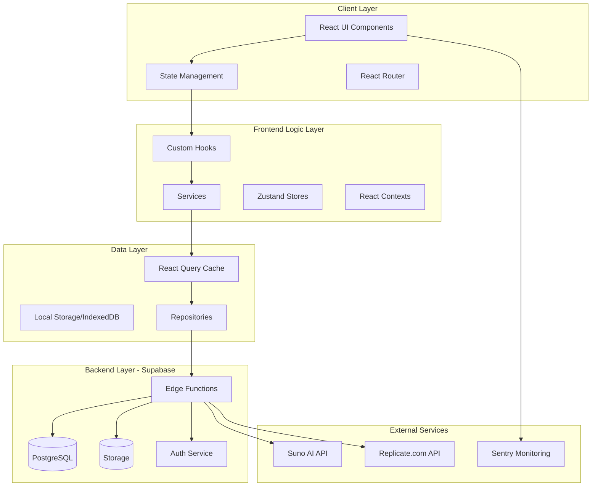
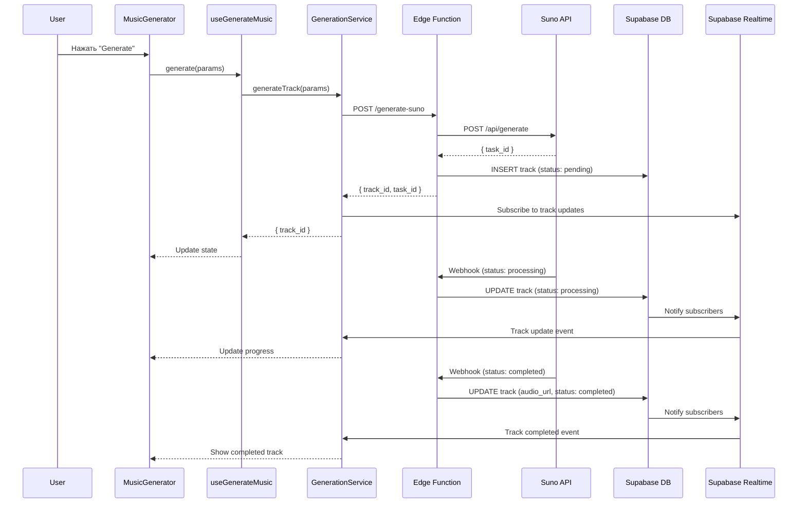
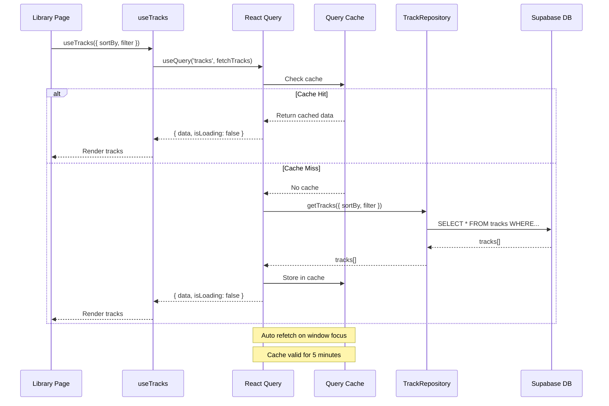

# Отчет по архитектуре - Albert3 Muse Synth Studio

**Дата:** 04 ноября 2025
**Версия:** 1.0

---

## 1. Общая архитектура системы

### 1.1 Архитектурный стиль
Проект использует **Frontend -> Backend-as-a-Service (BaaS)** архитектуру, где:
- **Frontend:** Single Page Application (SPA) на React
- **Backend:** Supabase (PostgreSQL + Edge Functions + Storage)
- **External Services:** Suno AI, Replicate.com, Mureka

### 1.2 Архитектурная диаграмма



---

## 2. Структура проекта

### 2.1 Основные директории

```
albert3-muse-synth-studio/
├── src/                          # Frontend код
│   ├── components/              # React компоненты (150+)
│   │   ├── generator/          # Генератор музыки (35 файлов)
│   │   ├── audio/              # Аудио компоненты (15 файлов)
│   │   ├── player/             # Проигрыватель (12 файлов)
│   │   ├── tracks/             # Управление треками (18 файлов)
│   │   ├── ui/                 # UI kit (shadcn) (40+ файлов)
│   │   ├── workspace/          # Workspace компоненты (25 файлов)
│   │   ├── error/              # Error boundaries (5 файлов)
│   │   └── layout/             # Layout компоненты (8 файлов)
│   ├── hooks/                   # Custom React hooks (40+)
│   │   ├── tracks/             # Track операции
│   │   ├── generation/         # Генерация музыки
│   │   └── audio/              # Аудио обработка
│   ├── services/                # Бизнес-логика (15+)
│   │   ├── generation/         # GenerationService
│   │   ├── providers/          # Provider адаптеры
│   │   ├── ai/                 # AI сервисы
│   │   └── analytics/          # Аналитика
│   ├── stores/                  # Zustand stores (5 файлов)
│   │   ├── audioPlayerStore.ts
│   │   ├── generatorStore.ts
│   │   └── trackStore.ts
│   ├── contexts/                # React Context (3 файла)
│   │   ├── AuthContext.tsx
│   │   └── TelegramContext.tsx
│   ├── repositories/            # Data Access Layer (8 файлов)
│   ├── types/                   # TypeScript типы (60+ интерфейсов)
│   ├── utils/                   # Утилиты (logger, formatters)
│   ├── integrations/            # Интеграции (Supabase, Sentry)
│   └── lib/                     # Общие функции
├── supabase/
│   ├── functions/               # Edge Functions (10+)
│   │   ├── get-balance/
│   │   ├── generate-suno/
│   │   ├── lyrics-callback/
│   │   ├── analyze-audio/
│   │   └── _shared/            # Общие утилиты
│   └── migrations/              # Database migrations
├── tests/
│   ├── unit/                    # Unit тесты (15 файлов)
│   ├── e2e/                     # E2E тесты (16 файлов)
│   └── integration/             # Integration тесты (3 файла)
└── docs/                        # Документация (161 MD файл)
    ├── audit/                   # Отчеты аудита
    ├── ARCHITECTURE.md
    └── API.md
```

### 2.2 Статистика кодовой базы

| Категория | Количество | Строки кода |
|-----------|------------|-------------|
| Frontend компоненты | 150+ | ~40,000 |
| Hooks | 40+ | ~8,000 |
| Services | 15+ | ~5,000 |
| Stores | 5 | ~1,500 |
| Edge Functions | 10+ | ~5,000 |
| Типы | 60+ интерфейсов | ~3,000 |
| Утилиты | 20+ | ~2,000 |
| **Всего** | **300+** | **~83,000** |

---

## 3. Архитектурные слои

### 3.1 Presentation Layer (UI)
**Ответственность:** Отображение UI и обработка пользовательских действий

**Компоненты:**
- **UI Kit:** shadcn/ui компоненты (Button, Dialog, Card, etc.)
- **Feature Components:** MusicGenerator, Library, AudioPlayer
- **Layout Components:** AppLayout, Sidebar, Header

**Паттерны:**
- ✅ Composition over Inheritance
- ✅ Container/Presentational разделение
- ✅ React.memo для оптимизации

**Пример:**
```typescript
// src/components/generator/MusicGeneratorContainer.tsx
export const MusicGeneratorContainer = () => {
  // Container компонент - управляет логикой
  const state = useGeneratorState(selectedProvider);
  const { generate, isGenerating } = useGenerateMusic({...});

  return (
    <MusicGeneratorContent
      // Presentational компонент - только UI
      state={state}
      onGenerate={generate}
      isGenerating={isGenerating}
    />
  );
};
```

### 3.2 Logic Layer
**Ответственность:** Бизнес-логика и управление состоянием

**Структура:**
```
Logic Layer
├── Custom Hooks (40+)
│   ├── useGenerateMusic - Генерация музыки
│   ├── useTracks - Получение треков
│   └── useAudioPlayer - Управление плеером
├── Services (15+)
│   ├── GenerationService - Оркестрация генерации
│   ├── ProviderFactory - Factory для провайдеров
│   └── MonitoringService - Мониторинг
└── Zustand Stores (5)
    ├── audioPlayerStore - Состояние плеера
    └── generatorStore - Состояние генератора
```

**Ключевые сервисы:**

#### GenerationService
**Путь:** `src/services/generation/GenerationService.ts`
**Роль:** Центральный сервис для генерации музыки

```typescript
class GenerationService {
  // Генерация трека
  async generateTrack(params: GenerationParams): Promise<Track>

  // Подписка на обновления
  subscribe(trackId: string, callback: Callback): Subscription

  // Проверка статуса
  async checkStatus(taskId: string): Promise<Status>
}
```

#### ProviderFactory
**Путь:** `src/services/providers/factory.ts`
**Роль:** Factory для создания адаптеров провайдеров

```typescript
class ProviderFactory {
  static getProvider(provider: 'suno' | 'replicate'): IProviderClient {
    if (!this.adapters.has(provider)) {
      this.adapters.set(provider, this.createAdapter(provider));
    }
    return this.adapters.get(provider)!;
  }

  private static createAdapter(provider: string): IProviderClient {
    switch (provider) {
      case 'suno': return new SunoProviderAdapter();
      case 'replicate': return new ReplicateProviderAdapter();
      default: throw new Error(`Unknown provider: ${provider}`);
    }
  }
}
```

### 3.3 State Management Layer
**Технологии:** React Query (server state) + Zustand (client state)

**Разделение состояния:**
```
State Management
├── Server State (React Query)
│   ├── Tracks (useTracks)
│   ├── User data (useUser)
│   ├── Projects (useProjects)
│   └── Analytics (useAnalytics)
└── Client State (Zustand)
    ├── Audio Player (audioPlayerStore)
    ├── Generator (generatorStore)
    └── UI (uiStore)
```

**Пример использования:**
```typescript
// Server state - React Query
const { data: tracks, isLoading, refetch } = useTracks({
  sortBy: 'created_at',
  sortOrder: 'desc',
  status: 'all'
});

// Client state - Zustand
const { currentTrack, play, pause } = useAudioPlayerStore();
```

### 3.4 Data Layer
**Ответственность:** Доступ к данным и кэширование

**Компоненты:**
- **Repositories:** Абстракция над Supabase клиентом
- **React Query Cache:** Автоматическое кэширование server state
- **Local Cache:** localStorage + IndexedDB для offline режима

**Пример Repository:**
```typescript
// src/repositories/TrackRepository.ts
export class TrackRepository {
  async getTrack(id: string): Promise<Track> {
    const { data, error } = await supabase
      .from('tracks')
      .select('*')
      .eq('id', id)
      .single();

    if (error) throw new Error(error.message);
    return data;
  }

  async updateTrack(id: string, updates: Partial<Track>): Promise<void> {
    const { error } = await supabase
      .from('tracks')
      .update(updates)
      .eq('id', id);

    if (error) throw new Error(error.message);
  }
}
```

### 3.5 Backend Layer (Supabase Edge Functions)
**Технология:** Deno TypeScript
**Версия Deno:** 1.168.0

**Основные функции:**

| Функция | Назначение | Строк кода |
|---------|-----------|------------|
| `get-balance` | Получение баланса Suno/Replicate | 434 |
| `generate-suno` | Генерация через Suno | ~300 |
| `lyrics-callback` | Webhook для лирики | 200 |
| `analyze-audio` | Анализ аудио через Replicate | 287 |
| `replicate-callback` | Callback от Replicate | 101 |
| `boost-style` | Бустинг стиля трека | ~250 |
| `recognize-song` | Распознавание песни | ~200 |

**Общие утилиты в `_shared/`:**
- `cors.ts` - CORS headers
- `security.ts` - Security headers
- `error-handler.ts` - Централизованная обработка ошибок
- `logger.ts` - Логирование
- `rate-limit.ts` - Rate limiting
- `webhook-verify.ts` - Верификация webhooks
- `cache.ts` - Кэширование

---

## 4. Паттерны проектирования

### 4.1 Factory Pattern ✅
**Применение:** Создание адаптеров провайдеров

```typescript
// src/services/providers/factory.ts
class ProviderFactory {
  private static adapters = new Map<MusicProvider, IProviderClient>();

  static getProvider(provider: MusicProvider): IProviderClient {
    if (!this.adapters.has(provider)) {
      this.adapters.set(provider, this.createAdapter(provider));
    }
    return this.adapters.get(provider)!;
  }
}
```

**Преимущества:**
- ✅ Единственная точка создания провайдеров
- ✅ Кэширование инстансов
- ✅ Легко добавлять новые провайдеры

### 4.2 Adapter Pattern ✅
**Применение:** Унификация интерфейсов внешних API

```typescript
// src/services/providers/adapters/IProviderClient.ts
interface IProviderClient {
  generateMusic(params: GenerationParams): Promise<GenerationResult>;
  extendTrack(params: ExtensionParams): Promise<GenerationResult>;
  getBalance(): Promise<BalanceInfo>;
}

// src/services/providers/adapters/suno.adapter.ts
class SunoProviderAdapter implements IProviderClient {
  async generateMusic(params: GenerationParams): Promise<GenerationResult> {
    // Адаптация к Suno API
  }
}

// src/services/providers/adapters/replicate.adapter.ts
class ReplicateProviderAdapter implements IProviderClient {
  async generateMusic(params: GenerationParams): Promise<GenerationResult> {
    // Адаптация к Replicate API
  }
}
```

**Преимущества:**
- ✅ Единый интерфейс для всех провайдеров
- ✅ Легкая замена провайдера
- ✅ Тестируемость

### 4.3 Repository Pattern ✅
**Применение:** Абстракция доступа к данным

```typescript
// src/repositories/ITrackRepository.ts
interface ITrackRepository {
  getTrack(id: string): Promise<Track>;
  getTracks(filter: TrackFilter): Promise<Track[]>;
  updateTrack(id: string, updates: Partial<Track>): Promise<void>;
  deleteTrack(id: string): Promise<void>;
}

// src/repositories/TrackRepository.ts
class TrackRepository implements ITrackRepository {
  constructor(private supabase: SupabaseClient) {}

  async getTrack(id: string): Promise<Track> {
    // Реализация через Supabase
  }
}
```

**Преимущества:**
- ✅ Разделение бизнес-логики и доступа к данным
- ✅ Легко мокировать для тестов
- ✅ Возможность замены источника данных

### 4.4 Observer Pattern (React Context + Hooks) ✅
**Применение:** Управление глобальным состоянием

```typescript
// src/contexts/AuthContext.tsx
const AuthContext = createContext<AuthContextValue>(defaultValue);

export const AuthProvider: React.FC<AuthProviderProps> = ({ children }) => {
  const [user, setUser] = useState<User | null>(null);
  const [loading, setLoading] = useState(true);

  useEffect(() => {
    // Subscribe to auth changes
    const { data: { subscription } } = supabase.auth.onAuthStateChange(
      (event, session) => {
        setUser(session?.user ?? null);
      }
    );

    return () => subscription.unsubscribe();
  }, []);

  return (
    <AuthContext.Provider value={{ user, loading }}>
      {children}
    </AuthContext.Provider>
  );
};
```

### 4.5 Custom Hook Composition ✅
**Применение:** Композиция логики в хуках

```typescript
// src/components/generator/MusicGeneratorContainer.tsx
const MusicGeneratorContainer = () => {
  // Композиция нескольких хуков
  const state = useGeneratorState(selectedProvider);
  const { generate, isGenerating } = useGenerateMusic({...});
  const { uploadAudio, uploading } = useAudioUpload({...});
  useMurekaLyricsSubscription({ trackId, enabled, onLyricsStage });
  usePendingGenerationLoader({ enabled: true });

  // Комбинированная логика
  return <MusicGeneratorContent {...props} />;
};
```

**Преимущества:**
- ✅ Переиспользование логики
- ✅ Тестируемость хуков отдельно
- ✅ Читаемость кода

---

## 5. Потоки данных

### 5.1 Генерация музыки через Suno



### 5.2 Получение списка треков



---

## 6. Оценка архитектуры

### 6.1 Сильные стороны ✅

1. **Четкое разделение слоев**
   - Presentation, Logic, State, Data, Backend четко разделены
   - Каждый слой имеет свою ответственность

2. **Правильное применение паттернов**
   - Factory, Adapter, Repository, Observer применены корректно
   - Паттерны решают реальные проблемы

3. **Масштабируемая структура**
   - Модульная организация по фичам
   - Легко добавлять новые компоненты/сервисы

4. **Dual-Provider архитектура**
   - Легко переключаться между Suno и Replicate
   - Легко добавить нового провайдера

5. **Правильное управление состоянием**
   - React Query для server state
   - Zustand для client state
   - React Context для глобального состояния

### 6.2 Области для улучшения 🟡

1. **Большие компоненты**
   - Library.tsx (831 строк) - разбить на модули
   - DetailPanelContent.tsx (762 строк) - вынести подкомпоненты

2. **Дублирование кода**
   - Обработка ошибок дублируется в нескольких местах
   - Subscription логика повторяется

3. **Отсутствие DI контейнера**
   - Сервисы создаются напрямую в хуках
   - Усложняет тестирование

4. **Нет слоя валидации**
   - Валидация разбросана по компонентам
   - Нет централизованной схемы валидации

### 6.3 Итоговая оценка архитектуры

**Оценка: 8.5/10** ⭐⭐⭐⭐

Архитектура проекта находится на **высоком уровне** с четким разделением ответственности, правильным применением паттернов проектирования и масштабируемой структурой. Основные улучшения требуются в рефакторинге больших компонентов и централизации общей логики.

---

**Подготовлено:** Claude AI (Sonnet 4.5)
**Дата:** 04 ноября 2025
